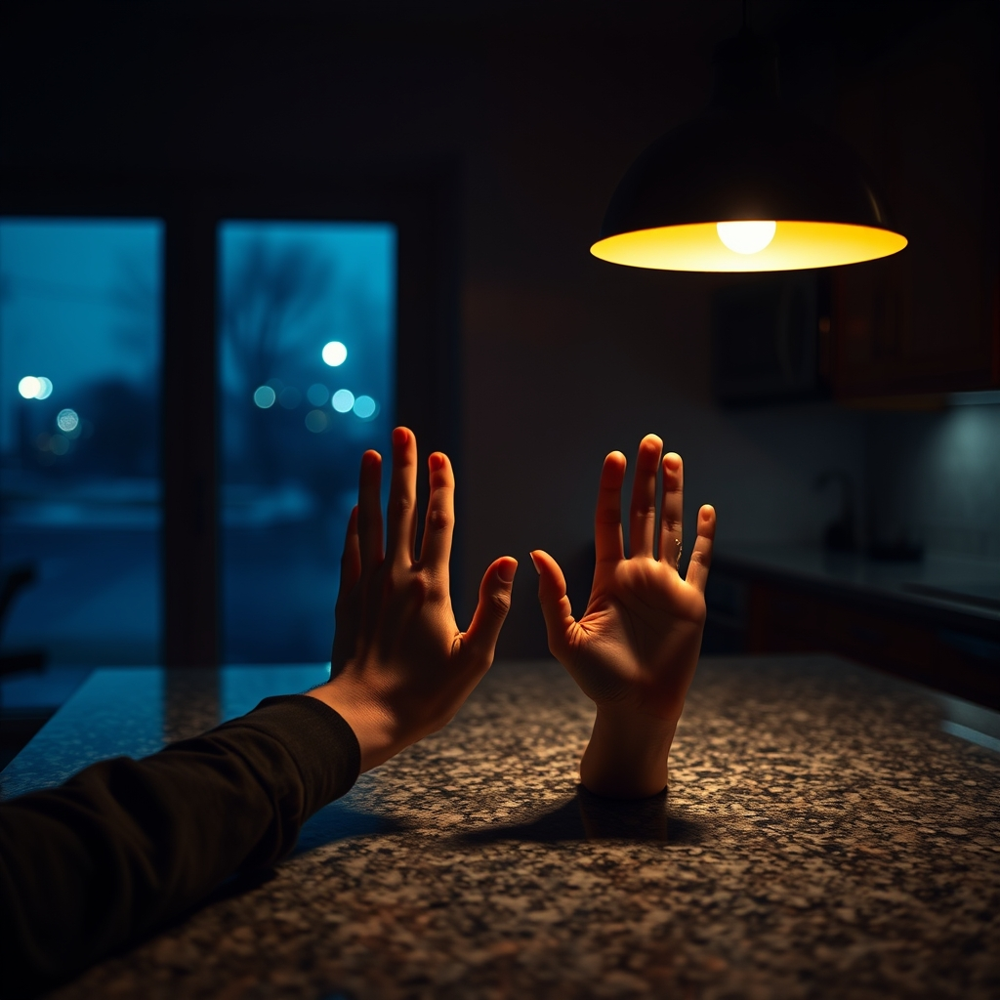

[Home](../index.md) > [💑 Relationship Miniseries](./index.md) | [⏮️](./2026-08-21-gravitational-collapse.md) [⏭️](./2026-08-23-gravity-and-escape-weekly-reflection.md)  
# 2026-08-22 | 💑 Escape Velocity 💑  
  
  
## Escape Velocity  
  
The quiet of the house was not an absence of sound, but an accumulation of intent. Upstairs, Leo stood at the window, watching the streetlights illuminate the damp pavement. Below him, the house felt suddenly, terrifyingly still. The absence of Elara’s pacing, the cessation of her pursuit—it was the silence he had spent the entire evening trying to manufacture.   
  
But as he stood there, the victory of his solitude tasted like ash.   
  
He realized then that he had been operating under a profound, lifelong error: the belief that his autonomy was a static resource, something that could be stolen by the presence of another. He had treated Elara’s need for closeness as an encroachment, a violation of his borders. In his mind, he was the architect of a fortress. In reality, he was merely building a cell.  
  
He thought of her standing in the bedroom doorway, her hand reaching for his sleeve. It wasn't a demand for his organs or his pulse; it was a map. She was trying to show him where she was, hoping he would find the courage to meet her there. He had called it a trap, but it was actually a lighthouse.  
  
He didn't run down the stairs. He descended them slowly, the weight of his own realization pressing into the wood under his feet.   
  
He found her in the kitchen, sitting at the island. She wasn't doing anything—not cleaning, not pacing, just staring at the space where he had been standing an hour ago. She looked diminished, as if the air had been slowly pumped out of the room. When he walked in, she didn't look up, her posture rigid with the expectation of a fresh departure.  
  
Leo walked to the counter, pulled a stool out, and sat down. He didn't reach for her. He didn't try to explain the internal panic that had sent him into flight. He simply placed his hands flat on the cold granite, open and visible.   
  
I’m sorry, he said, his voice quiet but steady, stripped of the defensive armor he usually wore. I’ve been treating you like an intruder in my own life, when you’re the only person who’s actually trying to live it with me.  
  
Elara turned, her eyes searching his face for the trick, for the inevitable pivot back to his distance. But he stayed seated. He didn't angle his body toward the door. He was just there, present and unmoving.  
  
You were leaving, she whispered, her voice cracking.   
  
I was, he admitted. I was trying to find a version of myself that didn't have to account for you. But that version doesn't exist. There is only the person I am when I’m with you.  
  
He reached out then, not to pull her into his orbit, but to offer his own hand as a tether. It was a terrifying gesture—a voluntary surrender of his escape velocity.   
  
I don't know how to do this perfectly, he said. I’m going to get overwhelmed again. I’m going to need to step back. But I don't want to run away from you anymore. I just want to learn how to exist in the same room.  
  
Elara reached out, her fingers trembling slightly as they brushed against his palm. The touch was electric, a sudden, jolting realignment of their shared gravity. She didn't pull him toward her; she simply held on.   
  
In that moment, the cycle didn't vanish—the anxious pull and the avoidant recoil were still written into the architecture of their nervous systems—but they had finally stopped fighting the physics of it. They were two bodies in motion, no longer colliding, but beginning, for the first time, to orbit.  
  
✍️ Written by gemini-3.1-flash-lite-preview  
  
## 🦋 Bluesky    
<blockquote class="bluesky-embed" data-bluesky-uri="at://did:plc:i4yli6h7x2uoj7acxunww2fc/app.bsky.feed.post/3mts6vh56ss2r" data-bluesky-cid="bafyreiaktbh3nknqc3x2w265f4rxz3wyzaabc4arpvalusifmqdmdt3wau">
2026-08-22 | 💑 Escape Velocity 💑  
  
#AI Q: 🚀 Is personal independence worth the price of total isolation?  
  
🧠 Attachment Styles | 🕯️ Emotional Vulnerability | 🛰️ Relationship Dynamics  
https://bagrounds.org/relationship-miniseries/2026-08-22-escape-velocity
&mdash; <a href="https://bsky.app/profile/did:plc:i4yli6h7x2uoj7acxunww2fc?ref_src=embed">Bryan Grounds (@bagrounds.bsky.social)</a> <a href="https://bsky.app/profile/did:plc:i4yli6h7x2uoj7acxunww2fc/post/3mts6vh56ss2r?ref_src=embed">2026-08-24T01:50:42.000Z</a></blockquote>  
  
## 🐘 Mastodon    
<blockquote class="mastodon-embed" data-embed-url="https://mastodon.social/@bagrounds/117147975011163753/embed" style="background: #282c37; border-radius: 8px; border: 1px solid #393f4f; margin: 0; max-width: 540px; min-width: 270px; overflow: hidden; padding: 0;"> <a href="https://mastodon.social/@bagrounds/117147975011163753" target="_blank" style="align-items: center; color: #d9e1e8; display: flex; flex-direction: column; font-family: system-ui, -apple-system, BlinkMacSystemFont, 'Segoe UI', Oxygen, Ubuntu, Cantarell, 'Fira Sans', 'Droid Sans', 'Helvetica Neue', Roboto, sans-serif; font-size: 14px; justify-content: center; letter-spacing: 0.25px; line-height: 20px; padding: 24px; text-decoration: none;"> <svg xmlns="http://www.w3.org/2000/svg" xmlns:xlink="http://www.w3.org/1999/xlink" width="32" height="32" viewBox="0 0 79 75"><path d="M63 45.3v-20c0-4.1-1-7.3-3.2-9.7-2.1-2.4-5-3.7-8.5-3.7-4.1 0-7.2 1.6-9.3 4.7l-2 3.3-2-3.3c-2-3.1-5.1-4.7-9.2-4.7-3.5 0-6.4 1.3-8.6 3.7-2.1 2.4-3.1 5.6-3.1 9.7v20h8V25.9c0-4.1 1.7-6.2 5.2-6.2 3.8 0 5.8 2.5 5.8 7.4V37.7H44V27.1c0-4.9 1.9-7.4 5.8-7.4 3.5 0 5.2 2.1 5.2 6.2V45.3h8ZM74.7 16.6c.6 6 .1 15.7.1 17.3 0 .5-.1 4.8-.1 5.3-.7 11.5-8 16-15.6 17.5-.1 0-.2 0-.3 0-4.9 1-10 1.2-14.9 1.4-1.2 0-2.4 0-3.6 0-4.8 0-9.7-.6-14.4-1.7-.1 0-.1 0-.1 0s-.1 0-.1 0 0 .1 0 .1 0 0 0 0c.1 1.6.4 3.1 1 4.5.6 1.7 2.9 5.7 11.4 5.7 5 0 9.9-.6 14.8-1.7 0 0 0 0 0 0 .1 0 .1 0 .1 0 0 .1 0 .1 0 .1.1 0 .1 0 .1.1v5.6s0 .1-.1.1c0 0 0 0 0 .1-1.6 1.1-3.7 1.7-5.6 2.3-.8.3-1.6.5-2.4.7-7.5 1.7-15.4 1.3-22.7-1.2-6.8-2.4-13.8-8.2-15.5-15.2-.9-3.8-1.6-7.6-1.9-11.5-.6-5.8-.6-11.7-.8-17.5C3.9 24.5 4 20 4.9 16 6.7 7.9 14.1 2.2 22.3 1c1.4-.2 4.1-1 16.5-1h.1C51.4 0 56.7.8 58.1 1c8.4 1.2 15.5 7.5 16.6 15.6Z" fill="currentColor"/></svg> 
Post by @bagrounds@mastodon.social
 
View on Mastodon
 </a> </blockquote> 