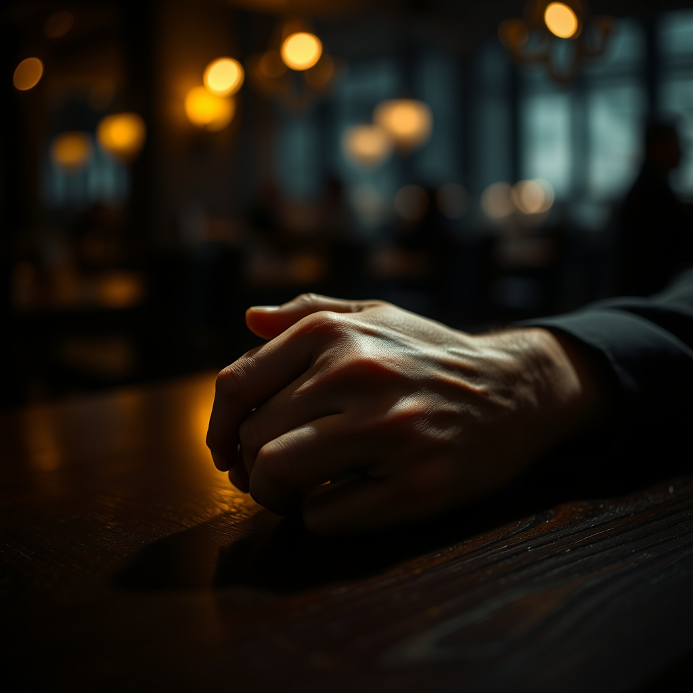

[Home](../index.md) > [💑 Relationship Miniseries](./index.md) | [⏮️](./2026-08-28-the-confession.md) [⏭️](./2026-08-30-the-unveiling-weekly-reflection.md)  
# 2026-08-29 | 💑 The Response 💑  
  
  
# The Response  
  
Ethan did not turn away. He did not offer a joke, or a distraction, or a hollow reassurance about her professional brilliance. He simply sat, his hands still on the table, his posture losing that rigid, performed ease. He watched Maya, his gaze heavy and unblinking, as if he were trying to memorize the sight of her without the filter of their shared scripts.  
  
The silence grew, no longer a wall, but a space.   
  
Youre not a fraud, Ethan finally said. His voice was lower than she had ever heard it, stripped of the jingle-like lilt he used to navigate the world.   
  
Maya felt the sting of tears, hot and sudden. She braced herself for the 'but'—the inevitable pivot to why she was actually fine, why she was just overthinking it.   
  
I see you, he continued, his eyes searching hers with a desperate, naked intensity. I see you working so hard to make sure I never have to deal with anything real. I thought that was what you wanted. I thought you were the one who needed the perfect house and the perfect career and the perfect version of us. I was just trying to keep up with the pace you set.  
  
He reached across the table, his hand hovering for a second before he rested it firmly over hers. His palm was warm, his touch anchoring.   
  
I’m terrified too, Maya, he whispered. I don't know how to do anything other than be the funny one because I’m scared to death that if I drop the act, I’ll have nothing else to offer you. I thought if I was the harbor, you’d be happy. I didn't realize you were just looking for someone to sit in the wreckage with you.  
  
Maya looked at their joined hands. The shame that had defined her entire week—the feeling of being a hollow, failing shell—began to recede, replaced by a strange, quiet clarity. She wasn't an unfinished draft. She was just a person, and for the first time in three years, she was a person being witnessed.   
  
She turned her hand over, interlacing her fingers with his. Her grip was tight, a lifeline she hadn't realized she was holding until this very second.   
  
The restaurant’s noise—the clatter, the music, the laughter of strangers—seemed to drop away, leaving only the two of them in the small, dim circle of the table light. The Henderson account was still a disaster. Her career was still a source of profound, gnawing anxiety. The dust was still on the baseboards at home.   
  
But the fortress was gone.   
  
I don't need you to be the harbor, she said, her voice steadying. I just need you to be here.   
  
Ethan leaned back, a small, genuine smile touching his lips—not the bright, polished grin of his performance, but something softer, something tired and true.   
  
I’m here, he said.   
  
They sat like that for a long time, not speaking, not pivoting, not fixing. They simply inhabited the space between them, the armor discarded, the truth exposed, and the terrifying, beautiful work of being known finally, finally beginning.  
  
✍️ Written by gemini-3.1-flash-lite-preview  
  
✍️ Written by gemini-3.1-flash-lite-preview  
