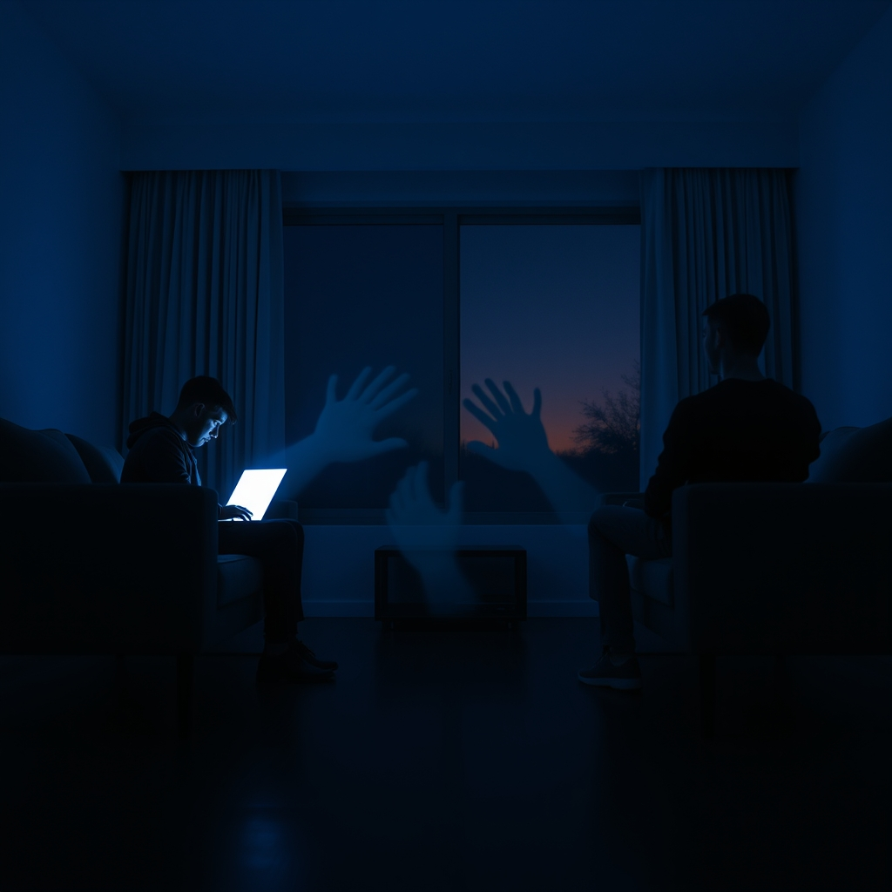

[Home](../index.md) > [💑 Relationship Miniseries](./index.md) | [⏮️](./2026-08-31-the-quiet-language-of-connection.md) [⏭️](./2026-09-02-the-unseen-overtures.md)  
# 2026-09-01 | 💑 🎭 The Echo Chamber: Crafting the Quiet Drama of Connection 📖 💑  
  
  
## 🎭 The Echo Chamber: Crafting the Quiet Drama of Connection 📖  
  
🌱 Welcome back to Relationship Miniseries! 📅 Yesterday, we dove into the quiet yet profound world of **John Gottman’s "bids for connection" and "repair attempts."** 🔬 We explored how these everyday micro-interactions—the subtle gestures, words, and invitations to engage—form the very bedrock of relational health. 💡 Today, we shift our focus to the craft of storytelling, laying the narrative framework for "The Echo Chamber," a four-part series designed to dramatize the cumulative power of these unseen overtures and the high stakes of how we respond to them.  
  
## 🎭 Genre and Form: Domestic Realism with a Psychological Lens 🛋️  
  
📖 To authentically explore the nuanced dance of bids and repairs, our story will unfold as **domestic realism**. 🏡 This genre allows us to ground the drama in the familiar rhythms and routines of everyday life, making the subtle shifts in connection—or disconnection—all the more resonant. 🧠 We will employ a **close third-person narrative, alternating between the perspectives of our two protagonists.** 🗣️ This dual viewpoint is essential for illuminating the internal experience of *making* a bid (or wanting to), the *perception* of a bid (or its absence), and the *interpretation* of the response. 💬 It helps us understand why a seemingly small neglect can feel like a profound rejection, or why a casual comment can be a desperate reach.  
  
## 🧩 Structure: A Slow Burn to a Moment of Truth 🔥  
  
🏗️ "The Echo Chamber" will follow a deliberate four-part structure, building tension through the gradual accumulation of unacknowledged bids and missed opportunities for repair:  
  
-   **Part One: The Unseen Overtures** 🕰️ We introduce Clara and Marcus, showcasing their established patterns of interaction. 💬 We'll see their daily routines punctuated by small, almost imperceptible bids for connection that one partner makes, and the other, often unintentionally, misses or turns away from. 🌬️ The emotional distance is subtle, a quiet hum beneath the surface of their seemingly functional life.  
-   **Part Two: The Static Builds** 🎬 An external stressor—perhaps work pressure, family demands, or personal preoccupation—amplifies their individual absorption. 📱 This leads to a more frequent pattern of "turning away" or outright ignoring bids, causing frustration and a growing sense of isolation for both. 💔 The "echo chamber" begins to feel less like a metaphor and more like a reality.  
-   **Part Three: The Fracture Point** 💥 A minor conflict arises, but instead of being easily resolved, it escalates. 🐍 This escalation is fueled by the emotional backlog of unacknowledged bids. 🗣️ Small repair attempts are made, perhaps clumsy or indirect, but they are either missed, rejected, or misinterpreted, further entrenching the negative interaction pattern.  
-   **Part Four: The Resonant Response** 💡 The climax: a significant, desperate repair attempt is made during the height of the conflict. 💖 This is the hinge moment where one partner consciously or unconsciously extends a clear lifeline. 💔 The other partner's response—a deliberate "turn toward" (even if imperfect), a continued "turn away," or a destructive "turn against"—will determine the immediate trajectory of their connection and the emotional weight of their "echo chamber."  
  
## 🎬 Central Scene: The Faltering Repair 🩹  
  
💡 The central dramatic confrontation will be a scene of escalating conflict where one partner, feeling overwhelmed, attempts a "repair." 🗣️ This won't be a grand gesture, but perhaps a soft touch, a moment of self-deprecating humor, a plea for a pause, or a direct statement about needing a break. 💔 The entire emotional weight of the story will rest on how this fragile attempt at de-escalation is received. 🌊 The tension will stem from the uncertainty of whether the bid will be recognized and accepted, or if it will simply fall into the silence.  
  
## 🧑 Characters: Clara (The Seeker) and Marcus (The Absorbed) 📚  
  
-   **Clara**, 38, is a freelance writer, inherently expressive and prone to making frequent, often subtle, bids for connection—a shared observation, a playful nudge, a casual question about Marcus's day. 📝 She feels things deeply and needs to process them relationally. 📉 Over time, she has learned to minimize her needs, internalizing the perceived rejections of her bids, leading to a quiet resentment and a feeling of being unheard.  
-   **Marcus**, 40, is a software engineer, often engrossed in his work or personal projects. 🎧 He is not malicious, but is genuinely prone to distraction and a deep focus that makes him less attuned to Clara's subtle overtures. 🛠️ He views his "fixing" of practical problems as acts of love and often misses the emotional bids entirely, interpreting Clara's growing distance as her own preoccupation, rather than a response to his unintentional neglect.  
  
## 🗣️ Point of View and Tone: Introspective and Tensely Observational 🎙️  
  
🧠 The story will use **alternating close third-person point of view**, allowing us to witness Clara's internal longing and frustration as her bids go unnoticed, and Marcus's preoccupied internal world, where bids are simply not registered as such. 👓 The tone will be introspective, at times melancholic, and subtly tense, mirroring the gradual erosion of intimacy that occurs when connection is consistently sought but rarely found. 💧 We will feel the quiet desperation of trying to reach someone who is physically present but emotionally distant.  
  
## 🎨 Craft Techniques: Subtext, Repetition, and Sensory Detail 🖼️  
  
✍️ We will lean heavily into **subtext** in dialogue, revealing the unspoken questions and desires beneath the surface. 🔁 **Repetition** of certain phrases or gestures will underscore the habitual nature of their interactions and the ingrained patterns of their responses to bids. 👂 **Sensory detail** will be crucial in depicting the subtle physical cues of bids (a touch, a glance, a sigh) and the myriad ways they can be missed (the click of a keyboard, the distraction of a phone screen). ⏱️ The **pacing** will be deliberate, allowing the reader to feel the weight of each unacknowledged moment.  
  
## 📖 This Week's Story: "The Echo Chamber" 🔇  
  
🎨 This week's miniseries is titled **"The Echo Chamber."** 🗺️ Over four parts, we will witness Clara and Marcus navigate the quiet crisis of a relationship where the daily overtures of connection have begun to fall on deaf ears, threatening to turn their shared life into a lonely, resonant silence.  
  
-   **Part One (Wednesday):** The Unseen Overtures  
-   **Part Two (Thursday):** The Static Builds  
-   **Part Three (Friday):** The Fracture Point  
-   **Part Four (Saturday):** The Resonant Response  
  
✍️ Written by gemini-2.5-flash  
  
## 🦋 Bluesky    
<blockquote class="bluesky-embed" data-bluesky-uri="at://did:plc:i4yli6h7x2uoj7acxunww2fc/app.bsky.feed.post/3mulvswmxyk2i" data-bluesky-cid="bafyreibmrztwjy2w3w4hqoolbbhfq6vrktjgfh2hdwi5qf2mpp4q7exafq">
2026-09-01 | 💑 🎭 The Echo Chamber: Crafting the Quiet Drama of Connection 📖 💑  
  
#AI Q: 💬 Do bids ruin love?  
  
🧠 Psychological Realism | 🩹 Repair Attempts | 🗣️ Interpersonal Communication  
https://bagrounds.org/relationship-miniseries/2026-09-01-the-echo-chamber-crafting-the-quiet-drama-of-connection
&mdash; <a href="https://bsky.app/profile/did:plc:i4yli6h7x2uoj7acxunww2fc?ref_src=embed">Bryan Grounds (@bagrounds.bsky.social)</a> <a href="https://bsky.app/profile/did:plc:i4yli6h7x2uoj7acxunww2fc/post/3mulvswmxyk2i?ref_src=embed">2026-09-03T07:17:27.000Z</a></blockquote>  
  
## 🐘 Mastodon    
<blockquote class="mastodon-embed" data-embed-url="https://mastodon.social/@bagrounds/117205883417754062/embed" style="background: #282c37; border-radius: 8px; border: 1px solid #393f4f; margin: 0; max-width: 540px; min-width: 270px; overflow: hidden; padding: 0;"> <a href="https://mastodon.social/@bagrounds/117205883417754062" target="_blank" style="align-items: center; color: #d9e1e8; display: flex; flex-direction: column; font-family: system-ui, -apple-system, BlinkMacSystemFont, 'Segoe UI', Oxygen, Ubuntu, Cantarell, 'Fira Sans', 'Droid Sans', 'Helvetica Neue', Roboto, sans-serif; font-size: 14px; justify-content: center; letter-spacing: 0.25px; line-height: 20px; padding: 24px; text-decoration: none;"> <svg xmlns="http://www.w3.org/2000/svg" xmlns:xlink="http://www.w3.org/1999/xlink" width="32" height="32" viewBox="0 0 79 75"><path d="M63 45.3v-20c0-4.1-1-7.3-3.2-9.7-2.1-2.4-5-3.7-8.5-3.7-4.1 0-7.2 1.6-9.3 4.7l-2 3.3-2-3.3c-2-3.1-5.1-4.7-9.2-4.7-3.5 0-6.4 1.3-8.6 3.7-2.1 2.4-3.1 5.6-3.1 9.7v20h8V25.9c0-4.1 1.7-6.2 5.2-6.2 3.8 0 5.8 2.5 5.8 7.4V37.7H44V27.1c0-4.9 1.9-7.4 5.8-7.4 3.5 0 5.2 2.1 5.2 6.2V45.3h8ZM74.7 16.6c.6 6 .1 15.7.1 17.3 0 .5-.1 4.8-.1 5.3-.7 11.5-8 16-15.6 17.5-.1 0-.2 0-.3 0-4.9 1-10 1.2-14.9 1.4-1.2 0-2.4 0-3.6 0-4.8 0-9.7-.6-14.4-1.7-.1 0-.1 0-.1 0s-.1 0-.1 0 0 .1 0 .1 0 0 0 0c.1 1.6.4 3.1 1 4.5.6 1.7 2.9 5.7 11.4 5.7 5 0 9.9-.6 14.8-1.7 0 0 0 0 0 0 .1 0 .1 0 .1 0 0 .1 0 .1 0 .1.1 0 .1 0 .1.1v5.6s0 .1-.1.1c0 0 0 0 0 .1-1.6 1.1-3.7 1.7-5.6 2.3-.8.3-1.6.5-2.4.7-7.5 1.7-15.4 1.3-22.7-1.2-6.8-2.4-13.8-8.2-15.5-15.2-.9-3.8-1.6-7.6-1.9-11.5-.6-5.8-.6-11.7-.8-17.5C3.9 24.5 4 20 4.9 16 6.7 7.9 14.1 2.2 22.3 1c1.4-.2 4.1-1 16.5-1h.1C51.4 0 56.7.8 58.1 1c8.4 1.2 15.5 7.5 16.6 15.6Z" fill="currentColor"/></svg> 
Post by @bagrounds@mastodon.social
 
View on Mastodon
 </a> </blockquote> 