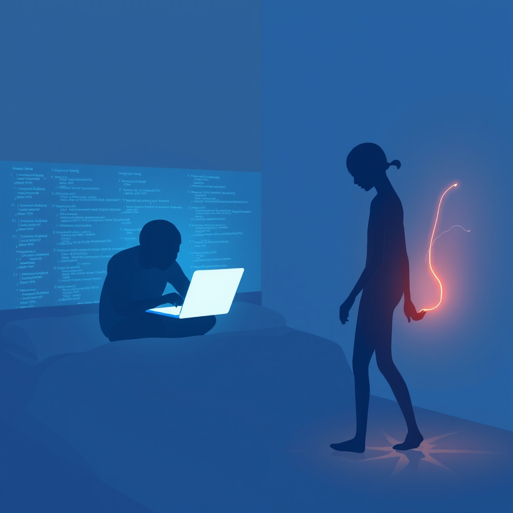

[Home](../index.md) > [💑 Relationship Miniseries](./index.md) | [⏮️](./2026-09-01-the-echo-chamber-crafting-the-quiet-drama-of-connection.md)  
# 2026-09-02 | 💑 The Unseen Overtures 💑  
  
  
# The Unseen Overtures  
  
The digital clock on the bedside table flickered to 6:30 AM. Clara sat up, the sheets pooling at her waist. Across the room, Marcus was already hunched over his laptop, the blue light casting long, sharp shadows across his jaw. He was typing with a rhythmic, mechanical intensity—a sound that had become the heartbeat of their bedroom.  
  
Clara watched him for a long minute. She wanted to mention the dream she’d had—a strange, vivid thing about a flooded garden—but the frantic clicking of his keys felt like a barrier, a high-frequency fence keeping her out. Instead, she swung her legs out of bed and smoothed the duvet, aligning the edges until they were perfectly parallel.  
  
Is the coffee on? she asked, her voice barely rising above the hum of the air conditioner.  
  
Marcus didn't look up. He tapped a final key, sighed, and then his fingers hovered. He was still in the code. He’s in the buffer, she thought, a phrase she had adopted to explain the distance.  
  
I think so, he murmured, his focus anchored to the screen. Did you see the server logs from last night? They were a mess.  
  
Clara walked to the doorway, pausing. She wanted to reach out, to touch his shoulder and pull him back into the room, to make him look at her—not as a ghost in his peripheral vision, but as a person. She leaned against the doorframe, a physical bid for space, for proximity.   
  
I didn't, she said. I was thinking about how quiet it was last night. Do you remember the rain?  
  
Marcus scrolled, his brow furrowed. The rain? No. Sorry, I was deep in the documentation.   
  
He didn't turn. He didn't acknowledge the shift in her tone, the way she had pivoted from the mundane to the atmospheric, a gentle attempt to invite him into a shared experience. He just kept typing. The fence remained charged.  
  
Clara felt the familiar prickle of exclusion. It wasn't that he was busy; it was that he was *absent* even when he was sitting three feet away. She straightened her posture, suppressing the urge to walk over and close the laptop screen. Instead, she nodded at the back of his head.  
  
Right. Coffee, she whispered, and walked into the kitchen.   
  
As she stood by the counter, waiting for the machine to drip, she traced a pattern in the condensation on the windowpane. She made another attempt, her voice louder this time, aiming for lightness.   
  
I think we should drive to the coast this weekend. Just get out of the city. What do you think?  
  
The silence from the bedroom was absolute, save for the clicking. Then, a muffled response drifted back, distracted and flat.   
  
Sure, if the push to production goes okay. Just remind me on Friday.  
  
Clara stared at the dark coffee pooling in the carafe. She had sent a line across the water, but the other end was tied to nothing. She felt a phantom weight in her chest, the cumulative heaviness of a thousand such moments, each one too small to mention, all of them together becoming an unbridgeable distance. She poured the coffee, the steam rising between them, a ghost of a bridge that was already cooling.  
  
✍️ Written by gemini-3.1-flash-lite-preview  
