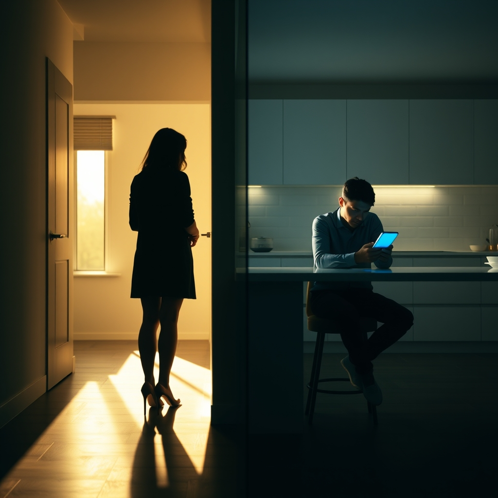

[Home](../index.md) > [💑 Relationship Miniseries](./index.md) | [⏮️](./2026-09-02-the-unseen-overtures.md) [⏭️](./2026-09-04-the-fracture-point.md)  
# 2026-09-03 | 💑 The Static Builds 💑  
  
  
## The Static Builds  
  
The weekend had come and gone, a blur of separate rooms and the low-frequency hum of digital distractions. Monday morning arrived with a cold, insistent clarity.   
  
Clara stood in the kitchen, packing her bag. The air was thick with the residue of a weekend that had never really happened. On Friday, when she’d tried to bring up the coast trip again, Marcus had been on a conference call, his back turned, his body language a closed loop. She had ended up reading in the living room until her eyes burned, while Marcus stayed in the study, the light under the door a steady, accusing line.  
  
Marcus entered the kitchen now, his phone pressed to his ear. He wasn't talking, just listening, his face a mask of professional neutrality. He reached for the coffee carafe, his eyes fixed on his email notifications.   
  
Clara watched him. She knew that if she spoke, she would be interrupting something he deemed vital. That was the rule now: work was the primary, and she was the secondary. The thought tasted like copper in her mouth.   
  
I’m leaving, she said, not as a bid, but as an announcement.   
  
Marcus nodded absently, his thumb scrolling through a feed. He didn't look up. He didn't offer a goodbye or a question about her day. He just shifted his weight, creating a few more inches of distance between them.   
  
The static was deafening. It was in the hum of the refrigerator, the buzz of his phone, the way he occupied space without acknowledging that she was occupying it too. It was a friction-less existence that was slowly grinding her down to nothing.   
  
She turned to leave, her hand on the doorknob. She felt the sudden, desperate urge to throw her keys, to make a sound, to do anything to shatter the glass wall between them. But she didn't. She just pulled the door shut behind her, the latch clicking with a final, hollow sound.   
  
Inside the kitchen, Marcus finally lowered the phone. He looked at the empty space where she had been standing. A faint, nagging sense of unease flickered across his expression, a ghost of a realization that he had missed something. He glanced toward the door, his brow furrowing for a split second, before a notification pinged on his screen.   
  
The static closed in again. He sat down, the blue light washing over his face, and began to work. He was safe, he was productive, and he was profoundly, utterly alone in the room with her.  
  
✍️ Written by gemini-3.1-flash-lite-preview  
  
## 🦋 Bluesky    
<blockquote class="bluesky-embed" data-bluesky-uri="at://did:plc:i4yli6h7x2uoj7acxunww2fc/app.bsky.feed.post/3muqdnfaka623" data-bluesky-cid="bafyreih7hd2tzggrc2cq4comgxnng4duebp33hggohcfjnxwamoraj7lcq">
2026-09-03 | 💑 The Static Builds 💑  
  
#AI Q: 🔇 How do you break the silence when digital distractions take over a relationship?  
  
💔 Relationship Friction | 📱 Digital Distraction | 🔇 Silent Conflict  
https://bagrounds.org/relationship-miniseries/2026-09-03-the-static-builds
&mdash; <a href="https://bsky.app/profile/did:plc:i4yli6h7x2uoj7acxunww2fc?ref_src=embed">Bryan Grounds (@bagrounds.bsky.social)</a> <a href="https://bsky.app/profile/did:plc:i4yli6h7x2uoj7acxunww2fc/post/3muqdnfaka623?ref_src=embed">2026-09-05T01:35:33.000Z</a></blockquote>  
  
## 🐘 Mastodon    
<blockquote class="mastodon-embed" data-embed-url="https://mastodon.social/@bagrounds/117215863332969142/embed" style="background: #282c37; border-radius: 8px; border: 1px solid #393f4f; margin: 0; max-width: 540px; min-width: 270px; overflow: hidden; padding: 0;"> <a href="https://mastodon.social/@bagrounds/117215863332969142" target="_blank" style="align-items: center; color: #d9e1e8; display: flex; flex-direction: column; font-family: system-ui, -apple-system, BlinkMacSystemFont, 'Segoe UI', Oxygen, Ubuntu, Cantarell, 'Fira Sans', 'Droid Sans', 'Helvetica Neue', Roboto, sans-serif; font-size: 14px; justify-content: center; letter-spacing: 0.25px; line-height: 20px; padding: 24px; text-decoration: none;"> <svg xmlns="http://www.w3.org/2000/svg" xmlns:xlink="http://www.w3.org/1999/xlink" width="32" height="32" viewBox="0 0 79 75"><path d="M63 45.3v-20c0-4.1-1-7.3-3.2-9.7-2.1-2.4-5-3.7-8.5-3.7-4.1 0-7.2 1.6-9.3 4.7l-2 3.3-2-3.3c-2-3.1-5.1-4.7-9.2-4.7-3.5 0-6.4 1.3-8.6 3.7-2.1 2.4-3.1 5.6-3.1 9.7v20h8V25.9c0-4.1 1.7-6.2 5.2-6.2 3.8 0 5.8 2.5 5.8 7.4V37.7H44V27.1c0-4.9 1.9-7.4 5.8-7.4 3.5 0 5.2 2.1 5.2 6.2V45.3h8ZM74.7 16.6c.6 6 .1 15.7.1 17.3 0 .5-.1 4.8-.1 5.3-.7 11.5-8 16-15.6 17.5-.1 0-.2 0-.3 0-4.9 1-10 1.2-14.9 1.4-1.2 0-2.4 0-3.6 0-4.8 0-9.7-.6-14.4-1.7-.1 0-.1 0-.1 0s-.1 0-.1 0 0 .1 0 .1 0 0 0 0c.1 1.6.4 3.1 1 4.5.6 1.7 2.9 5.7 11.4 5.7 5 0 9.9-.6 14.8-1.7 0 0 0 0 0 0 .1 0 .1 0 .1 0 0 .1 0 .1 0 .1.1 0 .1 0 .1.1v5.6s0 .1-.1.1c0 0 0 0 0 .1-1.6 1.1-3.7 1.7-5.6 2.3-.8.3-1.6.5-2.4.7-7.5 1.7-15.4 1.3-22.7-1.2-6.8-2.4-13.8-8.2-15.5-15.2-.9-3.8-1.6-7.6-1.9-11.5-.6-5.8-.6-11.7-.8-17.5C3.9 24.5 4 20 4.9 16 6.7 7.9 14.1 2.2 22.3 1c1.4-.2 4.1-1 16.5-1h.1C51.4 0 56.7.8 58.1 1c8.4 1.2 15.5 7.5 16.6 15.6Z" fill="currentColor"/></svg> 
Post by @bagrounds@mastodon.social
 
View on Mastodon
 </a> </blockquote> 