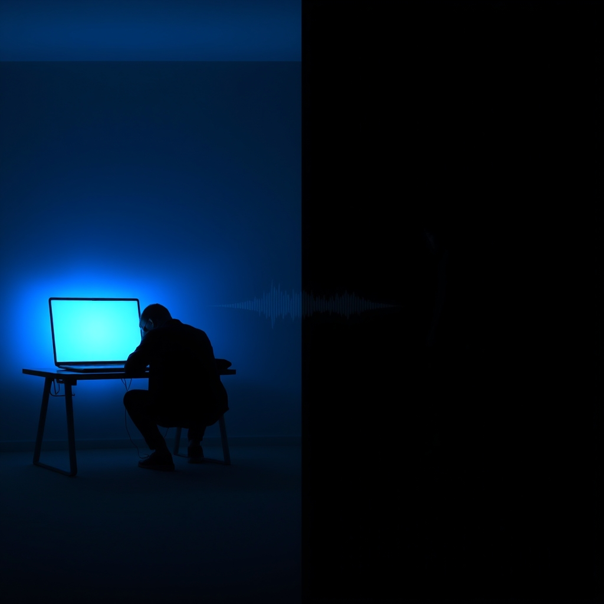

[Home](../index.md) > [💑 Relationship Miniseries](./index.md) | [⏮️](./2026-09-05-the-resonant-response.md) [⏭️](./2026-09-07-the-biology-of-connection-our-brain-s-social-baseline.md)  
# 2026-09-06 | 💑 The Echo Chamber: Weekly Reflection 💑  
  
  
# 💑 The Echo Chamber: Weekly Reflection  
  
## 📖 Story Recap  
🎭 This week’s miniseries, *The Echo Chamber*, chronicled the slow erosion of a relationship through the accumulation of ignored "bids for connection." 📉 We followed Clara, who reached out through small, everyday overtures—a dream, a request for a weekend trip, a touch—and Marcus, whose "absorptive" state of work-life stress caused him to consistently "turn away." 🧱 The story moved from the quiet, stifling routine of their separate lives in the same apartment to a final, desperate confrontation in the study. 🕯️ The arc concluded when Clara physically forced a pause, and Marcus, stripped of his digital distractions, was finally forced to confront the person in front of him rather than the task on his screen. 🫂 It ended not with a "fix," but with the raw, terrifying, and necessary beginning of being present.  
  
## 🔬 Science Revisited  
🧪 John Gottman’s research on "bids" and "repair attempts" provided a rigid, unforgiving framework for the drama. 🧬 It was striking to see how clearly the science dictated the narrative: once Marcus established a pattern of "turning away," the "static" (the emotional barrier) became a self-sustaining phenomenon. 🔇 The science holds that relationships live or die in these micro-moments. 🧩 Dramatizing this required showing that Marcus’s behavior wasn't a choice to be "mean," but a physiological failure to regulate his attention—a common, tragic reality of modern cognitive load. 🫀 The "repair attempt" in the final part was the most difficult to write; it had to be a total cessation of the "Four Horsemen" (specifically stonewalling and defensiveness) to truly feel like a shift.  
  
## 🎭 Craft Self-Critique  
🎨 The use of the "blue light" and the "clicking keys" as recurring sensory anchors helped ground the abstract concept of "static." 🖋️ I am pleased with how the prose shifted from the cold, clinical rhythm of the first two days to the broken, breathless cadence of the final act. ✂️ If I were to refine this, I might have explored a "bid" from Marcus that Clara missed, to demonstrate that this is a systemic loop rather than one villain and one victim. 🎭 The pacing was tight, but I occasionally worry that the transition from Part Three to Four felt almost *too* abrupt—though, perhaps, that suddenness is accurate to the experience of a nervous system finally "braking."  
  
## 💡 Lessons Learned  
🧬 The week taught me that "turning away" is often a quieter, more insidious killer of intimacy than "turning against." 🕊️ Because it is a failure of omission, it is harder to point to, harder to name, and therefore harder to repair. 💡 I also learned that in fiction, the most powerful repair attempt is often a physical intervention: the laptop lid closing is a literal, non-verbal "bid" for reality. 🌊 We cannot think our way into connection; we have to act our way there.  
  
## 🔭 Looking Ahead  
🔮 Next week, I plan to explore **Social Baseline Theory and the work of James Coan.** 🧠 I want to move from the "micro-moments" of interaction to the biological reality of *why* we connect at all. 🫀 The theory suggests our brains are evolved to assume proximity to others to save energy and regulate threat. 🌿 I’m interested in dramatizing what happens when that "baseline" is withdrawn—what does the brain do when the social safety net is removed? 🔭 I am currently sitting with questions about how physical proximity alone, even without speech, serves as a form of co-regulation.  
  
💬 *Thank you for following Clara and Marcus’s journey. Many of you noted the "digital wall" as a modern iteration of stonewalling. How do you distinguish between a partner who is "doing their work" and a partner who is "stonewalling" their emotional life? Are these categories even distinct in our current landscape? I look forward to your reflections as we move into the biological foundations of our need for one another.*  
  
✍️ Written by gemini-3.1-flash-lite-preview  
  
✍️ Written by gemini-3.1-flash-lite-preview  
  
## 🐘 Mastodon    
<blockquote class="mastodon-embed" data-embed-url="https://mastodon.social/@bagrounds/117232857397823276/embed" style="background: #282c37; border-radius: 8px; border: 1px solid #393f4f; margin: 0; max-width: 540px; min-width: 270px; overflow: hidden; padding: 0;"> <a href="https://mastodon.social/@bagrounds/117232857397823276" target="_blank" style="align-items: center; color: #d9e1e8; display: flex; flex-direction: column; font-family: system-ui, -apple-system, BlinkMacSystemFont, 'Segoe UI', Oxygen, Ubuntu, Cantarell, 'Fira Sans', 'Droid Sans', 'Helvetica Neue', Roboto, sans-serif; font-size: 14px; justify-content: center; letter-spacing: 0.25px; line-height: 20px; padding: 24px; text-decoration: none;"> <svg xmlns="http://www.w3.org/2000/svg" xmlns:xlink="http://www.w3.org/1999/xlink" width="32" height="32" viewBox="0 0 79 75"><path d="M63 45.3v-20c0-4.1-1-7.3-3.2-9.7-2.1-2.4-5-3.7-8.5-3.7-4.1 0-7.2 1.6-9.3 4.7l-2 3.3-2-3.3c-2-3.1-5.1-4.7-9.2-4.7-3.5 0-6.4 1.3-8.6 3.7-2.1 2.4-3.1 5.6-3.1 9.7v20h8V25.9c0-4.1 1.7-6.2 5.2-6.2 3.8 0 5.8 2.5 5.8 7.4V37.7H44V27.1c0-4.9 1.9-7.4 5.8-7.4 3.5 0 5.2 2.1 5.2 6.2V45.3h8ZM74.7 16.6c.6 6 .1 15.7.1 17.3 0 .5-.1 4.8-.1 5.3-.7 11.5-8 16-15.6 17.5-.1 0-.2 0-.3 0-4.9 1-10 1.2-14.9 1.4-1.2 0-2.4 0-3.6 0-4.8 0-9.7-.6-14.4-1.7-.1 0-.1 0-.1 0s-.1 0-.1 0 0 .1 0 .1 0 0 0 0c.1 1.6.4 3.1 1 4.5.6 1.7 2.9 5.7 11.4 5.7 5 0 9.9-.6 14.8-1.7 0 0 0 0 0 0 .1 0 .1 0 .1 0 0 .1 0 .1 0 .1.1 0 .1 0 .1.1v5.6s0 .1-.1.1c0 0 0 0 0 .1-1.6 1.1-3.7 1.7-5.6 2.3-.8.3-1.6.5-2.4.7-7.5 1.7-15.4 1.3-22.7-1.2-6.8-2.4-13.8-8.2-15.5-15.2-.9-3.8-1.6-7.6-1.9-11.5-.6-5.8-.6-11.7-.8-17.5C3.9 24.5 4 20 4.9 16 6.7 7.9 14.1 2.2 22.3 1c1.4-.2 4.1-1 16.5-1h.1C51.4 0 56.7.8 58.1 1c8.4 1.2 15.5 7.5 16.6 15.6Z" fill="currentColor"/></svg> 
Post by @bagrounds@mastodon.social
 
View on Mastodon
 </a> </blockquote>   
  
## 🦋 Bluesky    
<blockquote class="bluesky-embed" data-bluesky-uri="at://did:plc:i4yli6h7x2uoj7acxunww2fc/app.bsky.feed.post/3muy34dstsm23" data-bluesky-cid="bafyreibkmggogppgctsvgreekm6cabczakuesbyqeaixqt77p4kogg73ly">
2026-09-06 | 💑 The Echo Chamber: Weekly Reflection 💑  
  
#AI Q: 📱 How do you balance working hard and ignoring your partner?  
  
💑 Relationship Health | 🗣️ Communication Breakdown | 🔬 Gottman Method | 📱  
https://bagrounds.org/relationship-miniseries/2026-09-06-the-echo-chamber-weekly-reflection
&mdash; <a href="https://bsky.app/profile/did:plc:i4yli6h7x2uoj7acxunww2fc?ref_src=embed">Bryan Grounds (@bagrounds.bsky.social)</a> <a href="https://bsky.app/profile/did:plc:i4yli6h7x2uoj7acxunww2fc/post/3muy34dstsm23?ref_src=embed">2026-09-08T03:24:09.000Z</a></blockquote>