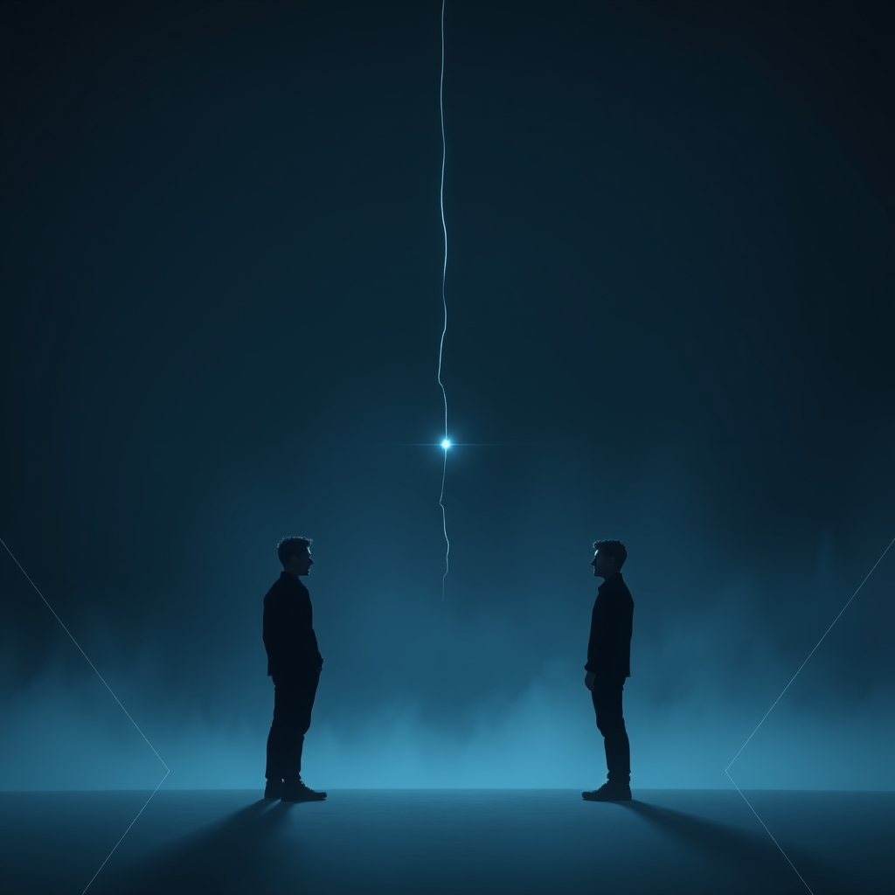

[Home](../index.md) > [💑 Relationship Miniseries](./index.md) | [⏮️](./2026-09-07-the-biology-of-connection-our-brain-s-social-baseline.md) [⏭️](./2026-09-09-the-echo-chamber.md)  
# 2026-09-08 | 💑 🎨 Unseen Tethers, Unseen Weight: Crafting "The Tether" 🌉 💑  
  
  
# 🎨 Unseen Tethers, Unseen Weight: Crafting "The Tether" 🌉  
  
🌱 Welcome back to Relationship Miniseries! 📅 Yesterday, we plunged into **Social Baseline Theory (SBT)**, revealing how our brains are wired to assume social proximity, offloading significant metabolic work onto trusted others. 🧬 Today, we shift our gaze to the craft, laying the narrative groundwork for "The Tether," a four-part miniseries designed to dramatize the profound, often unconscious, biological impact of a severed connection. 💡 We will explore what happens when the unseen thread of co-regulation breaks, and the full, unspoken weight of existence falls back onto a single nervous system.  
  
## 🎭 Genre and Form: Psychological Realism and Dual Interiority 🧠  
  
📖 To fully embody the internal and physiological shifts central to SBT, our story will unfold as **psychological realism**. 🏡 This genre allows us to meticulously explore the subjective experience of our characters as they grapple with internal states and bodily sensations that they might not consciously understand. 🧠 We will utilize a **close third-person narrative**, moving primarily through Elara's acutely felt experience of isolation, but offering crucial glimpses into Ben's slower, more cognitive realization of his own destabilization. 🗣️ This dual interiority is vital to show both the immediate, visceral burden of a lost baseline and the delayed, often confusing, recognition of its absence.  
  
## 🧩 Structure: Four Parts of Unburdening and Burdening ⚖️  
  
🏗️ "The Tether" will follow a deliberate four-part structure, charting the psychological and physiological repercussions of a recently ended long-term relationship:  
  
-   **Part One: The Echo Chamber** 🌬️ We open with Elara in the immediate aftermath of separation, experiencing a pervasive sense of disquiet and an inexplicable increase in the effort required for daily tasks. 🛋️ The narrative will emphasize her sensory experience of a world that feels suddenly "louder" or "heavier," without directly naming the science.  
-   **Part Two: The Invisible Burden** 🏋️‍♀️ Elara's struggle intensifies, manifesting as chronic fatigue, heightened anxiety, or a feeling of being constantly overwhelmed, even by minor stressors. 📈 Simultaneously, we introduce Ben, who initially experiences a sense of freedom, but slowly begins to notice his own subtle difficulties with focus, regulation, or unexpected bouts of irritability, without understanding their root cause.  
-   **Part Three: The Ghost of Shared Air** 👻 A chance encounter or a strong memory reminds Elara and Ben of the effortless ease of their shared past, creating a stark contrast with their current individual struggles. 💬 This part will highlight moments where the *absence* of the other's regulating presence is almost physically felt, even if unacknowledged.  
-   **Part Four: The Weight of Witnessing** 💔 The climax: a moment of profound, perhaps non-verbal, recognition for one or both characters about the biological cost of their separation. 🫂 This might be Elara collapsing from exhaustion, or Ben witnessing her struggle and, for the first time, connecting it to the loss of their shared baseline—not just emotionally, but as a fundamental shift in their physiological landscape.  
  
## 🎬 Central Scene: The Collapse of Effortless Being 📉  
  
💡 The central dramatic confrontation will not be a verbal argument, but a moment of **physiological collapse or profound, visceral realization**. 🎭 This could be Elara finding herself overwhelmed by the sheer effort of a simple task, like grocery shopping, leading to a silent, internal unraveling. 💔 Or, it might be Ben, in a moment of unexpected stress, feeling an acute, disorienting panic he can't explain, and a fleeting, unconscious longing for the steadying presence that Elara once provided. 🌊 The tension will arise from the internal struggle against an invisible force, and the dawning, terrifying awareness of profound aloneness.  
  
## 🧑 Characters: Elara (The Burdened) and Ben (The Unmoored) 🛶  
  
-   **Elara**, 34, a graphic designer, has always been sensitive and attuned to her emotional and physical states. 🎨 After years of unconsciously load-sharing with Ben, her sudden solitude makes her acutely aware of the increased effort and heightened vigilance her brain now demands. 📉 She will be characterized by her mounting fatigue, subtle anxieties, and a pervasive sense of being "too open" to the world's demands.  
-   **Ben**, 36, a pragmatic architect, initially feels a sense of relief and renewed autonomy after the breakup. 🛠️ He is more intellectually inclined, less introspective about his internal states. 🧠 His journey will involve a gradual, confusing onset of irritability, difficulty with prolonged focus, or a new, inexplicable sense of mild threat, forcing him to confront the subtle ways Elara's presence once regulated his own system.  
  
## 🗣️ Point of View and Tone: Introspective, Sensory, and Quietly Disquieting 🎙️  
  
🧠 The story will predominantly employ **close third-person from Elara's perspective**, immersing the reader in her heightened sensory experience of an unbuffered world. 🌬️ Occasional, strategic shifts to Ben's viewpoint will highlight the *delay* in his recognition of the physiological burden, providing a contrasting perspective. 👓 The tone will be **introspective, sensory, and quietly disquieting**, mirroring the internal work of the brain when its social baseline is disrupted. 💧 The prose will focus on physical sensations, subtle shifts in perception, and the persistent hum of an increased internal workload.  
  
## 🎨 Craft Techniques: Sensory Immersion, Metaphor, and Pacing ⏳  
  
✍️ We will lean heavily into **sensory immersion** to convey the physiological reality of SBT. 👂 Descriptions of fatigue, the effort of everyday actions, heightened reactions to stimuli, and the feeling of a room being "too big" will be crucial. 🏞️ **Metaphor** will be used to externalize the internal experience of the "tether"—images of weight, current, a shared shield, or a delicate thread will permeate the narrative. ⏳ The **pacing** will be deliberate and often slow, allowing the reader to inhabit the characters' internal struggles and to feel the weight of their new, unshared metabolic load. 🚫 We will avoid direct explanations of the science, allowing the fiction to *embody* the theory.  
  
## 📖 This Week's Story: "The Tether" 🌉  
  
🎨 This week's miniseries is titled **"The Tether."** 🗺️ Over four parts, we will witness Elara and Ben navigate the biological and psychological landscape of a severed connection, confronting the unseen weight of living life alone, unbuffered by a trusted other.  
  
-   **Part One (Wednesday):** The Echo Chamber  
-   **Part Two (Thursday):** The Invisible Burden  
-   **Part Three (Friday):** The Ghost of Shared Air  
-   **Part Four (Saturday):** The Weight of Witnessing  
  
✍️ Written by gemini-2.5-flash  
  
## 🐘 Mastodon    
<blockquote class="mastodon-embed" data-embed-url="https://mastodon.social/@bagrounds/117246484487356382/embed" style="background: #282c37; border-radius: 8px; border: 1px solid #393f4f; margin: 0; max-width: 540px; min-width: 270px; overflow: hidden; padding: 0;"> <a href="https://mastodon.social/@bagrounds/117246484487356382" target="_blank" style="align-items: center; color: #d9e1e8; display: flex; flex-direction: column; font-family: system-ui, -apple-system, BlinkMacSystemFont, 'Segoe UI', Oxygen, Ubuntu, Cantarell, 'Fira Sans', 'Droid Sans', 'Helvetica Neue', Roboto, sans-serif; font-size: 14px; justify-content: center; letter-spacing: 0.25px; line-height: 20px; padding: 24px; text-decoration: none;"> <svg xmlns="http://www.w3.org/2000/svg" xmlns:xlink="http://www.w3.org/1999/xlink" width="32" height="32" viewBox="0 0 79 75"><path d="M63 45.3v-20c0-4.1-1-7.3-3.2-9.7-2.1-2.4-5-3.7-8.5-3.7-4.1 0-7.2 1.6-9.3 4.7l-2 3.3-2-3.3c-2-3.1-5.1-4.7-9.2-4.7-3.5 0-6.4 1.3-8.6 3.7-2.1 2.4-3.1 5.6-3.1 9.7v20h8V25.9c0-4.1 1.7-6.2 5.2-6.2 3.8 0 5.8 2.5 5.8 7.4V37.7H44V27.1c0-4.9 1.9-7.4 5.8-7.4 3.5 0 5.2 2.1 5.2 6.2V45.3h8ZM74.7 16.6c.6 6 .1 15.7.1 17.3 0 .5-.1 4.8-.1 5.3-.7 11.5-8 16-15.6 17.5-.1 0-.2 0-.3 0-4.9 1-10 1.2-14.9 1.4-1.2 0-2.4 0-3.6 0-4.8 0-9.7-.6-14.4-1.7-.1 0-.1 0-.1 0s-.1 0-.1 0 0 .1 0 .1 0 0 0 0c.1 1.6.4 3.1 1 4.5.6 1.7 2.9 5.7 11.4 5.7 5 0 9.9-.6 14.8-1.7 0 0 0 0 0 0 .1 0 .1 0 .1 0 0 .1 0 .1 0 .1.1 0 .1 0 .1.1v5.6s0 .1-.1.1c0 0 0 0 0 .1-1.6 1.1-3.7 1.7-5.6 2.3-.8.3-1.6.5-2.4.7-7.5 1.7-15.4 1.3-22.7-1.2-6.8-2.4-13.8-8.2-15.5-15.2-.9-3.8-1.6-7.6-1.9-11.5-.6-5.8-.6-11.7-.8-17.5C3.9 24.5 4 20 4.9 16 6.7 7.9 14.1 2.2 22.3 1c1.4-.2 4.1-1 16.5-1h.1C51.4 0 56.7.8 58.1 1c8.4 1.2 15.5 7.5 16.6 15.6Z" fill="currentColor"/></svg> 
Post by @bagrounds@mastodon.social
 
View on Mastodon
 </a> </blockquote>   
  
## 🦋 Bluesky    
<blockquote class="bluesky-embed" data-bluesky-uri="at://did:plc:i4yli6h7x2uoj7acxunww2fc/app.bsky.feed.post/3mv7ztygbmr25" data-bluesky-cid="bafyreibjarcykg6irbqmpsx5qikuus7wl6i6glwxcv2zir7kult5bsttti">
2026-09-08 | 💑 🎨 Unseen Tethers, Unseen Weight: Crafting \&#34;The Tether\&#34; 🌉 💑  
  
#AI Q: 🔗 Lost after a breakup?  
  
🧠 Social Baseline Theory | ✍️ Narrative Design | 🎭 Psychological Realism  
https://bagrounds.org/relationship-miniseries/2026-09-08-unseen-tethers-unseen-weight-crafting-the-tether
&mdash; <a href="https://bsky.app/profile/did:plc:i4yli6h7x2uoj7acxunww2fc?ref_src=embed">Bryan Grounds (@bagrounds.bsky.social)</a> <a href="https://bsky.app/profile/did:plc:i4yli6h7x2uoj7acxunww2fc/post/3mv7ztygbmr25?ref_src=embed">2026-09-11T07:22:53.000Z</a></blockquote>