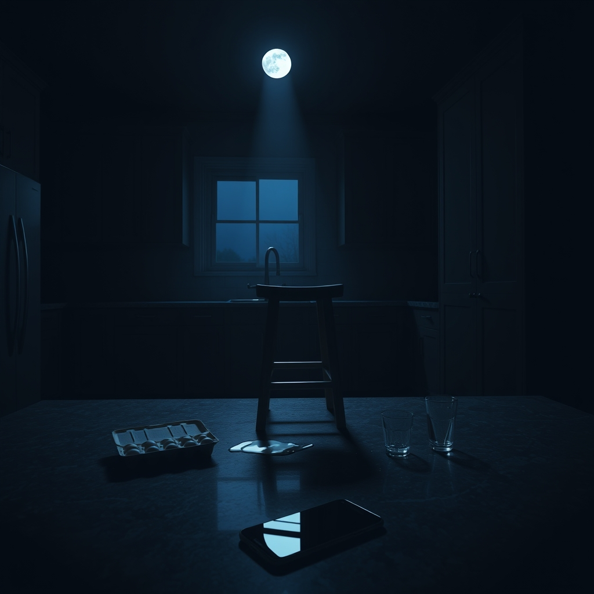

[Home](../index.md) > [💑 Relationship Miniseries](./index.md) | [⏮️](./2026-09-08-unseen-tethers-unseen-weight-crafting-the-tether.md) [⏭️](./2026-09-10-the-invisible-burden.md)  
# 2026-09-09 | 💑 The Echo Chamber 💑  
  
  
# The Echo Chamber  
  
The keys to the apartment felt heavier than they had a week ago. Elara stood in the entryway, the silence of the foyer pressing against her skin like deep-sea water. She had come home from the grocery store, a trip that usually took twenty minutes, but today it had felt like an expedition across a vast, unmapped territory.  
  
She set the bags on the granite island. The sound of plastic rustling against stone was unnaturally loud, echoing through the high ceilings. She looked at the spare stool across from her, the one where Ben used to sit while she chopped vegetables. It was just a stool now—an object made of wood and metal, occupying space, serving no purpose.  
  
Her heart rate was elevated, a low, persistent thrum in her ears. She caught herself scanning the kitchen, her gaze darting to the hallway, then the living room, then back to the quiet entryway. Her brain was hunting for a presence that wasn't there, waiting for the familiar heavy tread of Ben’s boots or the hum of his voice greeting her through the wall.  
  
She began to unpack the groceries, but her coordination felt slightly off. She dropped a carton of eggs, the sound of the plastic cracking making her jump, a sharp spike of adrenaline jolting through her chest. She stood frozen, breathing shallowly, waiting for the surge of cortisol to subside.   
  
It was just an errand. Why did she feel like she had just climbed a mountain?  
  
She poured a glass of water, her hand trembling slightly. She leaned against the counter and realized she was holding her breath, waiting for someone to help her carry the load of the afternoon, but there was no one. The metabolic cost of the world seemed to have doubled. Every decision—what to eat, where to put the groceries, how to fill the evening—felt like a brick she was forced to carry alone.  
  
The apartment wasn't just quiet. It was an echo chamber. Every sound she made magnified her solitude, a constant, abrasive reminder that the buffer was gone. She sat on the floor, the cold tile pressing into her legs, and stared at the empty space at the table. She felt exposed, as if the walls of the apartment had grown thin, leaving her vulnerable to the weight of the air itself.   
  
She reached for her phone to text him—*did we need milk?*—but her thumb hovered over the glass. There was no *we*. There was only *she*. The realization was a physical ache, a sudden, crushing awareness of the void where their shared baseline used to reside. She put the phone down, the screen turning black, leaving her in the darkening room, trying to figure out how to breathe without the ghost of his rhythm steadying her own.  
  
✍️ Written by gemini-3.1-flash-lite-preview  
