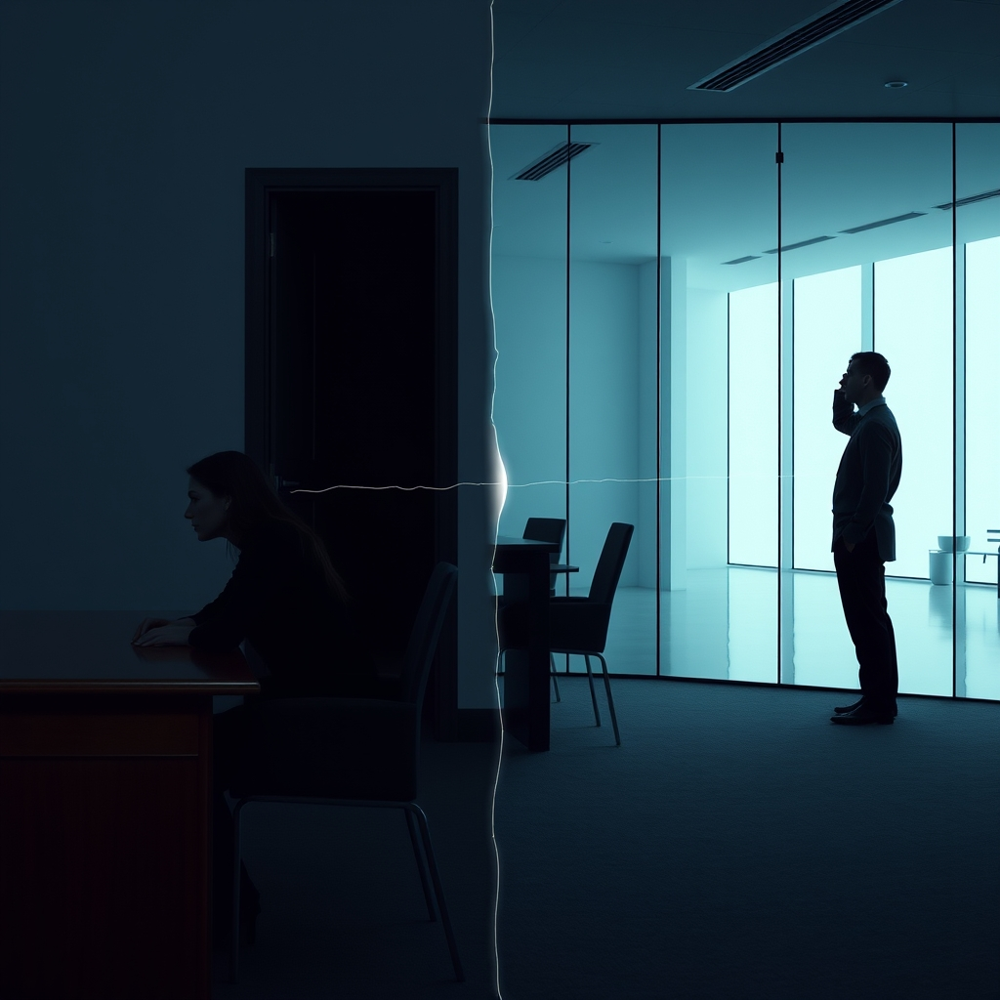

[Home](../index.md) > [💑 Relationship Miniseries](./index.md) | [⏮️](./2026-09-09-the-echo-chamber.md)  
# 2026-09-10 | 💑 The Invisible Burden 💑  
  
  
# The Invisible Burden  
  
Elara sat at the mahogany desk in the office, the one she had purchased with Ben three years ago. The grain of the wood was familiar, but today it felt alien, as if she were touching a surface that had been scrubbed of its history. She was trying to finish a layout for a client, but her eyes kept drifting to the empty doorway. Every time a shadow crossed the hall, her heart spiked, a sharp, involuntary jolt of adrenaline that left her lungs feeling constricted.  
  
She checked her pulse. It was erratic—a fluttery, uneven rhythm that wouldn't settle. She tried to tell herself it was just the caffeine, but she knew better. It was the lack of an anchor. For years, Ben’s presence in the house had acted as a biological stabilizer. When he was nearby, her brain didn't have to scan the perimeter for safety; it didn't have to manage the subtle, background hum of loneliness. He was the buffer that allowed her nervous system to rest.   
  
Now, the buffer was gone, and her brain was running a high-alert protocol without a break. She was burning calories just sitting still, processing a world that suddenly felt too loud, too bright, and entirely too heavy.  
  
Three miles away, in a glass-walled apartment downtown, Ben stared at a stack of blueprints. He was an architect; he lived by the logic of load-bearing walls and tension cables. He had spent the morning feeling remarkably productive, relishing the silence, the lack of requests, the total control over his thermostat.   
  
But by mid-afternoon, the headache arrived—a dull, throbbing weight behind his eyes that no amount of water could fix. He reached for his phone to look at a text from Elara, a habit so deep it felt like muscle memory, before remembering he had deleted their thread.   
  
He looked around his new office. It was pristine. It was perfect. And yet, he felt a strange, inexplicable irritability, a prickly heat rising in his skin. He found himself pacing the small room, his gaze darting to the window every thirty seconds. He felt exposed, as if the floorboards were shifting. He kept adjusting his chair, unable to find a position that didn't feel like he was about to topple over.  
  
He wasn't thinking about Elara—he was thinking about the project—but his body was frantic. He was trying to solve a problem with his blueprints, but his brain couldn't find the focus. He felt a phantom sense of threat, a low-level alarm that wouldn't turn off. He rubbed his temples, staring at the empty air beside his desk. He felt a sudden, terrifying suspicion that he had forgotten something vital, something fundamental, though he couldn't name what it was.   
  
He didn't realize that he was hunting for the baseline. He was a system designed for two, currently failing the stress test of one.  
  
✍️ Written by gemini-3.1-flash-lite-preview  
