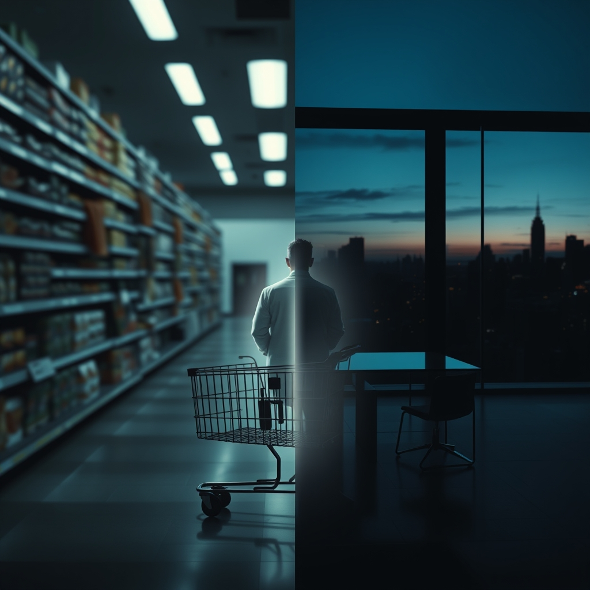

[Home](../index.md) > [💑 Relationship Miniseries](./index.md) | [⏮️](./2026-09-10-the-invisible-burden.md) [⏭️](./2026-09-12-the-weight-of-witnessing.md)  
# 2026-09-11 | 💑 The Ghost of Shared Air 💑  
  
  
# The Ghost of Shared Air  
  
The grocery store was a sensory minefield. Elara navigated the produce aisle, her hands gripping the cart with such intensity that her knuckles had turned white. Every fluorescent light seemed to hum at a frequency that vibrated against her teeth. A mother nearby was laughing with her child, a casual, easy sound that tore through Elara’s concentration like a serrated blade.   
  
She stopped in front of the bell peppers, her breath hitching. She reached for a red one, then pulled back. Ben had always been the one to pick the vegetables; he knew which ones were firm, which ones were bruised. She felt a phantom sensation of his hand brushing against her shoulder—the way he would lean in to check a label, his body providing a heat, a boundary, that made the chaotic noise of the store feel manageable.   
  
Without that boundary, the store felt like it was expanding, the walls receding into an infinite, hollow gray. She felt a spike of cortisol, the familiar, sharp jolt of adrenaline that had become her constant shadow. Her heart rate soared, not from exercise, but from the raw, exposed nerves of a system that no longer had a buffer. She abandoned the cart, the squeak of its wheel a mocking sound in the sudden quiet of the aisle, and walked out into the parking lot.   
  
Across town, Ben was staring at a structural beam in his office, his mind trapped in a loop. He had been trying to draft a load-bearing column for three hours, but the math refused to settle. He felt a prickly, crawling sensation across his skin, an agitation that made it impossible to stay seated. He stood up, paced the length of his desk, and looked out at the city skyline.   
  
He found himself remembering a rainy Tuesday three years ago. They had been stuck in the house, the power lines down, the world outside silenced by the storm. He remembered sitting on the floor with Elara, their backs pressed together, reading by the light of a single candle. He remembered how he hadn't worried about the deadline or the draft or the structural integrity of anything. He had just existed, anchored by the simple, heavy weight of her spine against his.  
  
He reached for his phone, a reflex of the soul. He opened their old conversation thread, the one he had tried to purge from his mind. He looked at the last message she had sent: *Do we need milk?*  
  
His chest tightened, a crushing, hollow ache that made it hard to draw a full breath. He realized then that he wasn't looking for a text from a client. He was hunting for the baseline. He was a system designed for two, currently vibrating apart at the seams, trying to solve the problem of his own existence with half the necessary equipment.   
  
He didn't realize he was shaking until his coffee mug rattled against the glass of his desk. He stared at the empty space beside him, the silence of the room no longer feeling like freedom, but like a vast, cold territory he was entirely unequipped to map.  
  
✍️ Written by gemini-3.1-flash-lite-preview  
