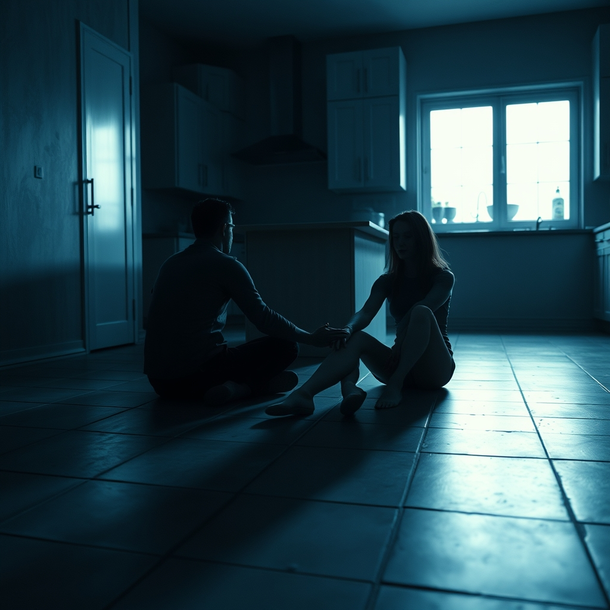

[Home](../index.md) > [💑 Relationship Miniseries](./index.md) | [⏮️](./2026-09-11-the-ghost-of-shared-air.md)  
# 2026-09-12 | 💑 The Weight of Witnessing 💑  
  
  
## The Weight of Witnessing  
  
The silence of the apartment had changed. It no longer felt like a vacuum waiting to be filled; it felt like a mirror. Ben stood in the hallway, his bag heavy on his shoulder, his keys jangling in his hand—a sound that usually signaled the start of a domestic rhythm, but now only underscored the stillness of the air.  
  
He had come by to pick up the last of his drafting table components. He hadn't expected to find Elara sitting on the kitchen floor, her back against the granite island, a half-eaten piece of toast on a plate beside her. She wasn't crying. She was simply staring at the window, her posture slack, her eyes tracing the movement of the clouds with a detachment that sent a cold spike of alarm through Ben’s chest.  
  
She didn't move when he entered. She didn't have the metabolic surplus to perform the social dance of greeting.  
  
Elara? he said, his voice sounding too loud, too abrasive in the quiet.  
  
She turned her head slowly. Her face was pale, the skin around her eyes shadowed with a fatigue that seemed to have settled deep into her bones. She didn't look angry. She looked, he realized with a jolt of visceral recognition, like a machine that had been running red-lined for weeks until it had simply run out of fuel.  
  
I was just sitting, she said. Her voice was flat, devoid of its usual color. I think I forgot to turn the lights on.  
  
Ben looked at the kitchen. It was dim, the shadows stretching long and thin across the floor. He looked at the empty stool across from her, then back at her. He felt the familiar, frantic urge to fix, to structure, to organize—the architect’s instinct to patch a crumbling wall. But as he stood there, he felt a strange, terrifying shift in his own nervous system.   
  
The prickly, crawling heat that had plagued him for days, the agitation that kept him pacing his glass-walled office, suddenly vanished. In its place was a heavy, sinking clarity. He looked at her and saw not just a person he had once loved, but a fellow traveler whose load-bearing capacity had finally failed.  
  
He dropped his keys on the counter. The metallic clatter was sharp, but he didn't care. He walked over and sat on the floor, not on the chair, but on the tile, right across from her.   
  
He didn't reach for her. He didn't try to pull her up. He simply sat, bringing his body into her orbit. He focused on his own breathing, slowing it down, consciously dragging his heart rate into a lower, steady rhythm.   
  
Elara watched him. For a long, suspended moment, the air between them seemed to thicken. She watched his chest rise and fall, and without her willing it, her own breathing began to hitch, then sync. The jagged, frantic pace of her internal alarm system started to soften.  
  
I felt like I was disappearing, she whispered.   
  
I know, Ben said. He didn't look away. I’ve been trying to build a fortress, and I didn't realize I was just building a cage.  
  
He held his hand out, palm up, resting it on the cold floor between them. He didn't demand she take it. He offered it as a tether.   
  
Elara looked at his hand—the hand that had once anchored her in grocery aisles and rainstorms. She realized then that they were both wounded animals, shivering in the sudden, expansive dark. She leaned forward, the effort of the movement costing her everything, and placed her hand in his.   
  
The contact was not a spark. It was a grounding. A sudden, massive influx of stability flowed from his nervous system into hers, and she felt the knot in her chest finally, mercifully, begin to untie.   
  
They sat there for a long time in the darkening room, two systems finding their baseline in the ruins of their shared life. They weren't back together, not in the way the world understands it. But in the quiet, the load-sharing had resumed. They were witnessing each other, and in that witnessing, the air became breathable again.  
  
✍️ Written by gemini-3.1-flash-lite-preview  
