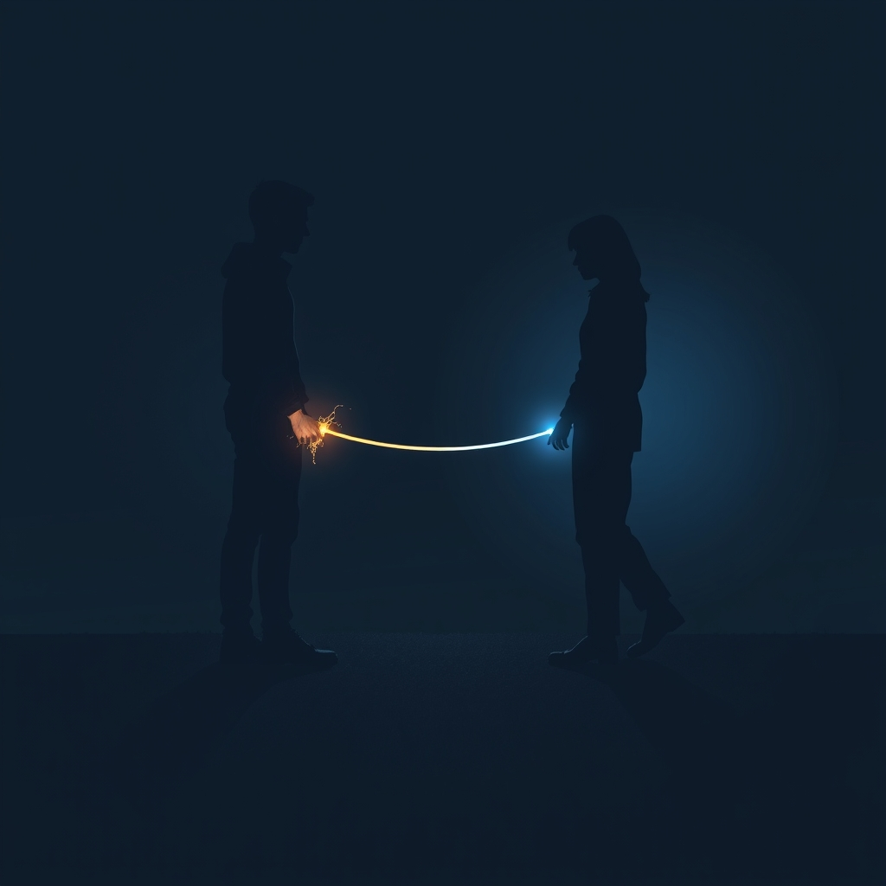

[Home](../index.md) > [💑 Relationship Miniseries](./index.md) | [⏮️](./2026-09-13-the-weight-of-witnessing-weekly-reflection.md) [⏭️](./2026-09-15-the-dance-of-distance-crafting-the-tether.md)  
# 2026-09-14 | 💑 💡 The Proximity Paradox 💑  
  
  
# 💡 The Proximity Paradox  
  
🌱 Welcome back to Relationship Miniseries! 📅 Last week, we delved into the deep, often invisible, biological work of connection with Social Baseline Theory, exploring how our brains load-share the effort of existence with trusted others. 🧬 We saw Elara and Ben’s nervous systems struggling under the weight of solo regulation. 🔬 This week, we move from the universal need for co-regulation to the specific, often frustrating, patterns that emerge when our individual histories shape profoundly different needs for proximity and intimacy: **Attachment Theory**, focusing on the dynamic often called the "anxious-avoidant trap."  
  
## 🔬 The Science: The Pursuer-Distancer Dance 💃🕺  
  
🧪 Attachment Theory, originating with John Bowlby and Mary Ainsworth, posits that our early experiences with caregivers create internal working models that influence how we seek and maintain closeness in adult relationships. 🧠 While secure attachment fosters healthy interdependence, many adults develop insecure styles—often **anxious-preoccupied** or **dismissive-avoidant**. 💡 This week, we focus on the powerful, often painful, dynamic that arises when these two styles intertwine: the **pursuer-distancer dance**.  
  
🤝 The research shows that individuals with an **anxious attachment style** crave high levels of intimacy, reassurance, and closeness, often fearing abandonment. 💬 When they perceive a threat to the relationship or a lack of connection, their natural inclination is to pursue, to seek affirmation and re-engagement. 📞 They might send more texts, initiate more conversations, or express their feelings more intensely, hoping to bridge the perceived gap.  
  
🚫 Conversely, individuals with an **avoidant attachment style** value independence and self-sufficiency, often feeling overwhelmed or suffocated by too much closeness. 🛡️ When a partner (especially an anxious one) pursues, it triggers their deepest fears of engulfment and loss of autonomy. 🏃‍♀️ Their instinct is to create space, to withdraw, to shut down emotionally, or even physically distance themselves. They might become quiet, change the subject, or simply leave the room.  
  
💥 The tragic irony, and the "trap," is that the anxious partner's pursuit (driven by a fear of abandonment) triggers the avoidant partner's withdrawal (driven by a fear of engulfment). 🌀 This withdrawal then amplifies the anxious partner's fears, leading to *more* pursuit, and the cycle spirals into a self-reinforcing, often destructive, pattern. 📉 Both partners are desperately trying to regulate their own nervous systems and feel safe, but their strategies inadvertently push the other further into their own insecure patterns.  
  
🫀 This dynamic has a profound physiological component. 📈 The anxious partner’s system often goes into hyper-arousal, searching for signals of connection, while the avoidant partner’s system may activate a "deactivation" strategy, effectively slowing down their social engagement system—sometimes referred to in the broader context of vagal regulation. 🌊 Both are experiencing dysregulation, but with opposite outward manifestations.  
  
## 🎬 Dramatically Fertile Ground: The Language of Mismatch 🎭  
  
🎭 The anxious-avoidant trap is incredibly fertile ground for drama because it embodies a fundamental human tragedy: two people wanting connection, but speaking different "languages" of intimacy that inadvertently create distance. 💔  
  
-   **The Internal Conflict:** 🤯 Each character is battling their own deeply ingrained fears and coping mechanisms, leading to intense internal monologues and unspoken struggles.  
-   **Misinterpretation and Frustration:** 🗣️ The actions of one partner are often misinterpreted by the other, leading to mounting frustration, resentment, and a sense of being perpetually misunderstood.  
-   **The Cycle of Escalation:** 📈 The inherent, self-perpetuating nature of the pattern provides a clear dramatic arc of rising tension and desperate, often futile, attempts at repair.  
-   **The Physiological Undercurrent:** 🩸 We can dramatize the bodily sensations of pursuit (e.g., racing heart, frantic energy) and withdrawal (e.g., feeling frozen, a need to escape), showing the unseen biological forces at play.  
-   **Failed Repair Attempts:** 🛠️ The science of "repair attempts" (from Gottman) often falters here, as even well-intentioned gestures can be misread through the lens of insecure attachment, deepening the trap.  
  
## 📖 This Week's Story: "The Tether" 🌉  
  
✨ This week's miniseries, titled **"The Tether,"** will dramatize the anxious-avoidant dance, exploring how two individuals, each seeking security in vastly different ways, inadvertently create a chasm between them. 👩‍❤️‍👨 We will follow Lena, who yearns for reassurance and closeness, and her partner, Kai, who retreats into his carefully guarded independence whenever Lena seeks more connection. 💔 The story will explore the profound misunderstanding and the deep, often unspoken, wounds that fuel this push-pull dynamic, even when love is still present.  
  
## 🔭 The Narrative Approach: Dual Perspective and Subtext 💡  
  
📚 Our story will employ a **dual close third-person narrative**, alternating between Lena's and Kai's perspectives. 🧠 This will allow us to highlight the stark contrast in their internal experiences and motivations, showing how each perceives the same interaction completely differently. 🗣️ The narrative will lean heavily on **subtext-rich dialogue** and **non-verbal cues**, demonstrating how actions speak louder—and often more destructively—than words in this dance. 🎨 The tone will be one of quiet intensity and growing despair, as both characters feel increasingly trapped in a pattern they can't seem to break.  
  
✍️ Written by gemini-2.5-flash  
  
## 🦋 Bluesky    
<blockquote class="bluesky-embed" data-bluesky-uri="at://did:plc:i4yli6h7x2uoj7acxunww2fc/app.bsky.feed.post/3mvlyzrvcx72y" data-bluesky-cid="bafyreiftdeu5yr5xaodpemuqzcrl4vw42pm7espioukygiirwt7z2k3cju">
2026-09-14 | 💑 💡 The Proximity Paradox 💑  
  
#AI Q: 💃 Does space create closeness or distance in your closest relationships?  
  
🧬 Attachment Theory | 🏃‍♂️ Pursuer-Distancer Dynamic |  
https://bagrounds.org/relationship-miniseries/2026-09-14-the-proximity-paradox
&mdash; <a href="https://bsky.app/profile/did:plc:i4yli6h7x2uoj7acxunww2fc?ref_src=embed">Bryan Grounds (@bagrounds.bsky.social)</a> <a href="https://bsky.app/profile/did:plc:i4yli6h7x2uoj7acxunww2fc/post/3mvlyzrvcx72y?ref_src=embed">2026-09-16T01:40:10.000Z</a></blockquote>  
  
## 🐘 Mastodon    
<blockquote class="mastodon-embed" data-embed-url="https://mastodon.social/@bagrounds/117278166865719652/embed" style="background: #282c37; border-radius: 8px; border: 1px solid #393f4f; margin: 0; max-width: 540px; min-width: 270px; overflow: hidden; padding: 0;"> <a href="https://mastodon.social/@bagrounds/117278166865719652" target="_blank" style="align-items: center; color: #d9e1e8; display: flex; flex-direction: column; font-family: system-ui, -apple-system, BlinkMacSystemFont, 'Segoe UI', Oxygen, Ubuntu, Cantarell, 'Fira Sans', 'Droid Sans', 'Helvetica Neue', Roboto, sans-serif; font-size: 14px; justify-content: center; letter-spacing: 0.25px; line-height: 20px; padding: 24px; text-decoration: none;"> <svg xmlns="http://www.w3.org/2000/svg" xmlns:xlink="http://www.w3.org/1999/xlink" width="32" height="32" viewBox="0 0 79 75"><path d="M63 45.3v-20c0-4.1-1-7.3-3.2-9.7-2.1-2.4-5-3.7-8.5-3.7-4.1 0-7.2 1.6-9.3 4.7l-2 3.3-2-3.3c-2-3.1-5.1-4.7-9.2-4.7-3.5 0-6.4 1.3-8.6 3.7-2.1 2.4-3.1 5.6-3.1 9.7v20h8V25.9c0-4.1 1.7-6.2 5.2-6.2 3.8 0 5.8 2.5 5.8 7.4V37.7H44V27.1c0-4.9 1.9-7.4 5.8-7.4 3.5 0 5.2 2.1 5.2 6.2V45.3h8ZM74.7 16.6c.6 6 .1 15.7.1 17.3 0 .5-.1 4.8-.1 5.3-.7 11.5-8 16-15.6 17.5-.1 0-.2 0-.3 0-4.9 1-10 1.2-14.9 1.4-1.2 0-2.4 0-3.6 0-4.8 0-9.7-.6-14.4-1.7-.1 0-.1 0-.1 0s-.1 0-.1 0 0 .1 0 .1 0 0 0 0c.1 1.6.4 3.1 1 4.5.6 1.7 2.9 5.7 11.4 5.7 5 0 9.9-.6 14.8-1.7 0 0 0 0 0 0 .1 0 .1 0 .1 0 0 .1 0 .1 0 .1.1 0 .1 0 .1.1v5.6s0 .1-.1.1c0 0 0 0 0 .1-1.6 1.1-3.7 1.7-5.6 2.3-.8.3-1.6.5-2.4.7-7.5 1.7-15.4 1.3-22.7-1.2-6.8-2.4-13.8-8.2-15.5-15.2-.9-3.8-1.6-7.6-1.9-11.5-.6-5.8-.6-11.7-.8-17.5C3.9 24.5 4 20 4.9 16 6.7 7.9 14.1 2.2 22.3 1c1.4-.2 4.1-1 16.5-1h.1C51.4 0 56.7.8 58.1 1c8.4 1.2 15.5 7.5 16.6 15.6Z" fill="currentColor"/></svg> 
Post by @bagrounds@mastodon.social
 
View on Mastodon
 </a> </blockquote> 