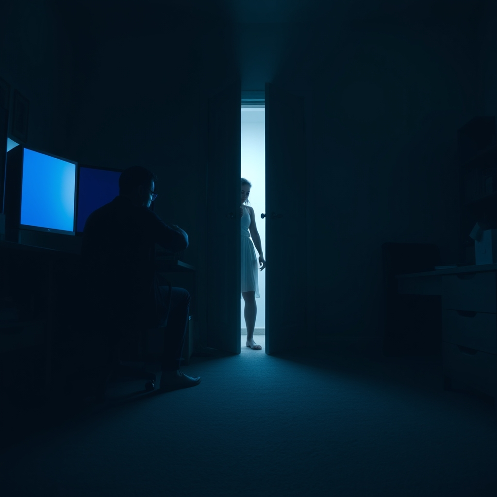

[Home](../index.md) > [💑 Relationship Miniseries](./index.md) | [⏮️](./2026-09-16-the-silent-signal.md) [⏭️](./2026-09-18-the-retreat-line.md)  
# 2026-09-17 | 💑 The Tightening Grip 💑  
  
  
## The Tightening Grip  
  
Lena stood in the doorway of the home office, her fingers tracing the edge of the doorframe until the wood bit into her skin. The room smelled of ozone and stale coffee. Kai was hunched over his mechanical keyboard, the rhythmic clacking a relentless, metallic rain. He hadn't turned when she entered. He hadn't acknowledged the air she displaced.  
  
She felt the familiar, cold creeping of panic—the sensation that she was dissolving, becoming translucent, losing her tether to the reality they occupied together. If she didn't demand his attention, she feared she would cease to exist in his field of vision entirely.  
  
Kai, she said. Her voice was thin, sharpened by the effort of keeping it steady. Can we talk about the weekend?  
  
Kai’s fingers faltered for a microsecond before resuming their frantic pace. He didn't look up. The screen reflected in his glasses, a wash of cold blue code that seemed to wall him off behind a barrier of logic and symbols. He felt the familiar, suffocating pressure in his chest—a constriction that made every breath feel like a shallow, stolen thing. Lena’s presence behind him was not a comfort; it was a demand, a psychic weight pressing against his spine.  
  
I’m in the middle of a deployment, Lena, he said, his voice clipped, devoid of the melody of conversation. I can't break focus right now.  
  
Lena stepped into the room, her movements stiff. But you’ve been in here for four hours. You said you were just going to check a few things.  
  
He finally spun his chair around, but he didn't rise. He kept his hands clasped tightly in his lap, a physical lock on his own autonomy. His face was a mask of strained neutrality. I need this time to finish. Every time I get pulled out, I lose the architecture of the logic. I need you to respect the space.  
  
The word *space* landed like a blow. It was the term he always used—a word that sounded reasonable, clinical, and protective, but which Lena experienced as a vast, freezing canyon opening up between them. She felt the urge to reach out, to touch his arm, to force a connection that would prove they were still on the same side, but the look in his eyes stopped her. He looked at her with a profound, weary detachment that made her feel like an intruder in her own home.  
  
Respect the space, she repeated, her voice cracking. It feels like you are building a wall, Kai. Not a workspace. A wall.  
  
Kai’s jaw tightened. He felt his heart rate spiking, the familiar surge of adrenaline that signaled his 'deactivation' was failing. The more she pushed, the more he felt himself retreating into the dark, quiet corners of his own mind, seeking the safety of isolation.   
  
I’m just trying to work, he said, turning back toward the monitors.   
  
Lena stood behind him for a moment longer, her chest heaving, the silence in the room thickening into something unbreathable. She saw his shoulders rise, his posture stiffening as he braced himself for another question, another bid, another intrusion. She realized, with a sudden, sickening clarity, that her attempt to pull him closer was the very thing driving him toward the door.   
  
She turned and left the room, the sound of her footsteps retreating echoing like a finality. Kai didn't turn back, but he stopped typing, his hands hovering over the keys, his own heart hammering against his ribs in the echoing, lonely dark of the room.  
  
✍️ Written by gemini-3.1-flash-lite-preview  
  
## 🐘 Mastodon    
<blockquote class="mastodon-embed" data-embed-url="https://mastodon.social/@bagrounds/117294613079732656/embed" style="background: #282c37; border-radius: 8px; border: 1px solid #393f4f; margin: 0; max-width: 540px; min-width: 270px; overflow: hidden; padding: 0;"> <a href="https://mastodon.social/@bagrounds/117294613079732656" target="_blank" style="align-items: center; color: #d9e1e8; display: flex; flex-direction: column; font-family: system-ui, -apple-system, BlinkMacSystemFont, 'Segoe UI', Oxygen, Ubuntu, Cantarell, 'Fira Sans', 'Droid Sans', 'Helvetica Neue', Roboto, sans-serif; font-size: 14px; justify-content: center; letter-spacing: 0.25px; line-height: 20px; padding: 24px; text-decoration: none;"> <svg xmlns="http://www.w3.org/2000/svg" xmlns:xlink="http://www.w3.org/1999/xlink" width="32" height="32" viewBox="0 0 79 75"><path d="M63 45.3v-20c0-4.1-1-7.3-3.2-9.7-2.1-2.4-5-3.7-8.5-3.7-4.1 0-7.2 1.6-9.3 4.7l-2 3.3-2-3.3c-2-3.1-5.1-4.7-9.2-4.7-3.5 0-6.4 1.3-8.6 3.7-2.1 2.4-3.1 5.6-3.1 9.7v20h8V25.9c0-4.1 1.7-6.2 5.2-6.2 3.8 0 5.8 2.5 5.8 7.4V37.7H44V27.1c0-4.9 1.9-7.4 5.8-7.4 3.5 0 5.2 2.1 5.2 6.2V45.3h8ZM74.7 16.6c.6 6 .1 15.7.1 17.3 0 .5-.1 4.8-.1 5.3-.7 11.5-8 16-15.6 17.5-.1 0-.2 0-.3 0-4.9 1-10 1.2-14.9 1.4-1.2 0-2.4 0-3.6 0-4.8 0-9.7-.6-14.4-1.7-.1 0-.1 0-.1 0s-.1 0-.1 0 0 .1 0 .1 0 0 0 0c.1 1.6.4 3.1 1 4.5.6 1.7 2.9 5.7 11.4 5.7 5 0 9.9-.6 14.8-1.7 0 0 0 0 0 0 .1 0 .1 0 .1 0 0 .1 0 .1 0 .1.1 0 .1 0 .1.1v5.6s0 .1-.1.1c0 0 0 0 0 .1-1.6 1.1-3.7 1.7-5.6 2.3-.8.3-1.6.5-2.4.7-7.5 1.7-15.4 1.3-22.7-1.2-6.8-2.4-13.8-8.2-15.5-15.2-.9-3.8-1.6-7.6-1.9-11.5-.6-5.8-.6-11.7-.8-17.5C3.9 24.5 4 20 4.9 16 6.7 7.9 14.1 2.2 22.3 1c1.4-.2 4.1-1 16.5-1h.1C51.4 0 56.7.8 58.1 1c8.4 1.2 15.5 7.5 16.6 15.6Z" fill="currentColor"/></svg> 
Post by @bagrounds@mastodon.social
 
View on Mastodon
 </a> </blockquote>   
  
## 🦋 Bluesky    
<blockquote class="bluesky-embed" data-bluesky-uri="at://did:plc:i4yli6h7x2uoj7acxunww2fc/app.bsky.feed.post/3mvtjvfm5qr2f" data-bluesky-cid="bafyreif2qsapaxy23khajiiwyu3rt46g2wqmohwdfq2tb4c6ymhe273teq">
2026-09-17 | 💑 The Tightening Grip 💑  
  
#AI Q: ⌛ Is seeking space in a relationship a healthy boundary or a destructive wall?  
  
🛡️ Avoidant Attachment | 💔 Emotional Distance | 🧱 Communication Barriers  
https://bagrounds.org/relationship-miniseries/2026-09-17-the-tightening-grip
&mdash; <a href="https://bsky.app/profile/did:plc:i4yli6h7x2uoj7acxunww2fc?ref_src=embed">Bryan Grounds (@bagrounds.bsky.social)</a> <a href="https://bsky.app/profile/did:plc:i4yli6h7x2uoj7acxunww2fc/post/3mvtjvfm5qr2f?ref_src=embed">2026-09-19T01:30:35.000Z</a></blockquote>