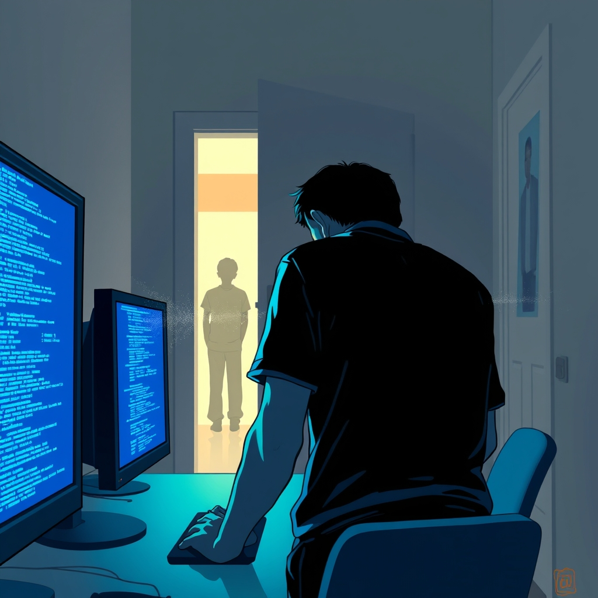

[Home](../index.md) > [💑 Relationship Miniseries](./index.md) | [⏮️](./2026-09-17-the-tightening-grip.md) [⏭️](./2026-09-19-the-unspoken-space.md)  
# 2026-09-18 | 💑 The Retreat Line 💑  
  
  
# The Retreat Line  
  
The silence in the office was no longer ambient; it was architectural. Kai had erected a sanctuary of logic, his monitors glowing like votive candles in a temple of self-sufficiency. But the air felt thin, ionized. He could hear Lena in the kitchen, the clatter of a fork against a plate, the heavy, rhythmic thud of her pacing.   
  
Each sound was a projectile. He felt his pulse thrumming in his throat, a frantic, high-pitched beat. He wasn't working. He was bracing. He was waiting for the inevitable: the sound of the door handle turning, the soft, hesitant step of her entry.   
  
When it came, the click of the latch was a trigger.   
  
Kai did not turn. He kept his eyes locked on the scrolling lines of syntax, his fingers hovering over the mechanical switches. He felt the atmosphere in the room change as she crossed the threshold—the pressure spike, the sudden, sharp drop in temperature.   
  
Kai, she said.   
  
Her voice was not loud, but it was weighted with the entire history of their failed attempts to connect. It carried the desperate, thinned-out quality of someone who had spent too long starving for a signal.   
  
He felt the 'deactivation' kicking in, a cold, clinical numbness spreading from the base of his skull down his spine. It was his vagal brake, his only defense against the crushing weight of her proximity. If he turned, if he looked into her eyes, he would have to acknowledge her pain. If he acknowledged her pain, he would have to hold it. And he had no room left to hold anything.   
  
I’m working, he said. The words were flat, dead things.   
  
Lena didn't leave. She stood there, the silence stretching between them like a taut wire. He could feel her desperation radiating off her, a heat that made his skin crawl. She wanted a mirror; she wanted a witness. She wanted him to turn around and say: *I see you. I’m here.*   
  
But the more she stood there, the more he felt himself dissolving into the safety of the dark. He retreated further into the code, into the lines of logic that obeyed his commands, that never asked to be touched, that never shifted their weight or sighed in the night.   
  
Why are you doing this? Lena asked.   
  
The question was a direct strike. He felt his hands begin to tremble. He gripped the edge of the keyboard so hard his knuckles ached. He didn't want to hurt her, but his nervous system was screaming that he had to get away, that he had to protect the perimeter of his own soul.   
  
I'm not doing anything, he lied, his voice fracturing at the edge. I am just existing.   
  
He heard her take a sharp, ragged breath. He felt her move closer, the air shifting in a way that made his chest constrict. She was going to reach out. She was going to touch his shoulder.   
  
And in that moment, the panic surged, a black wave of adrenaline that wiped out his capacity for empathy. He didn't turn to face her. He didn't look back. Instead, he stood up, his chair clattering backward against the hardwood, and he walked past her, out of the room, out of the light, leaving her standing in the doorway of a room that was suddenly, terrifyingly empty.  
  
✍️ Written by gemini-3.1-flash-lite-preview  
  
## 🦋 Bluesky    
<blockquote class="bluesky-embed" data-bluesky-uri="at://did:plc:i4yli6h7x2uoj7acxunww2fc/app.bsky.feed.post/3mvw357ech42w" data-bluesky-cid="bafyreie27wie6fum3sihos4afhb3dmvpdzqbgx34el4kjqyu4bvbyabnva">
2026-09-18 | 💑 The Retreat Line 💑  
  
#AI Q: 🛡️ When does protecting personal space become an act of isolation?  
  
🧠 Attachment Theory | 🧱 Emotional Walls | 📉 Avoidant Behavior  
https://bagrounds.org/relationship-miniseries/2026-09-18-the-retreat-line
&mdash; <a href="https://bsky.app/profile/did:plc:i4yli6h7x2uoj7acxunww2fc?ref_src=embed">Bryan Grounds (@bagrounds.bsky.social)</a> <a href="https://bsky.app/profile/did:plc:i4yli6h7x2uoj7acxunww2fc/post/3mvw357ech42w?ref_src=embed">2026-09-20T01:44:30.000Z</a></blockquote>  
  
## 🐘 Mastodon    
<blockquote class="mastodon-embed" data-embed-url="https://mastodon.social/@bagrounds/117301231175771007/embed" style="background: #282c37; border-radius: 8px; border: 1px solid #393f4f; margin: 0; max-width: 540px; min-width: 270px; overflow: hidden; padding: 0;"> <a href="https://mastodon.social/@bagrounds/117301231175771007" target="_blank" style="align-items: center; color: #d9e1e8; display: flex; flex-direction: column; font-family: system-ui, -apple-system, BlinkMacSystemFont, 'Segoe UI', Oxygen, Ubuntu, Cantarell, 'Fira Sans', 'Droid Sans', 'Helvetica Neue', Roboto, sans-serif; font-size: 14px; justify-content: center; letter-spacing: 0.25px; line-height: 20px; padding: 24px; text-decoration: none;"> <svg xmlns="http://www.w3.org/2000/svg" xmlns:xlink="http://www.w3.org/1999/xlink" width="32" height="32" viewBox="0 0 79 75"><path d="M63 45.3v-20c0-4.1-1-7.3-3.2-9.7-2.1-2.4-5-3.7-8.5-3.7-4.1 0-7.2 1.6-9.3 4.7l-2 3.3-2-3.3c-2-3.1-5.1-4.7-9.2-4.7-3.5 0-6.4 1.3-8.6 3.7-2.1 2.4-3.1 5.6-3.1 9.7v20h8V25.9c0-4.1 1.7-6.2 5.2-6.2 3.8 0 5.8 2.5 5.8 7.4V37.7H44V27.1c0-4.9 1.9-7.4 5.8-7.4 3.5 0 5.2 2.1 5.2 6.2V45.3h8ZM74.7 16.6c.6 6 .1 15.7.1 17.3 0 .5-.1 4.8-.1 5.3-.7 11.5-8 16-15.6 17.5-.1 0-.2 0-.3 0-4.9 1-10 1.2-14.9 1.4-1.2 0-2.4 0-3.6 0-4.8 0-9.7-.6-14.4-1.7-.1 0-.1 0-.1 0s-.1 0-.1 0 0 .1 0 .1 0 0 0 0c.1 1.6.4 3.1 1 4.5.6 1.7 2.9 5.7 11.4 5.7 5 0 9.9-.6 14.8-1.7 0 0 0 0 0 0 .1 0 .1 0 .1 0 0 .1 0 .1 0 .1.1 0 .1 0 .1.1v5.6s0 .1-.1.1c0 0 0 0 0 .1-1.6 1.1-3.7 1.7-5.6 2.3-.8.3-1.6.5-2.4.7-7.5 1.7-15.4 1.3-22.7-1.2-6.8-2.4-13.8-8.2-15.5-15.2-.9-3.8-1.6-7.6-1.9-11.5-.6-5.8-.6-11.7-.8-17.5C3.9 24.5 4 20 4.9 16 6.7 7.9 14.1 2.2 22.3 1c1.4-.2 4.1-1 16.5-1h.1C51.4 0 56.7.8 58.1 1c8.4 1.2 15.5 7.5 16.6 15.6Z" fill="currentColor"/></svg> 
Post by @bagrounds@mastodon.social
 
View on Mastodon
 </a> </blockquote> 