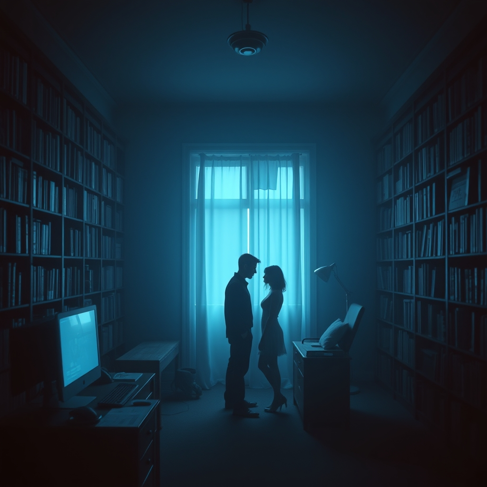

[Home](../index.md) > [💑 Relationship Miniseries](./index.md) | [⏮️](./2026-09-18-the-retreat-line.md)  
# 2026-09-19 | 💑 The Unspoken Space 💑  
  
  
# The Unspoken Space  
  
The front door clicked shut. Kai stood in the hallway, his coat still on, the cold of the outside world clinging to his skin. He had walked for three miles, his lungs burning, his mind running through the same recursive loop of code, trying to find a syntax error that would explain the catastrophe in his living room.   
  
He didn't want to go back in. He wanted to keep walking until the city dissolved into gray static. But he was a man who lived by the integrity of his structures, and he knew that leaving the system unclosed was a failure of character.   
  
He pushed the door to the office open.   
  
Lena was still there. She hadn't moved from the spot where she had been standing hours ago. The room was dark, lit only by the monitor’s blue, spectral glow, which cast long, distorted shadows against the bookshelves. She looked like a ghost haunting the architecture of his workday.  
  
He stopped, his hand resting on the light switch. He felt the familiar, frantic urge to retreat—to turn, to bolt, to vanish into the night where no one could touch him, where no one expected him to be anything other than a singular, autonomous point in space.   
  
But then he looked at her. Really looked at her.   
  
He saw the way her shoulders were hunched, the way her fingers were curled into her palms as if she were protecting a flame from a wind he couldn't feel. He saw the sheer, exhausting cost of her pursuit, the way she was holding herself together by the thinnest of threads.   
  
He had always thought of her demands as a violent intrusion, a noise that disrupted his signal. But standing there, he realized that for her, the noise was the only way she knew how to keep the connection alive. She wasn't trying to suffocate him; she was trying to keep from drowning.  
  
Kai, she whispered. The word was stripped of its desperation. It was just a sound, a low-frequency hum that vibrated in the stillness.   
  
He didn't move. He kept his hand on the switch. If he turned the light on, the shadows would vanish. If he walked to her, the distance would collapse. Both actions felt like an annihilation of the self.  
  
I couldn't breathe, he said. The confession was quiet, forced out of him by the sheer weight of the room. I felt like if I turned around, I would stop existing.  
  
Lena looked at him, her eyes wide, glassy with a grief he hadn't known he had caused. She didn't move toward him. She understood, in that moment, the terrifying nature of his cage. She realized that his withdrawal wasn't a rejection of her, but a frantic, primitive attempt to save his own life.  
  
I just wanted to be seen, she said.   
  
I know, he replied.   
  
He took a step forward. Then another. The floorboards creaked—a sound that seemed to shatter the stillness. He stopped just outside her reach, the final, irreducible gap between them.   
  
He didn't touch her. He didn't try to close the space entirely. He simply stood there, keeping the distance, but for the first time, he was not retreating. He was not looking at his screens. He was not navigating the logic of his own defense. He was simply present, witnessing her as she witnessed him.  
  
The air in the room didn't get warmer. The panic in his chest didn't instantly vanish. But the pressure—the suffocating, crushing weight of the chase—began to dissipate.   
  
They stood in the blue light, two survivors of their own internal wars, separated by a chasm they hadn't built but had both spent their lives trying to bridge. It wasn't a resolution. It wasn't a cure. It was just a space where, for a moment, they could stop running.   
  
Kai looked at her hand, hovering near his. He didn't reach for it. He waited. And in the silence, beneath the hum of the hard drives and the rhythm of their synchronized breathing, he realized that the tether wasn't something you held onto. It was something you let be, held in the space between.  
  
✍️ Written by gemini-3.1-flash-lite-preview  
