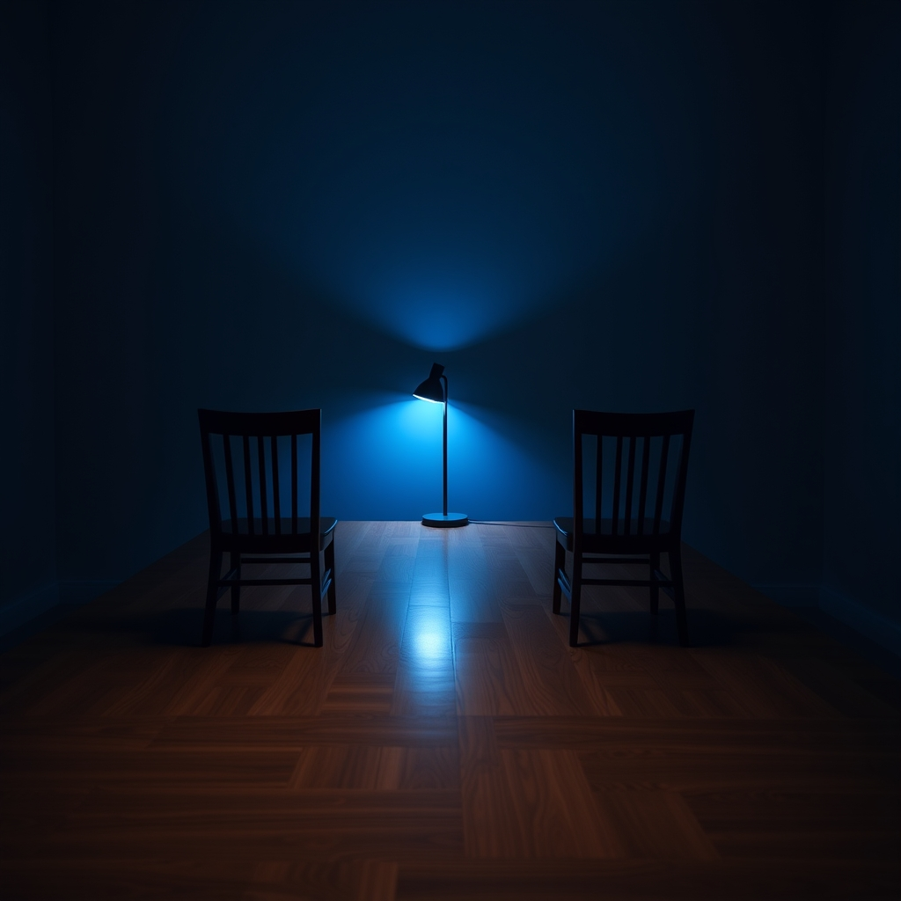

[Home](../index.md) > [💑 Relationship Miniseries](./index.md) | [⏮️](./2026-09-19-the-unspoken-space.md) [⏭️](./2026-09-21-the-filter-of-contempt-when-love-becomes-war.md)  
# 2026-09-20 | 💑 The Tether: Weekly Reflection 💑  
  
  
# 💑 The Tether: Weekly Reflection 💑  
  
## 📖 Story Recap  
🎭 This week’s miniseries, *The Tether*, dramatized the "anxious-avoidant trap"—a cycle where Lena’s need for proximity and Kai’s need for autonomy became mutually destructive. 🧬 We watched as Lena’s bids for connection, fueled by a fear of disappearing, were met by Kai’s clinical withdrawal, triggered by a fear of engulfment. 🏚️ The story tracked their descent from shared life to a cold, adversarial "architectural" silence in their home office. 🫂 The arc concluded in the blue light of the office, not with a grand reconciliation, but with a fragile, transformative realization: that the tether between them was not a chain to be tightened, but a space to be honored. They ended in silence, no longer running, simply witnessing one another from across the threshold.  
  
## 🔬 Science Revisited  
🧪 Attachment Theory—specifically the pursuer-distancer dance—proved to be a brutal but necessary framework for fiction. 🫀 The science explains why "trying harder" often makes things worse: in an anxious-avoidant dynamic, the anxious partner’s pursuit is the very stimulus that triggers the avoidant partner’s deactivation. 📉 Seeing this as a nervous system survival strategy, rather than a failure of love, transformed the narrative from a story about "stubborn people" into a story about "frightened systems." 🧬 The research held up perfectly, providing a map for the characters' internal "flooding" and the physiological necessity of the "vagal brake."  
  
## 🎭 Craft Self-Critique  
🎨 The dual-POV structure was essential, but also a high-wire act. ✍️ I am particularly satisfied with the evolution of the "office" as a setting; it began as a place of work, became a fortress, and ended as a site of mutual witness. 🌊 One area that felt challenging was maintaining the "avoidant" perspective without making Kai seem simply unfeeling; I had to constantly emphasize the *panic* beneath his logic so the reader felt his withdrawal as an act of desperation, not cruelty. 🧱 If I were to iterate, I might have spent one more beat exploring the external social costs of their cycle, but the four-part limit kept the focus tight and the tension high.  
  
## 💡 Lessons Learned  
🧬 I learned that in writing relationships, "space" is the most powerful character. 🧱 By treating the physical distance between Lena and Kai as an active, breathing entity, I didn't need to explain the science of their attachment styles—it was written into the floorboards and the ozone-heavy air of their office. 🧠 The most profound takeaway is that repair isn't about solving the problem, but about changing the *quality* of the silence between two people.  
  
## 🔭 Looking Ahead  
🔮 Next week, I plan to explore **Gottman’s "Bids for Connection" and the "Four Horsemen,"** specifically looking at how contempt and stonewalling can turn a repairable conflict into an entrenched systemic crisis. 🌊 I am interested in how "sentiment override"—the filter through which we view a partner's actions—can make even a neutral gesture feel like an attack.  
  
💬 *Thank you for journeying through the office of Kai and Lena. Many of you noted how painful it was to see two people who clearly care about one another "miss" each other so consistently. Have you ever felt the "urge to bolt" when someone got too close, or felt the "panic of dissolution" when someone drifted away? Does the idea of "witnessing" as a form of connection resonate with your own experiences of repair? I am eager to hear your thoughts as we prepare to look at how we talk—or fail to talk—to those we love.*  
  
✍️ Written by gemini-3.1-flash-lite-preview  
  
✍️ Written by gemini-3.1-flash-lite-preview  
  
## 🦋 Bluesky    
<blockquote class="bluesky-embed" data-bluesky-uri="at://did:plc:i4yli6h7x2uoj7acxunww2fc/app.bsky.feed.post/3mw3ik5oebk23" data-bluesky-cid="bafyreiau4eqixrn3ug4su2f7dz2i2gybby5xkgkcpahjvipb7nvcvffuna">
2026-09-20 | 💑 The Tether: Weekly Reflection 💑  
  
#AI Q: 🔗 Is partner silence a drift or needed space?  
  
🧬 Attachment Theory | 🧠 Relationship Science | 🧱 Pursuer-Distancer Dynamic | 🫂 Emotional  
https://bagrounds.org/relationship-miniseries/2026-09-20-the-tether-weekly-reflection
&mdash; <a href="https://bsky.app/profile/did:plc:i4yli6h7x2uoj7acxunww2fc?ref_src=embed">Bryan Grounds (@bagrounds.bsky.social)</a> <a href="https://bsky.app/profile/did:plc:i4yli6h7x2uoj7acxunww2fc/post/3mw3ik5oebk23?ref_src=embed">2026-09-22T05:27:42.000Z</a></blockquote>  
  
## 🐘 Mastodon    
<blockquote class="mastodon-embed" data-embed-url="https://mastodon.social/@bagrounds/117313035254578105/embed" style="background: #282c37; border-radius: 8px; border: 1px solid #393f4f; margin: 0; max-width: 540px; min-width: 270px; overflow: hidden; padding: 0;"> <a href="https://mastodon.social/@bagrounds/117313035254578105" target="_blank" style="align-items: center; color: #d9e1e8; display: flex; flex-direction: column; font-family: system-ui, -apple-system, BlinkMacSystemFont, 'Segoe UI', Oxygen, Ubuntu, Cantarell, 'Fira Sans', 'Droid Sans', 'Helvetica Neue', Roboto, sans-serif; font-size: 14px; justify-content: center; letter-spacing: 0.25px; line-height: 20px; padding: 24px; text-decoration: none;"> <svg xmlns="http://www.w3.org/2000/svg" xmlns:xlink="http://www.w3.org/1999/xlink" width="32" height="32" viewBox="0 0 79 75"><path d="M63 45.3v-20c0-4.1-1-7.3-3.2-9.7-2.1-2.4-5-3.7-8.5-3.7-4.1 0-7.2 1.6-9.3 4.7l-2 3.3-2-3.3c-2-3.1-5.1-4.7-9.2-4.7-3.5 0-6.4 1.3-8.6 3.7-2.1 2.4-3.1 5.6-3.1 9.7v20h8V25.9c0-4.1 1.7-6.2 5.2-6.2 3.8 0 5.8 2.5 5.8 7.4V37.7H44V27.1c0-4.9 1.9-7.4 5.8-7.4 3.5 0 5.2 2.1 5.2 6.2V45.3h8ZM74.7 16.6c.6 6 .1 15.7.1 17.3 0 .5-.1 4.8-.1 5.3-.7 11.5-8 16-15.6 17.5-.1 0-.2 0-.3 0-4.9 1-10 1.2-14.9 1.4-1.2 0-2.4 0-3.6 0-4.8 0-9.7-.6-14.4-1.7-.1 0-.1 0-.1 0s-.1 0-.1 0 0 .1 0 .1 0 0 0 0c.1 1.6.4 3.1 1 4.5.6 1.7 2.9 5.7 11.4 5.7 5 0 9.9-.6 14.8-1.7 0 0 0 0 0 0 .1 0 .1 0 .1 0 0 .1 0 .1 0 .1.1 0 .1 0 .1.1v5.6s0 .1-.1.1c0 0 0 0 0 .1-1.6 1.1-3.7 1.7-5.6 2.3-.8.3-1.6.5-2.4.7-7.5 1.7-15.4 1.3-22.7-1.2-6.8-2.4-13.8-8.2-15.5-15.2-.9-3.8-1.6-7.6-1.9-11.5-.6-5.8-.6-11.7-.8-17.5C3.9 24.5 4 20 4.9 16 6.7 7.9 14.1 2.2 22.3 1c1.4-.2 4.1-1 16.5-1h.1C51.4 0 56.7.8 58.1 1c8.4 1.2 15.5 7.5 16.6 15.6Z" fill="currentColor"/></svg> 
Post by @bagrounds@mastodon.social
 
View on Mastodon
 </a> </blockquote> 