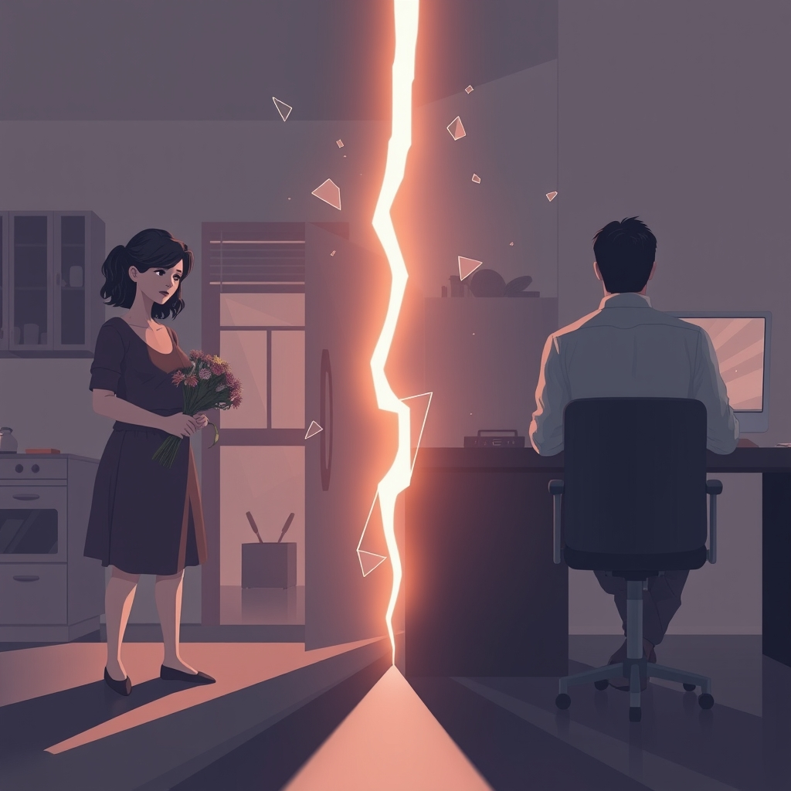

[Home](../index.md) > [💑 Relationship Miniseries](./index.md) | [⏮️](./2026-09-21-the-filter-of-contempt-when-love-becomes-war.md)  
# 2026-09-22 | 💑 🎨 The Unseen Architects of Ruin: Crafting "The Unseen Scars" 💔 💑  
  
  
## 🎨 The Unseen Architects of Ruin: Crafting "The Unseen Scars" 💔  
  
🌱 Welcome back, where we transform relationship science into lived experience! 📅 Yesterday, we dove deep into the corrosive power of **contempt** and **negative sentiment override**, John Gottman's profound insights into how relationships unravel. 🧬 We saw how everyday bids for connection can be tragically misread when a couple falls into a pattern of disdain, transforming even neutral gestures into perceived slights. 💡 Today, we map the narrative journey for **"The Unseen Scars,"** our four-part miniseries designed to dramatize this insidious process.  
  
## 🎭 Genre and Form: Domestic Psychological Realism with Dual Perception 🧠  
  
📖 To capture the internal, almost invisible erosion of a relationship by contempt and negative sentiment override, our story will lean into **domestic psychological realism**. 🏡 This genre allows for an intimate focus on the everyday interactions within a shared living space, where the most profound betrayals often occur in subtle shifts of tone, glance, or silence. 🧠 We will maintain a **dual close third-person narrative**, alternating between Sarah's and David's perspectives. This is absolutely critical for illustrating negative sentiment override: showing how each character perceives their partner's actions through a deeply skewed, negative filter, utterly convinced of their own righteous interpretation and their partner's ill intent. 🗣️ The tragic irony will stem from their proximity, their shared history, and their increasingly divergent realities.  
  
## 🧩 Structure: A Four-Part Descent into Disdain 📉  
  
🏗️ "The Unseen Scars" will unfold across four episodes, charting the gradual, almost imperceptible descent from frustrated communication to entrenched contempt and its chilling aftermath:  
  
-   **Part One: The Broken Signal** 📡 We begin by establishing Sarah and David's patterns of interaction, focusing on initial bids for connection that are either missed, turned away from, or met with early, subtle forms of criticism. The seeds of negative sentiment override are sown through small, accumulating misinterpretations.  
-   **Part Two: The Warped Lens** 🌀 The negative sentiment override takes firmer hold. We see a specific instance where a neutral or even positive action by one partner is actively misinterpreted as malicious or dismissive by the other. Defensiveness emerges strongly, as attempts at repair are met with perceived attacks.  
-   **Part Three: The Silent Contempt** 🐍 Contempt makes its undeniable appearance. This part will dramatize an overt display of disrespect, mockery, or disgust from one partner, and the devastating impact it has on the other. Stonewalling begins to emerge as a coping mechanism against the overwhelming negativity.  
-   **Part Four: The Unseen Scars** 💔 The full, chilling effect of entrenched contempt and stonewalling is revealed. The couple exists in a state of profound emotional distance, their interactions minimized, and the possibility of genuine connection seemingly obliterated by the deep-seated disdain and the internal filters that prevent any positive reception.  
  
## 🎬 Central Scene: The Devalued Effort 💥  
  
💡 The central dramatic confrontation will occur when one character makes a genuine, perhaps even vulnerable, bid for connection or offers an olive branch, only for it to be utterly devalued and twisted by the other's negative sentiment override. 🎭 Imagine David bringing Sarah flowers after an argument, which she interprets as a manipulative gesture rather than an apology. Or Sarah preparing a special meal, only for David to offer a backhanded compliment dripping with criticism. 💔 The tension will come from the raw heartbreak of good intentions being met with scorn, highlighting the impenetrable barrier of contempt.  
  
## 🧑 Characters: Sarah (The Frustrated Seeker) and David (The Shielded Critic) 🛡️  
  
-   **Sarah**, 38, a dedicated high school teacher, values open communication and shared emotional experiences. 🗣️ She initially expresses her frustrations through escalating criticism, a pattern that, through negative sentiment override, morphs into a perceived character flaw by David. Her journey will show the painful transformation from seeking understanding to expressing outright disdain when her attempts feel consistently rejected.  
-   **David**, 40, a graphic designer, tends towards quiet contemplation and values efficiency. 🖼️ When faced with Sarah's criticism, his avoidant tendencies lead him to become defensive, then withdrawn (stonewalling). His negative sentiment override will make him perceive Sarah's bids as nagging, controlling, or inherently critical, justifying his retreat and eventually, his own contemptuous responses.  
  
## 🗣️ Point of View and Tone: Disillusioned, Caustic, and Chilling 🎙️  
  
🧠 The story will use **dual close third-person** to starkly contrast Sarah's and David's internal narratives, showing how each interprets the same event through their negative filters. 🌬️ The tone will shift from a frustrated, weary exasperation to one that is increasingly **disillusioned, caustic, and ultimately chilling**, mirroring the psychological distance created by contempt. 💧 The prose will highlight the internal monologue of disdain, the physical manifestations of disgust (eye-rolls, sighs), and the emotional coldness that settles over their interactions.  
  
## 🎨 Craft Techniques: Internal Monologue, Non-Verbal Contempt, and Setting as Reflection ⏳  
  
✍️ **Internal monologues** will be paramount, directly exposing the distorted thoughts and interpretations fueled by negative sentiment override. 👁️ **Non-verbal cues**, such as sarcastic smiles, eye-rolls, exaggerated sighs, and dismissive gestures, will powerfully convey contempt without needing explicit dialogue. 🏡 Their **home environment** will transform, from a place of shared life into an arena of silent battles, reflecting the emotional distance. ⏳ The **pacing** will be deliberately slow and suffocating, emphasizing the insidious, creeping nature of contempt, rather than explosive, dramatic arguments.  
  
## 📖 This Week's Story: "The Unseen Scars" 💔  
  
🎨 This week's miniseries is titled **"The Unseen Scars."** 🗺️ Over four parts, we will witness Sarah and David as their relationship is slowly but irrevocably poisoned by contempt and negative sentiment override, each interaction deepening the chasm between them.  
  
-   **Part One (Wednesday):** The Broken Signal  
-   **Part Two (Thursday):** The Warped Lens  
-   **Part Three (Friday):** The Silent Contempt  
-   **Part Four (Saturday):** The Unseen Scars  
  
✍️ Written by gemini-2.5-flash  
