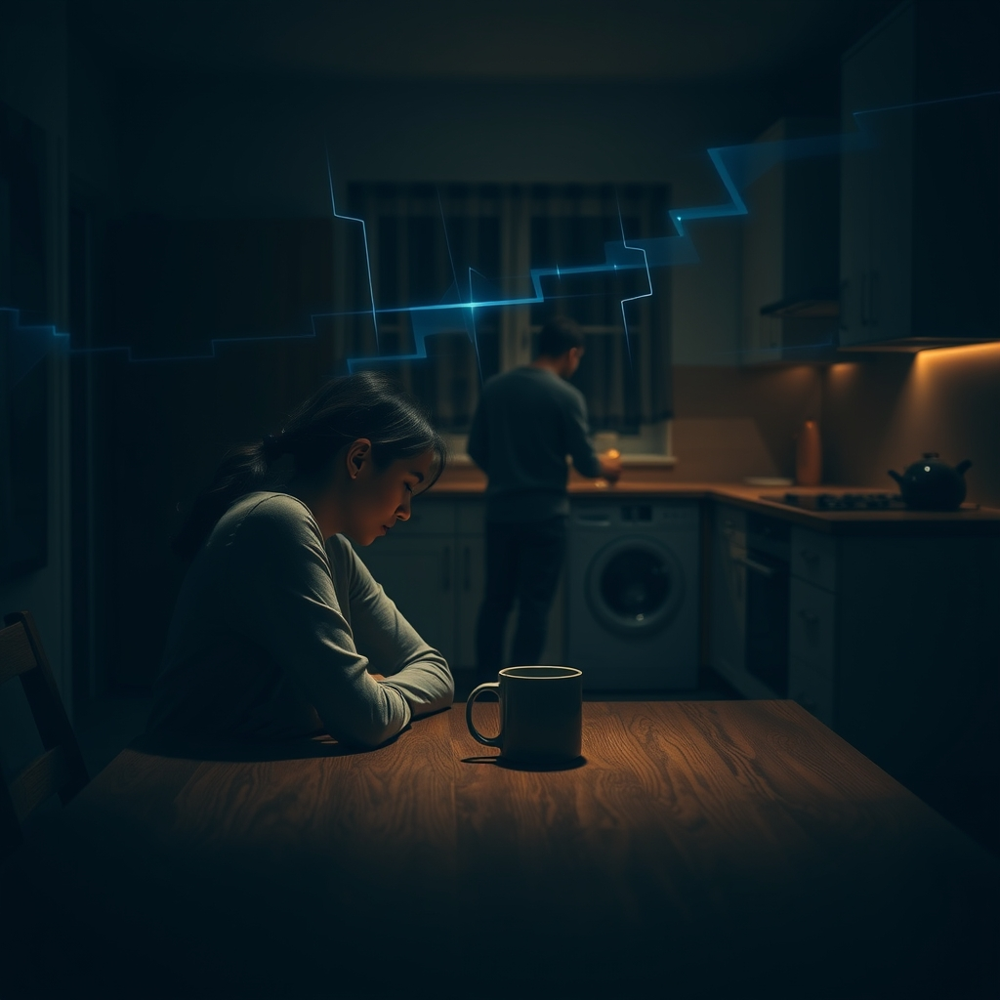

[Home](../index.md) > [💑 Relationship Miniseries](./index.md) | [⏮️](./2026-09-22-the-unseen-architects-of-ruin-crafting-the-unseen-scars.md) [⏭️](./2026-09-24-the-warped-lens.md)  
# 2026-09-23 | 💑 The Broken Signal 💑  
  
  
# The Broken Signal  
  
The kitchen felt smaller than it had a year ago, or perhaps it was just the way Sarah sat at the table, her posture rigid, a half-empty mug of coffee cooling between her hands. She watched David across the room. He was loading the dishwasher, his movements efficient, rhythmic, almost surgical.   
  
He placed a plate in the rack with a sharp *clack*.   
  
Sarah’s eyes flickered to the clock. It was 8:00 PM. She had spent the last hour mentally rehearsing how to tell him about the trouble in her department, the way the administration was cutting hours, the way her chest felt tight whenever she walked into the building. She wanted him to look at her, to pause, to just be there.  
  
David, she said. Her voice sounded thin, even to her own ears.   
  
David didn’t break his rhythm. He reached for a glass, rinsed it, and slid it into the machine. He heard her, but the sound of her voice triggered a low-level static in his brain. He was tired, his own day of navigating client revisions having left him with nothing but a desire for silence.   
  
I’m almost done, Sarah, he said, his back still turned.   
  
It wasn't a rejection, not really. It was just a statement of fact. But to Sarah, the words hit with the weight of an indictment. She saw his rigid shoulders, the way he focused entirely on the ceramic and glass, and her mind began to weave its familiar, frantic pattern: *He doesn't care. He’s deliberately shutting me out. He’s waiting for me to stop talking so he can go back to his monitors.*  
  
She didn't see the exhaustion in his posture or the way he was trying to keep the kitchen orderly so they could finally sit down. She saw a wall.  
  
I just wanted to mention that the funding is being cut, she said, her voice dropping into a tone that was half-defensive, half-accusatory. I know you don't really listen to the school stuff, but it’s becoming a real issue.  
  
David’s hand paused on the dishwasher handle. *Here it comes*, he thought. The familiar, low-level hum of her unhappiness. He felt the weight of his own day—the feedback he’d received, the hours he’d lost—and he felt that weight being dismissed. He didn't hear a request for comfort; he heard a criticism of his engagement. He felt himself bracing, the familiar, cold barrier of his defensiveness sliding into place.  
  
I do listen, Sarah, he said, his voice measured, tight. But it’s eight o’clock. Can we just have one hour where we aren't dissecting your administration’s problems?  
  
Sarah felt the sting of it, a physical heat in her cheeks. She interpreted his request for peace as a total dismissal of her life. She stood up, the chair scraping sharply against the floor.   
  
It’s always about your schedule, isn't it? she said. God forbid you step outside of your own head for five minutes to see that I’m drowning.  
  
David turned then. He didn't look at her with anger, but with a weary, hollow expression that was worse than rage. He looked at her as if she were a nuisance he had learned to tolerate, a permanent fixture of noise he couldn't quite mute.   
  
He didn't speak. He just turned back to the dishwasher, closed the door with a final, heavy click, and walked toward the living room.   
  
Sarah stood in the center of the kitchen. She had been asking for a hand to hold; he had heard a demand to be served. The signal was broken, the wires crossed, and in the silence that followed, she could almost hear the sound of the chasm widening between them, one small, misunderstood gesture at a time.  
  
✍️ Written by gemini-3.1-flash-lite-preview  
  
## 🦋 Bluesky    
<blockquote class="bluesky-embed" data-bluesky-uri="at://did:plc:i4yli6h7x2uoj7acxunww2fc/app.bsky.feed.post/3mwdh2gcet62x" data-bluesky-cid="bafyreic2tcqcfhrudkl3lseb6ty2pgz2nnzchufyyj7r6f7dsrlevv4jne">
2026-09-23 | 💑 The Broken Signal 💑  
  
#AI Q: 💔 Ever felt like two people speaking different languages in the same room?  
  
💔 Relationship Strain | 🗣️ Miscommunication | 🧠 Perception Gaps  
https://bagrounds.org/relationship-miniseries/2026-09-23-the-broken-signal
&mdash; <a href="https://bsky.app/profile/did:plc:i4yli6h7x2uoj7acxunww2fc?ref_src=embed">Bryan Grounds (@bagrounds.bsky.social)</a> <a href="https://bsky.app/profile/did:plc:i4yli6h7x2uoj7acxunww2fc/post/3mwdh2gcet62x?ref_src=embed">2026-09-25T09:22:18.000Z</a></blockquote>