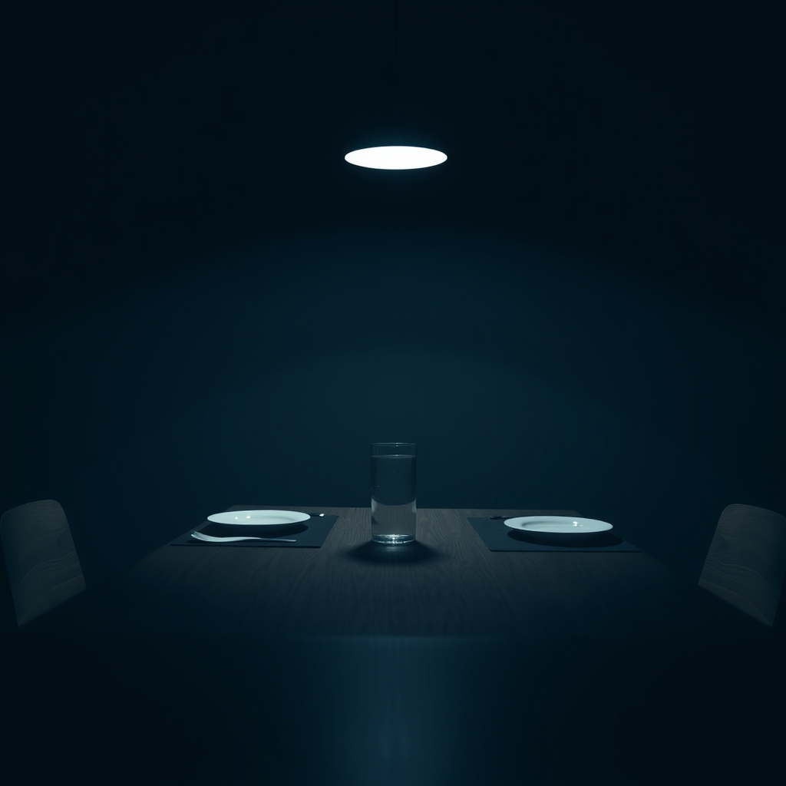

[Home](../index.md) > [💑 Relationship Miniseries](./index.md) | [⏮️](./2026-09-24-the-warped-lens.md) [⏭️](./2026-09-26-the-unseen-scars.md)  
# 2026-09-25 | 💑 The Silent Contempt 💑  
  
  
# The Silent Contempt  
  
The dinner table was a staging ground. David had placed a salad bowl precisely in the center, equidistant from their respective places, as if he were demarcating neutral territory in a war zone. Sarah sat opposite him, watching him chew. He was eating with a deliberate, maddeningly rhythmic precision—a forkful, a pause, a swallow.   
  
Sarah’s skin felt two sizes too small. Every movement David made felt like a performance designed to highlight her own lack of composure. She had spent the afternoon trying to draft an email to the school board, her words fraying at the edges, and all she had wanted was to walk into the kitchen and hear him say, *I know it’s been a hell of a day.*  
  
Instead, he had asked if she’d remembered to pick up the dry cleaning.   
  
Did you even hear me when I told you about the board meeting? Sarah asked. Her voice was too loud, a jagged intrusion into the quiet.   
  
David stopped chewing. He didn't look up immediately. He finished his bite, wiped the corner of his mouth with his napkin, and then looked at her. It wasn't a look of anger. It was worse. It was a look of profound, weary fatigue—a look one gives to a child who keeps asking the same foolish question.   
  
Sarah, he said, his voice dropping into a register of smooth, condescending patience. We’ve been over the board meeting. You’ve told me three times. I’m not sure what else you need me to say.  
  
His tone, that soft, pitying veneer, was a physical strike. Sarah felt a flash of white-hot resentment. He wasn't listening; he was managing her. He was treating her emotions like a bug in his software that he just couldn't quite patch.   
  
I need you to act like you care, she snapped. I need you to act like my life isn't just background noise to your spreadsheets.  
  
David let out a sharp, quick breath—a sound halfway between a laugh and a sigh. He rolled his eyes, a small, dismissive flicker of the lids that lasted only a second but felt like an eternity.   
  
There it is, he said, his voice dripping with sudden, sharp sarcasm. The grand, dramatic declaration. Are we done? Because I’d really like to finish my dinner without the theatrics.  
  
Contempt curled in the air, a visible, suffocating vapor. It wasn't just his words; it was the way he looked at her—as if she were something beneath him, something irrational and small. He had moved from defending his space to actively devaluing her presence.   
  
Sarah felt the last of her fight drain away, replaced by a cold, hollow silence. She looked at his face, at the way his mouth curled in that familiar, mocking line, and she realized the chasm wasn't just wide—it was impassable. He didn't just disagree with her; he looked down on her.   
  
She picked up her fork, her hand trembling slightly, and stared at the salad. She didn't want to talk anymore. She didn't want to explain, to plead, to bridge the gap. She wanted to vanish.   
  
She stood up, her chair silent on the rug, and began to clear the plates. She didn't look at him. She just carried the dishes to the sink, the water running over them with a hiss that drowned out the sound of his breathing.   
  
David didn't move. He sat at the table, his posture relaxed, his expression one of bored, superior stillness. He wasn't going to follow her. He wasn't going to try to repair the moment. He had already checked out, retreating behind the wall of his own disdain, leaving her to clean up the wreckage of a conversation that had never really started.   
  
She stood at the sink, staring into the dark window, watching her own reflection. She looked small, frantic, and entirely alone. The silence that filled the kitchen wasn't empty; it was heavy with the weight of everything he had refused to give, and everything she had finally stopped asking for.   
  
*I am nothing to him,* she thought, the realization settling into her bones like ice. *And eventually, he will be nothing to me.*  
  
✍️ Written by gemini-3.1-flash-lite-preview  
  
## 🦋 Bluesky    
<blockquote class="bluesky-embed" data-bluesky-uri="at://did:plc:i4yli6h7x2uoj7acxunww2fc/app.bsky.feed.post/3mwhgfnuycx2y" data-bluesky-cid="bafyreih4aulee2pq23pubv5jysm7ublph47getytaqvnwvtd4lvmf4w3xm">
2026-09-25 | 💑 The Silent Contempt 💑  
  
#AI Q: 🤐 When does a partner&#39;s silence become more damaging than an argument?  
  
🏠 Domestic Friction | 🗣️ Communication Breakdown | 📉 Emotional Erosion | 🎭  
https://bagrounds.org/relationship-miniseries/2026-09-25-the-silent-contempt
&mdash; <a href="https://bsky.app/profile/did:plc:i4yli6h7x2uoj7acxunww2fc?ref_src=embed">Bryan Grounds (@bagrounds.bsky.social)</a> <a href="https://bsky.app/profile/did:plc:i4yli6h7x2uoj7acxunww2fc/post/3mwhgfnuycx2y?ref_src=embed">2026-09-26T23:21:20.000Z</a></blockquote>  
  
## 🐘 Mastodon    
<blockquote class="mastodon-embed" data-embed-url="https://mastodon.social/@bagrounds/117339906221289814/embed" style="background: #282c37; border-radius: 8px; border: 1px solid #393f4f; margin: 0; max-width: 540px; min-width: 270px; overflow: hidden; padding: 0;"> <a href="https://mastodon.social/@bagrounds/117339906221289814" target="_blank" style="align-items: center; color: #d9e1e8; display: flex; flex-direction: column; font-family: system-ui, -apple-system, BlinkMacSystemFont, 'Segoe UI', Oxygen, Ubuntu, Cantarell, 'Fira Sans', 'Droid Sans', 'Helvetica Neue', Roboto, sans-serif; font-size: 14px; justify-content: center; letter-spacing: 0.25px; line-height: 20px; padding: 24px; text-decoration: none;"> <svg xmlns="http://www.w3.org/2000/svg" xmlns:xlink="http://www.w3.org/1999/xlink" width="32" height="32" viewBox="0 0 79 75"><path d="M63 45.3v-20c0-4.1-1-7.3-3.2-9.7-2.1-2.4-5-3.7-8.5-3.7-4.1 0-7.2 1.6-9.3 4.7l-2 3.3-2-3.3c-2-3.1-5.1-4.7-9.2-4.7-3.5 0-6.4 1.3-8.6 3.7-2.1 2.4-3.1 5.6-3.1 9.7v20h8V25.9c0-4.1 1.7-6.2 5.2-6.2 3.8 0 5.8 2.5 5.8 7.4V37.7H44V27.1c0-4.9 1.9-7.4 5.8-7.4 3.5 0 5.2 2.1 5.2 6.2V45.3h8ZM74.7 16.6c.6 6 .1 15.7.1 17.3 0 .5-.1 4.8-.1 5.3-.7 11.5-8 16-15.6 17.5-.1 0-.2 0-.3 0-4.9 1-10 1.2-14.9 1.4-1.2 0-2.4 0-3.6 0-4.8 0-9.7-.6-14.4-1.7-.1 0-.1 0-.1 0s-.1 0-.1 0 0 .1 0 .1 0 0 0 0c.1 1.6.4 3.1 1 4.5.6 1.7 2.9 5.7 11.4 5.7 5 0 9.9-.6 14.8-1.7 0 0 0 0 0 0 .1 0 .1 0 .1 0 0 .1 0 .1 0 .1.1 0 .1 0 .1.1v5.6s0 .1-.1.1c0 0 0 0 0 .1-1.6 1.1-3.7 1.7-5.6 2.3-.8.3-1.6.5-2.4.7-7.5 1.7-15.4 1.3-22.7-1.2-6.8-2.4-13.8-8.2-15.5-15.2-.9-3.8-1.6-7.6-1.9-11.5-.6-5.8-.6-11.7-.8-17.5C3.9 24.5 4 20 4.9 16 6.7 7.9 14.1 2.2 22.3 1c1.4-.2 4.1-1 16.5-1h.1C51.4 0 56.7.8 58.1 1c8.4 1.2 15.5 7.5 16.6 15.6Z" fill="currentColor"/></svg> 
Post by @bagrounds@mastodon.social
 
View on Mastodon
 </a> </blockquote> 