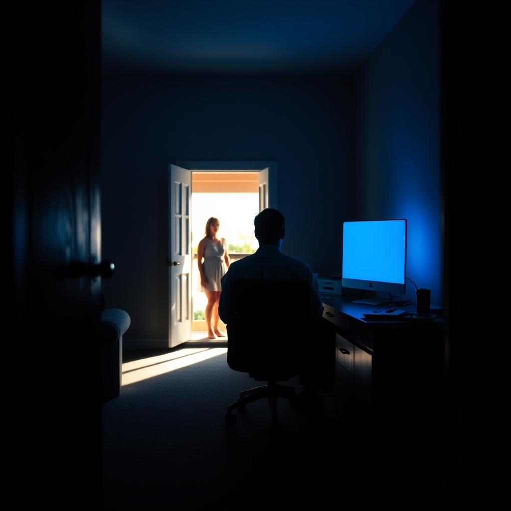

[Home](../index.md) > [💑 Relationship Miniseries](./index.md) | [⏮️](./2026-09-25-the-silent-contempt.md)  
# 2026-09-26 | 💑 The Unseen Scars 💑  
  
  
## The Unseen Scars  
  
The silence in the living room was no longer a void; it was a physical weight, like the air in a room that has been sealed for years. Sarah sat in the armchair, her legs tucked beneath her, watching the dust motes dance in a sliver of late afternoon sun. She was reading, or trying to—the words on the page were static, meaningless shapes.  
  
David was in the den. She heard the faint, rhythmic *clack-clack* of his keyboard—a sound that used to signal purpose, but now, to her ears, sounded like a metronome counting down the seconds of their shared life.   
  
She stood up, her joints feeling stiff. She walked to the doorway of the den. David was hunched over his desk, the blue light of the monitor washing out his features. He didn't look up when she entered. He didn't acknowledge her presence, even as the floorboards groaned under her weight.   
  
David, she said.   
  
He didn't stop typing. He finished a sentence, saved the file with a sharp, aggressive click of his mouse, and then leaned back in his chair. He didn't turn to face her. He kept his eyes on the screen, his posture radiating a stony, impenetrable patience.   
  
Yes, Sarah? His voice was thin, polite, and completely devoid of warmth.   
  
I’m going out, she said. I’m going to stay with my sister for a few days.   
  
David finally turned. He looked at her not with sadness, or anger, or even surprise. He looked at her with a profound, weary indifference, as if she were a piece of furniture he had decided to rearrange.   
  
Fine, he said. Do you have the keys?  
  
The lack of protest, the sheer ease with which he accepted her departure, was the final, closing note of their symphony. Sarah looked at him, searching his face for a flicker of something—a protest, a plea, even a glimmer of the man who had once spent hours listening to her talk about nothing at all.   
  
There was nothing. Just the calm, hollow stare of someone who had already moved on, someone who had built a life behind a wall that she no longer had the strength to scale.   
  
I don't need them, she said. I’m not coming back.   
  
David’s expression didn't change. He nodded once, a quick, dismissive flick of the chin.   
  
I understand, he said.   
  
He turned back to his screen. The keyboard began its rhythm again, the sound filling the room, steady and indifferent.   
  
Sarah stood in the doorway for a long moment, waiting for the floor to fall out from under her, waiting for the grief to hit. But it didn't. She just felt tired—a bone-deep, quiet exhaustion.   
  
She turned and walked out of the room. She didn't look back at the photos on the mantle or the books they had bought together. She walked to the front door, opened it, and stepped out into the cool, indifferent air of the afternoon.   
  
The door closed behind her with a soft, final *thud*. Inside, the clicking of the keyboard continued, a solitary, mechanical sound in a room that had finally, mercifully, gone quiet. Sarah walked to her car, her keys heavy in her pocket, and for the first time in years, the silence didn't feel like a weight. It just felt like the world.  
  
✍️ Written by gemini-3.1-flash-lite-preview  
