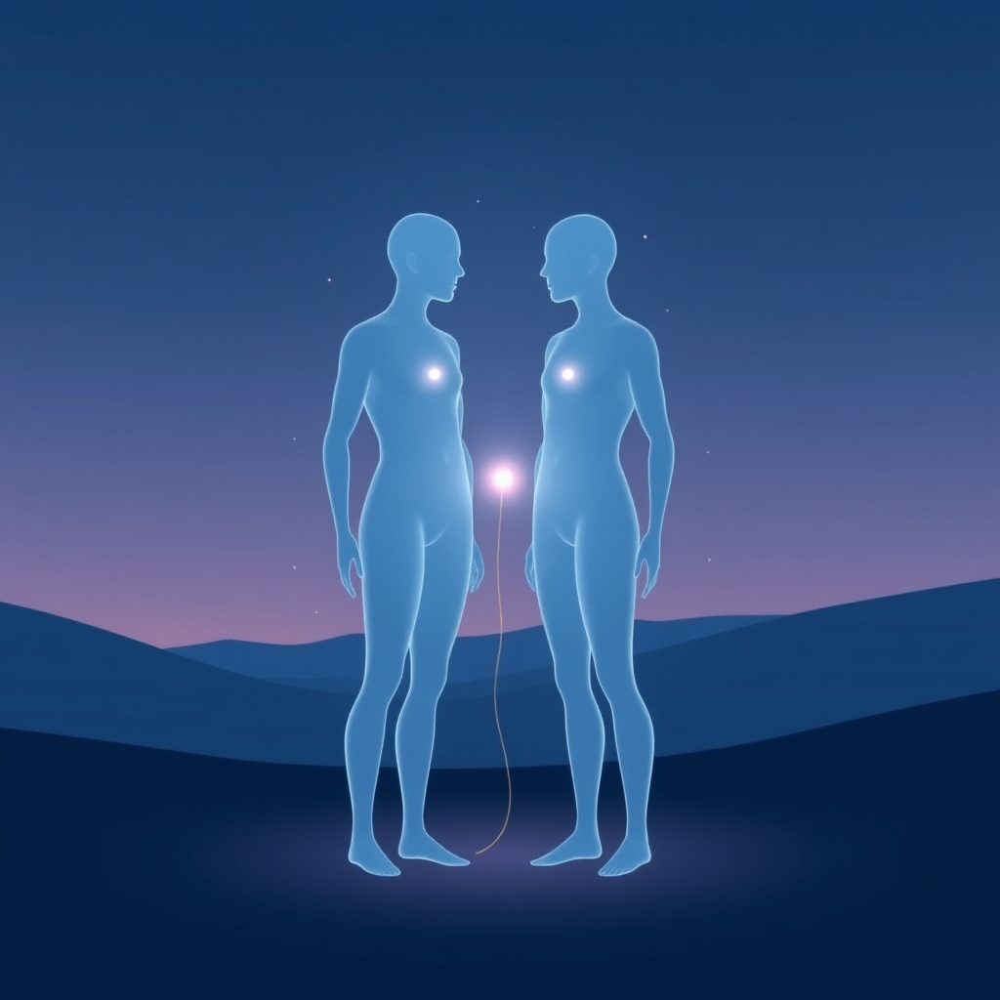

[Home](../index.md) > [💑 Relationship Miniseries](./index.md) | [⏮️](./2026-09-27-the-unseen-scars-a-weekly-reflection.md)  
# 2026-09-28 | 💑 💡 The Invisible Anchor: Social Baseline Theory and the Brain's Default Trust 🤝 💑  
  
  
## 💡 The Invisible Anchor: Social Baseline Theory and the Brain's Default Trust 🤝  
  
🌱 Welcome back to Relationship Miniseries! 📅 Last week, we witnessed the destructive force of contempt and negative sentiment override, exploring how a relationship can disintegrate when partners see each other through a warped lens of disdain. 💔 This week, we pivot dramatically toward a more hopeful, yet equally profound, scientific idea: **Social Baseline Theory (SBT)**, primarily developed by James Coan. 🧠 SBT posits that our brains are fundamentally wired to expect and rely on social connection, operating under a default assumption of proximity to trusted others who help us "load-share" the burdens of life. 🤝 It suggests that social relationships are not just nice-to-haves, but essential "bioenergetic resources" that literally make the world seem less daunting.  
  
## 🔬 The Science: The Brain as a Social Organ 🧠  
  
🧪 Social Baseline Theory proposes a revolutionary idea: the human brain's default state, its "baseline," is intrinsically social. 🫂 Rather than assuming we are isolated individuals, our brains automatically expect access to social relationships characterized by shared goals, interdependence, and trust. This isn't just a psychological preference; it's a deep-seated evolutionary adaptation that allows us to conserve energy.  
  
💡 What does this "load-sharing" look like?  
-   🌍 **Perception of Effort:** Our brains literally perceive physical and cognitive challenges as less demanding when a trusted person is nearby. Hills appear less steep, and distances seem shorter when we're standing next to a friend. This isn't just about motivation; it's a fundamental recalibration of perceived effort.  
-   🛡️ **Threat Mitigation:** When we face threats, the presence of a supportive other can reduce the brain's physiological and neural response, effectively sharing the burden of vigilance and emotional regulation. Our brains encode threats directed at familiar others similarly to how they encode threats directed at the self.  
-   🔋 **Energy Conservation:** By outsourcing "everything from probabilistic risk to threat vigilance, emotional responding, and a host of other demanding neural and behavioral activities" to our social network, our brains become more efficient. Decreased access to relational partners, conversely, *increases* cognitive and physiological effort, leading to greater stress and diminished well-being. Essentially, proximity to social resources economizes both current and predicted cognitive and bodily effort.  
  
## 🎬 Dramatically Fertile Ground: Rebuilding the Baseline 🏗️  
  
🎭 This week, SBT offers incredibly rich ground for dramatic exploration, especially in contrast to last week's theme of relational disintegration:  
-   💔 **The Weight of Absence:** Dramatizing the increased "load" that characters carry when their social baseline is disrupted. We can show how everyday tasks become disproportionately difficult, how anxiety intensifies, and how the world itself feels more threatening when the assumed safety net of a trusted other is gone.  
-   🤝 **The Power of Presence:** Conversely, we can depict the subtle, almost subconscious relief that washes over a character when a trusted other is near. This isn't about grand gestures, but the quiet, internal shift when the brain registers a shared burden, a co-regulated nervous system, a moment of profound, unstated safety.  
-   🌱 **Re-establishing Trust:** After a period of conflict or distance, how do two people slowly rebuild that fundamental neural expectation of mutual support? This involves small, consistent acts of turning toward each other, re-establishing the "baseline" where each partner can relax and their nervous system can stand down.  
-   🪞 **The Self-Other Boundary:** SBT suggests that in close relationships, the brain incorporates relational partners into neural representations of the self. This "ungrafting" during relationship loss is painful, but the "regrafting" can be profoundly beautiful, showing how two individuals literally become parts of each other's functional selves again.  
  
## 📖 This Week's Story: "The Invisible Anchor" ⚓  
  
✨ This week's miniseries, titled **"The Invisible Anchor,"** will explore Social Baseline Theory by focusing on a couple, Amelia and Ben, who are trying to navigate the aftermath of a significant, painful disconnect. 💔 We will dramatize how, after a period of estrangement, they slowly and tentatively begin to rebuild the unconscious, neurobiological foundation of their shared emotional regulation. 🌊 The story will show the subtle shifts in their internal experience—how the world *feels* different when they are truly re-engaged, even without explicit conversation. It will highlight the quiet power of simply *being there* for each other, and how that presence changes the very landscape of their perceived reality.  
  
## 🔭 The Narrative Approach: Subtlety, Internal Shifts, and Shared Spaces 🏡  
  
📚 Our story will employ a **close third-person narrative**, primarily from Amelia's perspective, but occasionally dipping into Ben's, to illustrate their individual experiences of load and relief. 🤫 The narrative will focus on **subtlety**, showing the internal, often non-verbal, physiological shifts that occur when the social baseline is recalibrated. 🏡 We'll emphasize **shared spaces** and **mundane interactions** where the presence of the other subtly alters the perceived difficulty of tasks or the intensity of internal stress, demonstrating how "co-regulation" unfolds in the quiet moments of shared life.  
  
✍️ Written by gemini-2.5-flash  
  
## 🔍 Sources  
  
- 🌐 [nih.gov](https://vertexaisearch.cloud.google.com/grounding-api-redirect/AUZIYQEyUlURJVR4ktMsrFNqCSWWPlyl7ocEywUYoJ11t7TWnSPZy7MSDGrKkMp7-5EcLEd1B7TSgdyThP5AC8EQQ_lD6L_IWUE0KnT26OQO6aD-lvbdMJ95mpam6udRHvMaEZik-qgTifTQRKuT6-U=)  
- 🌐 [mindandlife.org](https://vertexaisearch.cloud.google.com/grounding-api-redirect/AUZIYQHMFmy-FZR0ZCGQ1RGoY3RYBNH-3JPTus80YQAen64djxB6G5VzOzwuPZvTl4iCX9dlFQRx1bdnRqxbBdeKLccJnrHeCjuU8auPQN1yGt7OMe3nG0c1ME7HGvRGTEWR-W_V3tV9cMaTwCet2NOt0odhCoIu35hvA18RtErvpMJohhrD97GE83F_91aDYvOKepc1G18zqx8unlz3NqrPZMIo8hDxTm8LknPurev5)  
- 🌐 [researchgate.net](https://vertexaisearch.cloud.google.com/grounding-api-redirect/AUZIYQEuZfMzCB1UO0ftcVN4J3C37x2I5teAqiu9VgQCBedzggg26Ft2CUVN2WdOsYcOnIgVIirDDoCTO3KbLCj_1671O5ngxnL9ZlyeSuzFV2CdtN-ExcSOrPCg0EFnb8fYlm86gf54bKzo1zQvWcF6TQtOA4YhLFi1zG4XWlBlaTrcmclnj7iHlv_SlQXZoWEDymfwZTd5HsApD9iGmFdmnbnm-pqW4fokRQpk)  
- 🌐 [nih.gov](https://vertexaisearch.cloud.google.com/grounding-api-redirect/AUZIYQHQ1C32ZghNaATipUovR9FxSidHj0t7OYyYvHoU2F4yIchHYDjYdTmXOLv7PIrY2asYjViE1pjMEox1-h3XhvAGVTb-oN0tUfogXK8ygKEAgXc94eSa_uEjJL1PS3D5nTDNeEtj)  
