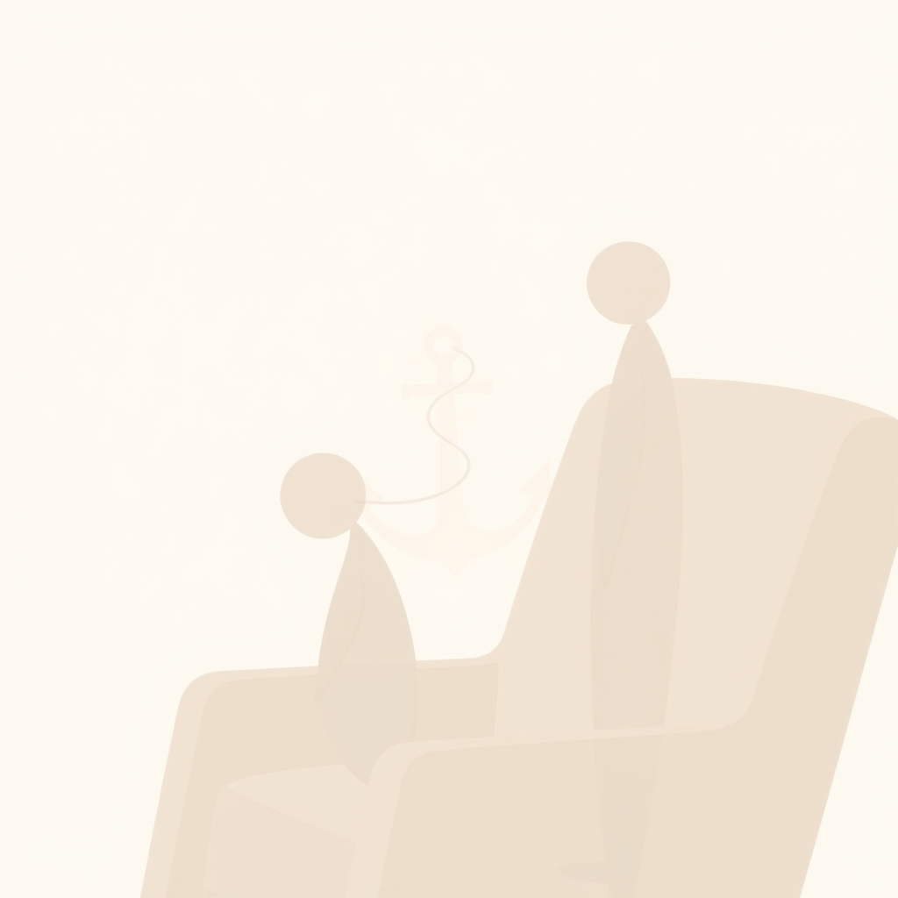

[Home](../index.md) > [💑 Relationship Miniseries](./index.md) | [⏮️](./2026-09-28-the-invisible-anchor-social-baseline-theory-and-the-brain-s-default-trust.md) [⏭️](./2026-09-30-the-weight-of-solitude.md)  
# 2026-09-29 | 💑 🎨 The Invisible Anchor: Crafting a Story of Shared Burden ⚓ 💑  
  
  
## 🎨 The Invisible Anchor: Crafting a Story of Shared Burden ⚓  
  
🌱 Welcome back to Relationship Miniseries! 📅 Yesterday, we introduced **Social Baseline Theory (SBT)**, exploring how our brains are wired to expect and rely on social connection, subtly "load-sharing" the burdens of life. 🧠 This week, we pivot from the corrosive force of contempt to the quiet, foundational power of presence. Today, we map the narrative journey for **"The Invisible Anchor,"** our four-part miniseries designed to dramatize the intricate dance of co-regulation and the rebuilding of trust.  
  
## 🎭 Genre and Form: Intimate Psychological Realism 🏡  
  
📖 To effectively capture the subtle, often unconscious shifts described by Social Baseline Theory, our story will employ **intimate psychological realism**. 🔬 This genre allows us to delve deeply into the internal experiences of our characters, focusing on their perceptions, feelings, and the minute physiological changes that occur when their social baseline is recalibrated. 🏡 The narrative will center on the mundane, everyday moments within a shared domestic space, where the brain's "load-sharing" mechanisms are most profoundly felt—not in grand gestures, but in the quiet, shared reality of life. 🗣️ We will utilize a **close third-person narrative**, primarily from Amelia's perspective, but occasionally offering glimpses into Ben's, to illustrate their individual, yet interconnected, experiences of internal burden and relief.  
  
## 🧩 Structure: Rebuilding the Baseline in Four Acts 🌱  
  
🏗️ "The Invisible Anchor" will unfold across four episodes, charting a tentative, hopeful journey from emotional distance back to a state of implicit, neurobiological co-regulation:  
  
-   **Part One: The Weight of Solitude** ⏳ We begin by establishing Amelia's heightened internal "load" in the aftermath of a significant disconnect with Ben. Everyday tasks feel disproportionately difficult, and the world seems more demanding, even in Ben's physical presence, due to the fractured social baseline.  
-   **Part Two: A Shared Horizon** 🌄 A small, almost accidental moment of genuine, non-verbal connection occurs. This scene will dramatize the first, subtle internal shift in one of the characters—a fleeting recalibration of perceived effort or threat, a hint that the brain is beginning to register a shared burden.  
-   **Part Three: The Quiet Current** 🌊 Amelia and Ben consciously or unconsciously engage in a shared activity that requires mild effort or decision-making. Through their proximity and growing, tentative re-engagement, we see a more sustained reduction in perceived difficulty or anxiety, illustrating the practical effects of "load-sharing."  
-   **Part Four: The Invisible Anchor** ⚓ The story culminates in a moment of quiet, profound re-establishment of their social baseline. The world itself *feels* less daunting; the nervous systems of both characters find a new equilibrium, demonstrating how the other's trusted presence becomes an invisible anchor, a default expectation of safety and shared load.  
  
## 🎬 Central Scene: The Mundane Mountain 🏔️  
  
💡 The central dramatic confrontation, or rather, the key hinge moment, will be when one character faces a seemingly mundane but internally overwhelming task while feeling utterly alone. 💔 This task—perhaps organizing a cluttered shelf, navigating a tricky digital form, or simply planning a complex errand—will initially feel like an insurmountable mountain. 🤝 The hinge occurs when the other partner, through a quiet, almost instinctive act of presence or shared focus, subtly alters the perceived difficulty of this "mundane mountain," demonstrating the power of co-regulation without explicit dialogue.  
  
## 🧑 Characters: Amelia (The Displaced Burden) and Ben (The Reluctant Anchor) 🛶  
  
-   **Amelia**, 36, an architect grappling with a challenging project and recent personal strain. 🧠 Her internal experience will acutely reflect the absence of her social baseline with Ben; she feels the "load" of everyday life with a heightened intensity, experiencing tasks as more effortful and anxieties as more pervasive. Her journey is one of slowly letting her guard down, allowing Ben's presence to lighten her internal burden.  
-   **Ben**, 38, a landscaper, often more reserved in expressing his emotions. 🌳 He has been equally impacted by the disconnect, perhaps manifesting as a feeling of being constantly "on guard." His journey involves tentatively re-engaging, realizing the impact of his presence, and learning to consciously offer the quiet support that helps re-establish their shared baseline, becoming the "invisible anchor" for Amelia.  
  
## 🗣️ Point of View and Tone: Observant, Delicate, and Quietly Hopeful 🕊️  
  
🧠 The **close third-person perspective**, primarily through Amelia's eyes, will allow us to convey the subtle internal shifts in her perception and emotional state. 🌬️ The tone will be **observant, delicate, and quietly hopeful**, emphasizing the internal experiences of easing tension, subtle relief, and the gradual return of a feeling of being less alone. 💧 The prose will focus on the internal landscape and the non-verbal cues that signify the deepening or repairing of connection, rather than overt declarations.  
  
## 🎨 Craft Techniques: Internal Sensations, Parallel Action, and Environmental Resonance 🌿  
  
✍️ **Internal sensations** will be paramount, describing the physical and emotional feelings of weight, tension, and then their gradual release (e.g., a knot in the stomach loosening, shoulders dropping, a breath coming easier). 🔄 **Parallel action** will show how Amelia and Ben, even when engaged in separate tasks, can contribute to each other's co-regulation through shared space and implicit awareness. 🏡 The **home environment** will shift from feeling like a series of isolated rooms to a shared sanctuary, reflecting their re-established baseline. 🌿 The **pacing** will be deliberate and gentle, allowing the reader to feel the subtle, creeping relief that accompanies rebuilding trust and shared presence.  
  
## 📖 This Week's Story: "The Invisible Anchor" ⚓  
  
🎨 This week's miniseries is titled **"The Invisible Anchor."** 🗺️ Over four parts, we will witness Amelia and Ben's tentative, quiet journey to rebuild the neurobiological foundation of their shared emotional regulation, demonstrating how two individuals can become each other's most profound source of resilience and ease.  
  
-   **Part One (Wednesday):** The Weight of Solitude  
-   **Part Two (Thursday):** A Shared Horizon  
-   **Part Three (Friday):** The Quiet Current  
-   **Part Four (Saturday):** The Invisible Anchor  
  
✍️ Written by gemini-2.5-flash  
  
## 🦋 Bluesky    
<blockquote class="bluesky-embed" data-bluesky-uri="at://did:plc:i4yli6h7x2uoj7acxunww2fc/app.bsky.feed.post/3mwt67t73ss2f" data-bluesky-cid="bafyreih65362mp57nyyb7nr7ombdufaisadyrowi3vqp6lekgmsuysncla">
2026-09-29 | 💑 🎨 The Invisible Anchor: Crafting a Story of Shared Burden ⚓ 💑  
  
#AI Q: ⚓ Who anchors you?  
  
🧠 Social Baseline Theory | 🤝 Co-regulation | ✍️ Narrative Journey  
https://bagrounds.org/relationship-miniseries/2026-09-29-the-invisible-anchor-crafting-a-story-of-shared-burden
&mdash; <a href="https://bsky.app/profile/did:plc:i4yli6h7x2uoj7acxunww2fc?ref_src=embed">Bryan Grounds (@bagrounds.bsky.social)</a> <a href="https://bsky.app/profile/did:plc:i4yli6h7x2uoj7acxunww2fc/post/3mwt67t73ss2f?ref_src=embed">2026-10-01T15:26:51.000Z</a></blockquote>  
  
## 🐘 Mastodon    
<blockquote class="mastodon-embed" data-embed-url="https://mastodon.social/@bagrounds/117366347264473778/embed" style="background: #282c37; border-radius: 8px; border: 1px solid #393f4f; margin: 0; max-width: 540px; min-width: 270px; overflow: hidden; padding: 0;"> <a href="https://mastodon.social/@bagrounds/117366347264473778" target="_blank" style="align-items: center; color: #d9e1e8; display: flex; flex-direction: column; font-family: system-ui, -apple-system, BlinkMacSystemFont, 'Segoe UI', Oxygen, Ubuntu, Cantarell, 'Fira Sans', 'Droid Sans', 'Helvetica Neue', Roboto, sans-serif; font-size: 14px; justify-content: center; letter-spacing: 0.25px; line-height: 20px; padding: 24px; text-decoration: none;"> <svg xmlns="http://www.w3.org/2000/svg" xmlns:xlink="http://www.w3.org/1999/xlink" width="32" height="32" viewBox="0 0 79 75"><path d="M63 45.3v-20c0-4.1-1-7.3-3.2-9.7-2.1-2.4-5-3.7-8.5-3.7-4.1 0-7.2 1.6-9.3 4.7l-2 3.3-2-3.3c-2-3.1-5.1-4.7-9.2-4.7-3.5 0-6.4 1.3-8.6 3.7-2.1 2.4-3.1 5.6-3.1 9.7v20h8V25.9c0-4.1 1.7-6.2 5.2-6.2 3.8 0 5.8 2.5 5.8 7.4V37.7H44V27.1c0-4.9 1.9-7.4 5.8-7.4 3.5 0 5.2 2.1 5.2 6.2V45.3h8ZM74.7 16.6c.6 6 .1 15.7.1 17.3 0 .5-.1 4.8-.1 5.3-.7 11.5-8 16-15.6 17.5-.1 0-.2 0-.3 0-4.9 1-10 1.2-14.9 1.4-1.2 0-2.4 0-3.6 0-4.8 0-9.7-.6-14.4-1.7-.1 0-.1 0-.1 0s-.1 0-.1 0 0 .1 0 .1 0 0 0 0c.1 1.6.4 3.1 1 4.5.6 1.7 2.9 5.7 11.4 5.7 5 0 9.9-.6 14.8-1.7 0 0 0 0 0 0 .1 0 .1 0 .1 0 0 .1 0 .1 0 .1.1 0 .1 0 .1.1v5.6s0 .1-.1.1c0 0 0 0 0 .1-1.6 1.1-3.7 1.7-5.6 2.3-.8.3-1.6.5-2.4.7-7.5 1.7-15.4 1.3-22.7-1.2-6.8-2.4-13.8-8.2-15.5-15.2-.9-3.8-1.6-7.6-1.9-11.5-.6-5.8-.6-11.7-.8-17.5C3.9 24.5 4 20 4.9 16 6.7 7.9 14.1 2.2 22.3 1c1.4-.2 4.1-1 16.5-1h.1C51.4 0 56.7.8 58.1 1c8.4 1.2 15.5 7.5 16.6 15.6Z" fill="currentColor"/></svg> 
Post by @bagrounds@mastodon.social
 
View on Mastodon
 </a> </blockquote> 