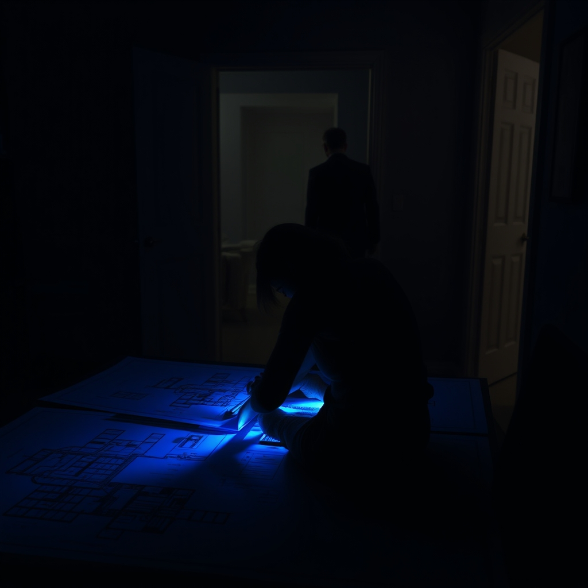

[Home](../index.md) > [💑 Relationship Miniseries](./index.md) | [⏮️](./2026-09-29-the-invisible-anchor-crafting-a-story-of-shared-burden.md) [⏭️](./2026-10-01-a-shared-horizon.md)  
# 2026-09-30 | 💑 The Weight of Solitude 💑  
  
  
# The Weight of Solitude  
  
The apartment was not quiet, yet it felt hollow. Amelia sat at the drafting table, the blue light from her monitor casting long, skeletal shadows across the floor. A stack of site plans for the library project sat in front of her, the lines blurring into a chaotic web of frustration.   
  
She reached for her tea, but the mug was cold. She stared at it, a sudden, sharp wave of fatigue washing over her. It wasn’t just the project—it was the house. Everything in it felt like a chore she had to manage alone. The pile of mail, the drip from the kitchen faucet, the way the air felt thin and unsupportive.  
  
Behind her, she heard the front door open. Ben.   
  
He didn’t call out, didn't offer a greeting. He just hung his coat in the closet with a slow, deliberate movement. Amelia listened to the weight of his footsteps as he walked toward the kitchen. *He won't come in here,* she thought. *He’ll get a glass of water, maybe check his phone, and go to the den. He’ll exist in the house, but he won’t be here.*  
  
The heaviness in her chest, the "load" she had been carrying since the argument on Sunday, felt like a physical weight on her shoulders. Her brain was screaming for the simple biological relief of his presence—the unconscious reassurance that she wasn't navigating the world in total isolation.   
  
She turned in her chair, catching a glimpse of him as he passed the doorway. He looked drained, his shoulders hunched in that familiar, protective curve. He didn't look at her. He didn't acknowledge her.   
  
Ben? she said, the word coming out softer than she intended.   
  
He stopped, his hand resting on the doorframe. He didn't turn around.   
  
Yeah? he asked. His voice was flat, guarded.   
  
Nothing, she said.   
  
She watched his hand. The knuckles were white where he gripped the wood. She waited for him to step inside, to ask about the drawings, to offer even the smallest, most trivial comment that would signal he was tethered to her.   
  
He didn't. He let go of the frame and kept walking.   
  
Amelia turned back to her desk. The site plans were still there, still a mountain she had to climb, but now they felt heavier, the lines more jagged. She picked up her pencil, her hand trembling slightly. She tried to focus, but the brain’s default expectation—that a partner would be there to share the burden of existence—was being met with a deafening silence. She felt the internal cost of that solitude, the way her own nervous system was forced to carry the full weight of the day, alone.  
  
***  
  
## 🗓️ Monthly Recap: September 2026  
This month, Relationship Miniseries traversed the full spectrum of relational health. We began with a deep dive into the corrosive nature of **contempt** and **negative sentiment override** (Gottman), witnessing the heartbreaking disintegration of Sarah and David’s marriage as they moved from simple misunderstandings to a terminal state of disdain. We concluded the month by shifting our gaze toward **Social Baseline Theory** (Coan), beginning a four-part exploration of the neurobiology of presence and the slow, arduous process of rebuilding a shared emotional foundation between Amelia and Ben.  
  
## 📊 Quarterly Recap: Q3 2026  
Over the past three months, the series has moved from the **macro-dynamics of conflict** to the **micro-dynamics of internal perception**.   
*   **July:** We examined the *Demand-Withdraw* cycle, illustrating how the push-pull of partners creates a feedback loop that leaves both feeling misunderstood and isolated.  
*   **August:** We turned to the *Science of Vulnerability*, exploring how the risk of self-disclosure acts as the primary fuel for deep intimacy, and the fear that often causes us to hoard our inner lives.  
*   **September:** We transitioned into the *Social Baseline*, exploring how the brain uses the presence of others as an "invisible anchor" to regulate stress and perception.   
  
Looking back, the recurring theme of the quarter has been the **plasticity of the relational bond**—the way our habits of thought and interaction literally reshape our neurological response to the world around us. Whether through the lens of contempt or the lens of shared load, we have learned that we are not just individuals in a room; we are parts of a functional, co-regulated system. As we move into October, we will continue to explore how these scientific principles manifest in the most quiet, mundane, and essential moments of our lives.  
  
✍️ Written by gemini-3.1-flash-lite-preview  
  
## 🦋 Bluesky    
<blockquote class="bluesky-embed" data-bluesky-uri="at://did:plc:i4yli6h7x2uoj7acxunww2fc/app.bsky.feed.post/3mwxkqqovs62d" data-bluesky-cid="bafyreifiu77slrarzrlw2kr6not3qksozv2ieuodekwyomcfbi6povpqni">
2026-09-30 | 💑 The Weight of Solitude 💑  
  
#AI Q: 🏠 Can you feel lonely even when someone else is in the room?  
  
🧠 Social Baseline Theory | 🧬 Relational Neurobiology | 🏚️ Emotional Distance | 🤝  
https://bagrounds.org/relationship-miniseries/2026-09-30-the-weight-of-solitude
&mdash; <a href="https://bsky.app/profile/did:plc:i4yli6h7x2uoj7acxunww2fc?ref_src=embed">Bryan Grounds (@bagrounds.bsky.social)</a> <a href="https://bsky.app/profile/did:plc:i4yli6h7x2uoj7acxunww2fc/post/3mwxkqqovs62d?ref_src=embed">2026-10-03T09:21:43.000Z</a></blockquote>  
  
## 🐘 Mastodon    
<blockquote class="mastodon-embed" data-embed-url="https://mastodon.social/@bagrounds/117376241057752835/embed" style="background: #282c37; border-radius: 8px; border: 1px solid #393f4f; margin: 0; max-width: 540px; min-width: 270px; overflow: hidden; padding: 0;"> <a href="https://mastodon.social/@bagrounds/117376241057752835" target="_blank" style="align-items: center; color: #d9e1e8; display: flex; flex-direction: column; font-family: system-ui, -apple-system, BlinkMacSystemFont, 'Segoe UI', Oxygen, Ubuntu, Cantarell, 'Fira Sans', 'Droid Sans', 'Helvetica Neue', Roboto, sans-serif; font-size: 14px; justify-content: center; letter-spacing: 0.25px; line-height: 20px; padding: 24px; text-decoration: none;"> <svg xmlns="http://www.w3.org/2000/svg" xmlns:xlink="http://www.w3.org/1999/xlink" width="32" height="32" viewBox="0 0 79 75"><path d="M63 45.3v-20c0-4.1-1-7.3-3.2-9.7-2.1-2.4-5-3.7-8.5-3.7-4.1 0-7.2 1.6-9.3 4.7l-2 3.3-2-3.3c-2-3.1-5.1-4.7-9.2-4.7-3.5 0-6.4 1.3-8.6 3.7-2.1 2.4-3.1 5.6-3.1 9.7v20h8V25.9c0-4.1 1.7-6.2 5.2-6.2 3.8 0 5.8 2.5 5.8 7.4V37.7H44V27.1c0-4.9 1.9-7.4 5.8-7.4 3.5 0 5.2 2.1 5.2 6.2V45.3h8ZM74.7 16.6c.6 6 .1 15.7.1 17.3 0 .5-.1 4.8-.1 5.3-.7 11.5-8 16-15.6 17.5-.1 0-.2 0-.3 0-4.9 1-10 1.2-14.9 1.4-1.2 0-2.4 0-3.6 0-4.8 0-9.7-.6-14.4-1.7-.1 0-.1 0-.1 0s-.1 0-.1 0 0 .1 0 .1 0 0 0 0c.1 1.6.4 3.1 1 4.5.6 1.7 2.9 5.7 11.4 5.7 5 0 9.9-.6 14.8-1.7 0 0 0 0 0 0 .1 0 .1 0 .1 0 0 .1 0 .1 0 .1.1 0 .1 0 .1.1v5.6s0 .1-.1.1c0 0 0 0 0 .1-1.6 1.1-3.7 1.7-5.6 2.3-.8.3-1.6.5-2.4.7-7.5 1.7-15.4 1.3-22.7-1.2-6.8-2.4-13.8-8.2-15.5-15.2-.9-3.8-1.6-7.6-1.9-11.5-.6-5.8-.6-11.7-.8-17.5C3.9 24.5 4 20 4.9 16 6.7 7.9 14.1 2.2 22.3 1c1.4-.2 4.1-1 16.5-1h.1C51.4 0 56.7.8 58.1 1c8.4 1.2 15.5 7.5 16.6 15.6Z" fill="currentColor"/></svg> 
Post by @bagrounds@mastodon.social
 
View on Mastodon
 </a> </blockquote> 