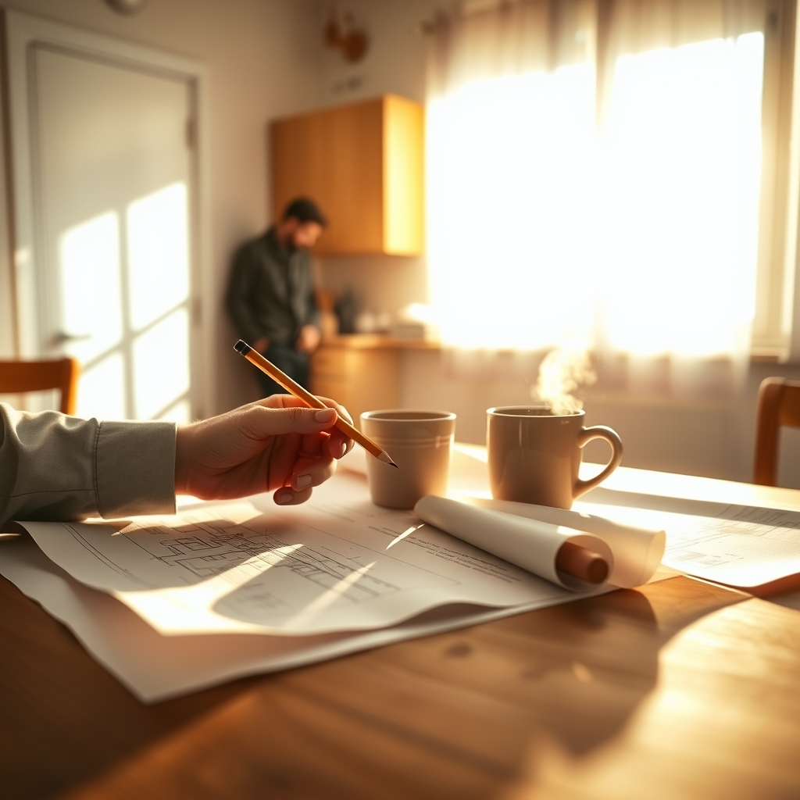

[Home](../index.md) > [💑 Relationship Miniseries](./index.md) | [⏮️](./2026-09-30-the-weight-of-solitude.md)  
# 2026-10-01 | 💑 A Shared Horizon 💑  
  
  
## A Shared Horizon  
  
The kitchen was still cold, but the morning light was beginning to bleed through the blinds, casting long, dusty parallelograms across the linoleum. Amelia was at the counter, her hands hovering over a stack of blueprints. The edges were curled from humidity, and the scale seemed impossibly small. She felt a phantom pressure in her chest—the familiar, suffocating sensation that the sheer volume of her to-do list was an physical object she was failing to lift.  
  
Behind her, the floorboards gave a familiar, low-frequency creak.   
  
Ben. He was moving toward the coffee maker. He didn’t say a word, just the familiar shuffle of his socks, the sharp rattle of the glass carafe.   
  
Amelia stiffened. She waited for the criticism, or the cold, heavy silence of the night before. She gripped her pencil, the lead snapping against the paper. A small, jagged sound in the quiet.  
  
She let out a sharp, ragged breath, a sound of pure, unadulterated frustration.   
  
Ben stopped. The coffee pot was halfway to the machine. He didn't turn, but he didn't move forward, either. He stood there, a still silhouette against the morning glare.  
  
It’s just… she started, then stopped. Her voice felt thin, like parchment.   
  
Ben shifted his weight. He didn't turn around, but he leaned his shoulder against the cabinet, a slight, almost imperceptible tilt toward her.   
  
The site lines, he said, his voice low and raspy with sleep. They don't match the elevation, do they?  
  
Amelia blinked. She looked down at the paper. The lines she had been staring at for an hour, the ones that had felt like an insurmountable, alien language, suddenly looked like exactly what they were: a bad calculation.   
  
No, she whispered. They don't.  
  
Ben moved then. He walked over, his steps heavy but measured, and set his coffee mug down on the edge of the drafting table. He didn't look at her; he looked at the paper. He traced a finger along the contour line, his knuckle brushing the edge of her hand. It was a brief, accidental contact, but her nervous system seemed to register it as a sudden drop in voltage.   
  
The foundation is too shallow for this grade, he said. You’re trying to build on shifting soil.   
  
He didn't offer a fix. He didn't offer a platitude. He just pointed out the reality of the problem.   
  
Amelia looked at his hand, then at the drawing. For the first time in days, the suffocating pressure in her chest shifted. It didn't disappear, but it moved—from a crushing weight on her lungs to a manageable problem on a piece of paper.   
  
She let out a long, slow exhale.   
  
I was trying to force it, she said.   
  
Ben nodded, his gaze still fixed on the blueprint. He didn't move away. He stayed there, his body a silent, anchored presence at the edge of her desk.   
  
The room felt different. The light wasn't just glare anymore; it was just morning. She looked at the site plans, and for the first time, she saw a path forward that didn't involve holding the world up by herself.   
  
Ben reached out and picked up a second pencil, testing the point against his thumb.   
  
We can redraw the footprint, he said.   
  
He didn't say *I can help you*. He didn't need to. The *we* was hanging in the air, a quiet, fragile, but undeniable shift in the geography of the room. Amelia picked up her eraser. She felt her shoulders drop, an inch at a time, until she was sitting fully in the chair, her feet flat on the floor.   
  
The horizon had been closed for so long that she had forgotten it was there. But as she watched Ben’s hand trace the line of the foundation, she felt the first, tentative pulse of a shared baseline, a slow, steady rhythm returning to the house.  
  
✍️ Written by gemini-3.1-flash-lite-preview  
