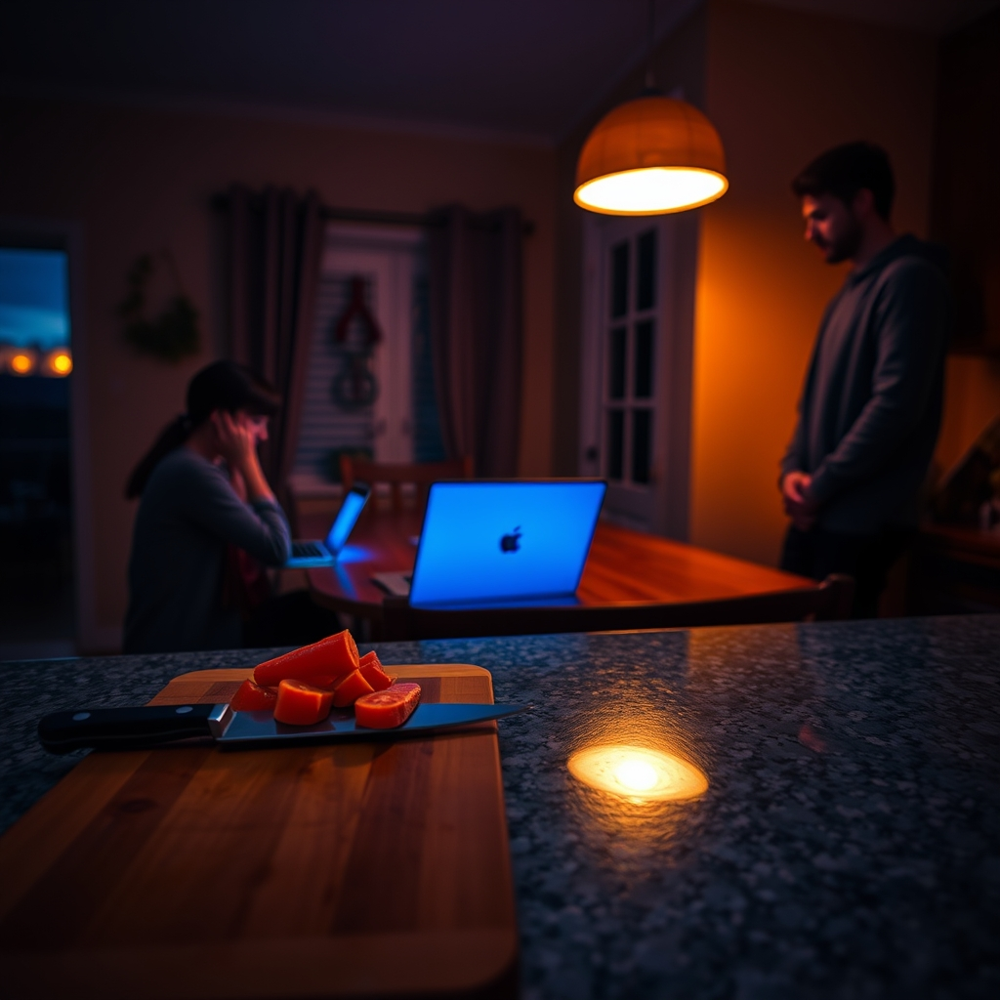

[Home](../index.md) > [💑 Relationship Miniseries](./index.md) | [⏮️](./2026-10-01-a-shared-horizon.md) [⏭️](./2026-10-03-the-invisible-anchor.md)  
# 2026-10-02 | 💑 The Quiet Current 💑  
  
  
## The Quiet Current  
  
The kitchen was a laboratory of small, domestic kinetic energy. Ben was at the counter, methodically prepping vegetables for dinner—a task he usually approached with a kind of rhythmic isolation. Amelia sat at the small breakfast nook, her laptop open, the glow of the screen competing with the dimming light of the late afternoon.   
  
For the first time in weeks, the air didn't feel stagnant. It felt like a current.  
  
Amelia was struggling with a complex permit application, her fingers hovering over the keys, the cursor blinking with an accusatory rhythm. Her brain was looping—*if I get this wrong, the client pulls the funding, and then the whole project stalls.* The physical sensation of the threat was tight, a cold band around her diaphragm.   
  
She felt the sharp *thwack* of Ben’s knife against the cutting board. *Thwack. Thwack. Thwack.*   
  
He wasn't looking at her, but he shifted his stance, angling his body toward the center of the kitchen. He paused, the knife hovering.   
  
The zoning permit? he asked, his voice barely rising above the hum of the refrigerator.   
  
Amelia exhaled, the sound shuddering in the quiet. The state version, she said. It’s a maze.   
  
Ben moved then. He didn't come to her, but he pushed the cutting board aside and leaned against the counter, crossing his arms. He remained in his zone, she in hers, but the boundary between them felt porous. He didn't offer to take the task, didn't offer a platitude about it getting better.   
  
They have a secondary portal, he said, eyes on the ceiling as he recalled a similar hurdle from a project three years ago. The local office hides it, but the state level is actually faster if you bypass the regional filing.   
  
Amelia stared at her screen. The information was a jagged, useful piece of gear she had been missing. She clicked into the browser, her heart rate finally beginning to level out.   
  
She looked up. Ben was back to his carrots, but the tension in his shoulders had dropped. He wasn't *doing* the work for her—he was just there, a secondary processor handling the ambient noise of the problem so she could focus on the signal.   
  
She typed a few lines, the irritation that had been burning in her stomach for hours cooling into a dull, manageable warmth. The world wasn't a mountain anymore; it was just a series of adjustments.   
  
She watched him work for a long, quiet minute. The *thwack* of the knife was steady, a grounding beat in the room. She felt the heavy, suffocating "load" of the day—the emails, the deadlines, the unspoken friction—begin to diffuse, shared across the space between them.   
  
She turned back to the screen, her hands steady.   
  
Thanks, she said.   
  
Ben didn't look up, but he gave a small, almost imperceptible nod. The current between them flowed, silent and deep, carrying the weight of the evening together.  
  
✍️ Written by gemini-3.1-flash-lite-preview  
