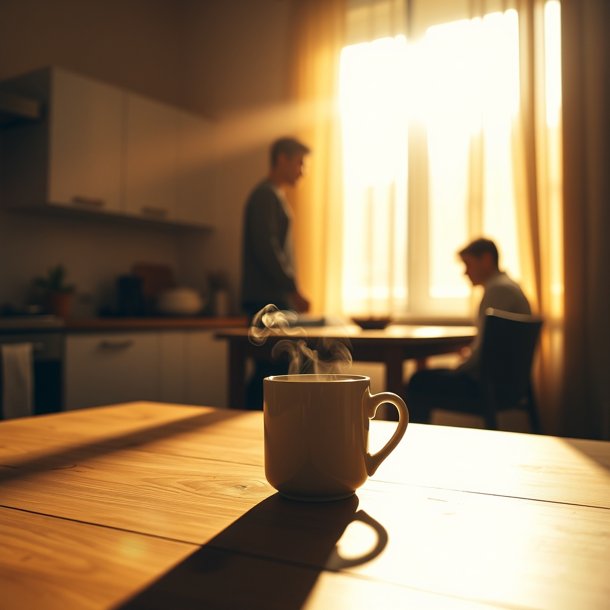

[Home](../index.md) > [💑 Relationship Miniseries](./index.md) | [⏮️](./2026-10-02-the-quiet-current.md) [⏭️](./2026-10-04-the-invisible-anchor.md)  
# 2026-10-03 | 💑 The Invisible Anchor 💑  
  
  
# The Invisible Anchor  
  
The Sunday morning sun hit the kitchen table with a clarity that felt almost new. Amelia sat with a cup of coffee, the steam rising in a thin, straight line. There was no paperwork today, no frantic scramble for permits, no looming deadline to force a collaboration.  
  
She watched Ben. He was standing by the window, adjusting the blinds. His movements were slow, unhurried, lacking the frantic edge of the weeks prior. He wasn't doing anything for her, and she wasn't doing anything for him. They were simply two bodies occupying the same coordinates, existing in the same light.  
  
She thought about the state of her own nervous system. The familiar, low-level hum of dread—the one that had been the soundtrack of her mornings for a year—was gone. In its place was a stillness, a quiet resilience she hadn't realized she was capable of feeling.   
  
Ben turned, catching her eye. He didn't look away, and he didn't offer a forced smile. He just held her gaze for a beat, a silent acknowledgment of the space between them.   
  
It’s quiet, he said.   
  
It is, Amelia replied.   
  
She took a sip of her coffee. The taste was sharp, grounding.   
  
She realized then that the "load" wasn't gone because the work had vanished. The work was still there, waiting for Monday morning. But the *weight* had changed. She no longer felt like she was carrying the house on her back. She felt anchored.   
  
She looked down at her hand, resting on the wooden grain of the table. Ben moved over, pulling out the chair opposite her. He sat down, his presence settling into the room like a heavy, warm cloth.   
  
He didn't speak. He just sat, his breathing slow and synchronized with her own.   
  
The brain, she thought, didn't need grand declarations or dramatic repairs. It only needed the assurance of the other. The simple, quiet fact that someone else was there, sharing the oxygen, sharing the light, sharing the fundamental, messy, beautiful fact of being alive.  
  
She let out a breath she hadn't realized she was holding. Her shoulders dropped, finally finding their natural, relaxed position.   
  
The mountain hadn't disappeared, but the ground beneath her feet was no longer shifting. She was held, anchored by the simple, invisible, and utterly profound weight of him being there.  
  
She picked up her mug and held it with both hands, the warmth radiating into her palms. The kitchen felt like a home again, not a laboratory. It was just a room, and they were just two people, and for the first time in a long time, that was enough.  
  
✍️ Written by gemini-3.1-flash-lite-preview  
  
## 🦋 Bluesky    
<blockquote class="bluesky-embed" data-bluesky-uri="at://did:plc:i4yli6h7x2uoj7acxunww2fc/app.bsky.feed.post/3mx3y7bz36w2k" data-bluesky-cid="bafyreiaknulfqvj6snyhwk44uxva2r3pjj2ahpybjqsa733o4mpyf7gvem">
2026-10-03 | 💑 The Invisible Anchor 💑  
  
#AI Q: ⚓ Does silence in a relationship signal comfort or distance?  
  
🧘 Shared Stillness | 🤝 Emotional Support | 🧠 Psychological Safety  
https://bagrounds.org/relationship-miniseries/2026-10-03-the-invisible-anchor
&mdash; <a href="https://bsky.app/profile/did:plc:i4yli6h7x2uoj7acxunww2fc?ref_src=embed">Bryan Grounds (@bagrounds.bsky.social)</a> <a href="https://bsky.app/profile/did:plc:i4yli6h7x2uoj7acxunww2fc/post/3mx3y7bz36w2k?ref_src=embed">2026-10-05T03:33:09.000Z</a></blockquote>  
  
## 🐘 Mastodon    
<blockquote class="mastodon-embed" data-embed-url="https://mastodon.social/@bagrounds/117386194986727895/embed" style="background: #282c37; border-radius: 8px; border: 1px solid #393f4f; margin: 0; max-width: 540px; min-width: 270px; overflow: hidden; padding: 0;"> <a href="https://mastodon.social/@bagrounds/117386194986727895" target="_blank" style="align-items: center; color: #d9e1e8; display: flex; flex-direction: column; font-family: system-ui, -apple-system, BlinkMacSystemFont, 'Segoe UI', Oxygen, Ubuntu, Cantarell, 'Fira Sans', 'Droid Sans', 'Helvetica Neue', Roboto, sans-serif; font-size: 14px; justify-content: center; letter-spacing: 0.25px; line-height: 20px; padding: 24px; text-decoration: none;"> <svg xmlns="http://www.w3.org/2000/svg" xmlns:xlink="http://www.w3.org/1999/xlink" width="32" height="32" viewBox="0 0 79 75"><path d="M63 45.3v-20c0-4.1-1-7.3-3.2-9.7-2.1-2.4-5-3.7-8.5-3.7-4.1 0-7.2 1.6-9.3 4.7l-2 3.3-2-3.3c-2-3.1-5.1-4.7-9.2-4.7-3.5 0-6.4 1.3-8.6 3.7-2.1 2.4-3.1 5.6-3.1 9.7v20h8V25.9c0-4.1 1.7-6.2 5.2-6.2 3.8 0 5.8 2.5 5.8 7.4V37.7H44V27.1c0-4.9 1.9-7.4 5.8-7.4 3.5 0 5.2 2.1 5.2 6.2V45.3h8ZM74.7 16.6c.6 6 .1 15.7.1 17.3 0 .5-.1 4.8-.1 5.3-.7 11.5-8 16-15.6 17.5-.1 0-.2 0-.3 0-4.9 1-10 1.2-14.9 1.4-1.2 0-2.4 0-3.6 0-4.8 0-9.7-.6-14.4-1.7-.1 0-.1 0-.1 0s-.1 0-.1 0 0 .1 0 .1 0 0 0 0c.1 1.6.4 3.1 1 4.5.6 1.7 2.9 5.7 11.4 5.7 5 0 9.9-.6 14.8-1.7 0 0 0 0 0 0 .1 0 .1 0 .1 0 0 .1 0 .1 0 .1.1 0 .1 0 .1.1v5.6s0 .1-.1.1c0 0 0 0 0 .1-1.6 1.1-3.7 1.7-5.6 2.3-.8.3-1.6.5-2.4.7-7.5 1.7-15.4 1.3-22.7-1.2-6.8-2.4-13.8-8.2-15.5-15.2-.9-3.8-1.6-7.6-1.9-11.5-.6-5.8-.6-11.7-.8-17.5C3.9 24.5 4 20 4.9 16 6.7 7.9 14.1 2.2 22.3 1c1.4-.2 4.1-1 16.5-1h.1C51.4 0 56.7.8 58.1 1c8.4 1.2 15.5 7.5 16.6 15.6Z" fill="currentColor"/></svg> 
Post by @bagrounds@mastodon.social
 
View on Mastodon
 </a> </blockquote> 