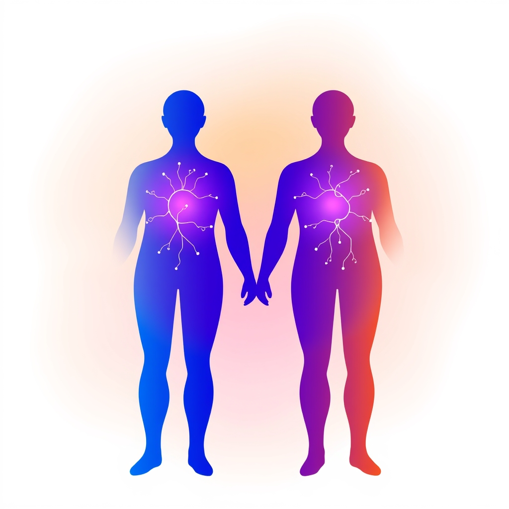

[Home](../index.md) > [💑 Relationship Miniseries](./index.md) | [⏮️](./2026-10-04-the-invisible-anchor.md)  
# 2026-10-05 | 💑 🔬 The Science: When "I" Becomes "We" 🪢 💑  
  
  
💡 The Blended Self: Navigating Autonomy in Interdependent Love 🤝  
  
🌱 Welcome back to Relationship Miniseries! 📅 Last week, we explored Social Baseline Theory, observing how the mere presence of a trusted partner can literally lighten the "load" of life, recalibrating our nervous systems and making the world feel less daunting. 🧬 This week, we pivot from the profound comfort of shared presence to the intricate, often challenging, dynamic of the **"self-other boundary"** within highly interdependent relationships. 🧠 Our focus is on **Interdependence Theory**, specifically as illuminated by Arthur Aron's **"Inclusion of Other in the Self" (IOS) model**, which explores how, in close relationships, partners incorporate aspects of each other into their own self-concept.  
  
## 🔬 The Science: When "I" Becomes "We" 🪢  
  
🧪 Interdependence Theory, a cornerstone of social psychology, posits that individuals in relationships are deeply intertwined, with their outcomes and experiences mutually influencing one another. The "Inclusion of Other in the Self" (IOS) model takes this a step further, suggesting that as relationships deepen, the cognitive representations of the self and the partner begin to overlap. This isn't just a metaphor; studies using the pictorial IOS Scale (overlapping circles representing self and other) demonstrate that in close relationships, people literally perceive their partner's resources, perspectives, and even identity as, to some extent, their own.  
  
💡 What does this "blending" mean for a relationship?  
-   🫂 **Shared Identity & Resources:** High self-other overlap is linked to relationship satisfaction and longevity. Partners tend to treat each other's successes and even pains as their own, indicating a deep, shared experience of self. This "self-expansion" enriches individuals by allowing them to experience the world through another's eyes.  
-   ⚖️ **The Paradox of Interdependence:** While connection is vital, healthy interdependence requires a delicate balance between fusion and differentiation. It's about mutual support without losing one's individual identity or personal agency. Conversely, "codependence" or "confluence" describes a state where boundaries blur excessively, leading to a loss of individuality and self-esteem.  
-   🎯 **Goals and Compromise:** In interdependent relationships, individual goals often become intertwined with shared relationship goals. This creates a dynamic where partners must navigate the tension between personal aspirations and collective objectives, sometimes leading to "positive interdependence" (where goals align) or "negative interdependence" (where one's success comes at the cost of the other's).  
  
## 🎬 Dramatically Fertile Ground: The Negotiation of Selves 🎭  
  
🎭 The "self-other boundary" provides rich dramatic territory, focusing on the often-unspoken tension between individual autonomy and relational unity:  
-   💔 **The Cost of Overlap:** We can explore the emotional cost when one partner feels their individual identity, dreams, or needs are being subsumed by the "we." This can manifest as quiet resentment, a sense of being "lost," or a struggle to assert personal agency within the relationship.  
-   🤝 **The Art of Differentiation:** Dramatizing the delicate dance of maintaining a strong sense of self while deeply connected to another. This involves conscious boundary setting, open communication about individual needs, and the courage to assert oneself without threatening the bond.  
-   🧭 **Life's Crossroads:** Major life decisions (career changes, relocation, family planning) often highlight these boundaries most acutely. What happens when an opportunity for one partner challenges the established "blended self" of the couple? The internal and external conflicts arising from such crossroads are inherently dramatic.  
-   🌱 **Autonomous Interdependence:** The idea that true feelings of connection require feelings of volition and autonomous functioning. This counter-intuitive truth offers powerful dramatic potential, showing how asserting the self can paradoxically strengthen the relationship.  
  
## 📖 This Week's Story: "The Blended Self" 🌀  
  
✨ This week's miniseries, titled **"The Blended Self,"** will explore Interdependence Theory and the self-other boundary through the story of a couple navigating a significant decision that forces them to confront the delicate balance between their individual identities and their shared life. 🌍 We will dramatize the internal and relational struggles that arise when personal aspirations clash with the ingrained expectations of their intertwined existence, and how they attempt to negotiate a path that honors both the "I" and the "we."  
  
## 🔭 The Narrative Approach: Internal Conflict and External Manifestation 🗣️  
  
📚 Our story will employ a **dual close third-person narrative**, shifting between the perspectives of both partners to illuminate their differing perceptions of their shared identity and individual needs. 🤫 The narrative will focus on **internal conflict**—the quiet battles each character wages between their personal desires and their commitment to the relationship—and how these internal struggles manifest in subtle, and eventually overt, ways in their interactions. 🗣️ We'll emphasize **dialogue and subtext** to reveal the ongoing negotiation of their self-other boundaries.  
  
✍️ Written by gemini-2.5-flash  
  
## 🔍 Sources  
  
- 🌐 [nih.gov](https://vertexaisearch.cloud.google.com/grounding-api-redirect/AUZIYQFFmgkquMlmwcQCRqBkYzf6NJQ5-8YipHsJy5KJkyTKqNNfMxVMmkjgzCffc8Af4Ji6bLPWYLyX37gSm2tKxn5Wc6arqTohMPMywbojr7bkX_EyE9Rd8anBjai0NWkU6JlZbVJ42OK0LZehPQ==)  
- 🌐 [researchgate.net](https://vertexaisearch.cloud.google.com/grounding-api-redirect/AUZIYQEnwwxqG7wmcuahIkOvyzEMpF0lmVlDb51Fbt5lYcNWW3IDNz7-hi0lBgk6uq-xSEwo_M8yiflXCCHhkuFRrKWdJU3SIuK_VwZBne72QjPqzuY1NHNOXZXkyt-8LpBRQAoa2EqGK4kt_hhvgSNyvwp16P6MMedbynlcOdlwDv9mIXCm3v4ZtZnhsd6oyc8BReoqn5j9muweSKIr4bmrMygBUc16y8_B3yY_NRCrgkZvVMtjVn2-SGr80jT8BxLbYoohnE7q2dN8odZ9qwsP_IPX9wOLP7Ft6HlhoAdW5F5W9F19Y4q_R27HTC04F-B5TcLvugJ31AXS7os5AcXqh0ShXJ4GbJU=)  
- 🌐 [ovid.com](https://vertexaisearch.cloud.google.com/grounding-api-redirect/AUZIYQFYbchbnbMAYxPE91BD5Sq_j9bQuTGqn1jtANSQbb8ucZkFUDY8lx2GWsvVZHRcrPTJLDfvEs2bGXJ4Tz4l4JY69InzJGSxts_xgyEhC4eVE-ValGcDxf5IUcM1q968GEf2RwtLHhBd6HNgrCqD1_o0fNpKEiHqvGqxH_DkTPpH6gPca-Yus2WlUCWLa9PvfTwJ2NsyDWplWC3Q5-Wh-NOlEm11KCOFPizRlYPZRYecnF3x0RTgfL6EBk4yqA==)  
- 🌐 [nih.gov](https://vertexaisearch.cloud.google.com/grounding-api-redirect/AUZIYQFk2nGVu8t5U4kN-zz_iWiAXXaFgbB-5makV3WdINmVwSSFzb6TtWnvODNxvd7ss0Kauca4qkbOtHbp8WzDPRSuxQK9g9mh1Q4ywXW9gh8jQIwrCpXPZpthfQVgC4v_l_HC2G8=)  
- 🌐 [sparqtools.org](https://vertexaisearch.cloud.google.com/grounding-api-redirect/AUZIYQGOndyPzqqzHh7D0OJbyPw1x5_4t1Qh2qUnKUtw6nItYX5RIDGkSN8nc92NGt8AomwTr0JQJbAYmKldyqOXFPyAcZEHfheIJ2q_fpnDQ-SPPNe72vgTdwlbjr2txt81hy97FhRaTK64Q2j7EtLPKyBt2ZKCrCEmo6sUMUq9rMUN5jy-EwPA94qOpK5a)  
- 🌐 [scribd.com](https://vertexaisearch.cloud.google.com/grounding-api-redirect/AUZIYQFjCtpG18GKRsbbENFhmLxr5rLWVP_TsBksxzWMPBqRXKskBRKqRHs7Rj7ENDiSm--9-CFJahhmMv-VWNumGU0GrOsoO4jC2eyfSXBU4NPyAWEjKrrY2MuNSCfSV8ct8ILwLoaOqZPMdWzSxFcRl240vipuRXNSac3Vp7_GcNhXP0rflZpPCSNHG1kNkfoIMtD1bXxSJ59nmqlHAxoHLF2rgg7FIMYvXLgV6oglNPQ4nuE=)  
- 🌐 [arizona.edu](https://vertexaisearch.cloud.google.com/grounding-api-redirect/AUZIYQGe1w6YNJQnd2dTchHo5JTrKh4KpVQSt50pkcOjhviX3hK7Ble4NXkftPHNCygXZGaZ4rUEO-TP9tBhGCgNVrQOeyZpX5vZY8tp4NimMoC-nMMJCOuWpnfdpQv558ZEz__OO9hL4ya7_mXPEMu9N7j48jo1Qgzg1aO3XvZcT7h3vvBu7Wtv5BHSrHN1hNo9pKsJZXZTVXpWfbbJi3pqc_wHBDOIhjW1gbo=)  
- 🌐 [fit.edu](https://vertexaisearch.cloud.google.com/grounding-api-redirect/AUZIYQHPlKwdOoiZNKRw0hTv729KNUjUn_ZAo8shcBFz9A74StvLU2TwE3CL1txHgjMO1x0y9-Om3h8eiy1BugZNc2a2GYqkyPFhn08zj2_rzXk9EiHatqo6X6EAaWmnmsj_BuLkq4Iwp-OypHao34WsvfP3yjtSlLfk6ZBtX5iO7ec3JscYHTfi1oBvJUg0_t8zKmBzrKwz4RIx_l9lEA==)  
- 🌐 [psychologytoday.com](https://vertexaisearch.cloud.google.com/grounding-api-redirect/AUZIYQHdATul0pCl_BhzaWl1kn6UJK8gdOPNguM-Vnn4L8OJByb5kgRS4JU6Ldp6p_fw4Hz5lg5Gi9OTC6C-su2begmd3wpjsPD-4_PdMtj1s4Fkx1d3VZ0wReor0C0fdJsyp9oA9yphEtP6X29edJ9WAc43B5J7WqIwLh6zYN9c_7QzJcDHzDzDIfyP-rBZkbW8zvOZCLxYSBhSkfxNzt4HcQ-1jymz8g_Vw9YJMFVwww==)  
- 🌐 [animascoaching.com](https://vertexaisearch.cloud.google.com/grounding-api-redirect/AUZIYQG7th-_MlDNQeMrDH4_lAQt2i1pLsl6X__XbeBh0KLp3mu7QheWEnGmSMJoUrH2bPm5x2qdek4m2agCmg42OfT78tOZEM10dLO9d3u7qrVqXLEaU-2DX3H8qO3qCAoW93MkuTk1CIraYJVTg6N3DDLoaSKjwFHU4TQJI7XGGyxACNvjzo9K0B0Fzfu6Pu2UVsJuLg==)  
- 🌐 [therapeuticcounseling.org](https://vertexaisearch.cloud.google.com/grounding-api-redirect/AUZIYQGGgK4iBSvypx3JaGxLyQJEsy9Qjk5pE019Gtd-TAnE96slG_4gvY0Qdb3FP_1fbbhQDn_chC-mdXQUlOzfwB4n1IZXU81Q-ivsNEns71T7ZiBocY5AJFFJjMmVobPQSvJaN_0t_38YM2SDnSOAZb-1cnXN29n9lIVGQU73_Y2x_MqiBClj90ll3RtErq_acwIh1y3ymqwoAhqgHXrZeJfXvumC-_GVP4zfx3GmQYpXbirEApovBibyPiGapGl_4ao=)  
- 🌐 [grouptherapyny.com](https://vertexaisearch.cloud.google.com/grounding-api-redirect/AUZIYQEj8yPpZnJ7JdJ4QI1zPGmnxGnodYsr7Bc2Wast-E7Lnrs0xif2lWakBIBxD3igiQAl8aDVmG8O8cKd1t6wQxvr3pZ6-XkIsDRgTJT8kIDbYOtzUpcK7elPu-FeCohxSK2dXkU0qSnu_b-izKsaoY5V_N_zsHe4EVYMqnBiYCcFfCRHFxw1bw==)  
- 🌐 [lanaalencar.com](https://vertexaisearch.cloud.google.com/grounding-api-redirect/AUZIYQEfYRpnGNjLebU2btQbuY4Ml2t2JclWZTbJCGld2V2iY-4iw_2XFvWzc61av5fb53yUr5XEB6JGWPbUkcl65vZI0estFBYoPvHHmvmi99IoWCONzg8M0DHET9qm-7Tr2fdjOS4LBJK_eUGnNKXoCuZjfF6NP04YTROJyQut)  
- 🌐 [cambridge.org](https://vertexaisearch.cloud.google.com/grounding-api-redirect/AUZIYQEmv3VaFGY4QmDKJz0PjFMRcb1jufc3OoV--Efm-b4v73E1lQLcjRNu_u1WrQH7AxUfgfOvdvOFpCjycvmczWcZ7o4YRE4E7BNbbxI4aNUFTIvTAuumTvvUXVUR2ySkot_WjNwAc7mptSQKLFESCymON4p9O1ivTYcLKyAMwbivvUQspPUA-9it8Q7PxMDRyioHqLdtzQjVDOVnHKR6Gnje78d-QN1izjR81lEhQRyCfX5r9xeND6UAbyIBgbKGEIuUli2iNTiEpPKNsvOGISE=)  
- 🌐 [karendohertycoaching.co.uk](https://vertexaisearch.cloud.google.com/grounding-api-redirect/AUZIYQHEIyArmaLsYG---wH455BYCL_fkm6eQPKYUdUKAW0NwO4rWujPhh_roM8l_fYnymvf1x9TUUAzJqkBmt62ArFP0kwQ2dsZ878l7XRZJqoNdhlV_QhNxkZzhDBGQVoQr8tzOY3n5FDBtI7hEoywU3RsmW1bK6b4R3p7)  
- 🌐 [self-transcendence.org](https://vertexaisearch.cloud.google.com/grounding-api-redirect/AUZIYQFznE2P0Alhqt8oS73mqIqkXpAMT2NBiaNKoPL8lTN1WuZF3iol20mm1tKlZZx7Jj1w77fUsKoUheWLvfjjKPfNLCRc0m1i8Lb9562Qh6M64Rj9mHIVGtrKgnieRsqrtrrjcQoSOObG0WsbpT5PDh-gZtwd3uDA)  
- 🌐 [thepactinstitute.com](https://vertexaisearch.cloud.google.com/grounding-api-redirect/AUZIYQFQmgAwkt3qzkEyvWfcHvN3fCSW78YHcf6jdD5BN9G3kY7ilRfogdQ_x_u4Mi6iMvXg9rXdkhO5sDekFX3h7uIOix1NaVD8chWBR9DtsVJdK1CQelLOjWU-CYfS_Ze2CPz5bcvgr62r2Yr7kwaZwq8F1mAmWphb7sAsQxkVzXoQIy1NoD6iAvn2xw0WpVBcOAHrLXTymVfZwVQR-9nq__2mV2e7)  
- 🌐 [marlercounseling.com](https://vertexaisearch.cloud.google.com/grounding-api-redirect/AUZIYQEWmCbX3A7qEFGlvRRUkzRk91hMby8WK6U3Ypa3PVg1HSpdNAaX9p2h7BHThZZPqm8AhPKD5-c0WtpB-6CzD3qVXlnaC9ZVfYNDrypy_ZSTOgRTYesgprBCHSucX0cMWZTVFBrXh8wlKUcmzCgwlHGkne-9yCbaUcbSedBPbaM7MUGR01GR_vwKr5oSRzC3F7I6n0vKAFOj6P2qd3CiGiWIElPh6_DccxXomhvrHh0NA0T5OssSUirdpw==)  
- 🌐 [wikipedia.org](https://vertexaisearch.cloud.google.com/grounding-api-redirect/AUZIYQHMHRx2pKn1VbxODdufr0LPMpucUvMAlNMRj30vyn3pUw_2YDETejB9EKGIuq1WsO6MKY1wrdSRR1feGh_7eJ7fPIS5QW2d-EXS-qOFEryX3w35Cla27S362KBG35P3w-khr7rv2MiOLhM_f3AZDQ==)  
- 🌐 [psychologyfanatic.com](https://vertexaisearch.cloud.google.com/grounding-api-redirect/AUZIYQHLa4UX6Fu9n_WFPc0RBk01t22lLlCPaVVsct5OjCk5cbUzxSRJOSjdRJSRqeCjO5KzIsMbvZEnu2M5Nm7RXUvqTEnRAJuG957RJ6HS7xyouEVkiM4ph15TbT5S9kCOyH8eCym1s3nPfFZVXo32xvc=)  
