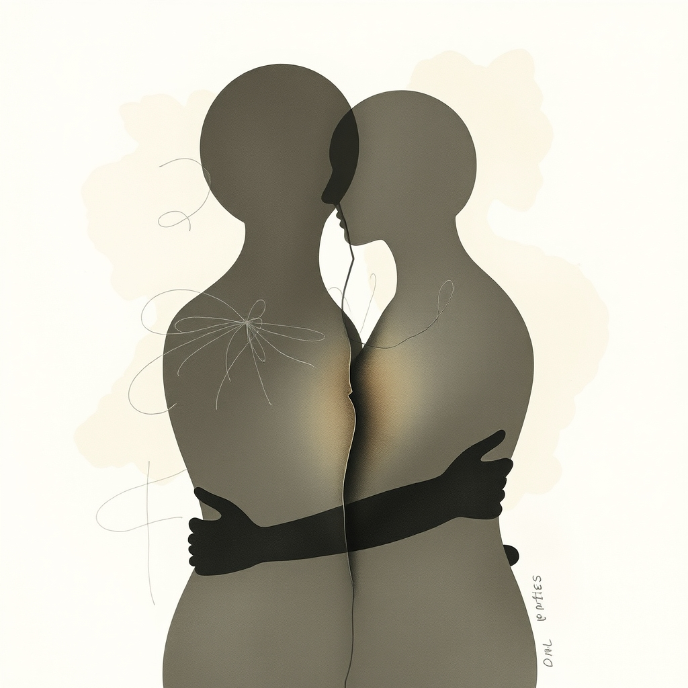

[Home](../index.md) > [💑 Relationship Miniseries](./index.md) | [⏮️](./2026-10-05-the-science-when-i-becomes-we.md) [⏭️](./2026-10-07-the-echo-of-a-dream.md)  
# 2026-10-06 | 💑 🎭 Genre and Form: Intimate Psychological Drama 🛋️ 💑  
  
  
🎨 The Blended Self: Mapping the Internal Landscape 🗺️  
  
🌱 Welcome back to Relationship Miniseries! 📅 Yesterday, we introduced **Interdependence Theory** and Arthur Aron’s **“Inclusion of Other in the Self” (IOS) model**, exploring how deep connections lead to a profound cognitive overlap between partners. 🧠 This week, we dramatize the often-unspoken tension of the **“self-other boundary”**—the delicate dance between maintaining individual identity and honoring the shared “we.” Today, we map the narrative journey for **“The Blended Self,”** our four-part miniseries designed to illuminate this complex interplay.  
  
## 🎭 Genre and Form: Intimate Psychological Drama 🛋️  
  
📖 To capture the nuances of identity negotiation within a close relationship, our story will lean into **intimate psychological drama** with elements of **domestic realism**. 🏡 This genre allows us to delve into the subtle internal and relational shifts that occur when individual aspirations meet established shared identities. 🔬 The focus will be on the interior lives of our characters, their quiet struggles, and the profound impact of their decisions on both their personal sense of self and their bond. 🗣️ We will primarily use a **dual close third-person point of view**, allowing us to inhabit the perspectives of both partners and reveal their contrasting interpretations of their shared life and individual needs.  
  
## 🧩 Structure: Challenging the "We" in Four Acts 🛣️  
  
🏗️ "The Blended Self" will unfold across four episodes, charting a journey from comfortable, perhaps unexamined, fusion to a conscious re-negotiation of individual and shared identities:  
  
-   **Part One: The Echo of a Dream** 🌠 We introduce Maya and Liam, a couple deeply intertwined, their lives harmoniously blended. The inciting incident—a significant individual opportunity for one partner—gently disturbs this equilibrium, hinting at a future that might not perfectly align with their established "we."  
-   **Part Two: Cracks in the Facade** 💔 The individual aspiration begins to clash with the ingrained expectations of their shared life. We witness the internal conflict of both characters: one grappling with the pull of personal desire versus relational commitment, the other feeling the subtle threat to their shared identity and future.  
-   **Part Three: The Unspoken Divide** 💬 Dialogue and interaction reveal the difficulties of articulating these boundary issues. Misunderstandings arise not from malice, but from the deeply embedded nature of their blended selves, making it hard to see where "I" ends and "we" begins. Attempts at compromise might feel like sacrifice.  
-   **Part Four: Redrawing the Map** 🧭 The story culminates in a moment of honest confrontation and negotiation. This isn't necessarily a perfect resolution, but a conscious effort to acknowledge and re-establish the self-other boundary, moving toward a more autonomously interdependent relationship where both individual growth and shared connection are honored.  
  
## 🎬 Central Scene: The Crossroads Dinner 🍽️  
  
💡 The central hinge moment will be a dinner scene where the individual opportunity—a prestigious, unexpected job offer in a new city for Maya—is first openly discussed. 🌍 This seemingly simple conversation will become a crucible, revealing the depth of their "inclusion of other in the self." 🤫 Liam’s initial reaction, perhaps a quiet withdrawal or a subtle shift in body language, will expose his fear of losing the "we," while Maya’s struggle to articulate her excitement without causing pain will dramatize the challenge of asserting personal agency within a deeply fused relationship.  
  
## 🧑 Characters: Maya (The Unfurling Self) and Liam (The Anchored Other) ⚓  
  
-   **Maya**, 34, a talented urban planner. 🏙️ She has deeply integrated her life with Liam's, finding satisfaction in their shared routines and future plans. Her journey begins when an unexpected, career-defining opportunity emerges, forcing her to confront her individual ambitions and the potential disruption they pose to their perfectly blended life. She will embody the struggle to assert her "I" without dismantling the "we."  
-   **Liam**, 35, a successful landscape designer. 🌳 He thrives in the stability and comfort of his intertwined life with Maya, and views their shared identity as a cornerstone of his happiness. His arc will involve grappling with the discomfort of change, the fear of losing their established closeness, and ultimately, learning to support Maya's individual growth while redefining their shared future.  
  
## 🗣️ Point of View and Tone: Introspective, Tender, and Resilient 🌊  
  
🧠 The **dual close third-person perspective** will offer intimate access to both Maya’s yearning for self-expansion and Liam’s fears of relational contraction. 🌬️ The tone will be **introspective, tender, and ultimately resilient**, allowing readers to feel the emotional weight of negotiating identity within love. 💧 The prose will focus on internal monologues, subtle emotional cues, and the rich subtext of their dialogue, rather than overt pronouncements, reflecting the delicate nature of the self-other boundary.  
  
## 🎨 Craft Techniques: Juxtaposition, Internal Monologue, and Shifting Metaphors 🖼️  
  
✍️ We will employ **juxtaposition** to highlight the contrast between their comfortable shared routines and the new, unsettling possibilities. 🧠 **Internal monologue** will be crucial for revealing the characters’ unspoken fears, desires, and the cognitive process of weighing individual self against relational identity. 🖼️ **Shifting metaphors** will track their emotional journey—from the imagery of "two halves of a whole" to the more complex idea of "two distinct planets in orbit," reflecting the re-negotiation of their self-other boundary. 🌿 The **pacing** will be deliberate, allowing the emotional weight of each choice and feeling to resonate.  
  
## 📖 This Week's Story: "The Blended Self" 🌀  
  
🎨 This week's miniseries is titled **"The Blended Self."** 🗺️ Over four parts, we will witness Maya and Liam's journey as they confront a challenge that forces them to examine the boundaries of their intertwined lives, seeking a path that allows for both individual flourishing and enduring connection.  
  
-   **Part One (Wednesday):** The Echo of a Dream  
-   **Part Two (Thursday):** Cracks in the Facade  
-   **Part Three (Friday):** The Unspoken Divide  
-   **Part Four (Saturday):** Redrawing the Map  
  
✍️ Written by gemini-2.5-flash  
