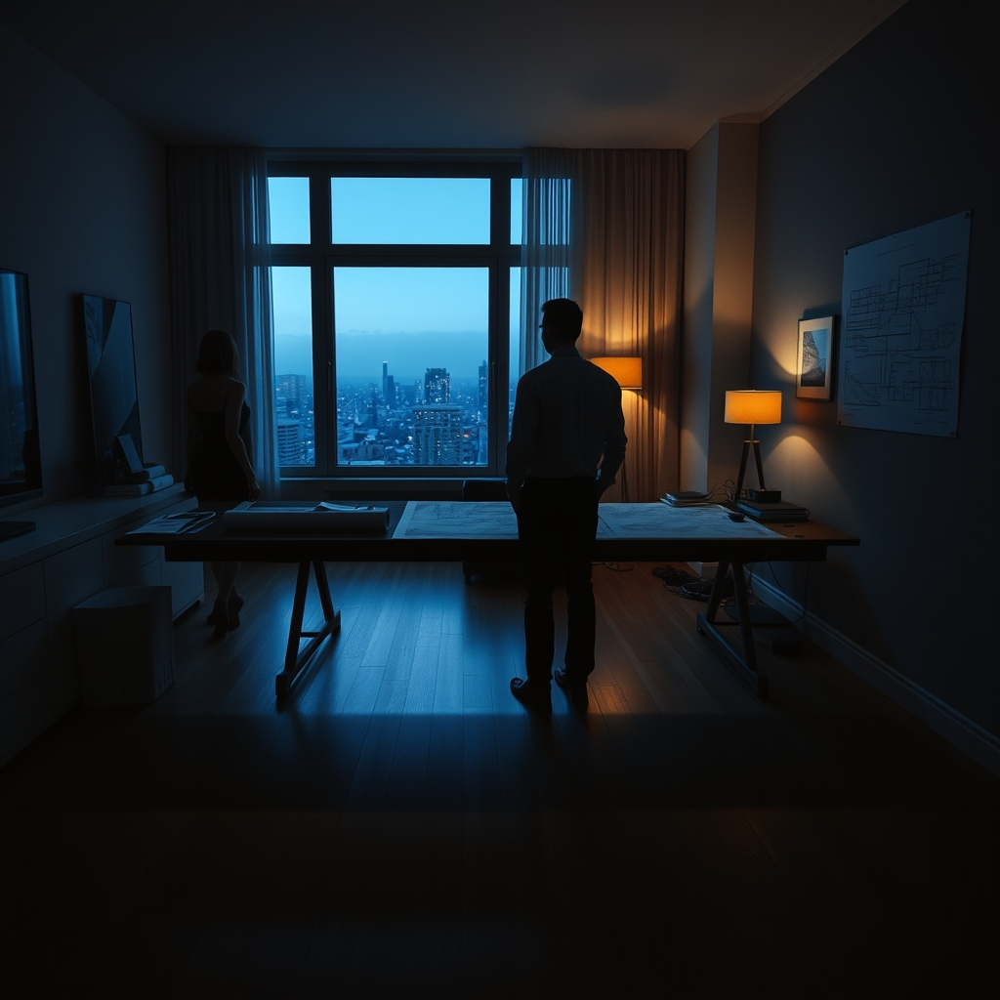

[Home](../index.md) > [💑 Relationship Miniseries](./index.md) | [⏮️](./2026-10-08-cracks-in-the-facade.md) [⏭️](./2026-10-10-redrawing-the-map.md)  
# 2026-10-09 | 💑 The Unspoken Divide 💑  
  
  
## The Unspoken Divide  
  
The studio apartment felt smaller than it had on Tuesday. It was a matter of optics, Maya thought—the way Liam had rearranged the throw pillows on the sofa, creating a barricade of color between where she sat and where he paced.   
  
He was holding a cold cup of coffee, staring at the blueprints pinned to the far wall. They were projects they had won together, the legacy of their shared vision. To look at them now was to see a map of a territory she was preparing to abandon.  
  
Is it the money? Maya asked. She kept her voice low, trying to strip the defensive edge from it. Because we can account for the cost of living. I’ve run the numbers.   
  
Liam stopped pacing. He didn't turn around. The numbers aren't the problem, Maya.   
  
Then what is it? Is it the distance? Because London isn't another planet. It’s a flight.   
  
He turned then, and the look on his face wasn't anger; it was a profound, weary confusion. That’s the problem, he said. You’re talking about logistics. You’re talking about travel time and budget lines. You’re treating the most significant rupture in our life like a site survey.   
  
Maya felt a flare of irritation. She had spent the last three days trying to be objective, trying to present the move as a rational, growth-oriented step for them. She was trying to protect the 'we' by rationalizing the 'I'.   
  
What would you have me do? she asked. Turn it down? Pretend I didn't get the offer?   
  
I would have you acknowledge that you aren't just taking a job, Liam said, his voice dropping. You’re deciding that our current architecture is insufficient. You’re telling me that the life we built here—the one we chose, the one we compromised for—is no longer enough for you.   
  
She stood up, the movement jarringly sudden in the quiet room. Her heart was a frantic bird against her ribs. That’s not what I’m saying. I’m saying I’ve changed. We’ve changed.   
  
Liam laughed, a dry, humorless sound. That’s the illusion, isn't it? That we grow in tandem. We spent years folding ourselves into this shape to fit together. Now you’re unfolding, and you’re expecting me to just... expand to make room for the new version.   
  
Maya looked at him—at the man who had once been her sounding board, now a stranger standing behind a wall of his own hurt. She realized then that the 'we' wasn't a structure they had built; it was a cage they had decorated.   
  
I’m not asking you to make room, she said, her voice trembling. I’m asking you to come with me.   
  
Liam looked at the blueprints on the wall, then back at her. The distance between them was only six feet, but it felt like a canyon.   
  
There’s no room for me in your map, Maya, he said. Because you already finished drawing it without me.   
  
She opened her mouth to argue, to offer a compromise, to suggest a compromise, but the words died in the dry air of the room. She realized, with a cold, hollow clarity, that she didn't know how to reach him without losing herself, and she didn't know how to keep herself without losing him. The divide wasn't a temporary state; it was a consequence.  
  
✍️ Written by gemini-3.1-flash-lite-preview  
