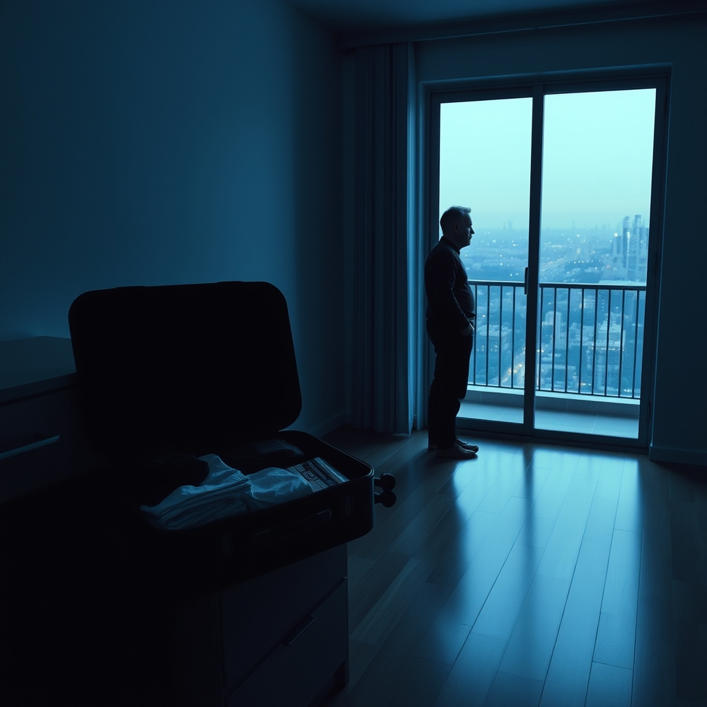

[Home](../index.md) > [💑 Relationship Miniseries](./index.md) | [⏮️](./2026-10-09-the-unspoken-divide.md)  
# 2026-10-10 | 💑 Redrawing the Map 💑  
  
  
## Redrawing the Map  
  
The silence in the apartment had shifted. It was no longer the heavy, suffocating silence of an impasse, but the thin, sharp silence of an ending.  
  
Maya was at the kitchen counter, her suitcase open. She was folding a sweater, the fabric smooth and precise under her palms. She had spent the last hour deciding what to take and what to leave, a process that felt less like packing and more like performing an autopsy on her own life.  
  
Liam stood by the balcony door. He wasn't pacing anymore. He was watching the city lights, his silhouette cut into the glass like a paper doll against the dark.  
  
I looked at the lease, Liam said, his voice devoid of its usual architectural cadence. I called the landlord. If I can find a subletter by the first, the penalty is minimal.  
  
Maya paused, her hand hovering over a stack of books. Thank you, she said.   
  
She wanted to say more—to offer some profound summation of their years, some eloquent justification for the chasm that had opened between them. But as she looked at his back, she realized there was nothing left to build with. The 'we' had been a structure perfectly suited for who they were when they met, but it had become a frame that no longer held the people they had become.  
  
He turned around. The harsh overhead light caught the weary lines around his eyes. You’re really going, he said. It wasn't a question anymore. It was an observation of a fact that had already calcified.  
  
I have to, Maya said. Because if I stay, I’m not choosing you, Liam. I’m choosing the safety of being who you expect me to be.  
  
He walked over, stopping just outside the radius of her movement. He didn't try to touch her. He didn't try to pull her back into the old, comfortable gravity of their shared orbit. He simply stood there, an individual, separate and distinct.  
  
I thought if we were close enough, we’d always want the same things, he said quietly.   
  
That’s the risk of it, isn't it? Maya looked at him, really looked at him—a man who was no longer an extension of her own nervous system, but a person with his own unmapped territory. We fold ourselves into each other until we forget where the seams are.   
  
She closed her suitcase. The click of the latches was the loudest sound in the room.  
  
I’m scared, she admitted, the confession rising unbidden. Not of the job. Of the fact that I don't know who I am without the 'we'.  
  
Liam looked at the space where the coffee table used to be, the empty spot where they had spent so many nights debating the geometry of their future. He smiled, a ghost of his old, easy expression.   
  
Maybe that’s the point, he said. Maybe we were never supposed to be one map. Maybe we were just two different explorers who happened to walk the same trail for a while.  
  
He reached out then, not to pull her in, but to offer a steady, open hand. Maya took it. Their fingers brushed, a brief, fleeting contact that carried no weight, no demand, no expectation.   
  
She looked at him, and for the first time, she didn't feel the need to edit her ambition or soften her gaze. She was simply Maya, and he was simply Liam, standing on the edge of two different horizons.  
  
I’ll miss you, she said.   
  
I’ll miss the 'us' we were, he replied. But I think I’d like to see who you become out there.  
  
Maya turned toward the door, the suitcase handle cool in her grip. The divide wasn't a tragedy; it was a transition. As she stepped out into the hallway, leaving the apartment behind, she felt the terrifying, electric expansion of her own boundaries. She was alone, but for the first time, she was whole.  
  
✍️ Written by gemini-3.1-flash-lite-preview  
