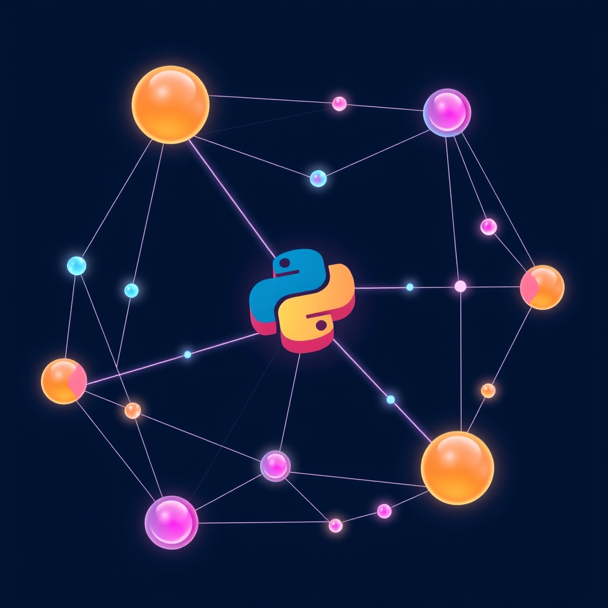

[Home](../index.md) > [Software](./index.md)  
# 🎨🧱 Graphiti  
  
  
## 🤖 AI Summary  
### 👉 What Is It?  
  
[Graphiti](https://github.com/getzep/graphiti) is a Python library designed to build knowledge graph-powered applications. 🧠 It focuses on representing and querying knowledge in a graph structure, facilitating complex relationships and semantic understanding. 🕸️ It belongs to the broader category of knowledge graph tools and graph databases. 📊  
  
### ☁️ A High Level, Conceptual Overview  
  
* **🍼 For A Child:** Imagine you have a map of all your friends, their favorite toys, and where they live. Graphiti helps you connect all these pieces of information so you can easily find out who likes what and where they are. 🗺️  
* **🏁 For A Beginner:** Graphiti is a Python tool that allows you to organize and query information as a network of connected things. It helps you understand relationships between different pieces of data, like how people are connected to places or things. 🔗  
* **🧙‍♂️ For A World Expert:** Graphiti provides a Pythonic interface for constructing and querying knowledge graphs, enabling sophisticated semantic reasoning and relationship analysis. It facilitates the creation of applications that understand and leverage complex data relationships. 🧠  
  
### 🌟 High-Level Qualities  
  
* **Pythonic:** Integrates smoothly with Python workflows. 🐍  
* **Knowledge Graph Focused:** Designed for representing and querying relationships. 🕸️  
* **Flexible:** Allows for custom node and edge types. 🧩  
* **Query Capabilities:** Provides tools for traversing and analyzing the graph. 🔍  
* **Extensible:** Supports custom functions and logic within the graph. 🛠️  
  
### 🚀 Notable Capabilities  
  
* **Node and Edge Creation:** Define and create nodes and edges with custom attributes. ➕  
* **Relationship Management:** Model complex relationships between entities. 🔗  
* **Graph Traversal:** Query and navigate the graph using flexible patterns. 🧭  
* **Semantic Analysis:** Perform analysis based on the relationships within the graph. 🧠  
* **Custom Functions:** Integrate custom Python functions into graph queries. 🐍  
  
### 📊 Typical Performance Characteristics  
  
* Performance depends on the size and complexity of the graph. 📈  
* Graph traversal performance is influenced by query complexity and graph structure. ⏱️  
* Optimization techniques like indexing and caching can improve performance. ⚡  
* Scalability is tied to the underlying data storage and processing capabilities. 🏗️  
  
### 💡 Examples Of Prominent Products, Applications, Or Services That Use It Or Hypothetical, Well Suited Use Cases  
  
* **Hypothetical:** A recommendation engine that suggests related products based on user preferences and product relationships. 🛒  
* **Hypothetical:** A knowledge base for medical information, connecting diseases, symptoms, and treatments. 🩺  
* **Hypothetical:** A social network analysis tool that identifies communities and influencers. 📱  
  
### 📚 A List Of Relevant Theoretical Concepts Or Disciplines  
  
* [🧠🌐 Knowledge Graphs](../topics/knowledge-graphs.md)  
* Graph theory 🕸️  
* Semantic web 🌐  
* Python programming 🐍  
* Data modeling 📊  
  
### 🌲 Topics:  
  
* **👶 Parent:** Graph databases 🗄️  
* **👩‍👧‍👦 Children:** Knowledge representation, graph traversal, semantic analysis. 🧠  
* **🧙‍♂️ Advanced topics:** Graph embeddings, semantic reasoning, knowledge graph completion. 🤯  
  
### 🔬 A Technical Deep Dive  
  
✨ Graphiti provides a 🐍 Python API for constructing 🏗️ and querying 🔍 knowledge graphs. It allows developers 👨‍💻👩‍💻 to define custom 🧩 node and edge types with 🏷️ attributes, and to create 🔗 relationships between nodes. 💡 Graphiti's query capabilities support 🔍 pattern matching, 🧭 graph traversal, and 🧠 semantic analysis. It also allows for the 🤝 integration of custom 🐍 Python functions within graph queries.  
 ⚙️  
  
### 🧩 The Problem(s) It Solves:  
  
* **Abstract:** Represents and queries complex relationships between entities. 🔗  
* **Common:** Building applications that require understanding and leveraging interconnected data. 🧠  
* **Surprising:** Discovering hidden relationships and patterns within large datasets. 🤯  
  
### 👍 How To Recognize When It's Well Suited To A Problem  
  
* When your data has complex relationships. 🕸️  
* When you need to perform semantic analysis. 🧠  
* When you need to query interconnected data. 🔍  
* When you are using python. 🐍  
  
### 👎 How To Recognize When It's Not Well Suited To A Problem (And What Alternatives To Consider)  
  
* When your data is simple and lacks relationships. 📊  
* When you need a traditional relational database. 🗄️  
* When you need high-performance transactional processing. ⏱️  
* Consider Neo4j or other dedicated graph databases for very large graphs. 🌐  
  
### 🩺 How To Recognize When It's Not Being Used Optimally (And How To Improve)  
  
* Slow query performance. Optimize graph structure and query patterns. ⏱️  
* Inefficient memory usage. Optimize data representation and caching. ⚡  
* Lack of proper data modeling. Design a clear and consistent schema. 📝  
  
### 🔄 Comparisons To Similar Alternatives  
  
* **Neo4j:** A dedicated graph database with Cypher query language. Graphiti offers pythonic integration. 🐍  
* **NetworkX:** A Python library for graph analysis. Graphiti focuses on knowledge representation. 🧠  
* **RDFlib:** A Python library for working with RDF graphs. Graphiti provides a more flexible data model. 🌐  
  
### 🤯 A Surprising Perspective  
  
Graphiti allows you to build applications that "think" by understanding the relationships between data points, enabling a more human-like interaction with information. 🧠  
  
### 📜 Some Notes On Its History, How It Came To Be, And What Problems It Was Designed To Solve  
  
Graphiti was created to provide a flexible and Pythonic way to build knowledge graph-powered applications. It addresses the need for tools that can represent and query complex relationships between entities, enabling semantic understanding and analysis. 🛠️  
  
### 📝 A Dictionary-Like Example Using The Term In Natural Language  
  
"We used Graphiti to build a knowledge graph that connected our product catalog with customer reviews, allowing us to generate personalized recommendations." 🛒  
  
### 😂 A Joke  
  
"My knowledge graph told me I'm related to a chair. Turns out, I have many node-to-seat relationships." 🤣  
  
### 📖 Book Recommendations  
  
* **Topical:** "Knowledge Graphs" by Aidan Hogan, Eva Blomqvist, Michael Cochez, Claudia d'Amato, Gerard de Melo, Claudio Gutierrez, Sabrina Kirrane, Jürgen Umbrich, and Lewis-Jon Miles. 🧠  
* **Tangentially Related:** "Graph Databases" by Ian Robinson, Jim Webber, and Emil Eifrem. 🕸️  
* **Topically Opposed:** "Database Systems: The Complete Book" by Hector Garcia-Molina, Jeffrey D. Ullman, and Jennifer Widom. 🗄️  
* **More General:** "Data Science from Scratch" by Joel Grus. 📊  
* **More Specific:** NetworkX Documentation. 🐍  
* **Fictional:** "[Snow Crash](../books/snow-crash.md)" by Neal Stephenson. (For the interconnected virtual world). 🌐  
* **Rigorous:** "Graph Theory" by Reinhard Diestel. 🕸️  
* **Accessible:** "Python Crash Course" by Eric Matthes. 🐍  
  
### 📺 Links To Relevant YouTube Channels Or Videos  
  
* Knowledge Graph Conference YouTube Channel: Search "Knowledge Graph Conference" on YouTube. 🧠  
* NetworkX Tutorials: Search "NetworkX Tutorial" on YouTube. 🐍  
* Graphiti Github: [https://github.com/getzep/graphiti](https://github.com/getzep/graphiti) 🛠️