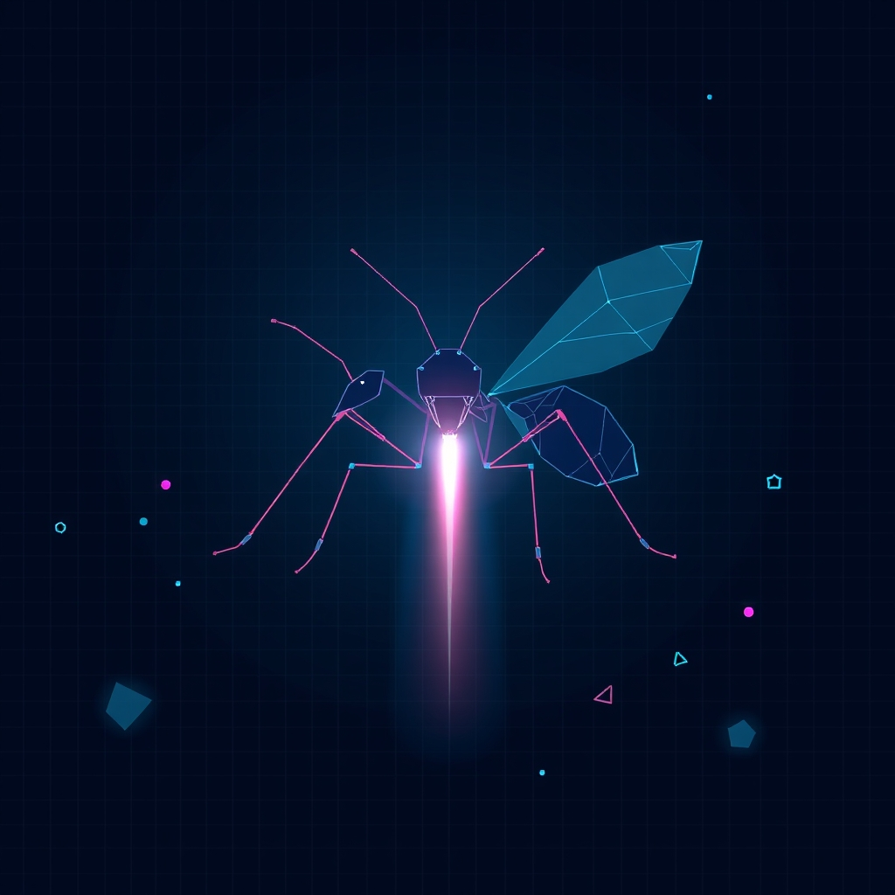

[Home](../index.md) > [Software](./index.md)  
# [⚙️🐜🔄 Haskell Ant Sim](https://github.com/olegalexander/haskell-ant-sim)  
  
  
## 🤖 AI Summary  
  
* 🐜 Simulate agent-based ant foraging behavior within the Haskell functional programming language.  
* 🧠 Implement neural network ant brains to control autonomous agent decision making.  
* 🧬 Use genetic algorithms to train these neural networks for efficient food gathering.  
* 👁️ Utilize 1D ant vision systems inspired by the geometrical concepts in the book Flatland.  
* 🏗️ Provide interactive environment manipulation including wall drawing and food placement.  
* 🎮 Enable manual control of a player ant to test simulation physics and vision.  
* 📊 Include real time visualizations of neural network layers and input/output vectors.  
* 🛠️ Manage global simulation parameters and training toggles through a centralized constants file.  
* 📉 Acknowledge potential software instability while exploring Haskell's suitability for game development.  
  
## 🤔 Evaluation  
  
* ⚖️ While this project uses genetic algorithms for training, many biological simulations prefer Ant Colony Optimization (ACO) algorithms, which focus more on collective pheromone intelligence than individual neural networks, according to Ant Colony Optimization by Marco Dorigo and Thomas Stützle (MIT Press).  
* ⚖️ The use of 1D vision is a creative abstraction, but more advanced simulations often use steering behaviors and sensory fields as defined in Steering Behaviors For Autonomous Characters by Craig Reynolds (Sony Computer Entertainment America).  
* 🔍 Explore the efficiency of purely functional state management in real time simulations to understand performance bottlenecks in Haskell.  
  
## ❓ Frequently Asked Questions (FAQ)  
  
### 🐜 Q: How does the ant vision system work in this simulation?  
🐿️ A: The simulation uses a 1D vision model where ants perceive their environment through ray casting, creating a flattened visual strip similar to the perspective described in the novella Flatland.  
  
### 🧬 Q: How are the ant brains developed and improved over time?  
🥯 A: Individual ant behaviors are controlled by neural networks which undergo evolution via a genetic algorithm to optimize foraging success across generations.  
  
### 🛠️ Q: What tools are required to build and run the simulation?  
⚙️ A: Users must have the Haskell Stack build tool installed to compile the source code and manage dependencies like the Gloss graphics library.  
  
### 🗺️ Q: Can users interact with the simulation environment in real time?  
🖱️ A: Yes, the program allows users to draw walls, place food sources, and manually navigate a lead ant using keyboard and mouse inputs.  
  
## 📚 Book Recommendations  
  
### ↔️ Similar  
  
* 📗 Ant Colony Optimization by Marco Dorigo and Thomas Stützle explores the computational power of simulated ant behavior for solving complex problems.  
* 📘 Multi-Agent Systems by Gerhard Weiss provides a comprehensive introduction to the theory and practice of designing autonomous software agents.  
  
### 🆚 Contrasting  
  
* 📙 Learn You a Haskell for Great Good! by Miran Lipovača offers a beginner friendly approach to Haskell that focuses on pure functional concepts rather than game simulation.  
* 📕 Programming Game AI by Example by Mat Buckland focuses on traditional imperative C++ techniques for game intelligence which contrast with the functional approach.  
  
### 🎨 Creatively Related  
  
* 📒 Flatland A Romance of Many Dimensions by Edwin Abbott Abbott serves as the primary inspiration for the limited dimensional vision used by the ants.  
* 📓 [♾️📐🎶🥨 Gödel, Escher, Bach: An Eternal Golden Braid](../books/godel-escher-bach.md) An Eternal Golden Braid by Douglas Hofstadter examines how complex intelligence emerges from simple recursive systems like ant colonies.  
  
## 🦋 Bluesky    
<blockquote class="bluesky-embed" data-bluesky-uri="at://did:plc:i4yli6h7x2uoj7acxunww2fc/app.bsky.feed.post/3mihgmoypjx24" data-bluesky-cid="bafyreie47a2ixjaazxxzvoshk6aoibal2txf52pngyus5hcid3mbwfvbue">
⚙️🐜🔄 Haskell Ant Sim  
  
#AI Q: 🐜 Could simple rules create true intelligence?  
  
🐜 Agent Simulation | 🧠 Neural Networks | 🧬 Genetic Algorithms | 📚 Computational Biology  
https://bagrounds.org/software/haskell-ant-sim
&mdash; <a href="https://bsky.app/profile/did:plc:i4yli6h7x2uoj7acxunww2fc?ref_src=embed">Bryan Grounds (@bagrounds.bsky.social)</a> <a href="https://bsky.app/profile/did:plc:i4yli6h7x2uoj7acxunww2fc/post/3mihgmoypjx24?ref_src=embed">2026-04-01T19:32:34.000Z</a></blockquote>  
## 🐘 Mastodon    
<blockquote class="mastodon-embed" data-embed-url="https://mastodon.social/@bagrounds/116331115592688491/embed" style="background: #282c37; border-radius: 8px; border: 1px solid #393f4f; margin: 0; max-width: 540px; min-width: 270px; overflow: hidden; padding: 0;"> <a href="https://mastodon.social/@bagrounds/116331115592688491" target="_blank" style="align-items: center; color: #d9e1e8; display: flex; flex-direction: column; font-family: system-ui, -apple-system, BlinkMacSystemFont, 'Segoe UI', Oxygen, Ubuntu, Cantarell, 'Fira Sans', 'Droid Sans', 'Helvetica Neue', Roboto, sans-serif; font-size: 14px; justify-content: center; letter-spacing: 0.25px; line-height: 20px; padding: 24px; text-decoration: none;"> <svg xmlns="http://www.w3.org/2000/svg" xmlns:xlink="http://www.w3.org/1999/xlink" width="32" height="32" viewBox="0 0 79 75"><path d="M63 45.3v-20c0-4.1-1-7.3-3.2-9.7-2.1-2.4-5-3.7-8.5-3.7-4.1 0-7.2 1.6-9.3 4.7l-2 3.3-2-3.3c-2-3.1-5.1-4.7-9.2-4.7-3.5 0-6.4 1.3-8.6 3.7-2.1 2.4-3.1 5.6-3.1 9.7v20h8V25.9c0-4.1 1.7-6.2 5.2-6.2 3.8 0 5.8 2.5 5.8 7.4V37.7H44V27.1c0-4.9 1.9-7.4 5.8-7.4 3.5 0 5.2 2.1 5.2 6.2V45.3h8ZM74.7 16.6c.6 6 .1 15.7.1 17.3 0 .5-.1 4.8-.1 5.3-.7 11.5-8 16-15.6 17.5-.1 0-.2 0-.3 0-4.9 1-10 1.2-14.9 1.4-1.2 0-2.4 0-3.6 0-4.8 0-9.7-.6-14.4-1.7-.1 0-.1 0-.1 0s-.1 0-.1 0 0 .1 0 .1 0 0 0 0c.1 1.6.4 3.1 1 4.5.6 1.7 2.9 5.7 11.4 5.7 5 0 9.9-.6 14.8-1.7 0 0 0 0 0 0 .1 0 .1 0 .1 0 0 .1 0 .1 0 .1.1 0 .1 0 .1.1v5.6s0 .1-.1.1c0 0 0 0 0 .1-1.6 1.1-3.7 1.7-5.6 2.3-.8.3-1.6.5-2.4.7-7.5 1.7-15.4 1.3-22.7-1.2-6.8-2.4-13.8-8.2-15.5-15.2-.9-3.8-1.6-7.6-1.9-11.5-.6-5.8-.6-11.7-.8-17.5C3.9 24.5 4 20 4.9 16 6.7 7.9 14.1 2.2 22.3 1c1.4-.2 4.1-1 16.5-1h.1C51.4 0 56.7.8 58.1 1c8.4 1.2 15.5 7.5 16.6 15.6Z" fill="currentColor"/></svg> 
Post by @bagrounds@mastodon.social
 
View on Mastodon
 </a> </blockquote>   
