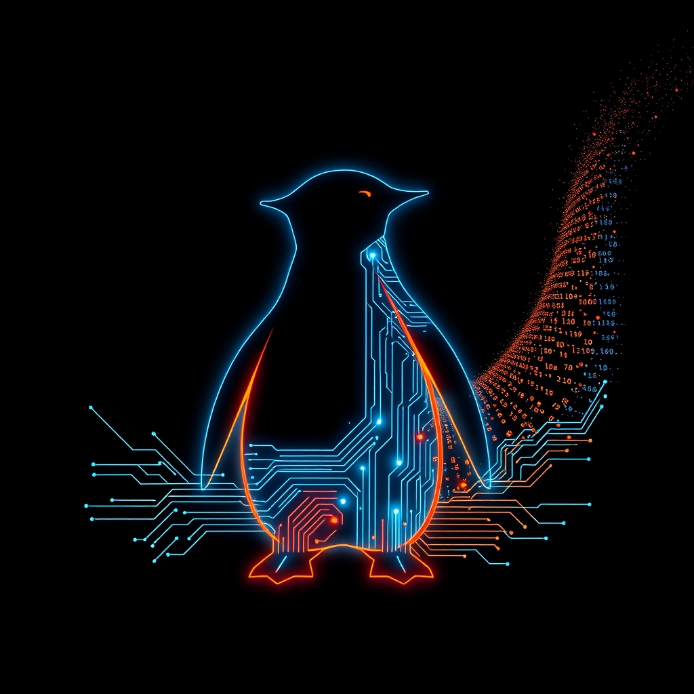

[Home](../index.md) > [Software](./index.md)  
# 🐧💻🚀 Linux  
  
  
## 🤖 AI Summary  
### 🔨 Tool Report: Linux 🐧  
  
👉 **What Is It?** 🤔 Linux 🚀 is a family of open-source Unix-like operating systems 💻 based on the Linux kernel. It's a foundational piece of software ⚙️, belonging to the broader class of operating systems that manage computer hardware and software resources. The name "Linux" typically refers to the kernel itself, but is often used to describe complete operating systems built around this kernel, which are more accurately called Linux distributions. It's not an acronym! 🎉  
  
☁️ **A High Level, Conceptual Overview**  
  
* 🍼 **For A Child:** Imagine your computer is like a toy robot 🤖. It has different parts like a brain (CPU), memory (like short-term storage), and arms and legs (hardware). Linux is like the special set of instructions 📜 that tells all these parts how to work together so you can play games 🎮, watch videos 🎬, and do other fun things! It's like the boss 👑 inside the robot!  
* 🏁 **For A Beginner:** Linux is an operating system, just like Windows or macOS 🍎. It's the software that lets you interact with your computer's hardware. The cool thing about Linux is that it's open source, meaning its code is freely available for anyone to use, modify, and distribute. This has led to many different versions of Linux, called distributions (or "distros"), like Ubuntu, Fedora, and Debian, each with its own look and feel and set of pre-installed software. Think of it like different flavors 🍦 of the same core operating system.  
* 🧙‍♂️ **For A World Expert:** Linux, at its core, is a monolithic, modular kernel adhering to the POSIX standard. Its design emphasizes process management, memory management (including virtual memory and sophisticated caching mechanisms), device driver interaction through a unified file system metaphor (/dev), and robust networking capabilities via the TCP/IP stack and various network protocols. The open-source nature fosters a vibrant ecosystem of kernel developers, contributing to rapid innovation and adaptation to diverse hardware architectures (from embedded systems ⚙️ to supercomputers 🚀). The flexibility and configurability of the kernel, coupled with user-space utilities and the X Window System/Wayland compositors, provide a highly customizable computing environment suitable for a wide range of workloads, including server infrastructure 🏢, scientific computing 🧪, and desktop environments 🖥️.  
  
🌟 **High-Level Qualities**  
  
* ✅ Open Source: Freely available and modifiable source code. 🔓  
* 🛡️ Security-Focused: Strong emphasis on security through user permissions and a modular design. 💪  
* ⚙️ Highly Customizable: Can be tailored to specific needs and hardware. 🛠️  
* 🌐 Large Community Support: Extensive online resources and active user base. 🤗  
* 💸 Often Free: Many distributions are available without cost. 💰  
* 🚀 Performance: Generally known for efficient resource utilization. 💨  
* Versatile: Runs on a wide range of devices. 📱💻  
  
🚀 **Notable Capabilities**  
  
* 💻 Multi-tasking: Running multiple programs simultaneously. 🎬🎧  
* 👤 Multi-user: Allowing multiple users to log in and work independently. 👨‍👩‍👧‍👦  
* 🌐 Networking: Robust support for various network protocols. 📡  
* 🔒 Strong Security: Granular control over file permissions and user access. 🔑  
* 🛠️ Command-Line Interface (CLI): Powerful text-based interface for system control. ⌨️  
* GUI Options: Supports various graphical user interfaces (e.g., GNOME, KDE). 🖼️  
* 💾 File System Flexibility: Supports numerous file systems (e.g., ext4, XFS). 📂  
  
📊 **Typical Performance Characteristics**  
  
* Boot Time: Can range from a few seconds to over a minute depending on the distribution and hardware. ⏱️  
* Memory Usage: Base memory footprint varies significantly between distributions, from a few hundred MB for minimal server installs to over 1 GB for desktop environments with many pre-installed applications. 💾  
* CPU Utilization: Generally efficient, with low overhead when idle. CPU usage spikes during intensive tasks like compiling code or running demanding applications. 📈  
* File System Performance: Performance depends on the chosen file system and storage device. Ext4 is a common choice offering good balance. ⚡  
* Network Throughput: Achieves network speeds comparable to other operating systems, limited primarily by network hardware. 🌐  
  
💡 **Examples Of Prominent Products, Applications, Or Services That Use It Or Hypothetical, Well Suited Use Cases**  
  
* Servers: Powers the vast majority of web servers worldwide (e.g., Apache, Nginx). 🏢  
* Android: The most popular mobile operating system is built on a modified Linux kernel. 📱  
* Embedded Systems: Used in routers, smart TVs, and various IoT devices. 📺  
* Scientific Computing: Popular in research and high-performance computing clusters. 🧪  
* Desktop Operating Systems: Distributions like Ubuntu, Fedora, and Mint are used by individuals. 🖥️  
* Hypothetical Use Case: A self-driving car 🚗 using a real-time Linux distribution for its control systems due to its reliability and customizability.  
  
📚 **A List Of Relevant Theoretical Concepts Or Disciplines**  
  
* Operating System Principles ⚙️  
* Kernel Design 🧠  
* Computer Architecture 💻  
* System Programming 👨‍💻  
* Network Protocols (TCP/IP) 🌐  
* File Systems 📂  
* Security Principles 🛡️  
* Open Source Software Development 🔓  
  
🌲 **Topics:**  
  
* 👶 Parent: Operating Systems 💻  
* 👩‍👧‍👦 Children:  
    * Linux Distributions (Ubuntu, Fedora, Debian) 📦  
    * Linux Kernel 🧠  
    * Command-Line Interface (CLI) ⌨️  
    * Graphical User Interfaces (GUIs) on Linux (GNOME, KDE) 🖼️  
    * Package Management (APT, YUM, DNF) 📦  
    * Linux Security (Permissions, Firewalls) 🔥  
* 🧙‍♂️ Advanced topics:  
    * Kernel Modules 🧩  
    * System Calls 📞  
    * Memory Management Internals 💾  
    * Process Scheduling Algorithms ⏳  
    * Device Drivers ⚙️  
    * Containerization (Docker, Kubernetes) 🐳🚢  
  
🔬 **A Technical Deep Dive**  
  
The Linux kernel is a monolithic kernel with modularity. This means that while the core functionalities reside in the kernel space, additional features (like device drivers and file system support) can be loaded and unloaded as modules without requiring a system reboot. The kernel manages the system's hardware resources through a set of system calls that provide an interface for user-space programs to interact with the kernel. Process management involves scheduling processes for execution on the CPU using various algorithms (e.g., CFS - Completely Fair Scheduler). Memory management includes virtual memory, paging, and swapping to efficiently utilize RAM. The virtual file system (VFS) provides a consistent interface for different file systems. Device drivers enable the kernel to communicate with hardware devices. Security is enforced through user IDs, group IDs, and file permissions. The kernel source code is written primarily in C, with some architecture-specific parts in assembly language. 💻🧠💾🔒  
  
🧩 **The Problem(s) It Solves:**  
  
* Abstract: Provides a stable and consistent software layer that abstracts the complexities of computer hardware, allowing applications to run without needing to know the specifics of the underlying hardware. ⚙️➡️💻  
* Specific Common Examples:  
    * Running web servers reliably and securely. 🌐🛡️  
    * Providing a customizable desktop environment for users. 🖥️🛠️  
    * Powering mobile devices with a flexible and adaptable platform. 📱⚙️  
* A Surprising Example: Running on the International Space Station 🚀, providing a robust and adaptable computing environment for scientific experiments. 🌌  
  
👍 **How To Recognize When It's Well Suited To A Problem**  
  
* Needs a stable and reliable operating system. 🐕  
* Requires customization and control over system behavior. 🛠️  
* Demands strong security features. 🛡️  
* Benefits from a large and active community for support and updates. 🤗  
* Cost is a significant factor (many distributions are free). 💰  
* Targeting server environments or embedded systems. 🏢⚙️  
* Development or experimentation requiring access to the operating system's internals. 👨‍💻🔬  
  
👎 **How To Recognize When It's Not Well Suited To A Problem (And What Alternatives To Consider)**  
  
* Requires specific proprietary software with no Linux support (consider Windows or macOS). 🍎  
* User is unfamiliar with command-line interfaces and prefers a purely graphical environment with limited customization (consider macOS or ChromeOS). 🍎🖱️  
* Hardware compatibility is limited or drivers are unavailable for specific devices (check compatibility lists or consider other OS). ⚙️❓  
* Real-time applications with strict latency requirements might need specialized RTOS (Real-Time Operating Systems). ⏱️  
* Gaming with a strong reliance on Windows-specific DirectX features (consider Windows or SteamOS). 🎮  
  
🩺 **How To Recognize When It's Not Being Used Optimally (And How To Improve)**  
  
* High CPU or memory usage without clear cause (use tools like `top`, `htop`, `vmstat` to investigate and optimize processes or upgrade resources). 📈📉  
* Slow boot times or application loading (analyze startup services, optimize disk I/O, consider faster storage). ⏱️🐌➡️🚀  
* Security vulnerabilities due to outdated software (regularly update the system using package managers). 🛡️➡️✅  
* Inefficient use of command-line tools for repetitive tasks (learn scripting with Bash or Python). ⌨️➡️🐍  
* Unnecessary services running in the background (disable or uninstall unused services). ⚙️🧹  
  
🔄 **Comparisons To Similar Alternatives (Especially If Better In Some Way)**  
  
* Windows: More user-friendly for general desktop use and has broader software compatibility for some applications, especially games. However, Linux offers greater customization, stronger command-line tools, and is generally more secure and resource-efficient for server workloads. 🍎 vs. 🐧🏆  
* macOS: Known for its polished user interface and tight integration with Apple hardware. Linux offers greater hardware flexibility and open-source freedom. 🍎 vs. 🐧  
* BSD (e.g., FreeBSD, OpenBSD): Similar Unix-like operating systems with a different licensing model and often a stronger focus on stability and security in the base system. Linux has a larger community and wider hardware support. 🐧 vs. 😈🛡️  
* ChromeOS: Lightweight OS primarily focused on web browsing and cloud applications. Linux offers broader application support and more offline capabilities. ☁️ vs. 💻🌍  
  
🤯 **A Surprising Perspective**  
  
Despite its technical nature, Linux has fostered an incredibly collaborative and community-driven ecosystem. The open-source model has allowed countless individuals and organizations to contribute, leading to rapid innovation and adaptation across a vast range of applications, from powering your phone to supercomputers. It's a testament to the power of shared knowledge and collaborative development. 🤝🌍🚀  
  
📜 **Some Notes On Its History, How It Came To Be, And What Problems It Was Designed To Solve**  
  
Linux was created in 1991 by Linus Torvalds, a Finnish student, as a hobby project. He was inspired by Minix, a small Unix-like system. The initial goal was to create a free and open-source alternative to proprietary operating systems like Unix. The release of the kernel under the GNU General Public License in 1992 was pivotal, allowing a global community of developers to contribute and build upon it. This collaborative effort led to the diverse range of Linux distributions we see today, addressing needs from server infrastructure to desktop computing and embedded systems. The problems it aimed to solve were the limitations and cost of proprietary operating systems, offering users more freedom, control, and access to the underlying technology. 📜➡️🔓🌍  
  
📝 **A Dictionary-Like Example Using The Term In Natural Language**  
  
"My old laptop was running slowly, so I decided to install **Linux** to give it a new lease on life." 💻➡️🐧🚀  
  
😂 **A Joke:**  
  
Why did the SysAdmin break up with the Linux server? Because it kept saying, "It's not a bug, it's a feature!" 😂🐧  
  
📖 **Book Recommendations**  
  
* Topical: "The Linux Command Line: A Complete Introduction" by William Shotts Jr. ⌨️  
* Tangentially Related: "Open Sources 2.0: The Continuing Evolution" by Chris Dibona et al. 🔓  
* Topically Opposed: "Microsoft Windows Internals" by Mark Russinovich, David A. Solomon, and Alex Ionescu. 🍎  
* More General: "Operating System Concepts" by Abraham Silberschatz, Peter Baer Galvin, and Greg Gagne. ⚙️🧠  
* More Specific: "Linux Kernel Development" by Robert Love. 🧠💻  
* Fictional: "[Snow Crash](../books/snow-crash.md)" by Neal Stephenson (explores concepts related to operating systems and virtual worlds). 👓🌍  
* Rigorous: "Modern Operating Systems" by Andrew S. Tanenbaum and Herbert Bos. 🧠💻📚  
* Accessible: "Linux for Dummies" by Emmett Dulaney and Rickford Grant. 🧑‍🏫🐧  
  
📺 **Links To Relevant YouTube Channels Or Videos**  
  
* [The Linux Foundation](https://www.youtube.com/user/TheLinuxFoundation) 🌐🐧  
* [DistroTube](https://www.youtube.com/c/DistroTube) 📦📺  
* [Learn Linux TV](https://www.youtube.com/c/LearnLinuxTV) 🧑‍🏫📺  
* [NetworkChuck](https://www.youtube.com/c/NetworkChuck) (often features Linux in server and networking contexts) 🌐📺  
* [Techlore](https://www.youtube.com/c/Techlore) (focuses on privacy and security, often using Linux) 🔒📺