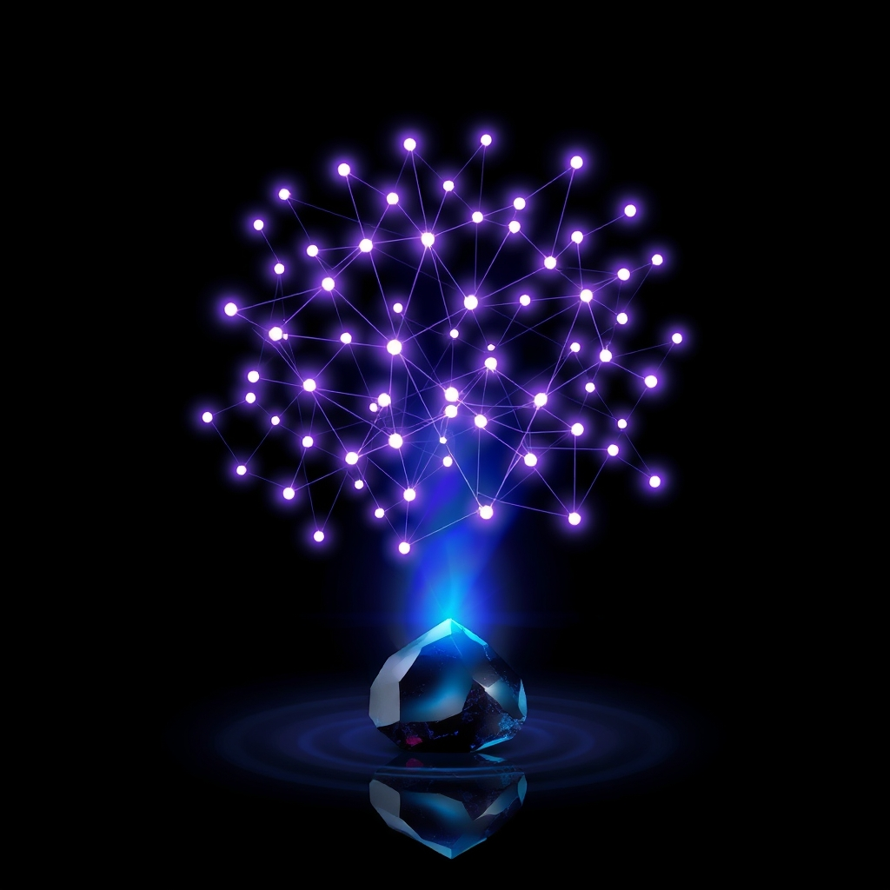

[Home](../index.md) > [Software](./index.md)  
# 💾✍️🌋⚫️ Obsidian  
  
  
## 🤖 AI Summary  
### 💾 Software Report: Obsidian 📝✨  
  
### High-Level Overview 🧠  
  
* **For a Child 🧒:** Obsidian is like a digital notebook where you can connect your ideas with lines, like a spider web! 🕸️ It helps you remember and organize everything you learn.  
* **For a Beginner 🧑‍💻:** Obsidian is a powerful note-taking and knowledge management app that uses Markdown files. It lets you create interconnected notes, forming a personal knowledge base. Think of it as a digital garden for your thoughts. 🪴  
* **For a World Expert 🧙‍♂️:** Obsidian is a locally-first, Markdown-based knowledge graph application, facilitating non-linear note-taking and knowledge synthesis. Its core strength lies in its graph view, enabling emergent connections and insights. It prioritizes data control and extensibility through plugins, making it a robust personal knowledge management system. 🚀  
  
### Performance Characteristics and Capabilities 📊  
  
* **Locally Stored Data:** Obsidian operates on local Markdown files, ensuring data privacy and fast access. 🔒  
* **Graph View:** Visualizes note connections, enabling discovery of relationships. 📈  
* **Markdown Support:** Utilizes plain text Markdown, ensuring future-proof notes. ✍️  
* **Plugin Ecosystem:** Extensible through community and core plugins. 🔌  
* **Performance:**  
    * **Latency:** Near-instantaneous note loading and editing due to local storage. ⚡  
    * **Scalability:** Handles tens of thousands of notes efficiently. 📚  
    * **Reliability:** Depends on local file system reliability, but backups are easily managed. 💾  
    * **Search:** Full-text search across all notes, with rapid results. 🔍  
  
### Prominent Use Cases 💼  
  
* **Personal Knowledge Management (PKM):** Building a second brain. 🧠  
* **Research and Academic Note-Taking:** Connecting research papers and ideas. 🎓  
* **Creative Writing and Story Development:** Organizing plot lines and character arcs. ✍️  
* **Software Documentation:** Creating interconnected documentation. 💻  
* **Project Management:** Linking tasks and project notes. 📋  
  
### Relevant Theoretical Concepts or Disciplines 📚  
  
* **Knowledge Management:** Organizing and utilizing information. 🧠  
* **Network Theory:** Understanding interconnected systems. 🕸️  
* **Information Architecture:** Structuring information for usability. 🏗️  
* **Markdown Syntax:** Plain text formatting. 📝  
* **Zettelkasten Method:** Interconnected note-taking. 🗂️  
  
### Technical Deep Dive 🛠️  
  
Obsidian is built on Electron, allowing cross-platform compatibility. It uses Chromium for rendering and Node.js for backend functionalities. 🖥️ Key features include:  
  
* **Markdown Editor:** Supports standard Markdown syntax and extensions. 📝  
* **Graph View:** Visualizes backlinks and links between notes. 📈  
* **Backlinks and Internal Links:** Creates bidirectional links between notes. 🔗  
* **Plugins:** Extends functionality with community-developed plugins. 🔌  
* **Themes:** Customizes the user interface. 🎨  
* **Sync (Obsidian Sync):** Paid service to sync vaults across devices. 🔄  
* **Obsidian Publish:** Paid service to publish notes online. 🌐  
  
### When It's Well Suited 👍  
  
* **Need for a personal, interconnected knowledge base.** 🧠  
* **Preference for local data storage and control.** 🔒  
* **Desire for a customizable and extensible note-taking tool.** 🔌  
* **Frequent use of Markdown for note-taking.** 📝  
* **Need to visualize relationships between notes.** 📈  
  
### When It's Not Well Suited 👎  
  
* **Real-time collaborative editing is required.** (Consider Google Docs or Notion). 🤝  
* **Primary need is for a simple, linear note-taking app.** (Consider Apple Notes or Microsoft OneNote). 📝  
* **Lack of comfort with Markdown syntax.** ✍️  
* **Need for a tightly integrated project management tool.** (Consider Jira or Asana). 📋  
* **Need for heavy rich text editing and formatting.** 🖌️  
  
### Recognizing and Improving Suboptimal Usage 🛠️  
  
* **Over-reliance on plugins:** Can lead to performance issues and instability. 🐛  
    * **Improvement:** Regularly review and remove unused plugins. 🧹  
* **Unstructured note-taking:** Can lead to a disorganized vault. 😵‍💫  
    * **Improvement:** Implement a consistent note-taking method (e.g., Zettelkasten). 🗂️  
* **Neglecting the graph view:** Misses out on discovering connections. 📈  
    * **Improvement:** Regularly explore the graph view to identify patterns. 🔍  
* **Lack of regular backups:** Risk of data loss. 🚨  
    * **Improvement:** Implement automated backups or use Obsidian Sync. 🔄  
  
### Comparisons to Similar Software 🆚  
  
* **Notion:** Cloud-based, collaborative, rich-text focused. ☁️  
* **Roam Research:** Cloud-based, bi-directional linking, outliner-focused. 🌐  
* **Logseq:** Open-source, local-first, outliner and graph-based. 🌳  
* **Zettlr:** Open-source, Markdown editor, focused on academic writing. 🧑‍🎓  
* **Joplin:** Open-source, cross-platform, Markdown with sync options. 🔄  
  
### Surprising Perspective 🤯  
  
Obsidian can be seen as a personal, evolving "Wikipedia" of your own thoughts and knowledge, constantly being refined and connected. 📚💡  
  
### Closest Physical Analogy 📦  
  
A physical card catalog in a library, where cards are linked through cross-references and subject categories, forming a vast network of information. 🗂️📚  
  
### History 📜  
  
Obsidian was developed by Erica Xu and Shida Li, released in 2020. It was designed to address the limitations of existing note-taking tools by prioritizing local data storage, extensibility, and interconnected note-taking. It aimed to create a robust personal knowledge management system that users could control. 🚀  
  
### Book Recommendations 📚  
  
* "How to Take Smart Notes" by Sönke Ahrens. 📝  
* "Building a Second Brain" by Tiago Forte. 🧠  
  
### YouTube Channels/Videos 📺  
  
* Linking Your Thinking: https://www.youtube.com/@linkingyourthinking 🧠  
* Nicole van der Hoeven: https://www.youtube.com/@Nicolevdh 💻  
  
### Recommended Guides, Resources, and Learning Paths 🗺️  
  
* Obsidian Forum: [https://forum.obsidian.md/](https://forum.obsidian.md/) 💬  
* Obsidian Community Plugins: [https://obsidian.md/plugins](https://obsidian.md/plugins) 🔌  
  
### Official and Supportive Documentation 📄  
  
* Obsidian Help: [https://help.obsidian.md/](https://help.obsidian.md/) 📖  
* Obsidian Official Website: [https://obsidian.md/](https://obsidian.md/) 🌐  
  
## 🦋 Bluesky    
<blockquote class="bluesky-embed" data-bluesky-uri="at://did:plc:i4yli6h7x2uoj7acxunww2fc/app.bsky.feed.post/3mjfzfyah7y2d" data-bluesky-cid="bafyreibc4v4fa73yn7o6splmmygn2quzlaonlgig62yfc3uqmqerpp4yy4">
💾✍️🌋⚫️ Obsidian  
  
#AI Q: 🧠 Is your digital note system a second brain or just a graveyard for forgotten ideas?  
  
🧠 Knowledge Management | 🕸️ Network Theory | 📝 Markdown | 🚀 Personal Knowledge Base  
https://bagrounds.org/software/obsidian
&mdash; <a href="https://bsky.app/profile/did:plc:i4yli6h7x2uoj7acxunww2fc?ref_src=embed">Bryan Grounds (@bagrounds.bsky.social)</a> <a href="https://bsky.app/profile/did:plc:i4yli6h7x2uoj7acxunww2fc/post/3mjfzfyah7y2d?ref_src=embed">2026-04-13T23:28:42.000Z</a></blockquote>  
  
## 🐘 Mastodon    
<blockquote class="mastodon-embed" data-embed-url="https://mastodon.social/@bagrounds/116399991403613809/embed" style="background: #282c37; border-radius: 8px; border: 1px solid #393f4f; margin: 0; max-width: 540px; min-width: 270px; overflow: hidden; padding: 0;"> <a href="https://mastodon.social/@bagrounds/116399991403613809" target="_blank" style="align-items: center; color: #d9e1e8; display: flex; flex-direction: column; font-family: system-ui, -apple-system, BlinkMacSystemFont, 'Segoe UI', Oxygen, Ubuntu, Cantarell, 'Fira Sans', 'Droid Sans', 'Helvetica Neue', Roboto, sans-serif; font-size: 14px; justify-content: center; letter-spacing: 0.25px; line-height: 20px; padding: 24px; text-decoration: none;"> <svg xmlns="http://www.w3.org/2000/svg" xmlns:xlink="http://www.w3.org/1999/xlink" width="32" height="32" viewBox="0 0 79 75"><path d="M63 45.3v-20c0-4.1-1-7.3-3.2-9.7-2.1-2.4-5-3.7-8.5-3.7-4.1 0-7.2 1.6-9.3 4.7l-2 3.3-2-3.3c-2-3.1-5.1-4.7-9.2-4.7-3.5 0-6.4 1.3-8.6 3.7-2.1 2.4-3.1 5.6-3.1 9.7v20h8V25.9c0-4.1 1.7-6.2 5.2-6.2 3.8 0 5.8 2.5 5.8 7.4V37.7H44V27.1c0-4.9 1.9-7.4 5.8-7.4 3.5 0 5.2 2.1 5.2 6.2V45.3h8ZM74.7 16.6c.6 6 .1 15.7.1 17.3 0 .5-.1 4.8-.1 5.3-.7 11.5-8 16-15.6 17.5-.1 0-.2 0-.3 0-4.9 1-10 1.2-14.9 1.4-1.2 0-2.4 0-3.6 0-4.8 0-9.7-.6-14.4-1.7-.1 0-.1 0-.1 0s-.1 0-.1 0 0 .1 0 .1 0 0 0 0c.1 1.6.4 3.1 1 4.5.6 1.7 2.9 5.7 11.4 5.7 5 0 9.9-.6 14.8-1.7 0 0 0 0 0 0 .1 0 .1 0 .1 0 0 .1 0 .1 0 .1.1 0 .1 0 .1.1v5.6s0 .1-.1.1c0 0 0 0 0 .1-1.6 1.1-3.7 1.7-5.6 2.3-.8.3-1.6.5-2.4.7-7.5 1.7-15.4 1.3-22.7-1.2-6.8-2.4-13.8-8.2-15.5-15.2-.9-3.8-1.6-7.6-1.9-11.5-.6-5.8-.6-11.7-.8-17.5C3.9 24.5 4 20 4.9 16 6.7 7.9 14.1 2.2 22.3 1c1.4-.2 4.1-1 16.5-1h.1C51.4 0 56.7.8 58.1 1c8.4 1.2 15.5 7.5 16.6 15.6Z" fill="currentColor"/></svg> 
Post by @bagrounds@mastodon.social
 
View on Mastodon
 </a> </blockquote> 