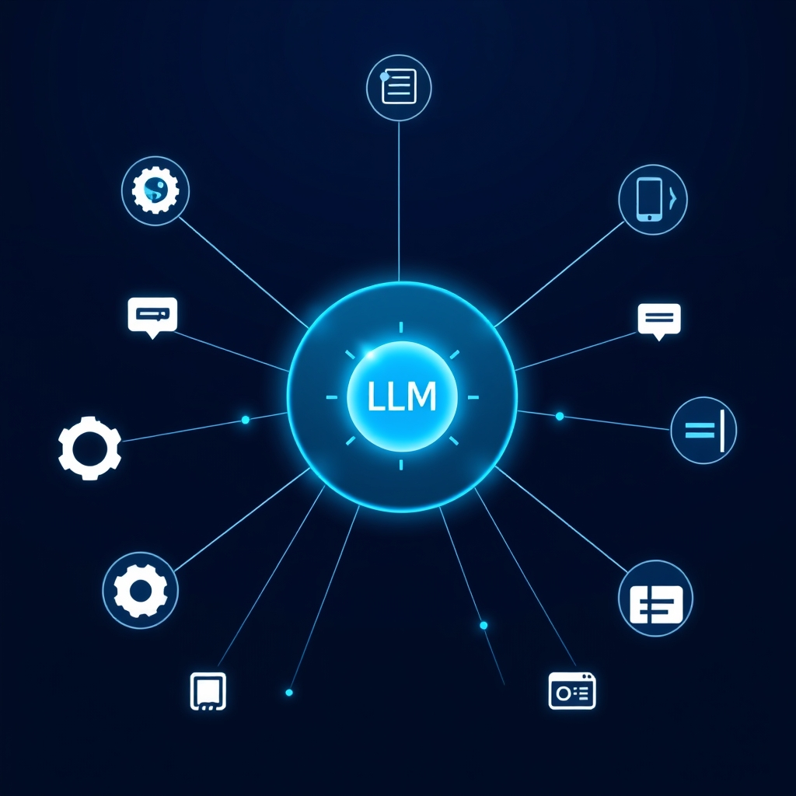

[Home](../index.md) > [Software](./index.md)  
# 🌐🔓💻 Open WebUI  
  
  
## 🤖 AI Summary  
### 💾 Software Report: Open WebUI 🌐  
  
Open WebUI is a user-friendly, self-hostable web interface designed to interact with Large Language Models (LLMs) like those from OpenAI, Google, or locally run models via APIs like [Ollama](./ollama.md). It provides a clean, chat-like interface for managing conversations and model interactions.  
  
### High-Level Conceptual Overview 🧠  
  
* **For a Child (Level 1):** Imagine a website where you can talk to a smart computer friend. You type messages, and it responds! Open WebUI is like that website, making it easy to chat with those smart computers. 🧒💬💻  
* **For a Beginner (Level 2):** Open WebUI is a web-based chat interface that lets you interact with AI language models. It simplifies the process of sending prompts and receiving responses, allowing you to manage conversations and try out different models in one place. It's like a central hub for your AI chats. 🧑‍💻🤖🤝  
* **For a World Expert (Level 3):** Open WebUI is a self-deployable, model-agnostic front-end that abstracts the complexities of LLM API interactions. It facilitates seamless user engagement with diverse LLM backends via a consistent, configurable interface, enabling advanced prompt engineering, context management, and multi-model experimentation. It's an orchestration layer for LLM interaction. 👨‍🔬📊🚀  
  
### Typical Performance Characteristics and Capabilities 📊  
  
* **Latency:** Dependent on the underlying LLM's API. For local models with sufficient resources, expect 100ms to 2 seconds latency for response generation. Remote API latency is reliant on the cloud provider. ⚡️⏱️  
* **Scalability:** Scales horizontally with the underlying LLM infrastructure. Open WebUI itself has minimal resource overhead, and its scalability is primarily limited by the LLM backend's capacity. 📈☁️  
* **Reliability:** High reliability when deployed on stable infrastructure. Reliability is dependent on the stability of the backend LLM service. 🛡️✅  
* **Capabilities:**  
    * Multi-model support (OpenAI, Google, Ollama, etc.). 🤝  
    * Conversation history management. 📜  
    * Prompt templating. 📝  
    * User authentication and access control. 🔒  
    * Customizable UI. 🎨  
    * Markdown rendering. ✍️  
    * Code highlighting. 💻  
    * Image generation support (depending on the LLM). 🖼️  
  
### Examples of Prominent Products or Services/Hypothetical Use Cases 💡  
  
* **Hypothetical Use Case:** A research team uses Open WebUI to compare the performance of different LLMs on a set of standardized prompts. 🔬  
* **Hypothetical Use Case:** A small business uses Open WebUI to create a chatbot for customer service, integrating a locally hosted LLM for privacy. 🏢🤖  
* **Hypothetical Use Case:** A student uses Open WebUI to interact with multiple LLMs for academic research and writing assistance. 🧑‍🎓📚  
  
### Relevant Theoretical Concepts or Disciplines 📚  
  
* Natural Language Processing (NLP) 🗣️  
* Large Language Models (LLMs) 🧠  
* API Design and Integration 🔗  
* Web Development (HTML, CSS, JavaScript) 🕸️  
* Containerization (Docker) 🐳  
* User Interface/User Experience (UI/UX) design. 🎨  
  
### Technical Deep Dive 🛠️  
  
Open WebUI is primarily a front-end application written in JavaScript, utilizing a modern web framework (like React or Vue). It interacts with LLM APIs through HTTP requests. It can be deployed using Docker, simplifying the installation and configuration process. Key components:  
  
* **Front-end:** Handles user interaction, prompt submission, and response rendering. 🖥️  
* **Back-end (Optional):** Primarily a proxy to the LLM backend, handling authentication and request routing. ➡️  
* **Configuration:** Allows users to specify LLM API endpoints and authentication details. ⚙️  
* **Data Storage:** Stores conversation history and user preferences (if persistent storage is configured). 💾  
  
### How to Recognize When It's Well Suited to a Problem 👍  
  
* You need a consistent, user-friendly interface for interacting with multiple LLMs. 🤝  
* You want to self-host your LLM interface for privacy or customization. 🏠  
* You need to manage and organize conversation history. 📜  
* You want to experiment with different prompt templates. 📝  
  
### How to Recognize When It's Not Well Suited to a Problem (and What Alternatives to Consider) 👎  
  
* If you need a highly specialized LLM application with complex workflows. Consider building a custom application using LLM SDKs. 🏗️  
* If you only need to interact with a single LLM through its official API. Use the official API directly or a dedicated SDK. 🔗  
* If you need extremely low level control of the LLM, or are developing the LLM itself. Use the LLM frameworks directly like Pytorch or Tensorflow. 🧠  
* If you need real time, high throughput processing of LLM requests. Use a dedicated LLM infrastructure platform. 💨  
  
### How to Recognize When It's Not Being Used Optimally (and How to Improve) 🛠️  
  
* **Suboptimal:** Slow response times due to inefficient LLM configuration.  
    * **Improvement:** Optimize LLM parameters, use a faster LLM, or upgrade hardware. 🚀  
* **Suboptimal:** Cluttered conversation history.  
    * **Improvement:** Use conversation management features, create separate conversations for different topics. 🧹  
* **Suboptimal:** Inconsistent prompt formatting.  
    * **Improvement:** Use prompt templates and consistent formatting. 📝  
  
### Comparisons to Similar Software 🆚  
  
* **OpenAI Playground:** A cloud-based interface for OpenAI models. Less control over deployment, but simpler setup. ☁️  
* **LM Studio:** A desktop application for running local LLMs with a built in UI. More focused on local execution. 💻  
* **Chatbot UI:** Similar open source web-based chat interface. Similar functionality. 🤝  
  
### A Surprising Perspective 🤯  
  
Open WebUI democratizes access to LLMs, enabling anyone to create their own AI chat interface. It turns what was once a complex, technical process into a simple, user-friendly experience. 🧑‍🤝‍🧑  
  
### The Closest Physical Analogy 📦  
  
A universal remote control for multiple televisions, each representing a different LLM. 📺➡️🤖  
  
### Some Notes on Its History, How It Came to Be, and What Problems It Was Designed to Solve 📜  
  
Open WebUI emerged from the growing need for a versatile and self-hostable interface for interacting with various LLMs. It addresses the fragmentation of LLM interfaces and the desire for greater control and privacy. It's a community driven project. 🧑‍🤝‍🧑  
  
### 📚 Book Recommendations  
  
* [🗣️💻 Natural Language Processing with Transformers](../books/natural-language-processing-with-transformers.md) by Tunstall, von Werra, Wolf. 📖  
* [🧠💻🤖 Deep Learning](../books/deep-learning.md) by Ian Goodfellow, Yoshua Bengio, Aaron Courville. 🧠  
  
### Links to Relevant YouTube Channels or Videos 📺  
  
* "Ollama Tutorial" - Search YouTube for up to date tutorials. 💻  
* "LLM Tutorial" - Search YouTube for up to date tutorials. 🤖  
  
### Links to Recommended Guides, Resources, and Learning Paths 🔗  
  
* Open WebUI GitHub Repository: [https://github.com/open-webui/open-webui](https://github.com/open-webui/open-webui) 🐙  
* Ollama GitHub Repository: [https://github.com/ollama/ollama](https://github.com/ollama/ollama) 🐑  
  
### Links to Official and Supportive Documentation 📄  
  
* Open WebUI Documentation (GitHub README): [https://github.com/open-webui/open-webui/blob/main/README.md](https://github.com/open-webui/open-webui/blob/main/README.md) 📝  
