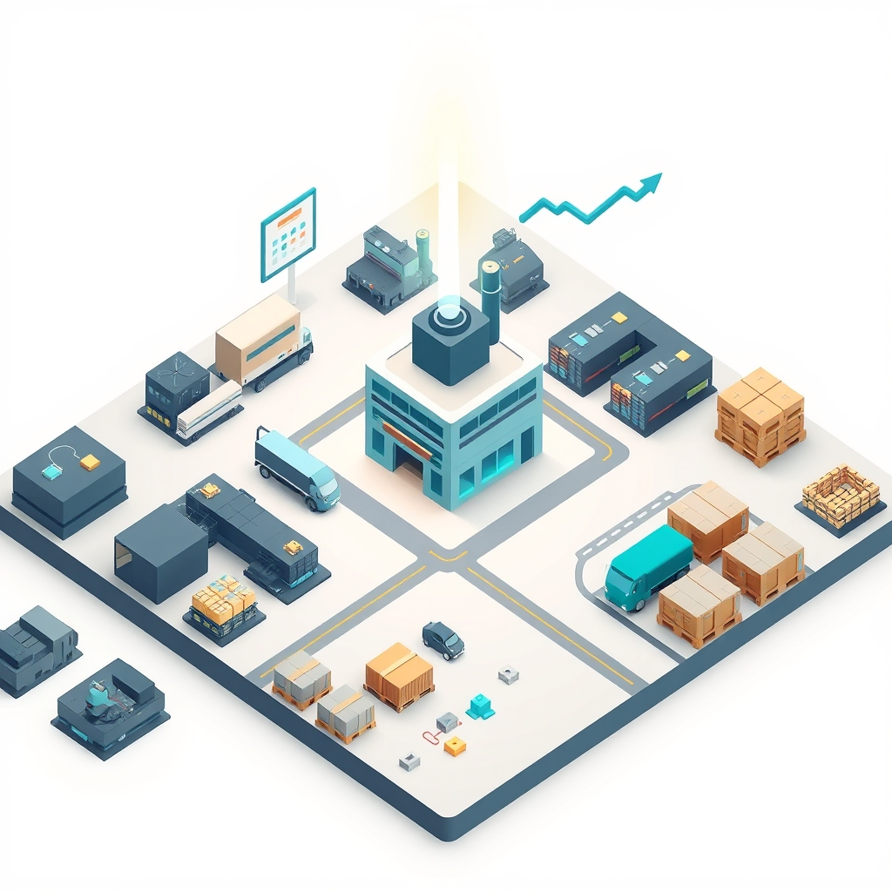

[Home](../index.md) > [Software](./index.md)  
# [📈🏭💰 Sim Companies](https://www.simcompanies.com/ref/4174388)  
  
  
## 🤖 AI Summary  
  
### 👉 What Is It?  
  
* 🏢 Sim Companies is a browser-based, massively multiplayer online (MMO) business simulation game.  
* 📈 It belongs to the tycoon or management simulation genre, specifically focusing on micro- and macro-economic principles.  
* 🌐 It simulates a player-driven global economy where users manage supply chains, production, retail, and research.  
  
### ☁️ A High Level, Conceptual Overview  
  
* 🍼 **For A Child:** Imagine a digital lemonade stand where you have to buy lemons, find someone to make juice, and then find people who want to buy your juice.  
* 🏁 **For A Beginner:** You manage a virtual business by balancing production costs against market prices, deciding when to build new facilities, and trading resources with other real-life players.  
* 🧙‍♂️ **For A World Expert:** It is a dynamic, agent-based economic simulation where aggregate player behavior dictates price elasticity and market equilibrium, requiring rigorous optimization of resource flow through integrated value chains.  
  
### 🌟 High-Level Qualities  
  
* 🔄 **Dynamic:** The market is entirely player-driven; supply and demand fluctuations are based on real-time collective decisions.  
* ⚖️ **Balanced:** The economy is designed to be fair, preventing singular monopolies from ruining the experience for newcomers.  
* 📱 **Accessible:** Optimized for mobile-first play, allowing users to make business decisions in short bursts.  
* 🛡️ **Non-Predatory:** Widely recognized by its community as a non-pay-to-win environment where strategy outperforms cash.  
  
### 🚀 Notable Capabilities  
  
* 🏭 **Supply Chain Management:** Designing and scaling complex production pipelines.  
* 📊 **Financial Analysis:** Monitoring income statements, balance sheets, and market trends.  
* 🤝 **Peer-to-Peer Trading:** Negotiating private contracts with other players to optimize costs.  
* 🚀 **Research & Development:** Investing in patents to unlock higher efficiency and new product tiers.  
  
### 📊 Typical Performance Characteristics  
  
* ⏲️ **Response Time:** Changes in market supply/demand typically manifest in hourly or daily cycles.  
* 👥 **Scale:** Supports thousands of concurrent users in a shared, persistent global market.  
* 🖥️ **Resource Footprint:** Extremely lightweight, as it functions as a progressive web app (PWA) with minimal data overhead.  
  
### 💡 Examples Of Use  
  
* 🏢 **Retail Tycoon:** A player builds high-level shopping malls and focuses entirely on selling high-margin consumer electronics.  
* 🔬 **Researcher:** A company specializes solely in the production of high-value research points to sell to large manufacturing corporations.  
* 🚛 **Logistic Specialist:** A player acts as a middleman, buying raw materials in bulk and distributing them to smaller producers at a markup.  
  
### 📚 Relevant Theoretical Concepts  
  
* 📉 **Supply and Demand:** The core engine of the game's market.  
* ⚙️ **Value-Added Tax/Margins:** Calculating gross vs. net profit.  
* ⛓️ **Vertical Integration:** Bringing different stages of production under one company.  
* 🧠 **Opportunity Cost:** Choosing whether to produce a good or buy it from the market.  
  
### 🌲 Topics  
  
* 👶 **Parent:** Business Simulation Games, MMOs.  
* 👩‍👧‍👦 **Children:** Supply Chain Logistics, Market Trading, Retail Management, Executive Leadership.  
* 🧙‍♂️ **Advanced:** Elasticity of Demand, Market Equilibrium Modeling, Automated Trading Scripts.  
  
### 🔬 A Technical Deep Dive  
  
* 🧪 The game uses a proprietary engine that simulates retail demand based on the total volume of goods available in the market.  
* 🔢 When players sell items, the system aggregates the supply across all companies to determine the sales rate, preventing any one user from instantly crashing the market.  
* 📡 It relies on a persistent database where every transaction (contract or market listing) affects the global state.  
  
### 🧩 The Problem(s) It Solves  
  
* 📦 **Abstract:** Simplifies the complexity of real-world global economics into a playable, fun loop.  
* 📈 **Common:** Teaching players the value of time-to-market and the importance of resource management.  
* 😲 **Surprising:** It helps users understand why just-in-time manufacturing is risky when supply chains are disrupted.  
  
### 👍 How To Recognize When It's Well Suited  
  
* 🧠 You want to learn business logic without the risks of real-world bankruptcy.  
* ⏳ You have limited time but enjoy long-term strategic progression.  
* 📉 You are interested in data-driven decision-making and market analytics.  
  
### 👎 How To Recognize When It's Not Well Suited  
  
* 💥 You want fast-paced, action-oriented gameplay (e.g., combat or shooters).  
* 🏢 You prefer games with heavy narrative-driven cutscenes or roleplay.  
* 🚫 You find accounting or spreadsheet-style management tedious rather than satisfying.  
  
### 🩺 How To Recognize When It's Not Being Used Optimally  
  
* 📉 Your production costs consistently exceed market sale prices.  
* 🧱 You are bottlenecked by raw materials because you aren't using trade contracts.  
* 💤 Your factory capacity is sitting idle due to poor resource planning.  
  
### 🔄 Comparisons  
  
* 🆚 **vs. Factorio:** Factorio is about mechanical automation and physical space; Sim Companies is about financial automation and market timing.  
* 🆚 **vs. Eve Online:** Eve is a complex, high-stakes sandbox with combat; Sim Companies is a dedicated, streamlined business simulation.  
  
### 📜 History  
  
* 📅 Launched in September 2019 by Sim Companies S.R.O.  
* 🏗️ Designed to remove the tedious aspects of real-world management (like taxes or regulations) to focus on the core thrill of entrepreneurship.  
  
### 📝 Dictionary-Like Example  
  
* 🗣️ After optimizing my supply chain, my company's valuation increased significantly in the **Sim Companies** market.  
  
## ❓ FAQ  
  
* ❓ **Is it pay-to-win?** No, the community consistently rates it as a skill-based experience.  
* ❓ **Do I need to be online 24/7?** No, the game is designed for asynchronous play.  
* ❓ **Can I play on my phone?** Yes, it is fully optimized for mobile browsers.  
  
## 📖 Book Recommendations  
  
* 📚 **Topical:** The Goal by Eliyahu M. Goldratt.  
* 📚 **Tangentially Related:** [🤔🐇🐢 Thinking, Fast and Slow](../books/thinking-fast-and-slow.md) by Daniel Kahneman.  
* 📚 **Accessible:** The Personal MBA by Josh Kaufman.  
* 📚 **Fictional:** Atlas Shrugged by Ayn Rand (for the themes of industrial struggle).  
* 📚 **Rigorous:** Microeconomic Theory by Mas-Colell, Whinston, and Green.  
  
## 🦋 Bluesky    
<blockquote class="bluesky-embed" data-bluesky-uri="at://did:plc:i4yli6h7x2uoj7acxunww2fc/app.bsky.feed.post/3mo4j75qvii2t" data-bluesky-cid="bafyreihvay3vs2dhf3qdnixhteem7e22aeeqapo34a7yolhb7s2tawd55e">
📈🏭💰 Sim Companies  
  
#AI Q: 📈 Prefer managing a virtual empire or the real world?  
  
💹 Economic Simulation | 🚚 Supply Chain | 📊 Market Trading | 🏗️ Tycoon Management  
https://bagrounds.org/software/sim-companies
&mdash; <a href="https://bsky.app/profile/did:plc:i4yli6h7x2uoj7acxunww2fc?ref_src=embed">Bryan Grounds (@bagrounds.bsky.social)</a> <a href="https://bsky.app/profile/did:plc:i4yli6h7x2uoj7acxunww2fc/post/3mo4j75qvii2t?ref_src=embed">2026-06-12T19:50:33.000Z</a></blockquote>  
  
## 🐘 Mastodon    
<blockquote class="mastodon-embed" data-embed-url="https://mastodon.social/@bagrounds/116738872885692663/embed" style="background: #282c37; border-radius: 8px; border: 1px solid #393f4f; margin: 0; max-width: 540px; min-width: 270px; overflow: hidden; padding: 0;"> <a href="https://mastodon.social/@bagrounds/116738872885692663" target="_blank" style="align-items: center; color: #d9e1e8; display: flex; flex-direction: column; font-family: system-ui, -apple-system, BlinkMacSystemFont, 'Segoe UI', Oxygen, Ubuntu, Cantarell, 'Fira Sans', 'Droid Sans', 'Helvetica Neue', Roboto, sans-serif; font-size: 14px; justify-content: center; letter-spacing: 0.25px; line-height: 20px; padding: 24px; text-decoration: none;"> <svg xmlns="http://www.w3.org/2000/svg" xmlns:xlink="http://www.w3.org/1999/xlink" width="32" height="32" viewBox="0 0 79 75"><path d="M63 45.3v-20c0-4.1-1-7.3-3.2-9.7-2.1-2.4-5-3.7-8.5-3.7-4.1 0-7.2 1.6-9.3 4.7l-2 3.3-2-3.3c-2-3.1-5.1-4.7-9.2-4.7-3.5 0-6.4 1.3-8.6 3.7-2.1 2.4-3.1 5.6-3.1 9.7v20h8V25.9c0-4.1 1.7-6.2 5.2-6.2 3.8 0 5.8 2.5 5.8 7.4V37.7H44V27.1c0-4.9 1.9-7.4 5.8-7.4 3.5 0 5.2 2.1 5.2 6.2V45.3h8ZM74.7 16.6c.6 6 .1 15.7.1 17.3 0 .5-.1 4.8-.1 5.3-.7 11.5-8 16-15.6 17.5-.1 0-.2 0-.3 0-4.9 1-10 1.2-14.9 1.4-1.2 0-2.4 0-3.6 0-4.8 0-9.7-.6-14.4-1.7-.1 0-.1 0-.1 0s-.1 0-.1 0 0 .1 0 .1 0 0 0 0c.1 1.6.4 3.1 1 4.5.6 1.7 2.9 5.7 11.4 5.7 5 0 9.9-.6 14.8-1.7 0 0 0 0 0 0 .1 0 .1 0 .1 0 0 .1 0 .1 0 .1.1 0 .1 0 .1.1v5.6s0 .1-.1.1c0 0 0 0 0 .1-1.6 1.1-3.7 1.7-5.6 2.3-.8.3-1.6.5-2.4.7-7.5 1.7-15.4 1.3-22.7-1.2-6.8-2.4-13.8-8.2-15.5-15.2-.9-3.8-1.6-7.6-1.9-11.5-.6-5.8-.6-11.7-.8-17.5C3.9 24.5 4 20 4.9 16 6.7 7.9 14.1 2.2 22.3 1c1.4-.2 4.1-1 16.5-1h.1C51.4 0 56.7.8 58.1 1c8.4 1.2 15.5 7.5 16.6 15.6Z" fill="currentColor"/></svg> 
Post by @bagrounds@mastodon.social
 
View on Mastodon
 </a> </blockquote> 