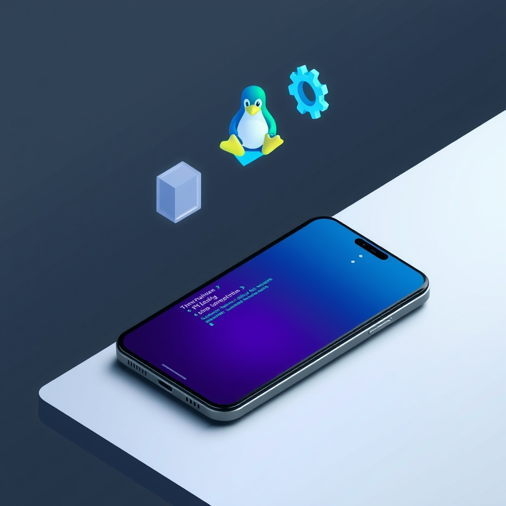

[Home](../index.md) > [Software](./index.md)  
# 💻📱🛠️ Termux  
  
  
## 🤖 AI Summary  
### Termux 📱💻  
  
👉 **What Is It?** 🤔 Termux is an **Android terminal emulator** 📲 and **[Linux](./linux.md) environment app** 🐧. It's like having a command line interface right on your phone or tablet\! 🤯 It belongs to the broader class of **terminal emulators** 💻 and **Unix-like environments** 🛠️. It's not an acronym; it's a portmanteau of "terminal" and "Linux". 🤓  
  
☁️ **A High Level, Conceptual Overview**  
  
  * 🍼 **For A Child:** Imagine you have a special app on your phone 📱 that looks like a computer screen with words. You can type special commands into it, like telling a robot 🤖 what to do, to make your phone do cool things like look at files 📂 or even play simple games\! 🎮  
  * 🏁 **For A Beginner:** Termux is an app for Android 🤖 that gives you a command line interface, similar to what you might see in Linux or macOS. This allows you to interact with your device using text-based commands instead of just tapping icons. You can install software 💾, run scripts 📜, and manage files 📂, all from the command line. It's a powerful tool for learning about Linux commands and doing more advanced things with your Android device. 💪  
  * 🧙‍♂️ **For A World Expert:** Termux provides an accessible and surprisingly complete POSIX-compliant command-line environment on Android devices, leveraging the underlying Linux kernel. It offers a package manager (`pkg`) based on Debian's `apt`, enabling the installation of a wide array of development tools 🛠️, system utilities ⚙️, and even lightweight desktop environments 🖥️. Its architecture cleverly bridges the gap between the Android security sandbox 🔒 and the power of a full-fledged Linux distribution, facilitating development workflows 🚀, system administration tasks ⚙️, and security testing 🛡️ directly on mobile hardware. Advanced users can leverage its capabilities for scripting 🐍, networking 🌐, and even running server-side applications 🌐 within the constraints of the Android OS.  
  
🌟 **High-Level Qualities** ✨  
  
  * **Free and Open Source:** 🆓 It's available to everyone without cost and its source code is open for inspection and modification. 👀  
  * **Powerful:** 💪 It provides a full-fledged Linux-like environment with a package manager. 📦  
  * **Versatile:** 🤸‍♀️ It can be used for a wide range of tasks, from basic file management to software development. 💻  
  * **Lightweight:** 💨 It doesn't consume a lot of system resources. 🔋  
  * **Extensible:** ➕ You can install various packages to extend its functionality. 🛠️  
  * **Secure:** 🛡️ Operates within Android's security sandbox. 🔒  
  
🚀 **Notable Capabilities** 🚀  
  
  * **Package Management:** 📦 Install and manage software using the `pkg` command, similar to `apt` on Debian/Ubuntu.  
  * **Command-Line Utilities:** ⌨️ Access standard Unix utilities like `bash`, `zsh`, `grep`, `sed`, `awk`, `vim`, `emacs`, etc.  
  * **Development Tools:** 🛠️ Install compilers (like GCC and Clang), interpreters (like Python, Node.js, Ruby, PHP), and other development tools.  
  * **Networking:** 🌐 Use network utilities like `ssh`, `curl`, `wget`, `ping`, `netstat`.  
  * **File Management:** 📂 Navigate, create, modify, and delete files and directories using command-line tools.  
  * **Scripting:** 📜 Write and execute shell scripts (Bash, Zsh) and scripts in other supported languages.  
  * **Customization:** 🎨 Customize the terminal appearance, fonts, and colors.  
  * **Hardware Access (Limited):** ⚙️ Access some device hardware features through specific APIs and tools.  
  
📊 **Typical Performance Characteristics** ⚙️  
  
  * **Resource Consumption:** 🔋 Generally low CPU and RAM usage when idle; usage increases based on the complexity of the commands and running processes.  
  * **Installation Size:** 💾 The base installation is relatively small (around \~150MB), but the size grows significantly with installed packages.  
  * **Execution Speed:** ⚡ Command execution speed is generally comparable to running similar commands on a desktop Linux environment, limited by the Android device's hardware. Complex compilations or heavy I/O operations will take longer on a mobile device.  
  * **Network Throughput:** 📶 Network performance depends on the device's Wi-Fi or cellular connection. Termux itself doesn't impose significant overhead.  
  * **Latency:** ⏳ Command latency is typically low for local operations. Network operations will have latency dependent on the network connection.  
  
💡 **Examples Of Prominent Products, Applications, Or Services That Use It Or Hypothetical, Well Suited Use Cases** ✨  
  
  * **Learning Linux Commands:** 🧑‍🏫 Students and beginners can use it to learn and practice Linux commands without needing a separate Linux installation.  
  * **Remote Server Access:** 💻 System administrators can use `ssh` to securely connect to and manage remote servers.  
  * **Basic Development Tasks:** 👨‍💻 Developers can write and test simple scripts or code snippets in various languages.  
  * **Web Development Testing:** 🌐 Running lightweight web servers or using `curl` and `wget` for basic web testing.  
  * **Security Auditing:** 🛡️ Security enthusiasts can use tools like `nmap` (after installation) for network scanning (with limitations due to Android's sandboxing).  
  * **Automation:** 🤖 Automating repetitive tasks on the Android device using shell scripts.  
  * **Data Analysis:** 📊 Performing basic data manipulation and analysis using command-line tools like `awk` and `sed`, or by installing Python with libraries like Pandas (though performance might be limited for large datasets).  
  * **Hypothetical Use Case:** 🏡 A smart home enthusiast could potentially use Termux to run a lightweight home automation server directly on an old Android tablet, controlling lights and other devices via custom scripts. 💡  
  
📚 **A List Of Relevant Theoretical Concepts Or Disciplines** 🧠  
  
  * **Operating Systems:** ⚙️ Understanding the fundamentals of operating systems, especially Unix-like systems.  
  * **Command-Line Interface (CLI):** ⌨️ Familiarity with the concept and usage of command-line interfaces.  
  * **Shell Scripting:** 📜 Knowledge of shell scripting languages like Bash or Zsh.  
  * **Networking:** 🌐 Basic understanding of networking concepts and protocols (TCP/IP, SSH, HTTP).  
  * **Package Management:** 📦 Understanding how software is installed, updated, and removed using package managers.  
  * **Linux/Unix Philosophy:** 🐧 The principles of simplicity, modularity, and extensibility in software design.  
  * **Security:** 🛡️ Basic security concepts related to remote access and system administration.  
  * **Software Development:** 💻 Fundamentals of programming and software development workflows.  
  
🌲 **Topics** 🌳  
  
  * 👶 **Parent:** Command-Line Interfaces (CLIs) ⌨️  
  * 👩‍👧‍👦 **Children:**  
      * Terminal Emulators 🖥️  
      * Linux Distributions 🐧  
      * Android Development Tools 🤖  
      * Mobile Computing 📱  
  * 🧙‍♂️ **Advanced topics:**  
      * POSIX Compliance on Android 🔩  
      * Android Security Sandbox Implications for CLI Tools 🔒  
      * Cross-Compilation on Mobile Architectures 🛠️  
      * Inter-Process Communication (IPC) in Android and Termux 🔗  
      * Advanced Shell Scripting and Automation Techniques 🤖  
      * Utilizing the Android NDK within Termux Workflows 🧑‍💻  
  
🔬 **A Technical Deep Dive** ⚙️  
  
Termux operates by providing a user-space environment on top of the Android kernel. It leverages the `pty` (pseudoterminal) subsystem to create terminal interfaces within the Android application. The core of Termux is a set of native executables compiled for Android's architecture (typically ARM or x86). Its package manager, `pkg`, downloads and installs pre-compiled packages from its repositories, managing dependencies and ensuring compatibility within the Termux environment. These packages are often stripped-down versions of their Linux counterparts, optimized for mobile devices. Termux does not require rooting the Android device, as it operates entirely within its own isolated sandbox. However, this sandboxing imposes certain limitations on system-level access. For instance, direct access to hardware devices (beyond storage and some network interfaces) is restricted. Termux utilizes Android's standard APIs for file system access, network communication, and other functionalities within the confines of the application's permissions. It creates a virtual file system rooted at `/data/data/com.termux/files/home`, providing a familiar Linux-like directory structure. The `termux-api` package provides a bridge to some Android-specific functionalities like accessing the camera 📸, GPS 📍, and notifications 🔔, but requires explicit user permission.  
  
🧩 **The Problem(s) It Solves** 🤔  
  
  * **Abstract:** It solves the problem of limited interaction and control over the underlying operating system of an Android device. It provides a powerful and flexible text-based interface for more advanced users. 💪  
  * **Specific Common Examples:**  
      * Needing to run Linux command-line tools on an Android device without needing a separate computer. 💻➡️📱  
      * Wanting to automate tasks on an Android device using scripts. 🤖  
      * Desiring a platform for learning Linux commands and system administration on the go. 🚶‍♂️📚  
      * Needing to quickly access and manage files on the device using familiar command-line tools. 📂  
      * Wanting to run lightweight development tools or servers for testing purposes on a mobile device. 🛠️🌐  
  * **A Surprising Example:** Imagine using Termux on a cheap Android TV box 📺 to create a custom home automation hub or a lightweight media server, leveraging its network capabilities and the ability to run server software. 🏡  
  
👍 **How To Recognize When It's Well Suited To A Problem** ✅  
  
  * The task involves text-based interaction and manipulation. ⌨️  
  * Familiarity with command-line interfaces and Linux/Unix tools is beneficial. 🤓  
  * The need for automation through scripting is present. 🤖  
  * Accessing remote servers or network resources is required. 🌐  
  * Lightweight development or testing environments are needed on an Android device. 🛠️  
  * Learning and experimenting with Linux commands is the goal. 🧑‍🏫  
  
👎 **How To Recognize When It's Not Well Suited To A Problem (And What Alternatives To Consider)** ❌  
  
  * The task is primarily graphical and requires extensive GUI interaction. 🖼️ (Consider dedicated Android apps for those tasks).  
  * High-performance computing or resource-intensive tasks are needed. 🚀 (A desktop or server environment would be more suitable).  
  * Direct hardware-level access is required beyond what Android APIs allow. ⚙️ (Rooting the device might offer more access but comes with security risks and voids warranties).  
  * Simple, user-friendly interfaces are preferred over command-line interaction. 😊 (Use standard Android apps).  
  * Real-time, low-latency graphical applications are needed. 🎮 (Termux is text-based and not designed for this).  
  
🩺 **How To Recognize When It's Not Being Used Optimally (And How To Improve)** ⚕️  
  
  * **Redundant Commands:** Repeating the same sequences of commands manually. ➡️ **Improve:** Write shell scripts to automate these tasks. 📜  
  * **Inefficient Navigation:** Using `cd` excessively to move between directories. ➡️ **Improve:** Use tools like `find` or `fd` to locate files more efficiently, or leverage shell history and tab completion. 🧭  
  * **Reinventing the Wheel:** Trying to implement functionality that already exists in available packages. ➡️ **Improve:** Search for and install relevant packages using `pkg search` and `pkg install`. 📦  
  * **Ignoring Customization:** Using the default terminal appearance when a more comfortable or efficient setup is possible. ➡️ **Improve:** Customize the terminal colors, fonts, and keybindings in the Termux configuration files (`~/.termux/termux.properties`). 🎨  
  * **Not Utilizing SSH:** Manually copying files to and from remote servers. ➡️ **Improve:** Use `ssh` and `scp` for secure and efficient remote file transfer and management. 🌐  
  
🔄 **Comparisons To Similar Alternatives (Especially If Better In Some Way)** 🆚  
  
  * **Other Android Terminal Emulators (e.g., ConnectBot, JuiceSSH):** These primarily focus on providing SSH access to remote servers. Termux offers a full local Linux environment in addition to SSH capabilities, making it more versatile for local tasks and development. ➕  
  * **Android Subsystems for Linux (e.g., WSL on Windows, Crostini on ChromeOS):** These provide more integrated Linux environments but are not available on standard Android devices. Termux offers a similar level of functionality within the constraints of the Android OS without requiring special system features. 👍  
  * **Cloud-Based Development Environments (e.g., Gitpod, GitHub Codespaces):** These offer powerful development environments accessible through a web browser. Termux provides a local environment directly on the device, which can be advantageous for offline work or when direct access to the device's file system is needed. ☁️➡️📱  
  * **Rooted Android Environments with Full Linux Distributions (e.g., running a Linux distro in a chroot):** This offers a more complete Linux experience but requires rooting the device, which has security implications and can void warranties. Termux achieves a balance by providing a powerful environment without requiring root access. 🛡️  
  
🤯 **A Surprising Perspective** 😲  
  
Despite running within the limitations of Android's user-space environment, Termux can often feel surprisingly like a "real" Linux system. The ability to install a wide range of familiar tools and even run lightweight server applications directly on a phone can blur the lines between mobile and desktop computing in unexpected ways. 📱➡️💻🤔  
  
📜 **Some Notes On Its History, How It Came To Be, And What Problems It Was Designed To Solve** 📜  
  
Termux was created by Fredrik Fornwall and has been actively developed by the open-source community. It emerged from the desire to have a usable command-line environment on Android devices without requiring root access. The primary goal was to provide a platform for developers, system administrators, and Linux enthusiasts to leverage familiar tools and workflows on their mobile devices. The initial development focused on creating a functional terminal emulator and a basic package management system to bring essential command-line utilities to Android. Over time, the project has grown significantly, with a large number of packages being ported to the Android architecture, making it a powerful tool for a wide range of use cases. The design emphasizes security by operating within Android's sandbox and not requiring elevated privileges.  
  
📝 **A Dictionary-Like Example Using The Term In Natural Language** 🗣️  
  
"While waiting for the bus, Sarah used **Termux** on her phone to quickly SSH into her server and check the logs." 🚌📱💻  
  
😂 **A Joke** 😂  
  
I tried to explain Linux to my phone using only emojis. It just kept giving me the blue screen of sad face. 😥 Maybe I should have used Termux. 🤔  
  
📖 **Book Recommendations** 📚  
  
  * **topical:** "The Linux Command Line: A Complete Introduction" by William E. Shotts Jr. 🐧 (Fundamental knowledge for using Termux effectively).  
  * **tangentially related:** "Hacking: The Art of Exploitation" by Jon Erickson 🛡️ (For understanding security concepts relevant to using network tools in Termux).  
  * **topically opposed:** "Android Studio Development Essentials" by Neil Smyth 🤖 (Focuses on GUI-based Android development, a different paradigm).  
  * **more general:** "Operating System Concepts" by Abraham Silberschatz, Peter Baer Galvin, and Greg Gagne ⚙️ (Provides a deeper understanding of operating system principles).  
  * **more specific:** [Termux Wiki Pages](https://wiki.termux.com/wiki/Main_Page) 📖 (The official documentation).  
  * **fictional:** "[Snow Crash](../books/snow-crash.md)" by Neal Stephenson 👓 (Features a virtual reality "Metaverse" with command-line interfaces in a cyberpunk setting).  
  * **rigorous:** "Advanced Programming in the UNIX Environment" by W. Richard Stevens and Stephen A. Rago 👨‍💻 (A classic text on Unix system programming concepts).  
  * **accessible:** "Linux for Dummies" by Richard Blum and Christine Bresnahan 🧑‍🏫 (A beginner-friendly introduction to Linux concepts applicable to Termux).  
  
📺 **Links To Relevant YouTube Channels Or Videos** ▶️  
  
  * [Termux tutorials](https://youtube.com/results?search_query=Termux+tutorials). 🔍  
  * [DistroTube](https://www.youtube.com/@DistroTube) (Covers various Linux distributions and command-line tools).  
  * [Learn Linux TV](https://www.youtube.com/@LearnLinuxTV) (Educational content on Linux and the command line).  
  
## 🦋 Bluesky    
<blockquote class="bluesky-embed" data-bluesky-uri="at://did:plc:i4yli6h7x2uoj7acxunww2fc/app.bsky.feed.post/3mj7jc7cop72z" data-bluesky-cid="bafyreiee34jrmzxiqsqa5vlgk27talrvj3pjgdsxaz5lsfpnkt3ps6vb54">
💻📱🛠️ Termux  
  
#AI Q: 💻 Ever used your phone to run a full Linux environment?  
  
📱 Mobile Linux | 💻 Command Line Tools | 🤖 Android Development | 🐧 Unix Environment  
https://bagrounds.org/software/termux
&mdash; <a href="https://bsky.app/profile/did:plc:i4yli6h7x2uoj7acxunww2fc?ref_src=embed">Bryan Grounds (@bagrounds.bsky.social)</a> <a href="https://bsky.app/profile/did:plc:i4yli6h7x2uoj7acxunww2fc/post/3mj7jc7cop72z?ref_src=embed">2026-04-11T09:24:17.000Z</a></blockquote>  
  
## 🐘 Mastodon    
<blockquote class="mastodon-embed" data-embed-url="https://mastodon.social/@bagrounds/116385346922780485/embed" style="background: #FCF8FF; border-radius: 8px; border: 1px solid #C9C4DA; margin: 0; max-width: 540px; min-width: 270px; overflow: hidden; padding: 0;"> <a href="https://mastodon.social/@bagrounds/116385346922780485" target="_blank" style="align-items: center; color: #1C1A25; display: flex; flex-direction: column; font-family: system-ui, -apple-system, BlinkMacSystemFont, 'Segoe UI', Oxygen, Ubuntu, Cantarell, 'Fira Sans', 'Droid Sans', 'Helvetica Neue', Roboto, sans-serif; font-size: 14px; justify-content: center; letter-spacing: 0.25px; line-height: 20px; padding: 24px; text-decoration: none;"> <svg xmlns="http://www.w3.org/2000/svg" xmlns:xlink="http://www.w3.org/1999/xlink" width="32" height="32" viewBox="0 0 79 75"><path d="M63 45.3v-20c0-4.1-1-7.3-3.2-9.7-2.1-2.4-5-3.7-8.5-3.7-4.1 0-7.2 1.6-9.3 4.7l-2 3.3-2-3.3c-2-3.1-5.1-4.7-9.2-4.7-3.5 0-6.4 1.3-8.6 3.7-2.1 2.4-3.1 5.6-3.1 9.7v20h8V25.9c0-4.1 1.7-6.2 5.2-6.2 3.8 0 5.8 2.5 5.8 7.4V37.7H44V27.1c0-4.9 1.9-7.4 5.8-7.4 3.5 0 5.2 2.1 5.2 6.2V45.3h8ZM74.7 16.6c.6 6 .1 15.7.1 17.3 0 .5-.1 4.8-.1 5.3-.7 11.5-8 16-15.6 17.5-.1 0-.2 0-.3 0-4.9 1-10 1.2-14.9 1.4-1.2 0-2.4 0-3.6 0-4.8 0-9.7-.6-14.4-1.7-.1 0-.1 0-.1 0s-.1 0-.1 0 0 .1 0 .1 0 0 0 0c.1 1.6.4 3.1 1 4.5.6 1.7 2.9 5.7 11.4 5.7 5 0 9.9-.6 14.8-1.7 0 0 0 0 0 0 .1 0 .1 0 .1 0 0 .1 0 .1 0 .1.1 0 .1 0 .1.1v5.6s0 .1-.1.1c0 0 0 0 0 .1-1.6 1.1-3.7 1.7-5.6 2.3-.8.3-1.6.5-2.4.7-7.5 1.7-15.4 1.3-22.7-1.2-6.8-2.4-13.8-8.2-15.5-15.2-.9-3.8-1.6-7.6-1.9-11.5-.6-5.8-.6-11.7-.8-17.5C3.9 24.5 4 20 4.9 16 6.7 7.9 14.1 2.2 22.3 1c1.4-.2 4.1-1 16.5-1h.1C51.4 0 56.7.8 58.1 1c8.4 1.2 15.5 7.5 16.6 15.6Z" fill="currentColor"/></svg> 
Post by @bagrounds@mastodon.social
 
View on Mastodon
 </a> </blockquote> 