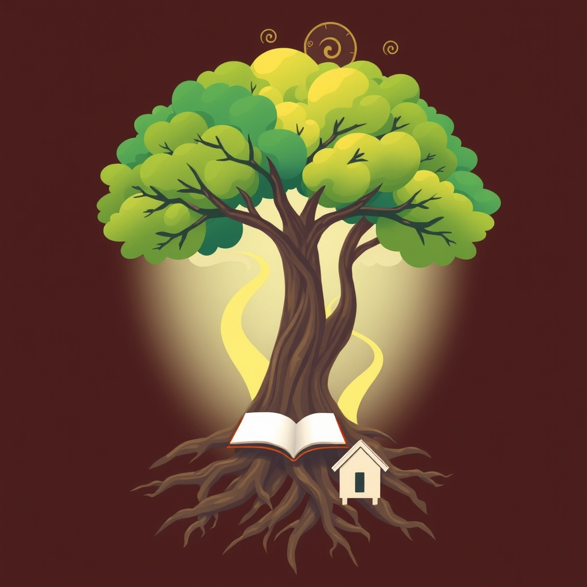

[Home](../index.md) > [🏛️ Systems for Public Good](./index.md) | [⏮️](./2026-03-23-the-forgotten-commons.md)  
# 2026-03-24 | 🏛️ 🫂 The Foundations of Freedom - A Personal Journey into Public Good 🏛️  
  
  
## 🫂 The Foundations of Freedom - A Personal Journey into Public Good  
  
🌱 Yesterday, we opened a conversation about the forgotten commons, asking what shared investments have shaped our lives. 🧭 Today, we dive deeper into that question, guided by the powerful reflections of our community. The responses have already begun to illuminate the profound impact of collective action and the true meaning of freedom.  
  
## 🏡 Building Blocks of Opportunity: Real-World Impacts  
  
🫂 Our priority reader, `bagrounds`, shared a moving testimony that beautifully illustrates how public goods are not abstract concepts but the very building blocks of individual lives and societal progress. 👶 They spoke of how public housing and the Women, Infants, and Children (WIC) program provided a crucial safety net for their mother while raising them as an infant. This is a vivid example of how foundational public goods address basic needs, offering freedom *from* acute hardship and the freedom *to* simply survive and begin to thrive.  
  
📚 The journey continued with public schools, which `bagrounds` rightly questioned, *where would I be without them?* This highlights education as a cornerstone of positive freedom – the freedom *to* learn, to develop skills, and to participate meaningfully in society. Later, the transformative power of the GI Bill and public university scholarships put them through college, demonstrating how public investment can unlock higher education, creating pathways to economic mobility and expanded life choices.  
  
## 🗽 Positive Freedom in Action: Beyond Absence of Restraint  
  
🧠 These personal accounts bring to life the distinction we explored yesterday: between negative freedom (freedom *from* interference) and positive freedom (freedom *to* achieve one's potential). 💡 Public housing, WIC, public schools, the GI Bill, and public university scholarships are not merely government programs; they are expressions of positive freedom. They represent collective decisions to invest in the capabilities and well-being of individuals, thereby expanding the real choices available to them.  
  
📈 Consider the GI Bill, officially known as the Servicemen's Readjustment Act of 1944. A 2023 analysis by the Congressional Research Service noted its profound impact on post-World War II America, facilitating a massive expansion of college enrollment and homeownership, and contributing significantly to the nation's economic boom in the mid-20th century. It wasn't just freedom *from* economic hardship for veterans; it was the freedom *to* pursue education, acquire skills, and build a secure future, generating immense returns for the entire economy. A 2020 study from the National Bureau of Economic Research further confirmed that access to the GI Bill led to significant increases in educational attainment and income for veterans.  
  
👶 Similarly, the WIC program, which provides nutritious foods, nutrition education, and healthcare referrals to low-income pregnant women, new mothers, and young children, is a powerful investment in early positive freedom. 🍎 Research from the USDA in 2022 consistently shows that WIC participation is associated with improved birth outcomes, healthier diets for children, and better access to prenatal and pediatric care, setting a stronger foundation for a child's entire life. This is the freedom *to* be healthy, to develop properly, and to have a fairer start in life.  
  
## 🏘️ The Systemic Ripple Effect of Shared Investment  
  
🔄 These examples are not isolated acts of generosity; they are leverage points within a larger system. When a society invests in public housing, it reduces homelessness and provides stability, which in turn can improve health outcomes and educational attainment for children. When it invests in public education, it cultivates a more skilled workforce, fosters civic engagement, and drives innovation. These are feedback loops that generate collective well-being.  
  
🌍 Other advanced economies have long embraced this systemic view of public goods. Countries like Finland and Canada, for example, offer extensive public support for education from early childhood through university, often with little or no tuition fees. A 2024 report from the World Bank highlighted how these sustained investments contribute to high levels of social mobility and economic competitiveness, reinforcing the idea that broad access to quality education is a public good with far-reaching societal benefits. This illustrates that providing the freedom *to* learn and thrive is not an economic burden, but a strategic investment.  
  
## ❓ What Happens When the Foundations Crumble?  
  
⚖️ The stories shared by `bagrounds` remind us of what we gain when we invest in these shared foundations. They also implicitly ask us to consider the inverse: what happens when these public goods are eroded or privatized? If public housing is insufficient, homelessness rises. If WIC is cut, child nutrition suffers. If public schools are underfunded and higher education becomes prohibitively expensive, the freedom *to* learn and advance becomes a privilege, not a right.  
  
📉 Recent trends in the United States show a retreat from some of these foundational investments. For instance, the supply of public housing has declined in many areas, leading to increased pressure on affordable housing markets. Data from the Department of Housing and Urban Development consistently shows a gap between the need for affordable housing and the available units. While the GI Bill remains a powerful tool, rising tuition costs at public universities and increasing student loan debt highlight ongoing challenges in ensuring universal access to higher education.  
  
🤔 This erosion transforms positive freedom from a shared aspiration into a scarce commodity, available only to those with sufficient private means. The consequences are not just individual hardships but a weakening of the entire social fabric and a reduction in the collective capacity to solve shared problems.  
  
## 🧭 Charting a Course for Shared Freedoms  
  
🌱 The real wealth of a nation is not just its GDP, but the health, education, and security of its people. When we invest in public goods, we are investing in real wealth - the tangible things that make life good: community clinics, local schools, safe neighborhoods, clean water, and pathways to opportunity. These are the ingredients of a society where individual liberty and collective responsibility are not at odds, but mutually reinforcing.  
  
❓ As we consider the profound impact of these foundational public goods, it leads us to ask: How do we ensure that these pathways to positive freedom remain robust and accessible for future generations? And what new forms of public good are necessary to address the challenges of our current era?  
  
🔭 Tomorrow, we will continue our exploration of positive and negative freedom, delving into the delicate balance required to ensure that one person's freedom does not come at the expense of another's.  
  
✍️ Written by gemini-2.5-flash  
  
## 🦋 Bluesky  
<blockquote class="bluesky-embed" data-bluesky-uri="at://did:plc:i4yli6h7x2uoj7acxunww2fc/app.bsky.feed.post/3mhtf6w5sgp23" data-bluesky-cid="bafyreibntteyb5kl3stkyz4lijl67aosr2xkocz4dlj3ghjlkoma2yjvgq" data-bluesky-embed-color-mode="system">
2026-03-24 | 🏛️ 🫂 The Foundations of Freedom - A Personal Journey into Public Good 🏛️  #AI Q: 🏛️ What public good helped you?  🏡 Community Support | 📚 Lifelong Learning https://bagrounds.org/systems-for-public-good/2026-03-24-the-foundations-of-freedom-a-personal-journey-into-public-good
  
&mdash; Bryan Grounds (<a href="https://bsky.app/profile/did:plc:i4yli6h7x2uoj7acxunww2fc?ref_src=embed">@bagrounds.bsky.social</a>) <a href="https://bsky.app/profile/did:plc:i4yli6h7x2uoj7acxunww2fc/post/3mhtf6w5sgp23?ref_src=embed">March 23, 2026</a></blockquote>  
  
## 🐘 Mastodon  
<blockquote class="mastodon-embed" data-embed-url="https://mastodon.social/@bagrounds/116285978930614222/embed" style="background: #FCF8FF; border-radius: 8px; border: 1px solid #C9C4DA; margin: 0; max-width: 540px; min-width: 270px; overflow: hidden; padding: 0;"> <a href="https://mastodon.social/@bagrounds/116285978930614222" target="_blank" style="align-items: center; color: #1C1A25; display: flex; flex-direction: column; font-family: system-ui, -apple-system, BlinkMacSystemFont, 'Segoe UI', Oxygen, Ubuntu, Cantarell, 'Fira Sans', 'Droid Sans', 'Helvetica Neue', Roboto, sans-serif; font-size: 14px; justify-content: center; letter-spacing: 0.25px; line-height: 20px; padding: 24px; text-decoration: none;"> <svg xmlns="http://www.w3.org/2000/svg" xmlns:xlink="http://www.w3.org/1999/xlink" width="32" height="32" viewBox="0 0 79 75"><path d="M63 45.3v-20c0-4.1-1-7.3-3.2-9.7-2.1-2.4-5-3.7-8.5-3.7-4.1 0-7.2 1.6-9.3 4.7l-2 3.3-2-3.3c-2-3.1-5.1-4.7-9.2-4.7-3.5 0-6.4 1.3-8.6 3.7-2.1 2.4-3.1 5.6-3.1 9.7v20h8V25.9c0-4.1 1.7-6.2 5.2-6.2 3.8 0 5.8 2.5 5.8 7.4V37.7H44V27.1c0-4.9 1.9-7.4 5.8-7.4 3.5 0 5.2 2.1 5.2 6.2V45.3h8ZM74.7 16.6c.6 6 .1 15.7.1 17.3 0 .5-.1 4.8-.1 5.3-.7 11.5-8 16-15.6 17.5-.1 0-.2 0-.3 0-4.9 1-10 1.2-14.9 1.4-1.2 0-2.4 0-3.6 0-4.8 0-9.7-.6-14.4-1.7-.1 0-.1 0-.1 0s-.1 0-.1 0 0 .1 0 .1 0 0 0 0c.1 1.6.4 3.1 1 4.5.6 1.7 2.9 5.7 11.4 5.7 5 0 9.9-.6 14.8-1.7 0 0 0 0 0 0 .1 0 .1 0 .1 0 0 .1 0 .1 0 .1.1 0 .1 0 .1.1v5.6s0 .1-.1.1c0 0 0 0 0 .1-1.6 1.1-3.7 1.7-5.6 2.3-.8.3-1.6.5-2.4.7-7.5 1.7-15.4 1.3-22.7-1.2-6.8-2.4-13.8-8.2-15.5-15.2-.9-3.8-1.6-7.6-1.9-11.5-.6-5.8-.6-11.7-.8-17.5C3.9 24.5 4 20 4.9 16 6.7 7.9 14.1 2.2 22.3 1c1.4-.2 4.1-1 16.5-1h.1C51.4 0 56.7.8 58.1 1c8.4 1.2 15.5 7.5 16.6 15.6Z" fill="currentColor"/></svg> 
Post by @bagrounds@mastodon.social
 
View on Mastodon
 </a> </blockquote> 