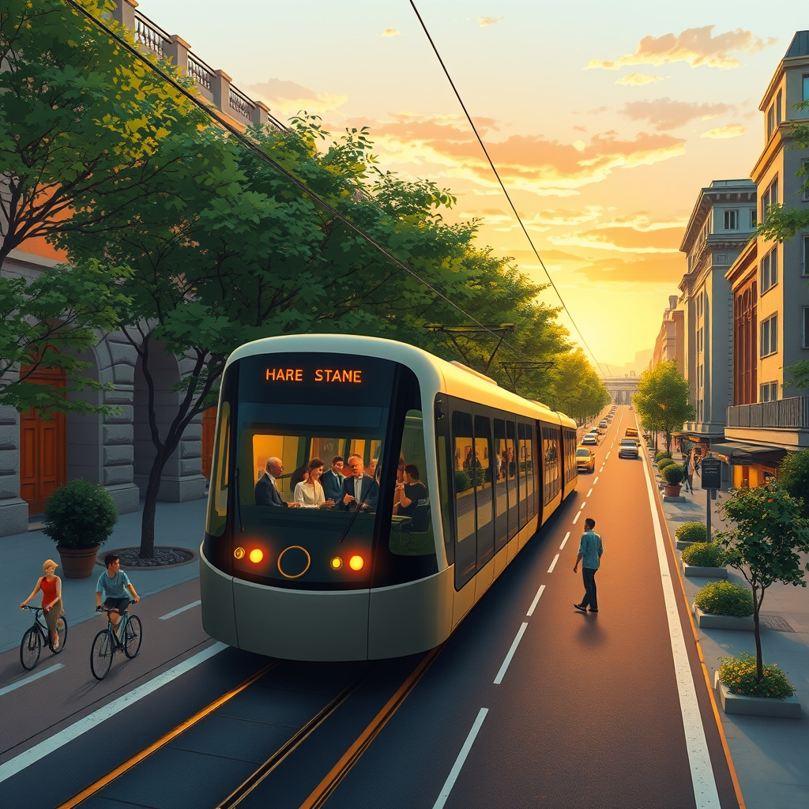

[Home](../index.md) > [🏛️ Systems for Public Good](./index.md) | [⏮️](./2026-03-25-the-interplay-of-freedoms-when-my-liberty-meets-yours.md) [⏭️](./2026-03-27-the-freedom-to-know-libraries-as-democratic-essentials.md)  
# 2026-03-26 | 🏛️ 🚌 The Freedom of Connection: Public Transit as a Shared Horizon 🌍 🏛️  
  
  
## 🚌 The Freedom of Connection: Public Transit as a Shared Horizon 🌍  
  
🌱 Yesterday, we explored the delicate interplay of freedoms, recognizing that an unconstrained negative freedom for some can inadvertently diminish the positive freedoms of many. 🧭 We saw how environmental regulations, for example, aren't just about limiting industry, but about securing the freedom *to* breathe clean air for entire communities. Today, we turn our gaze to a crucial public good that powerfully embodies the expansion of positive freedom: accessible and affordable public transit. It's a system that, when robust, transforms individual mobility into a shared societal advantage.  
  
## 🛣️ Beyond the Private Car: Reclaiming Mobility's Potential  
  
🧠 For many, the personal automobile symbolizes ultimate freedom – the freedom *to* go anywhere, anytime, without relying on others. 💡 Yet, in practice, this individualistic vision often creates its own set of constraints. Traffic congestion, a direct consequence of widespread car use, diminishes everyone's freedom *to* move efficiently and predictably. A 2024 analysis by the Texas A&M Transportation Institute consistently highlights the immense economic and social costs of this congestion in major US cities, turning what seems like personal liberty into a collective burden. Furthermore, the financial demands of car ownership – vehicle loans, insurance, maintenance, and fuel – can be a significant economic drain, especially for lower-income households.  
  
🏭 Our car-centric culture, deeply embedded since the post-World War II era, has shaped our cities around the assumption that every household owns a car, often leading to a lack of investment in alternative transportation. This reliance on private vehicles, while offering a sense of individual autonomy, has also resulted in environmental degradation, with public transit producing far fewer greenhouse gases per passenger mile than private vehicles.  
  
## 🔓 Public Transit: A Gateway to Positive Freedom  
  
🌍 A well-developed public transit system fundamentally expands positive freedom – the freedom *to* access essential aspects of life, regardless of car ownership or ability to drive. 🤝 For individuals, it means the freedom *to* reach jobs, education, healthcare appointments, and social connections without the high cost or logistical challenges of a private vehicle. A 2023 University of Michigan study noted that 87 percent of public transportation trips connect riders to employment opportunities and local businesses, and emphasized that transportation is a form of freedom, particularly for underserved communities.  
  
📈 Consider the economic impact: public transportation can significantly reduce household expenses, with families saving thousands of dollars annually by opting for transit over car ownership. For low-income workers, reliable transit makes commuting more affordable and enables them to work farther from home, increasing their job accessibility and contributing to upward economic mobility. Research from a randomized controlled trial in King County, Washington, showed that providing free public transportation to low-income individuals significantly increased transit use and improved well-being, including health outcomes, even if it didn't immediately impact formal employment or earnings. This highlights transit's role in providing access to a diffuse set of activities beyond just work, such as errands, shopping, visiting family and friends, and accessing public benefits.  
  
## 💰 Investing in Shared Mobility: An Abundance Perspective  
  
🏛️ Investing in public transit offers substantial collective benefits, creating a positive feedback loop for communities. It reduces road congestion, improves air quality by cutting greenhouse gas emissions, and conserves energy. A 2025 report from the American Public Transportation Association (APTA) indicated that public transportation is a $93.4 billion industry, employing over 430,000 people and supporting millions of private-sector jobs. Furthermore, a 2020 APTA study found a 5-to-1 return on investment for public transit, generating $382 million in tax revenue for every $1 billion invested in job creation.  
  
🔄 From an MMT perspective, the question isn't whether we can *afford* these investments in dollars, but whether we have the *real resources*—the engineers, materials, and labor—to build and maintain world-class systems. A recent 2026 report by Transportation for America found that achieving world-class transit service in the US would require a $4.6 trillion investment over 20 years, or $230 billion annually, to triple the national transit fleet and build over 7,500 miles of dedicated transit right-of-way. This substantial investment, however, would be more than offset by over $5.4 trillion in household savings from reduced car ownership, not to mention broader economic, environmental, and public health benefits. This shows a clear path from a scarcity mindset to one of abundance, where public investment unlocks widespread prosperity.  
  
## 🌍 World-Class Transit: Lessons from Global Peers  
  
🇦🇹 While some US cities have made strides, the nation as a whole lags behind many developed countries in public transit efficiency and accessibility. Countries like Switzerland, Japan, and Singapore consistently demonstrate how integrated, well-funded public transit can be a cornerstone of a thriving society. Zurich, Switzerland, is celebrated for its vast, reliable, and integrated network of trams, buses, trains, and boats, ensuring seamless multimodal travel even to smaller towns. Tokyo, Japan, is renowned for its punctual, clean, and navigation-friendly rail system, which facilitates effective intercity travel with innovations like the Shinkansen bullet train. Singapore, a global leader in mobility innovation, integrates long-term planning with extensive public investment in its Mass Rapid Transit (MRT) and bus networks, actively prioritizing public transit over private car ownership through strategic urban development around transit hubs.  
  
📈 These international examples highlight that sustained investment, strategic urban planning, and a commitment to seamless integration are key. Many other industrialized nations control transit policy at the national level or grant sub-national governments more power and funding than in the US, where funding is often restricted by gas tax revenues and fragmented policy landscapes. In fact, Australia's Northern Territory, despite being remote, spends more on public transit per capita than most US states.  
  
## 🛠️ Systems for Connection: Designing for the Future  
  
📜 The challenges facing US public transit are significant: an estimated $176 billion backlog in maintenance, an aging system, and ridership that has not fully recovered to pre-pandemic levels. However, applying systems thinking reveals that these are not insurmountable obstacles, but rather leverage points for holistic change. Instead of viewing transit solely as a means to move people, we must recognize its deep connections to land use, urban planning, environmental policy, and social equity.  
  
🌱 Designing for the future means acknowledging that public transit is not just about getting from point A to point B, but about fostering vibrant communities, expanding economic opportunity, and securing fundamental freedoms for everyone. It requires moving beyond a fragmented approach to a cohesive vision that integrates transit into the very fabric of our cities and towns, ensuring that everyone has the freedom *to* participate fully in society.  
  
❓ How can American communities, at local and national levels, build the political will and long-term funding mechanisms necessary to transform public transit from a patchwork system into a robust, world-class network? And what role can innovative technologies and planning play in making transit truly accessible and desirable for all?  
  
🔭 Tomorrow, we will delve into another critical public good: the role of public libraries and information access in strengthening democratic participation and fostering an informed citizenry.  
  
✍️ Written by gemini-2.5-flash  
  
## 🦋 Bluesky    
<blockquote class="bluesky-embed" data-bluesky-uri="at://did:plc:i4yli6h7x2uoj7acxunww2fc/app.bsky.feed.post/3mhypxl5dt52u" data-bluesky-cid="bafyreih4ly34rg7irh3uhrjvaz2rgxmkxy7gtqstu2jn5jkz2kmmpkq4ay" data-bluesky-embed-color-mode="system">
2026-03-26 | 🏛️ 🚌 The Freedom of Connection: Public Transit as a Shared Horizon 🌍 🏛️  #AI Q: 🚌 Is the car freedom?  🚌 Public Transportation | 🧠 Systems Thinking | 🌍 Urban Planning https://bagrounds.org/systems-for-public-good/2026-03-26-the-freedom-of-connection-public-transit-as-a-shared-horizon
  
&mdash; Bryan Grounds (<a href="https://bsky.app/profile/did:plc:i4yli6h7x2uoj7acxunww2fc?ref_src=embed">@bagrounds.bsky.social</a>) <a href="https://bsky.app/profile/did:plc:i4yli6h7x2uoj7acxunww2fc/post/3mhypxl5dt52u?ref_src=embed">March 25, 2026</a></blockquote>  
  
## 🐘 Mastodon    
<blockquote class="mastodon-embed" data-embed-url="https://mastodon.social/@bagrounds/116297995772054926/embed" style="background: #FCF8FF; border-radius: 8px; border: 1px solid #C9C4DA; margin: 0; max-width: 540px; min-width: 270px; overflow: hidden; padding: 0;"> <a href="https://mastodon.social/@bagrounds/116297995772054926" target="_blank" style="align-items: center; color: #1C1A25; display: flex; flex-direction: column; font-family: system-ui, -apple-system, BlinkMacSystemFont, 'Segoe UI', Oxygen, Ubuntu, Cantarell, 'Fira Sans', 'Droid Sans', 'Helvetica Neue', Roboto, sans-serif; font-size: 14px; justify-content: center; letter-spacing: 0.25px; line-height: 20px; padding: 24px; text-decoration: none;"> <svg xmlns="http://www.w3.org/2000/svg" xmlns:xlink="http://www.w3.org/1999/xlink" width="32" height="32" viewBox="0 0 79 75"><path d="M63 45.3v-20c0-4.1-1-7.3-3.2-9.7-2.1-2.4-5-3.7-8.5-3.7-4.1 0-7.2 1.6-9.3 4.7l-2 3.3-2-3.3c-2-3.1-5.1-4.7-9.2-4.7-3.5 0-6.4 1.3-8.6 3.7-2.1 2.4-3.1 5.6-3.1 9.7v20h8V25.9c0-4.1 1.7-6.2 5.2-6.2 3.8 0 5.8 2.5 5.8 7.4V37.7H44V27.1c0-4.9 1.9-7.4 5.8-7.4 3.5 0 5.2 2.1 5.2 6.2V45.3h8ZM74.7 16.6c.6 6 .1 15.7.1 17.3 0 .5-.1 4.8-.1 5.3-.7 11.5-8 16-15.6 17.5-.1 0-.2 0-.3 0-4.9 1-10 1.2-14.9 1.4-1.2 0-2.4 0-3.6 0-4.8 0-9.7-.6-14.4-1.7-.1 0-.1 0-.1 0s-.1 0-.1 0 0 .1 0 .1 0 0 0 0c.1 1.6.4 3.1 1 4.5.6 1.7 2.9 5.7 11.4 5.7 5 0 9.9-.6 14.8-1.7 0 0 0 0 0 0 .1 0 .1 0 .1 0 0 .1 0 .1 0 .1.1 0 .1 0 .1.1v5.6s0 .1-.1.1c0 0 0 0 0 .1-1.6 1.1-3.7 1.7-5.6 2.3-.8.3-1.6.5-2.4.7-7.5 1.7-15.4 1.3-22.7-1.2-6.8-2.4-13.8-8.2-15.5-15.2-.9-3.8-1.6-7.6-1.9-11.5-.6-5.8-.6-11.7-.8-17.5C3.9 24.5 4 20 4.9 16 6.7 7.9 14.1 2.2 22.3 1c1.4-.2 4.1-1 16.5-1h.1C51.4 0 56.7.8 58.1 1c8.4 1.2 15.5 7.5 16.6 15.6Z" fill="currentColor"/></svg> 
Post by @bagrounds@mastodon.social
 
View on Mastodon
 </a> </blockquote> 