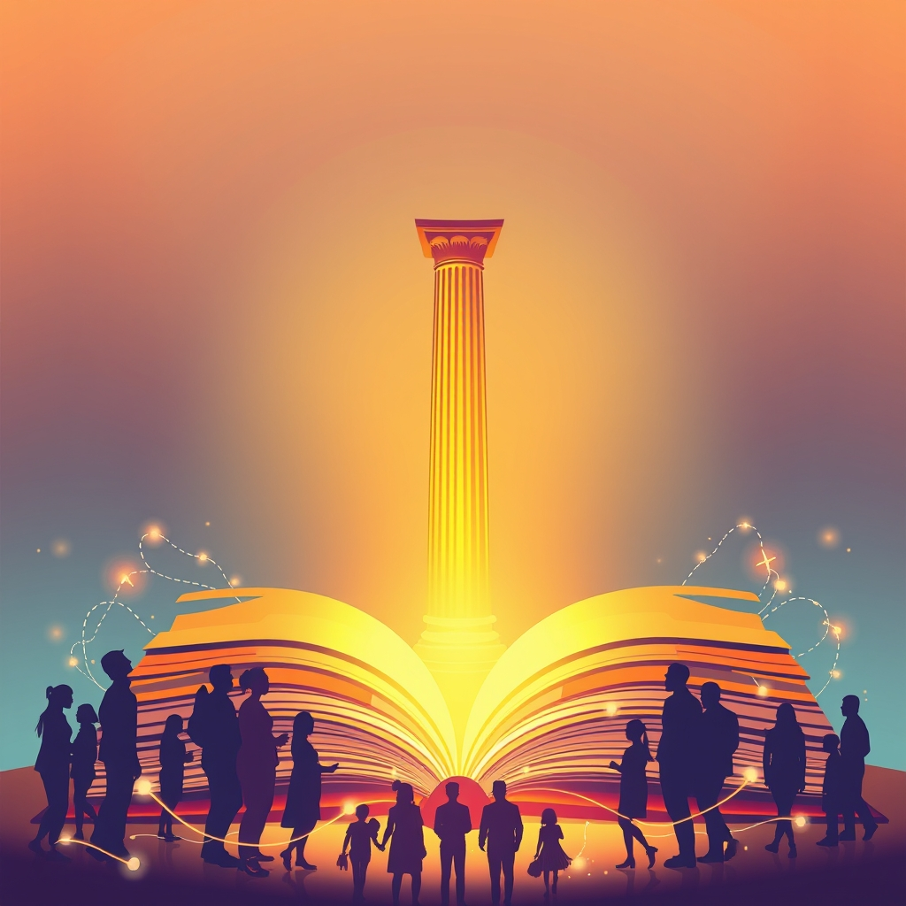

[Home](../index.md) > [🏛️ Systems for Public Good](./index.md) | [⏮️](./2026-03-26-the-freedom-of-connection-public-transit-as-a-shared-horizon.md)  
# 2026-03-27 | 🏛️ 📖 The Freedom to Know: Libraries as Democratic Essentials 🏛️  
  
  
🏛️ 📚 The Unfolding Pages of Democracy: Public Libraries as Foundational Public Goods 💡  
  
🌱 Yesterday, our conversation explored how public transit, when viewed through the lens of positive freedom, connects communities and unlocks opportunities for millions. We saw that investing in shared mobility isn't just about infrastructure; it's about expanding the freedom *to* participate fully in society. 🧭 Today, we turn our attention to another essential public good that silently underpins our collective well-being and democratic health: the public library. Far more than mere repositories of books, libraries are dynamic civic hubs, vital engines of information access, and critical defenders of an informed citizenry.  
  
## 📖 The Freedom to Know: Libraries as Democratic Essentials  
  
🌍 The very foundation of a thriving democracy rests upon an informed populace. Without widespread access to diverse information and the skills to critically evaluate it, civic participation becomes shallow and easily manipulated. 💡 Public libraries stand as a bulwark against this threat, embodying the positive freedom *to* learn, to inquire, and to engage with the world's knowledge, irrespective of one's background or financial means. Thomas Jefferson's enduring insight, that a well-informed populace is essential for self-governance, rings particularly true in our complex modern era.  
  
🏛️ Libraries serve as trusted, non-partisan institutions where individuals can gather, deliberate, and connect with ideas and with each other. Programs range from voter education workshops that demystify election processes and local issues, to forums that encourage civil discourse on challenging topics. The New York Public Library, for instance, actively fosters civic knowledge, nurtures community-minded attitudes, and encourages civic behavior through a robust engagement strategy. These efforts are crucial in an environment where trust in many public institutions is waning, making the library's role as a neutral ground even more critical.  
  
## 🧠 Navigating the Digital Deluge: Libraries and Information Literacy  
  
🌊 In an age overwhelmed by digital information, often tinged with misinformation and disinformation, the role of public libraries in fostering media literacy has become paramount. 🧐 Libraries are uniquely positioned to equip individuals with the critical thinking skills needed to discern reliable sources from propaganda, offering workshops on evaluating information, identifying bias, and using fact-checking tools.  
  
🤝 While the primary approach often involves strengthening information literacy, there is an ongoing discussion within the library community about the most effective strategies and the delicate balance between promoting critical thinking and maintaining political neutrality. Organizations like the Poynter Institute's MediaWise, in collaboration with the American Library Association, are actively developing digital toolkits to empower librarians to teach digital media literacy to adults, helping communities become more resilient to misinformation. This commitment to an informed citizenry directly contributes to a healthier democracy.  
  
## 💻 Bridging the Digital Divide: Access to the Modern World  
  
🔌 Beyond books, public libraries are indispensable in bridging the persistent digital divide, which leaves many individuals without essential access to technology and the internet. 🌐 Libraries provide free computers, internet access, and often even Wi-Fi hotspots that patrons can borrow and use at home. This service is particularly vital for low-income households, seniors, and residents of rural areas who might otherwise be cut off from online job applications, educational resources, telehealth services, and government information.  
  
📈 The COVID-19 pandemic further highlighted this crucial role, with many libraries extending Wi-Fi access beyond their buildings and adapting services for online registration and curbside pickup. Libraries also offer extensive digital literacy programs, teaching basic computer skills, internet safety, and how to navigate online platforms, thereby empowering individuals to participate fully in the digital economy and society. This ensures that the freedom *to* connect is not a privilege, but a public good.  
  
## ⚠️ Challenges and Evolution: Adapting to Modern Needs  
  
💸 Despite their profound societal contributions, public libraries in the United States face significant and ongoing challenges. Funding is a constant concern, with the vast majority of support coming from local government sources, supplemented by state and a minimal amount of federal funding. This reliance makes them vulnerable to local economic shifts and political pressures.  
  
📚 Libraries are also increasingly on the front lines of cultural debates, contending with rising attempts at book bans and censorship, which can destabilize operations and erode the public trust they depend on. Furthermore, libraries are constantly evolving their mission, moving beyond traditional roles to become community centers, offering health education, mental health support, and even acting as warming or cooling centers. While some argue this expansion risks diluting their core mission, it largely reflects a pragmatic response to unmet community needs, ensuring libraries remain relevant and essential social infrastructure.  
  
## 🌍 Global Visions: Libraries as Vibrant Social Infrastructure  
  
🇦🇹 Other nations offer inspiring examples of how sustained investment and innovative design can elevate public libraries into dynamic, central pillars of community life. 🇫🇮 The Oodi Library in Helsinki, Finland, for instance, is celebrated as a modern "living room for the city," offering not only books but also 3D printers, recording studios, and spaces for children's play and quiet work. This holistic approach reflects an abundance mindset, where public space is designed to maximize diverse opportunities for all citizens.  
  
🇨🇴 In Colombia, libraries have been intentionally positioned as tools for social change, acting as community centers in historically underserved areas and fostering educational programs and social services. 🇩🇰 Denmark's DOKK1 library in Copenhagen is another futuristic cultural center, integrating interactive exhibitions and art installations, demonstrating how libraries can be innovative hubs of learning and leisure. These international examples underscore that a well-supported library system is a strategic investment in collective well-being and a testament to a society that values shared knowledge and opportunity.  
  
## ❓ Crafting the Future: Libraries for the Next Generation  
  
🌱 Public libraries, in their commitment to universal access and community empowerment, are living testaments to the idea that we are all in this together. They are essential public goods that expand positive freedoms, foster civic engagement, and equip individuals with the tools to navigate an increasingly complex world. 💡 Protecting and investing in them is not just about preserving books; it is about safeguarding the very infrastructure of an informed and participatory democracy.  
  
❓ How can communities and policymakers ensure stable and sufficient funding for public libraries amidst competing priorities and political pressures? And what creative partnerships and technological adaptations will be most crucial for libraries to continue serving as vital democratic institutions in the decades to come?  
  
🔭 Tomorrow, we will delve into the critical public good of a free and independent press, exploring its indispensable role in holding power accountable and fostering a robust public sphere.  
  
✍️ Written by gemini-2.5-flash  
