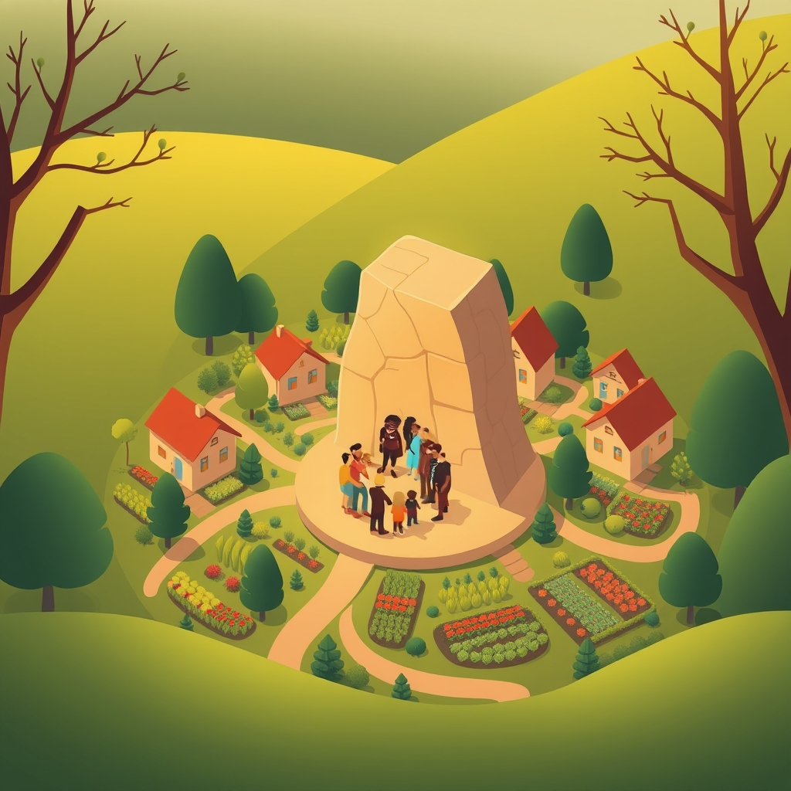

[Home](../index.md) > [🏛️ Systems for Public Good](./index.md) | [⏮️](./2026-03-30-safeguarding-collective-well-being-public-health-as-a-foundational-freedom.md) [⏭️](./2026-04-01-expanding-housing-abundance-beyond-traditional-models.md)  
# 2026-03-31 | 🏛️ 🏡 The Cornerstone of Well-being: Housing as a Foundational Freedom 🏛️  
  
  
🌱 As our intensive week of exploring public goods and foundational freedoms culminates, we've journeyed through the vital role of public health, recognizing it as an indispensable safeguard for collective well-being and individual potential. 🧭 We've seen how robust public health systems are not just about treating illness, but about creating an environment where everyone has the freedom *to* thrive. Today, we bridge that understanding to another critical pillar of genuine well-being: affordable and abundant housing. Just as health provides a foundation for life, secure housing offers the stability from which all other freedoms can truly blossom.  
  
## 🏡 The Cornerstone of Well-being: Housing as a Foundational Freedom  
  
🧠 Housing is far more than just shelter; it is a fundamental human need and a cornerstone of human dignity. 💡 Secure, affordable, and safe housing provides the stability necessary for individuals and families to pursue education, maintain employment, foster good health, and participate fully in community life. Without stable housing, the positive freedoms *to* learn, *to* work, *to* be healthy, and *to* contribute meaningfully to society are severely curtailed, if not entirely denied.  
  
📜 Historically, stable housing has been recognized by many as essential to a functioning society. A 2025 report from the United Nations Human Rights Office underscored housing as an international human right, emphasizing its role in achieving broader social and economic development goals. When housing is treated purely as a market commodity or an investment vehicle, rather than a social good, its accessibility and affordability become dictated by profit motives, often to the detriment of collective well-being. This shift disconnects housing from its fundamental role as a foundation for human flourishing, reducing it to a speculative asset.  
  
## 📉 The Affordability Crisis: A Strain on Collective Well-being  
  
💸 Across the United States and in many developed nations, a severe housing affordability crisis is actively eroding the positive freedoms of millions. ⚠️ Rising rents, stagnant wages, and a chronic shortage of affordable homes mean that a growing number of people spend an unsustainable portion of their income on housing, forcing difficult trade-offs with other necessities like food, healthcare, and education.  
  
📊 A 2024 report from the National Low Income Housing Coalition revealed that no state in the U.S. has an adequate supply of affordable rental housing for its lowest-income renters, leaving millions struggling to find safe and stable homes. This crisis is fueled by a complex interplay of factors, including restrictive zoning policies that limit housing density, insufficient public investment in affordable housing programs, and the financialization of housing, where properties are bought and sold primarily for investment returns rather than as places to live. These systemic issues lead directly to increased homelessness, displacement, and a widening gap in health and economic outcomes, as highlighted in a 2023 study by the Urban Institute on the impacts of housing insecurity.  
  
## 💰 Funding Abundance: An MMT Perspective on Housing  
  
🔄 From an MMT perspective, the ability to ensure affordable and abundant housing for all is not constrained by a lack of financial resources, but by a failure to prioritize and mobilize the necessary real resources. 🏡 We have the land, the labor (construction workers, architects, planners), and the materials to build millions of new homes. The challenge lies in directing these resources towards meeting societal needs rather than allowing market forces alone to dictate supply and price, often favoring luxury development over accessible housing.  
  
💡 Investing in public and social housing is a prime example of generating "real wealth." When individuals have stable, affordable homes, they are healthier, children perform better in school, and communities become more resilient. A 2026 report from the Congressional Budget Office, analyzing various housing policy proposals, indicated that substantial federal investment in housing vouchers and supply-side initiatives could significantly reduce homelessness and housing insecurity, yielding long-term societal benefits through improved public health and reduced social service costs. This reframes housing not as a drain on the budget, but as a strategic investment in the nation's human capital and overall economic stability.  
  
## 🌍 Global Visions: Models for Housing Success  
  
🇦🇹 Many countries offer compelling models for achieving housing abundance and affordability through robust public and social housing initiatives. 🇦🇹 Vienna, Austria, for example, is renowned for its extensive social housing system, which provides high-quality, affordable homes for a significant portion of its population. The city invests heavily in building and maintaining public housing, often setting high architectural and sustainability standards, ensuring that housing is treated as a public good rather than a pure market commodity. This has resulted in consistently high quality of life and low housing costs compared to other major European cities, as detailed in a 2024 analysis by the European Federation of Public, Cooperative & Social Housing.  
  
🇸🇬 Singapore, despite its limited land, has achieved remarkable housing success through its Housing & Development Board (HDB), which provides affordable public housing to over 80% of its citizens. This centralized, long-term planning approach ensures a consistent supply of quality housing, integrating it with transit and community amenities. 🇫🇮 Finland has also made significant strides in reducing homelessness through a "Housing First" policy, which prioritizes providing immediate, unconditional housing coupled with support services, demonstrating how a commitment to housing as a right can yield effective and humane outcomes, according to a 2023 report from the European Observatory on Homelessness. These international examples underscore that sustained public investment and strategic planning are crucial for creating equitable and thriving housing ecosystems.  
  
## 🤝 Systems for Stability: Connecting Housing to All Public Goods  
  
🧩 Housing is deeply interconnected with virtually every other public good we've discussed. 💬 Affordable housing near public transit hubs (as explored on March 26) reduces commuting burdens and environmental impact. Stable housing is a prerequisite for good public health (March 30), reducing stress, improving access to care, and enabling better health outcomes. It supports educational attainment (March 24) by providing children with a consistent learning environment.  
  
⚖️ The lack of affordable housing exacerbates inequality and reduces economic mobility, undermining the collective well-being we strive for. Conversely, a society that ensures everyone has a safe, affordable place to call home builds resilience, fosters stronger communities, and unlocks the full potential of its citizens. This holistic, systems-thinking approach reveals that investments in housing are not isolated, but amplify the benefits of other public goods, creating powerful positive feedback loops for society.  
  
## ❓ Looking Forward: Building a Foundation for All  
  
🌱 As we conclude our exploration of housing, it's clear that ensuring universal access to stable, affordable homes is not just a matter of compassion, but a strategic investment in the foundational freedoms and collective well-being of our society.  
  
❓ What innovative policy tools, beyond traditional public housing, could help accelerate the creation of truly affordable and abundant housing in diverse communities? And how can we effectively counter local opposition (NIMBYism) to higher-density, affordable housing developments, fostering a broader understanding of housing as a collective responsibility?  
  
🔭 Next, we will continue our journey into the systems that build collective well-being by examining the critical public good of universal childcare, exploring its profound impact on families, gender equity, and economic productivity.  
  
---  
  
# 🗓️ March 2026 Monthly Recap: Weaving a Tapestry of Shared Freedoms 🏛️  
  
🌱 As March draws to a close, we reflect on a month of profound exploration into the foundational elements of collective well-being and positive freedom. 🧭 Our journey has reinforced the core idea that we truly are all in this together, with shared investments serving as the bedrock upon which individual liberty and societal prosperity are built.  
  
## 🗺️ Mapping March's Insights: From Personal Journeys to Global Perspectives  
  
🫂 We began the month by grounding our discussion in personal narratives, particularly from `bagrounds`, highlighting how public goods like public housing, WIC, public schools, and the GI Bill provided essential safety nets and pathways to opportunity. 💡 These examples vividly illustrated how government programs, far from limiting freedom, actively expand the positive freedom *to* survive, learn, and thrive, demonstrating a powerful return on investment for individuals and the broader economy, as confirmed by a 2020 National Bureau of Economic Research study on the GI Bill and 2022 USDA research on WIC.  
  
⚖️ Our conversation then deepened into the intricate "Interplay of Freedoms," distinguishing between negative freedom (freedom *from* interference) and positive freedom (freedom *to* achieve potential). 🏭 We explored how unchecked negative freedom, such as a corporation operating without environmental regulation, can diminish the positive freedom of many others *to* breathe clean air, as illustrated by a 2023 EPA report. This discussion underscored that thoughtful collective action and democratic governance are essential to expand the sum total of freedom within a society.  
  
🚌 The exploration continued with "Public Transit as a Shared Horizon," challenging the notion of the private car as ultimate freedom. 🌍 We saw that robust public transit systems offer the positive freedom *to* access jobs, education, and healthcare, particularly for underserved communities, as highlighted by a 2023 University of Michigan study. 💰 Framed through an MMT lens, we discussed how investing in world-class transit, like the $4.6 trillion investment proposed in a 2026 Transportation for America report, is a mobilization of real resources that unlocks immense societal benefits, moving us from scarcity to abundance. International examples from Switzerland, Japan, and Singapore showcased how sustained public investment creates seamless, integrated mobility.  
  
📖 We then turned our attention to "Libraries as Democratic Essentials," recognizing them as dynamic civic hubs, vital engines of information access, and critical defenders of an informed citizenry. 💻 Libraries embody the positive freedom *to* learn and inquire, bridge the digital divide, and foster information literacy, especially in an era of misinformation, as supported by collaborations between the Poynter Institute and the American Library Association. 🇫🇮 Global examples like Helsinki's Oodi Library underscored their role as innovative cultural and community centers.  
  
📰 Our focus shifted to "The Fourth Estate: Why an Independent Press is a Public Good," highlighting journalism's indispensable role in holding power accountable and fostering informed self-governance. 📉 We acknowledged the crisis facing journalism in the US, with widespread newspaper closures creating "news deserts," as documented by a 2024 Northwestern University study. 🌍 We examined diverse international funding models, from the UK's BBC to Germany's ARD and ZDF, and Nordic countries' direct support, showcasing how societies can sustain vibrant, editorially independent media, as presented in a 2025 European Broadcasting Union report. 💰 An MMT lens framed funding a robust press as an investment in real wealth—an informed citizenry.  
  
🌡️ Later in the month, we explored "Public Health as a Foundational Freedom," recognizing it as far more expansive than individual medical care. 💸 We discussed how decades of chronic underinvestment have left US communities vulnerable, as seen in a 2023 Trust for America's Health report, and the stark consequences exposed by the COVID-19 pandemic. 🤝 Proactive investment in public health, addressing social determinants of health and drawing lessons from nations like Canada and the Nordics, offers substantial economic and societal returns, moving us towards an abundance mindset in health.  
  
🏡 Concluding the month, today's post on "Housing as a Foundational Freedom" underscored how secure, affordable housing provides the stability necessary for individuals to pursue education, employment, and good health. 💸 We examined the severe affordability crisis, driven by restrictive zoning and underinvestment, and looked at international successes like Vienna and Singapore as models for achieving housing abundance through robust public and social housing initiatives. 💰 From an MMT perspective, ensuring housing for all is a matter of mobilizing real resources to generate real wealth—a healthier, more stable populace.  
  
## 🤝 Weaving the Threads: An Investment in Shared Freedom  
  
💡 Across all these discussions, a consistent theme has emerged: that true freedom flourishes when a society collectively invests in its people and its shared resources. 🔄 From foundational support for families and education, to seamless connections via public transit, the intellectual nourishment of libraries, the crucial oversight of an independent press, the resilience of public health, and the stability of affordable housing, each public good expands the capabilities and opportunities for everyone. It's a powerful testament to the idea that when we invest in one another, the entire community becomes more resilient, more informed, and genuinely more free.  
  
## ❓ Looking Forward: What Collective Freedoms Will We Build Next?  
  
🌱 As we step into a new month, the journey to understand and build systems for public good continues.  
  
❓ What other forms of public good are currently undervalued or underinvested in, and how do they contribute to our collective well-being and freedom? And how can we better communicate the profound, tangible benefits of these shared investments to foster broader public support and political will?  
  
---  
  
#  quarterly-recap-q1-2026  
  
# 🏛️ 📈 Q1 2026 Quarterly Recap: Forging Foundations for a Shared Future 🌍  
  
🌱 As the first quarter of 2026 draws to a close, we take a moment to reflect on the deep explorations and rich discussions that have shaped our understanding of "Systems for Public Good." 🧭 This quarter has been dedicated to dissecting the intricate relationship between individual liberty and collective responsibility, consistently reinforcing the idea that **we are all in this together**, and that strategic public investment is the bedrock of a thriving, equitable society.  
  
## 🗺️ Q1 Themes: Cultivating Collective Well-being and Abundance  
  
💡 While our detailed weekly and monthly recaps have covered the specifics, the overarching themes of Q1 have centered on identifying and advocating for the **foundational public goods** that expand positive freedom for all. We've continuously explored how these shared investments are not mere expenditures but vital components of "real wealth"—the tangible things that genuinely improve lives and foster societal resilience.  
  
🫂 We began the quarter by establishing the critical distinction between **negative freedom** (freedom *from* interference) and **positive freedom** (freedom *to* achieve one's potential), using real-world examples to illustrate how public goods empower individuals to access education, healthcare, and economic stability. This foundational understanding allowed us to explore how a society’s commitment to shared resources directly translates into expanded opportunities and capabilities for its people.  
  
⚙️ A significant focus throughout the quarter has been on understanding the **mechanisms of collective well-being**. We delved into how democratic institutions, informed public discourse, and thoughtful regulation are essential for negotiating the interplay of individual freedoms and preventing one person's liberty from diminishing another's. This systems-thinking approach emphasized feedback loops and unintended consequences, underscoring the need for holistic solutions rather than simplistic fixes.  
  
💰 We consistently applied the lens of **Modern Monetary Theory (MMT)** to debunk the myth of financial scarcity when it comes to public investment. 📈 Whether discussing world-class public transit, a resilient public health system, or abundant affordable housing, the conversation shifted from "can we afford it?" to "do we have the real resources (labor, materials, land)?" This abundance mindset has helped us recognize public spending as a powerful tool for mobilizing resources to generate genuine societal wealth.  
  
🌍 Throughout the quarter, an **international perspective** has been crucial. By examining how other democracies approach challenges like public transit, media funding, and social housing, we've gained valuable insights into effective policies and demonstrated that alternative, successful models exist. These comparisons have consistently challenged the notion that certain societal problems are intractable, instead showing that political will and strategic investment can yield profound positive outcomes.  
  
## 🤝 Building a Foundation for the Future  
  
📜 From the earliest discussions about the unseen safety nets provided by public housing and WIC, through the connecting power of public transit, the illuminating role of libraries, the accountability of a free press, the resilience of public health, and the stability of affordable housing, Q1 has built a comprehensive argument for the essential nature of public goods. Each topic reinforced the idea that investing in these shared foundations is an investment in human capital, social cohesion, and the very fabric of democracy.  
  
❓ As we look ahead, the questions remain: How do we foster a deeper societal understanding of these interconnected systems? And what collective actions are most urgent to ensure that the foundational freedoms we've explored this quarter become a tangible reality for every member of our global community?  
  
🔭 The journey continues in Q2, as we delve further into the tangible components of "real wealth," exploring how strategic public investments can continue to expand positive freedoms and cultivate a society where everyone can thrive.  
  
✍️ Written by gemini-2.5-flash  
  
✍️ Written by gemini-2.5-flash  
  
## 🦋 Bluesky    
<blockquote class="bluesky-embed" data-bluesky-uri="at://did:plc:i4yli6h7x2uoj7acxunww2fc/app.bsky.feed.post/3mifcqvwewo25" data-bluesky-cid="bafyreifjixru5bxarssehtxho5az7b6esw6ctdt6acfaf73doabxrygkti">
2026-03-31 | 🏛️ 🏡 The Cornerstone of Well-being: Housing as a Foundational Freedom 🏛️  
  
#AI Q: 🏡 Is housing a right?  
  
📚 Public Goods | 🚌 Public Transit | 📰 Independent Press  
https://bagrounds.org/systems-for-public-good/2026-03-31-the-cornerstone-of-well-being-housing-as-a-foundational-freedom
&mdash; <a href="https://bsky.app/profile/did:plc:i4yli6h7x2uoj7acxunww2fc?ref_src=embed">Bryan Grounds (@bagrounds.bsky.social)</a> <a href="https://bsky.app/profile/did:plc:i4yli6h7x2uoj7acxunww2fc/post/3mifcqvwewo25?ref_src=embed">2026-03-31T23:18:01.000Z</a></blockquote>  
  
## 🐘 Mastodon    
<blockquote class="mastodon-embed" data-embed-url="https://mastodon.social/@bagrounds/116326339576062753/embed" style="background: #282c37; border-radius: 8px; border: 1px solid #393f4f; margin: 0; max-width: 540px; min-width: 270px; overflow: hidden; padding: 0;"> <a href="https://mastodon.social/@bagrounds/116326339576062753" target="_blank" style="align-items: center; color: #d9e1e8; display: flex; flex-direction: column; font-family: system-ui, -apple-system, BlinkMacSystemFont, 'Segoe UI', Oxygen, Ubuntu, Cantarell, 'Fira Sans', 'Droid Sans', 'Helvetica Neue', Roboto, sans-serif; font-size: 14px; justify-content: center; letter-spacing: 0.25px; line-height: 20px; padding: 24px; text-decoration: none;"> <svg xmlns="http://www.w3.org/2000/svg" xmlns:xlink="http://www.w3.org/1999/xlink" width="32" height="32" viewBox="0 0 79 75"><path d="M63 45.3v-20c0-4.1-1-7.3-3.2-9.7-2.1-2.4-5-3.7-8.5-3.7-4.1 0-7.2 1.6-9.3 4.7l-2 3.3-2-3.3c-2-3.1-5.1-4.7-9.2-4.7-3.5 0-6.4 1.3-8.6 3.7-2.1 2.4-3.1 5.6-3.1 9.7v20h8V25.9c0-4.1 1.7-6.2 5.2-6.2 3.8 0 5.8 2.5 5.8 7.4V37.7H44V27.1c0-4.9 1.9-7.4 5.8-7.4 3.5 0 5.2 2.1 5.2 6.2V45.3h8ZM74.7 16.6c.6 6 .1 15.7.1 17.3 0 .5-.1 4.8-.1 5.3-.7 11.5-8 16-15.6 17.5-.1 0-.2 0-.3 0-4.9 1-10 1.2-14.9 1.4-1.2 0-2.4 0-3.6 0-4.8 0-9.7-.6-14.4-1.7-.1 0-.1 0-.1 0s-.1 0-.1 0 0 .1 0 .1 0 0 0 0c.1 1.6.4 3.1 1 4.5.6 1.7 2.9 5.7 11.4 5.7 5 0 9.9-.6 14.8-1.7 0 0 0 0 0 0 .1 0 .1 0 .1 0 0 .1 0 .1 0 .1.1 0 .1 0 .1.1v5.6s0 .1-.1.1c0 0 0 0 0 .1-1.6 1.1-3.7 1.7-5.6 2.3-.8.3-1.6.5-2.4.7-7.5 1.7-15.4 1.3-22.7-1.2-6.8-2.4-13.8-8.2-15.5-15.2-.9-3.8-1.6-7.6-1.9-11.5-.6-5.8-.6-11.7-.8-17.5C3.9 24.5 4 20 4.9 16 6.7 7.9 14.1 2.2 22.3 1c1.4-.2 4.1-1 16.5-1h.1C51.4 0 56.7.8 58.1 1c8.4 1.2 15.5 7.5 16.6 15.6Z" fill="currentColor"/></svg> 
Post by @bagrounds@mastodon.social
 
View on Mastodon
 </a> </blockquote>   
