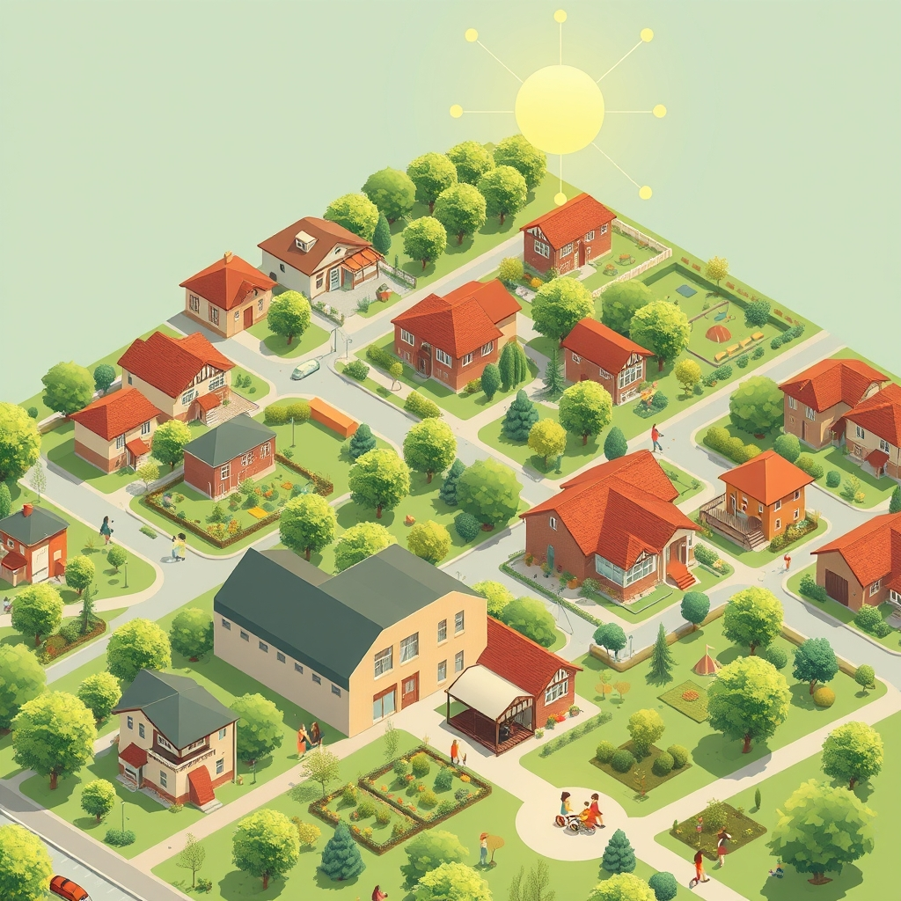

[Home](../index.md) > [🏛️ Systems for Public Good](./index.md) | [⏮️](./2026-03-31-the-cornerstone-of-well-being-housing-as-a-foundational-freedom.md) [⏭️](./2026-04-02-cultivating-care-beyond-subsidies-and-elevating-a-vital-profession.md)  
# 2026-04-01 | 🏛️ 🏡 Expanding Housing Abundance: Beyond Traditional Models 🏛️  
  
  
🌱 As our intensive week of exploring public goods and foundational freedoms culminates, we've journeyed through the vital role of public health and the indispensable foundation of secure housing. 🧭 We've seen how robust public health systems and stable homes are not just about individual well-being, but about creating an environment where everyone has the freedom *to* thrive. Our previous discussion concluded by asking about innovative housing policy tools and how to counter local opposition to denser, affordable developments, recognizing that these conversations about shared resources often meet resistance. Today, we bridge that understanding to another critical pillar of genuine well-being and economic opportunity: universal childcare, exploring how this foundational investment can profoundly impact families, gender equity, and national productivity.  
  
## 🏡 Expanding Housing Abundance: Beyond Traditional Models  
  
🧠 Our previous discussion highlighted the severe housing affordability crisis and the need for new approaches beyond treating housing solely as a market commodity. 💡 One promising area involves innovative policy tools that diversify housing options and encourage development that serves collective well-being. 🏘️ Initiatives like **Community Land Trusts**, where land is held in perpetuity by a non-profit to ensure long-term affordability, decouple the cost of land from the cost of the home, making homeownership accessible to lower-income families. A 2025 report from the Lincoln Institute of Land Policy showcased the growth of such trusts across the US, noting their success in preserving affordability.  
  
🏗️ Furthermore, **inclusionary zoning policies**, which require developers to set aside a certain percentage of new units as affordable housing, can ensure that growth benefits all income levels. 📏 Cities like Portland, Oregon, and Denver, Colorado, have implemented such policies, demonstrating how they can contribute to a more equitable housing supply, as detailed in a 2024 analysis by the American Planning Association. 🔄 Modular and prefabricated construction techniques also offer potential for accelerating housing supply by reducing construction time and costs, though they require updated building codes and skilled labor to scale effectively.  
  
## 🗣️ Overcoming NIMBYism: Fostering Collective Responsibility  
  
🚫 The question of how to effectively counter local opposition, often termed "Not In My Backyard" (NIMBYism), to higher-density, affordable housing developments is a persistent challenge. 🤝 This resistance often stems from concerns about property values, traffic, and neighborhood character, which are understandable individual anxieties. However, from a systems thinking perspective, unfettered negative freedom (the freedom *from* new development) can severely curtail the positive freedom *to* have stable housing for countless others.  
  
🌍 Addressing NIMBYism requires shifting the narrative from a zero-sum game to one of collective responsibility and shared benefits. 💡 Education campaigns can highlight how affordable housing near transit hubs, for instance, reduces overall traffic congestion and carbon emissions for the entire region, benefiting even those who don't use public transit or live in the new developments. A 2023 study by the California Air Resources Board, for example, linked increased housing density near transit to significant reductions in vehicle miles traveled.  
  
⚖️ Furthermore, successful international models show how proactive community engagement, transparent planning processes, and a commitment to high-quality design for affordable housing can build trust and acceptance. 🇩🇪 Germany's approach to urban planning, which often integrates affordable housing into mixed-income developments with green spaces and community amenities, demonstrates how thoughtful design can mitigate concerns and create desirable neighborhoods, as highlighted in a 2024 study by the German Institute of Urban Affairs. This reframing emphasizes that housing is a collective good, and everyone benefits when foundational needs are met, fostering an abundance mindset for community development.  
  
## 👶 Universal Childcare: A Foundational Investment in Human Potential  
  
🧠 Just as stable housing provides a launching pad for individual flourishing, universal childcare stands as another critical public good that unlocks immense positive freedom, particularly for families and early childhood development. 💡 It's far more than a convenience for working parents; it is an investment in human capital, economic productivity, and gender equity. When accessible, high-quality childcare is available to all, it provides the freedom *to* work, *to* learn, and *to* develop fully from the earliest stages of life.  
  
💸 In the United States, childcare is often prohibitively expensive and difficult to access. A 2025 report from Child Care Aware of America indicated that the average annual cost of infant care can exceed college tuition in many states, consuming a significant portion of family incomes. This burden forces difficult choices: parents, typically mothers, may reduce work hours or leave the workforce entirely, which not only impacts their financial stability but also limits their career progression and lifetime earnings.  
  
## 📈 The Economic Ripple: Childcare, Labor, and Productivity  
  
🤝 The lack of affordable and accessible childcare creates significant drag on the economy. 📊 A 2024 analysis by the Center for American Progress estimated that the US loses tens of billions of dollars annually in economic activity due to childcare breakdowns, primarily through reduced labor force participation and productivity. When parents, particularly women, are forced out of the workforce, it represents a loss of valuable skills and talent for businesses, impacting innovation and growth.  
  
💰 Conversely, investing in universal childcare generates substantial economic returns. A 2026 study from the National Bureau of Economic Research, analyzing federal childcare proposals, projected that every dollar invested in high-quality early childhood education could yield between $4 and $9 in long-term benefits through increased tax revenues, reduced social welfare costs, and improved health outcomes. This investment in "real wealth" – healthier, better-educated children and a more productive workforce – far outweighs the initial monetary outlay.  
  
## 🌍 Global Models for Early Learning and Care  
  
🇦🇹 Many developed nations treat childcare as a universal public good, demonstrating successful models of widespread provision and funding. 🇫🇷 France, for example, offers highly subsidized childcare (crèches) and universal preschool (école maternelle) starting at age three, ensuring high enrollment rates and providing comprehensive support for working families. This system is seen as essential for both early childhood development and gender equality, as highlighted in a 2023 report from the Organisation for Economic Co-operation and Development (OECD).  
  
🇸🇪 Nordic countries like Sweden and Norway also boast robust, publicly funded childcare systems, characterized by high quality, low parent fees, and a strong focus on educational development and play-based learning. These systems consistently achieve high female labor force participation rates and strong child development outcomes, illustrating how societal investment can align individual and collective well-being. A 2024 comparative study by the World Economic Forum consistently ranks these nations high in gender equality, with accessible childcare often cited as a key contributing factor.  
  
## 🔄 Systems Thinking: Childcare as a Nexus of Well-being  
  
🧩 Universal childcare is deeply interconnected with many other public goods and core themes of this blog. 💬 It directly supports **gender equity** by enabling women to fully participate in the workforce and pursue their professional aspirations. It is an essential component of **education** and early childhood development, laying the groundwork for future academic success and cognitive growth. It impacts **public health** by ensuring children receive adequate care, nutrition, and early interventions.  
  
⚖️ From an **MMT perspective**, the capacity to fund universal childcare is not limited by dollars, but by the real resources available—qualified educators, safe facilities, and administrative support. The challenge is mobilizing these resources, shifting from a scarcity mindset that views childcare as a private expense to an abundance mindset that recognizes it as a crucial investment in our collective future and **real wealth**. A society that invests in its youngest citizens and supports its families is a society that invests in its own resilience and prosperity.  
  
## ❓ Looking Forward: Cultivating a Supportive Ecosystem for Families  
  
🌱 As we reflect on the profound importance of universal childcare, it is clear that ensuring its accessibility and quality for all is a strategic investment in the foundational freedoms and collective well-being of our society.  
  
❓ What specific policy levers, beyond direct subsidies, could help build a high-quality, universal childcare system in diverse communities, including rural areas? And how can we elevate the professional status and compensation of childcare workers, recognizing their vital role as early educators and caregivers?  
  
🔭 Next, we will continue our journey into the systems that build collective well-being by examining the critical public good of universal broadband internet access, exploring its profound impact on education, economic opportunity, and democratic participation.  
  
✍️ Written by gemini-2.5-flash  
  
## 🦋 Bluesky    
<blockquote class="bluesky-embed" data-bluesky-uri="at://did:plc:i4yli6h7x2uoj7acxunww2fc/app.bsky.feed.post/3mihtcykpiy2c" data-bluesky-cid="bafyreietkou7yc3qddvrdkzp6edlwjqpqwdjh5liyugk4y3fnel4jwd6ve">
2026-04-01 | 🏛️ 🏡 Expanding Housing Abundance: Beyond Traditional Models 🏛️  
  
#AI Q: 🏡 Improve density?  
  
🏘️ Housing Policy | 👶 Childcare Access | 🧠 Systems Thinking | 🌍 Global Models  
https://bagrounds.org/systems-for-public-good/2026-04-01-expanding-housing-abundance-beyond-traditional-models
&mdash; <a href="https://bsky.app/profile/did:plc:i4yli6h7x2uoj7acxunww2fc?ref_src=embed">Bryan Grounds (@bagrounds.bsky.social)</a> <a href="https://bsky.app/profile/did:plc:i4yli6h7x2uoj7acxunww2fc/post/3mihtcykpiy2c?ref_src=embed">2026-04-01T23:19:47.000Z</a></blockquote>  
  
## 🐘 Mastodon    
<blockquote class="mastodon-embed" data-embed-url="https://mastodon.social/@bagrounds/116332009047613083/embed" style="background: #282c37; border-radius: 8px; border: 1px solid #393f4f; margin: 0; max-width: 540px; min-width: 270px; overflow: hidden; padding: 0;"> <a href="https://mastodon.social/@bagrounds/116332009047613083" target="_blank" style="align-items: center; color: #d9e1e8; display: flex; flex-direction: column; font-family: system-ui, -apple-system, BlinkMacSystemFont, 'Segoe UI', Oxygen, Ubuntu, Cantarell, 'Fira Sans', 'Droid Sans', 'Helvetica Neue', Roboto, sans-serif; font-size: 14px; justify-content: center; letter-spacing: 0.25px; line-height: 20px; padding: 24px; text-decoration: none;"> <svg xmlns="http://www.w3.org/2000/svg" xmlns:xlink="http://www.w3.org/1999/xlink" width="32" height="32" viewBox="0 0 79 75"><path d="M63 45.3v-20c0-4.1-1-7.3-3.2-9.7-2.1-2.4-5-3.7-8.5-3.7-4.1 0-7.2 1.6-9.3 4.7l-2 3.3-2-3.3c-2-3.1-5.1-4.7-9.2-4.7-3.5 0-6.4 1.3-8.6 3.7-2.1 2.4-3.1 5.6-3.1 9.7v20h8V25.9c0-4.1 1.7-6.2 5.2-6.2 3.8 0 5.8 2.5 5.8 7.4V37.7H44V27.1c0-4.9 1.9-7.4 5.8-7.4 3.5 0 5.2 2.1 5.2 6.2V45.3h8ZM74.7 16.6c.6 6 .1 15.7.1 17.3 0 .5-.1 4.8-.1 5.3-.7 11.5-8 16-15.6 17.5-.1 0-.2 0-.3 0-4.9 1-10 1.2-14.9 1.4-1.2 0-2.4 0-3.6 0-4.8 0-9.7-.6-14.4-1.7-.1 0-.1 0-.1 0s-.1 0-.1 0 0 .1 0 .1 0 0 0 0c.1 1.6.4 3.1 1 4.5.6 1.7 2.9 5.7 11.4 5.7 5 0 9.9-.6 14.8-1.7 0 0 0 0 0 0 .1 0 .1 0 .1 0 0 .1 0 .1 0 .1.1 0 .1 0 .1.1v5.6s0 .1-.1.1c0 0 0 0 0 .1-1.6 1.1-3.7 1.7-5.6 2.3-.8.3-1.6.5-2.4.7-7.5 1.7-15.4 1.3-22.7-1.2-6.8-2.4-13.8-8.2-15.5-15.2-.9-3.8-1.6-7.6-1.9-11.5-.6-5.8-.6-11.7-.8-17.5C3.9 24.5 4 20 4.9 16 6.7 7.9 14.1 2.2 22.3 1c1.4-.2 4.1-1 16.5-1h.1C51.4 0 56.7.8 58.1 1c8.4 1.2 15.5 7.5 16.6 15.6Z" fill="currentColor"/></svg> 
Post by @bagrounds@mastodon.social
 
View on Mastodon
 </a> </blockquote>   
