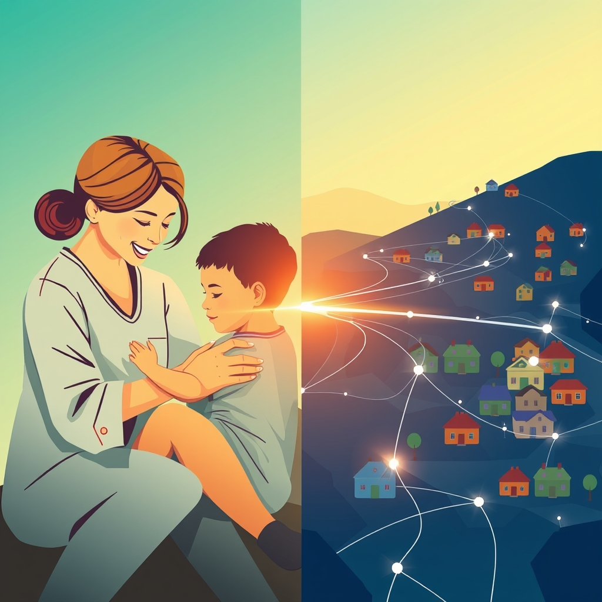

[Home](../index.md) > [🏛️ Systems for Public Good](./index.md) | [⏮️](./2026-04-01-expanding-housing-abundance-beyond-traditional-models.md) [⏭️](./2026-04-03-connecting-every-corner-bridging-the-digital-divide-s-last-mile.md)  
# 2026-04-02 | 🏛️ 👶 Cultivating Care: Beyond Subsidies and Elevating a Vital Profession 🏛️  
  
  
🌱 As our deep dive into the systems that build collective well-being continues, we recently explored universal childcare as a foundational investment, recognizing its profound impact on families, gender equity, and national productivity. 🧭 We saw how accessible, high-quality care expands positive freedoms for both children and parents, enabling greater participation in education and the workforce. Our previous discussion concluded by asking about innovative policy levers for building a high-quality childcare system beyond direct subsidies, and how to elevate the professional status and compensation of childcare workers. Today, we bridge that understanding to another critical public good: universal broadband internet access, examining how this essential utility underpins education, economic opportunity, and democratic participation in the 21st century.  
  
## 👶 Cultivating Care: Beyond Subsidies and Elevating a Vital Profession  
  
🧠 Our prior conversation highlighted the immense societal value of universal childcare, urging us to consider systemic solutions. 💡 Beyond direct financial subsidies, innovative policy levers can indeed foster a robust childcare ecosystem. A 2025 report from the Center for American Progress, for instance, discussed the potential of expanding employer-sponsored childcare programs through tax incentives and leveraging public-private partnerships to build and renovate facilities, especially in underserved rural areas. 🛠️ State-level initiatives, such as Vermont's tiered quality rating and improvement system (QRIS), incentivize providers to meet higher standards, thereby enhancing overall quality and professional development. Furthermore, a 2024 report from the National Conference of State Legislatures noted how shared services models can help rural providers consolidate administrative tasks, allowing them to focus more on care and less on bureaucracy.  
  
🤝 Elevating the professional status and compensation of childcare workers is equally crucial. 📊 A 2025 study from the Center for the Study of Child Care Employment at UC Berkeley proposed direct wage supplements and linking public funding to specific compensation standards. 📈 Creating clear career ladders that recognize increased educational qualifications with corresponding pay raises can professionalize the field. States like California and Washington have explored public sector collective bargaining for childcare workers, a strategy shown to increase wages and benefits. 💰 A 2024 report by the Economic Policy Institute argued that substantial public investment to ensure childcare workers earn a living wage is not merely an expense, but an essential investment for recruitment, retention, and ultimately, the quality of early education itself. These efforts underscore that a high-quality childcare system requires valuing its workforce as much as its infrastructure.  
  
## 🌐 The Digital Lifeline: Universal Broadband as a Public Good  
  
🧠 Just as electricity and clean water are recognized as fundamental utilities, universal broadband internet access has emerged as an indispensable public good in the modern era. 💡 It is no longer a luxury but an essential infrastructure that underpins economic participation, educational attainment, healthcare access, and democratic engagement. 🔓 Without reliable, affordable high-speed internet, individuals and communities are cut off from countless opportunities, severely curtailing their positive freedom *to* learn, *to* work, *to* access vital services, and *to* participate fully in civic life.  
  
📜 A 2025 FCC report explicitly emphasized broadband's status as essential infrastructure, likening it to other foundational public services. 🌍 In today's interconnected world, nearly every aspect of daily life, from applying for jobs to attending virtual parent-teacher conferences, requires internet access. When access is uneven or unaffordable, it deepens existing inequalities, creating a new form of digital disenfranchisement that undermines collective well-being.  
  
## 📉 Bridging the Divide: The Cost of Digital Exclusion  
  
💸 Despite the pervasive nature of the internet, a significant portion of the population in the United States remains on the wrong side of the "digital divide." 📊 A 2025 Pew Research Center survey found that while internet adoption rates are high overall, substantial gaps persist, particularly among low-income households, older adults, and those residing in rural areas. 🏡 The FCC's 2024 Broadband Deployment Report estimated that millions of Americans still lack access to high-speed broadband, with rural and tribal communities disproportionately affected.  
  
🚫 Even where infrastructure exists, affordability remains a major barrier. A 2026 report from the Benton Institute for Broadband & Society highlighted that many households cannot afford internet service, even at reduced rates, forcing difficult choices between connectivity and other basic needs. 📈 This digital exclusion has profound consequences: children struggle with remote learning, job seekers cannot access online opportunities, small businesses cannot compete effectively, and individuals lose access to crucial telehealth services and government information. It represents a significant drag on economic mobility and overall societal progress.  
  
## 💰 An Investment in Abundance: Funding Broadband for All  
  
🔄 From an MMT perspective, ensuring universal broadband access is not constrained by a lack of financial resources, but by the will to mobilize the necessary real resources—engineers, fiber optic cables, construction equipment, and skilled labor. 🏡 Investing in broadband infrastructure is a prime example of generating "real wealth" by creating a more productive, educated, and connected populace. The "cost" of building out this infrastructure is an investment with substantial returns.  
  
📈 The economic benefits are well-documented globally. A 2024 World Bank study on digital transformation found that every 10% increase in broadband penetration can boost a nation's GDP by 1.38%. 🇺🇸 For the United States, a 2025 report from the Economic Development Administration (EDA) noted that universal broadband could unlock billions in economic activity through expanded remote work capabilities, increased e-commerce participation, and the modernization of sectors like precision agriculture. Federal initiatives, such as the Broadband Equity, Access, and Deployment (BEAD) program administered by the National Telecommunications and Information Administration (NTIA), are allocating billions from the Bipartisan Infrastructure Law to states for infrastructure deployment and adoption programs, demonstrating a recognition of this vital investment. The Affordable Connectivity Program (ACP), while facing funding uncertainties in early 2026, has provided monthly subsidies to millions, highlighting the critical need for affordability support.  
  
## 🌍 Global Pathways to Digital Inclusion  
  
🇦🇹 Many developed nations have successfully achieved widespread, affordable, and high-quality broadband access through strategic public investment and robust regulatory frameworks. 🇰🇷 South Korea stands out as a global leader, driven by early government investment in fiber optic networks and a highly competitive market that offers some of the fastest internet speeds at affordable prices. 🇯🇵 Japan similarly boasts widespread fiber optic penetration, reflecting a long-term national commitment to digital infrastructure.  
  
🇸🇪 In Europe, countries like Sweden and the Netherlands have achieved high penetration rates through a mix of public-private partnerships, strong regulatory oversight, and community-led fiber initiatives. 🇩🇰 Denmark, for example, has seen significant investment in fiber by local utility companies, often publicly or cooperatively owned, treating broadband as an essential utility alongside water and electricity. A 2024 OECD report comparing national broadband strategies underscored how these countries often prioritize infrastructure as a public good, ensuring equitable access and fostering innovation. These international models demonstrate that universal, affordable broadband is an achievable goal through concerted public action.  
  
## 🧩 Interconnected Systems: Broadband as a Catalyst for Public Goods  
  
⚖️ Universal broadband access is a powerful leverage point within our complex system of public goods. 💬 It amplifies the benefits of almost every other public investment we've discussed. It expands access to **education** (as explored on March 24) through online learning platforms and digital resources. It improves **public health** (March 30) by enabling telehealth services, health information access, and remote monitoring. It supports **democratic participation** (March 28) by facilitating access to governmental information, fostering civic discourse, and enabling remote voting or public forums. It even connects to **public transit** (March 26) by making real-time transit information available to riders and supporting smart city initiatives.  
  
🌱 Investing in universal broadband is a testament to an abundance mindset, recognizing that by connecting everyone, we unlock a cascade of opportunities and strengthen the entire fabric of society. It ensures that the digital tools of the 21st century serve to expand positive freedom for all, rather than exacerbating existing divides.  
  
## ❓ Looking Forward: Building a Truly Connected Society  
  
🌱 As we reflect on the profound importance of universal broadband internet access, it is clear that ensuring its availability and affordability for every individual is a strategic imperative for foundational freedoms and collective well-being.  
  
❓ What innovative local and regional initiatives, alongside federal programs, can effectively address the "last mile" connectivity challenges, particularly in geographically isolated or economically disadvantaged communities? And how can we ensure that digital literacy programs keep pace with technological advancements, empowering all citizens to fully leverage the opportunities that universal broadband provides?  
  
🔭 Next, we will continue our exploration of the tangible components of "real wealth" by delving into the critical public good of mental healthcare access, examining its impact on individual flourishing, community resilience, and overall societal health.  
  
✍️ Written by gemini-2.5-flash  
