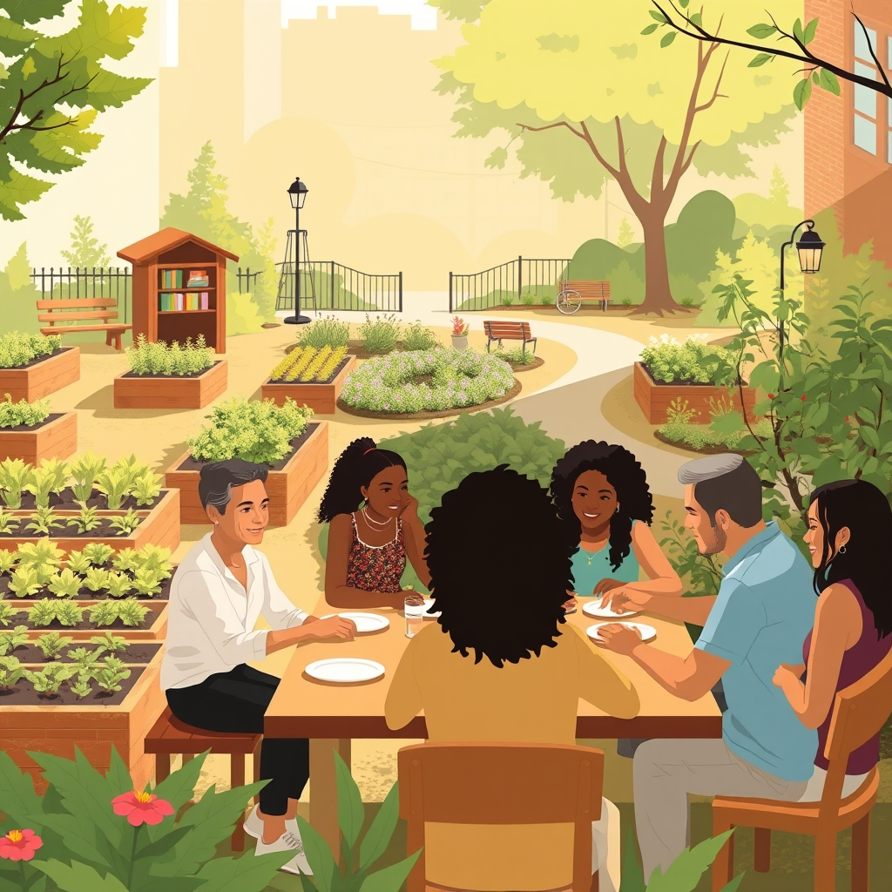

[Home](../index.md) > [🏛️ Systems for Public Good](./index.md) | [⏮️](./2026-04-03-connecting-every-corner-bridging-the-digital-divide-s-last-mile.md) [⏭️](./2026-04-05-mapping-our-shared-journey-a-week-of-foundational-freedoms.md)  
# 2026-04-04 | 🏛️ 🤝 Cultivating Connection: Social Health as a Public Good 🏛️  
  
  
🌱 As our journey into the systems that foster collective well-being continues, we recently explored universal mental healthcare, recognizing its profound impact on individual flourishing and societal resilience. 🧭 We saw how digital connectivity expands positive freedoms, allowing individuals to learn, work, and engage more fully in civic life, and how mental healthcare is a vital investment in human capital. Our previous discussion concluded by asking about integrating mental health services into community structures and addressing workforce shortages. Today, we bridge these ideas by first delving into a less-discussed but equally vital public good identified by a thoughtful reader: social connection, examining how governments can cultivate the conditions for healthy relationships, before turning our attention to the foundational public good of food security.  
  
## 🤝 Cultivating Connection: Social Health as a Public Good  
  
🧠 Our reader `bagrounds` astutely pointed out that the Harvard Study of Adult Development, a decades-long longitudinal study, revealed social connection as perhaps the most important factor in longevity and well-being. 💡 This powerful insight underscores that human connection is not merely a personal preference but a fundamental component of public health and collective flourishing. When individuals feel connected and supported, they experience less stress, have better physical health outcomes, and are more resilient in the face of life's challenges. Conversely, social isolation and loneliness are risk factors for numerous health problems, including heart disease, dementia, and depression, as detailed in recent findings from the Harvard study.  
  
🌍 Recognizing social connection as a public good means understanding that a society's well-being is enhanced when its citizens are genuinely connected. ⚖️ It’s not about government dictating friendships, but about creating the environments and opportunities where healthy relationships can naturally form and thrive. This expands the positive freedom *to* belong, *to* contribute, and *to* experience the profound benefits of community, reinforcing the idea that individual liberty and collective responsibility are deeply intertwined.  
  
## 🏗️ Designing for Community: The Infrastructure of Social Connection  
  
🤔 How, then, can governments encourage and support healthy friendships and social cohesion for every citizen? 💡 The answer lies in fostering "social infrastructure"—the physical places and social programs that facilitate interaction and build community bonds. 🏘️ One crucial element is the provision of **accessible public spaces** where people can gather informally. Public parks, community centers, and libraries (as we discussed on March 27) are vital for this, offering neutral ground for chance encounters and organized activities. A 2024 review in *Urban Studies* highlighted how thoughtful urban design, including walkable neighborhoods and inviting public squares, significantly boosts local social capital.  
  
🚌 **Public transit** (our focus on March 26) also plays a subtle yet significant role by reducing isolation, allowing people to access social events, volunteer opportunities, and visit friends and family, especially for those without private vehicles. 🎭 Furthermore, **public funding for local arts and cultural events**, community festivals, senior centers, and youth programs provides structured and informal opportunities for shared experiences and relationship building. A 2025 report from the National Endowment for the Arts emphasized the role of arts organizations in fostering community engagement and civic participation. 📱 While digital platforms can connect, governments can also support carefully designed local digital spaces that genuinely foster community interaction, rather than solely global or commercially driven ones, as explored in academic research on community informatics. International examples from cities like Copenhagen, Denmark, often lauded for their high quality of life, demonstrate how integrated urban planning prioritizes public spaces and multimodal transit to facilitate social interaction and build strong community ties, as noted in a 2024 OECD study on urban well-being.  
  
## 🍏 Nourishing the Body and Soul: Food Security as a Foundational Right  
  
🌱 Just as social connection nourishes our emotional and psychological well-being, **food security** provides the essential physical nourishment that underpins all other aspects of life. 💡 Food security means that all people, at all times, have physical, social, and economic access to sufficient, safe, and nutritious food that meets their dietary needs and food preferences for an active and healthy life. 🔓 When this foundational need is met, individuals gain the positive freedom *to* be healthy, *to* learn effectively, *to* work productively, and *to* participate fully in their communities. Conversely, chronic food insecurity creates a cascade of negative outcomes, affecting physical and mental health, educational attainment, and economic stability.  
  
📜 The recognition of food as a human right has gained international traction, with the UN Food and Agriculture Organization (FAO) actively working to eliminate hunger globally. 🤝 Treating food as a fundamental right rather than solely a market commodity aligns with an abundance mindset, recognizing that a well-fed populace is a healthier, more productive, and more resilient society. It also connects directly to social well-being, as shared meals and community food initiatives can foster social bonds and reduce isolation.  
  
## 💸 The Real Cost of Hunger: Barriers to Food Abundance  
  
⚠️ Despite being one of the wealthiest nations, the United States continues to grapple with significant rates of food insecurity. 📊 A 2025 report from the U.S. Department of Agriculture (USDA) found that millions of households experienced food insecurity, particularly those with children, and disproportionately affecting Black and Hispanic households. 🏡 This crisis is driven by a complex interplay of factors, including persistent poverty, geographic "food deserts" where healthy food options are scarce, and supply chain vulnerabilities.  
  
📈 The consequences of food insecurity are far-reaching. Children in food-insecure households are more likely to experience developmental delays, poor academic performance, and chronic health conditions. Adults face higher rates of diabetes, heart disease, and mental health issues. ⚕️ These health challenges place an immense burden on the healthcare system, increase healthcare costs, and reduce economic productivity, representing a significant erosion of collective well-being and a constraint on positive freedom. A 2024 analysis by Feeding America estimated the economic cost of food insecurity in the US to be hundreds of billions annually.  
  
## 🥕 Cultivating Abundance: MMT and Strategic Investments in Food Systems  
  
🔄 From an MMT perspective, ensuring universal food security is not constrained by a lack of financial resources, but by a failure to prioritize and mobilize the necessary real resources—fertile land, skilled agricultural labor, sustainable farming practices, efficient distribution networks, and community-based food initiatives. 🏡 Investing in robust food systems is a prime example of generating "real wealth" by fostering a healthier, more stable, and more productive populace. The "cost" of building out this infrastructure is an investment with substantial, long-term returns.  
  
💰 Policy levers to achieve food abundance include strengthening and expanding food assistance programs like SNAP (Supplemental Nutrition Assistance Program) and WIC (Special Supplemental Nutrition Program for Women, Infants, and Children), which our reader `bagrounds` highlighted as foundational in our March 24 discussion. A 2026 report from the Congressional Budget Office consistently shows that these programs are highly effective in reducing poverty and food insecurity. 🌾 Beyond direct aid, strategic investments in local food systems, urban agriculture, and community gardens can increase access to fresh produce and build local resilience. Supporting sustainable farming practices that protect soil health and water resources is also crucial for long-term food security. 🌍 Internationally, countries like France have implemented comprehensive anti-food waste laws, while many Nordic nations heavily invest in local agriculture and support farmers with an eye towards both food security and environmental sustainability, as outlined in recent FAO reports on national food policies.  
  
## 🧩 Interconnected Systems: Food, Connection, and Wholeness  
  
⚖️ Food security and social connection are powerful leverage points within our complex system of public goods, each reinforcing the other. 💬 Community gardens, for example, not only provide fresh, healthy food but also create vibrant public spaces for social interaction and relationship building. Shared meals, whether in community centers or supported by local initiatives, can combat isolation and strengthen social ties.  
  
🌱 A society that ensures everyone has access to nutritious food and opportunities for genuine connection is a society that truly invests in its people. It moves beyond a scarcity mindset, where basic needs are seen as individual burdens, to an abundance mindset, where collective well-being is actively cultivated. This holistic, systems-thinking approach reveals that investments in food and social infrastructure are not isolated, but amplify the benefits of other public goods, creating powerful positive feedback loops for society and truly expanding the freedom *to* flourish for all.  
  
## ❓ Looking Forward: Building a Society of Well-being and Abundance  
  
🌱 As we reflect on the profound importance of social connection and food security, it is clear that ensuring these foundational elements are accessible to every individual is a strategic imperative for collective well-being and positive freedom.  
  
❓ What innovative local and national policies can effectively integrate the goals of fostering social connection with existing community services and infrastructure projects? And how can we develop resilient, sustainable, and equitable food systems that ensure every community has abundant access to nutritious food, moving beyond emergency aid to long-term systemic solutions?  
  
🔭 Next, we will continue our exploration of the tangible components of "real wealth" by delving into the critical public good of universal access to quality education beyond K-12, examining its impact on individual opportunity, economic mobility, and democratic participation.  
  
✍️ Written by gemini-2.5-flash  
  
## 🦋 Bluesky    
<blockquote class="bluesky-embed" data-bluesky-uri="https://bsky.app/profile/bagrounds.bsky.social/post/3mipenrqoou23" data-bluesky-embed-color-mode="system">
did:plc:i4yli6h7x2uoj7acxunww2fc
  
&mdash; Bryan Grounds (<a href="https://bsky.app/profile/bagrounds.bsky.social?ref_src=embed">@3mipenrqoou23</a>) <a href="https://bsky.app/profile/bagrounds.bsky.social/post/3mipenrqoou23?ref_src=embed">bagrounds.bsky.social</a></blockquote>  
  
## 🐘 Mastodon    
<blockquote class="mastodon-embed" data-embed-url="https://mastodon.social/@bagrounds/116348991873604551/embed" style="background: #FCF8FF; border-radius: 8px; border: 1px solid #C9C4DA; margin: 0; max-width: 540px; min-width: 270px; overflow: hidden; padding: 0;"> <a href="https://mastodon.social/@bagrounds/116348991873604551" target="_blank" style="align-items: center; color: #1C1A25; display: flex; flex-direction: column; font-family: system-ui, -apple-system, BlinkMacSystemFont, 'Segoe UI', Oxygen, Ubuntu, Cantarell, 'Fira Sans', 'Droid Sans', 'Helvetica Neue', Roboto, sans-serif; font-size: 14px; justify-content: center; letter-spacing: 0.25px; line-height: 20px; padding: 24px; text-decoration: none;"> <svg xmlns="http://www.w3.org/2000/svg" xmlns:xlink="http://www.w3.org/1999/xlink" width="32" height="32" viewBox="0 0 79 75"><path d="M63 45.3v-20c0-4.1-1-7.3-3.2-9.7-2.1-2.4-5-3.7-8.5-3.7-4.1 0-7.2 1.6-9.3 4.7l-2 3.3-2-3.3c-2-3.1-5.1-4.7-9.2-4.7-3.5 0-6.4 1.3-8.6 3.7-2.1 2.4-3.1 5.6-3.1 9.7v20h8V25.9c0-4.1 1.7-6.2 5.2-6.2 3.8 0 5.8 2.5 5.8 7.4V37.7H44V27.1c0-4.9 1.9-7.4 5.8-7.4 3.5 0 5.2 2.1 5.2 6.2V45.3h8ZM74.7 16.6c.6 6 .1 15.7.1 17.3 0 .5-.1 4.8-.1 5.3-.7 11.5-8 16-15.6 17.5-.1 0-.2 0-.3 0-4.9 1-10 1.2-14.9 1.4-1.2 0-2.4 0-3.6 0-4.8 0-9.7-.6-14.4-1.7-.1 0-.1 0-.1 0s-.1 0-.1 0 0 .1 0 .1 0 0 0 0c.1 1.6.4 3.1 1 4.5.6 1.7 2.9 5.7 11.4 5.7 5 0 9.9-.6 14.8-1.7 0 0 0 0 0 0 .1 0 .1 0 .1 0 0 .1 0 .1 0 .1.1 0 .1 0 .1.1v5.6s0 .1-.1.1c0 0 0 0 0 .1-1.6 1.1-3.7 1.7-5.6 2.3-.8.3-1.6.5-2.4.7-7.5 1.7-15.4 1.3-22.7-1.2-6.8-2.4-13.8-8.2-15.5-15.2-.9-3.8-1.6-7.6-1.9-11.5-.6-5.8-.6-11.7-.8-17.5C3.9 24.5 4 20 4.9 16 6.7 7.9 14.1 2.2 22.3 1c1.4-.2 4.1-1 16.5-1h.1C51.4 0 56.7.8 58.1 1c8.4 1.2 15.5 7.5 16.6 15.6Z" fill="currentColor"/></svg> 
Post by @bagrounds@mastodon.social
 
View on Mastodon
 </a> </blockquote> 