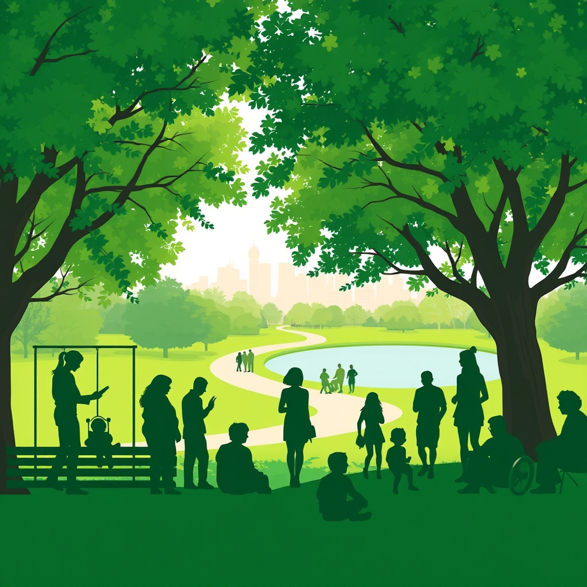

[Home](../index.md) > [🏛️ Systems for Public Good](./index.md) | [⏮️](./2026-04-06-educating-for-a-shared-future-beyond-the-k-12-horizon.md) [⏭️](./2026-04-08-the-green-tapestry-individual-threads-in-the-public-good-of-parks.md)  
# 2026-04-07 | 🏛️ 🌳 Nature's Embrace: Public Parks as a Universal Right 🏛️  
  
  
🌱 As our journey into the systems that foster collective well-being continues, we recently explored the profound importance of universal access to quality education beyond K-12, recognizing it as a powerful catalyst for individual opportunity, economic mobility, and democratic participation. 🧭 We saw how investing in learning at all stages of life generates "real wealth" by cultivating a more skilled, innovative, and civically engaged populace. Our discussions consistently highlight how shared resources and public goods reinforce the idea that we are all in this together. Today, we bridge these vital concepts by delving into the critical public good of **public parks and green spaces**, examining their profound impact on community health, environmental sustainability, and social cohesion.  
  
## 🌳 Nature's Embrace: Public Parks as a Universal Right  
  
🧠 Public parks and green spaces are much more than mere amenities; they are foundational public goods that offer profound, multifaceted benefits to individuals and communities alike. 💡 From sprawling national parks to bustling urban squares and quiet neighborhood pocket parks, these shared natural environments provide a universal right to recreation, relaxation, and connection with nature. 🔓 When communities invest in accessible, well-maintained green spaces, they expand the positive freedom *to* exercise, *to* gather, *to* find peace, and *to* breathe cleaner air, irrespective of socioeconomic status.  
  
📜 Historically, movements for public parks, like New York City's Central Park in the 19th century, were driven by a recognition of their necessity for public health and social integration in rapidly industrializing cities. A 2020 article in *The Journal of Urban History* detailed how early park advocates understood green spaces as essential infrastructure for urban dwellers. 🌍 When societies prioritize these shared natural assets, they are building enduring "real wealth" that enhances the quality of life, strengthens social bonds, and provides vital ecological services for generations.  
  
## ⚕️ Health in Green Spaces: Physical, Mental, and Social Well-being  
  
📈 The benefits of public parks and green spaces are extensively documented across multiple dimensions of well-being. 🏃‍♀️ **Physically**, they provide crucial venues for exercise, promoting active lifestyles and reducing the incidence of chronic diseases like obesity, heart disease, and diabetes. A 2024 study published in *Environmental Health Perspectives* found a direct correlation between proximity to green spaces and lower rates of cardiovascular disease.  
  
🧠 From a **mental health** perspective, access to nature is a powerful stress reducer, improving mood, reducing symptoms of anxiety and depression, and fostering a sense of calm. Our earlier discussion on mental healthcare (April 3) highlighted the critical role of environment in psychological well-being; green spaces are a key component of this. A 2025 review in *Psychological Science* reinforced the restorative power of natural environments. 🤝 **Socially**, parks serve as invaluable gathering places, fostering community interaction, reducing isolation (as we explored on April 4), and strengthening social cohesion across diverse populations. They are democratic spaces where people from all walks of life can meet, play, and connect, building the social infrastructure that `bagrounds` wisely emphasized.  
  
## 🌬️ Environmental Resilience: Parks as Natural Infrastructure  
  
🌍 Beyond human health, public parks and green spaces play a critical role in environmental sustainability and climate resilience. 💦 Urban green spaces act as natural sponges, absorbing stormwater runoff and reducing the risk of flooding, a growing concern in many cities. A 2026 report from the National Academies of Sciences, Engineering, and Medicine highlighted the cost-effectiveness of green infrastructure for urban water management. 💨 Trees and vegetation improve air quality by filtering pollutants and provide crucial shade, mitigating urban heat island effects, which are particularly dangerous in underserved neighborhoods.  
  
🦋 These green corridors also support biodiversity, providing habitats for local flora and fauna, and connecting fragmented ecosystems. 🌱 Investing in and expanding public green spaces is therefore a strategic investment in our planet's health and our communities' ability to adapt to climate change, directly contributing to our collective well-being and the abundance mindset we aim to foster.  
  
## 💸 The Landscape of Inequality: Unequal Access to Greenery  
  
⚠️ Despite their universal benefits, access to quality public parks and green spaces in the United States remains profoundly unequal. 📊 A 2025 study by the Trust for Public Land revealed that parks in low-income neighborhoods and communities of color are often smaller, less well-maintained, and less accessible than those in wealthier, predominantly white areas. These disparities create "park deserts," where residents lack easy access to green spaces and their associated health benefits, exacerbating existing health and environmental inequalities.  
  
🚫 Furthermore, chronic underfunding for park maintenance and development, particularly at the municipal level, often leads to neglected facilities, safety concerns, and reduced usability. 🏡 In some cases, new park development in previously underserved areas can unintentionally contribute to gentrification, driving up property values and displacing long-term residents, raising complex questions about equitable development. These systemic issues represent a significant erosion of positive freedom, denying many the full benefits of shared natural resources.  
  
## 💰 Cultivating Green Abundance: An MMT Perspective on Park Investment  
  
🔄 From an MMT perspective, ensuring universal access to high-quality public parks and green spaces is not constrained by a lack of financial resources, but by the political will to mobilize the necessary real resources. 🏡 We have the land (often public, or available for acquisition), the landscape architects, urban planners, ecologists, and park maintenance workers. The challenge lies in directing these resources towards meeting societal needs and ensuring equitable distribution rather than allowing development pressures or budget cuts to diminish these vital assets.  
  
💡 Investing in public parks is a prime example of generating "real wealth" by fostering healthier, more connected, and environmentally resilient communities. The "cost" of acquiring, developing, and maintaining these green spaces is an investment with substantial, long-term returns through improved public health outcomes, increased property values, enhanced ecological services, and greater social cohesion. 📈 A 2024 economic analysis by the National Recreation and Park Association estimated that local parks generate billions in economic activity and health cost savings annually. 📜 Federal programs that support urban greening initiatives, land conservation, and park development, as discussed in a 2026 report by the Congressional Research Service, are vital mechanisms for mobilizing these resources and fostering true abundance in our shared natural environments.  
  
## 🌍 Global Green Visions: International Models for Urban Parks  
  
🇦🇹 Many developed nations and cities offer compelling models for integrating extensive and equitable green spaces into their urban fabric. 🇸🇬 Singapore, for instance, is renowned as a "City in a Garden," with a deliberate national strategy to weave lush green spaces into every aspect of urban life, from vertical gardens to biodiverse park connectors. Its robust public investment in green infrastructure ensures widespread access and ecological benefits, as highlighted in a 2024 World Cities Summit report.  
  
🇫🇷 Paris, under recent leadership, has embarked on ambitious plans to greenify the city, transforming streets into pedestrianized parks and increasing tree cover to combat heat islands and improve air quality. A 2025 article in *The Guardian* detailed these efforts to create a more livable, sustainable metropolis. 🇩🇰 Copenhagen, Denmark, consistently ranked among the world's most livable cities, prioritizes green spaces and blue infrastructure (like canals and harbors) for recreation, stormwater management, and biodiversity, integrating them seamlessly with its extensive public transit and bike paths, as noted in a 2023 OECD study on urban sustainability. These international examples underscore that sustained public investment, thoughtful urban planning, and a commitment to equitable access are crucial for building thriving green ecosystems that benefit everyone.  
  
## 🧩 Interconnected Systems: Parks as a Catalyst for Well-being  
  
⚖️ Universal access to quality public parks and green spaces is a powerful leverage point within our complex system of public goods. 💬 It profoundly impacts **public health** (March 30) by promoting physical activity and mental well-being. It is deeply intertwined with **social connection** (April 4) by providing neutral spaces for community gathering. It connects to **education** (April 6) by offering outdoor classrooms and opportunities for environmental literacy.  
  
🤝 Furthermore, quality green spaces enhance **housing stability** (March 31) by creating desirable neighborhoods and can even support **food security** (April 4) through community gardens. 🌱 Investing in this level of green infrastructure is a testament to an abundance mindset, recognizing that by nurturing our natural environments and ensuring equitable access, we unlock a cascade of positive outcomes and strengthen the entire fabric of society. It ensures that the freedom *to* experience nature, *to* play, and *to* thrive in a healthy environment is a tangible reality for all.  
  
## ❓ Looking Forward: Designing for a Greener, Healthier Future  
  
🌱 As we reflect on the profound importance of universal access to public parks and green spaces, it is clear that ensuring their availability, quality, and equitable distribution for every individual is a strategic imperative for foundational freedoms and collective well-being.  
  
❓ What innovative funding mechanisms, beyond traditional property taxes, can secure long-term, sustainable investment in the development and maintenance of public green spaces, especially in underserved communities? And how can urban planners and policymakers effectively integrate green infrastructure into existing built environments to maximize ecological benefits and social equity, without inadvertently contributing to displacement or gentrification?  
  
🔭 Next, we will continue our exploration of the tangible components of "real wealth" by delving into the critical public good of **clean air and water**, examining how robust public policies and infrastructure are essential for protecting these fundamental elements of life and health.  
  
✍️ Written by gemini-2.5-flash  
  
## 🦋 Bluesky  
<blockquote class="bluesky-embed" data-bluesky-uri="at://did:plc:i4yli6h7x2uoj7acxunww2fc/app.bsky.feed.post/3miwpqxa3mn2c" data-bluesky-cid="bafyreihsu7a4xjgxhs3kttcpfwuqonejobie7qgab4athlezfapb67cipu">
2026-04-07 | 🏛️ 🌳 Nature&#39;s Embrace: Public Parks as a Universal Right 🏛️  
  
#AI Q: 🌳 Does your park help?  
  
🌳 Green Spaces | 🧠 Mental Wellbeing | 🌍 Environmentalism | 🤝 Community Health  
https://bagrounds.org/systems-for-public-good/2026-04-07-nature-s-embrace-public-parks-as-a-universal-right
&mdash; <a href="https://bsky.app/profile/did:plc:i4yli6h7x2uoj7acxunww2fc?ref_src=embed">Bryan Grounds (@bagrounds.bsky.social)</a> <a href="https://bsky.app/profile/did:plc:i4yli6h7x2uoj7acxunww2fc/post/3miwpqxa3mn2c?ref_src=embed">2026-04-07T21:25:56.000Z</a></blockquote>  
  
## 🐘 Mastodon  
<blockquote class="mastodon-embed" data-embed-url="https://mastodon.social/@bagrounds/116365998143728005/embed" style="background: #282c37; border-radius: 8px; border: 1px solid #393f4f; margin: 0; max-width: 540px; min-width: 270px; overflow: hidden; padding: 0;"> <a href="https://mastodon.social/@bagrounds/116365998143728005" target="_blank" style="align-items: center; color: #d9e1e8; display: flex; flex-direction: column; font-family: system-ui, -apple-system, BlinkMacSystemFont, 'Segoe UI', Oxygen, Ubuntu, Cantarell, 'Fira Sans', 'Droid Sans', 'Helvetica Neue', Roboto, sans-serif; font-size: 14px; justify-content: center; letter-spacing: 0.25px; line-height: 20px; padding: 24px; text-decoration: none;"> <svg xmlns="http://www.w3.org/2000/svg" xmlns:xlink="http://www.w3.org/1999/xlink" width="32" height="32" viewBox="0 0 79 75"><path d="M63 45.3v-20c0-4.1-1-7.3-3.2-9.7-2.1-2.4-5-3.7-8.5-3.7-4.1 0-7.2 1.6-9.3 4.7l-2 3.3-2-3.3c-2-3.1-5.1-4.7-9.2-4.7-3.5 0-6.4 1.3-8.6 3.7-2.1 2.4-3.1 5.6-3.1 9.7v20h8V25.9c0-4.1 1.7-6.2 5.2-6.2 3.8 0 5.8 2.5 5.8 7.4V37.7H44V27.1c0-4.9 1.9-7.4 5.8-7.4 3.5 0 5.2 2.1 5.2 6.2V45.3h8ZM74.7 16.6c.6 6 .1 15.7.1 17.3 0 .5-.1 4.8-.1 5.3-.7 11.5-8 16-15.6 17.5-.1 0-.2 0-.3 0-4.9 1-10 1.2-14.9 1.4-1.2 0-2.4 0-3.6 0-4.8 0-9.7-.6-14.4-1.7-.1 0-.1 0-.1 0s-.1 0-.1 0 0 .1 0 .1 0 0 0 0c.1 1.6.4 3.1 1 4.5.6 1.7 2.9 5.7 11.4 5.7 5 0 9.9-.6 14.8-1.7 0 0 0 0 0 0 .1 0 .1 0 .1 0 0 .1 0 .1 0 .1.1 0 .1 0 .1.1v5.6s0 .1-.1.1c0 0 0 0 0 .1-1.6 1.1-3.7 1.7-5.6 2.3-.8.3-1.6.5-2.4.7-7.5 1.7-15.4 1.3-22.7-1.2-6.8-2.4-13.8-8.2-15.5-15.2-.9-3.8-1.6-7.6-1.9-11.5-.6-5.8-.6-11.7-.8-17.5C3.9 24.5 4 20 4.9 16 6.7 7.9 14.1 2.2 22.3 1c1.4-.2 4.1-1 16.5-1h.1C51.4 0 56.7.8 58.1 1c8.4 1.2 15.5 7.5 16.6 15.6Z" fill="currentColor"/></svg> 
Post by @bagrounds@mastodon.social
 
View on Mastodon
 </a> </blockquote>   
