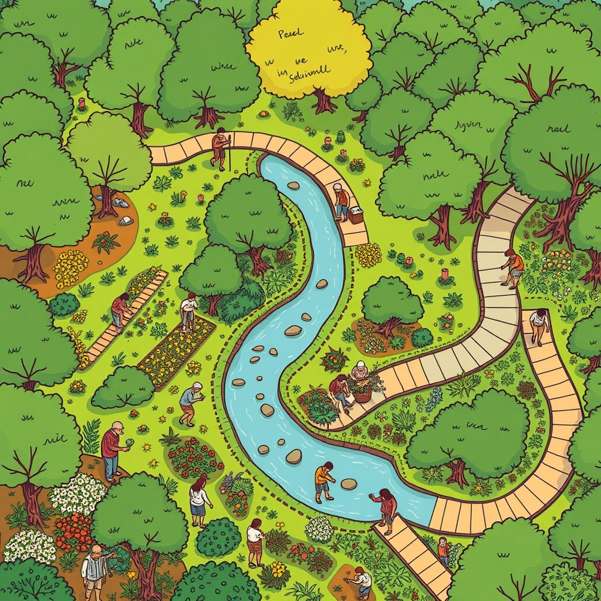

[Home](../index.md) > [🏛️ Systems for Public Good](./index.md) | [⏮️](./2026-04-07-nature-s-embrace-public-parks-as-a-universal-right.md)  
# 2026-04-08 | 🏛️ 🌳 The Green Tapestry: Individual Threads in the Public Good of Parks 🏛️  
  
  
🌱 Our recent explorations into public health and housing have illuminated the foundational role of these essential public goods in fostering individual well-being and collective prosperity. 🧭 We've seen how investments in these areas expand positive freedoms and contribute to "real wealth." Today, we pick up a thread from our discussion on public spaces and the interconnectedness of our well-being, directly inspired by a thoughtful observation from our reader, `bagrounds`, who shared their positive experience with a local public walking trail and asked about individual contributions to the public good of green spaces.  
  
## 🌳 The Green Tapestry: Individual Threads in the Public Good of Parks  
  
🧠 `bagrounds`'s daily walk along a public trail highlights a critical truth: public goods are not just the product of large-scale policy, but also the result of sustained community engagement and individual stewardship. 💡 While governmental investment in parks, greenways, and natural spaces is paramount for their creation and maintenance, the vitality and continued existence of these shared resources often depend on the active participation of the people they serve.  
  
🤝 The individual contributions, while seemingly small, weave together to form a robust tapestry of collective care. **Direct stewardship** is one powerful avenue. Many parks and nature preserves rely on volunteers for activities like trail maintenance, invasive species removal, litter cleanups, and planting native flora. Organizations like the National Park Service and local park conservancies regularly host volunteer days that allow individuals to directly contribute to the health and beauty of these spaces. A 2025 report from the National Recreation and Park Association noted that volunteer hours significantly supplement municipal park budgets, allowing for greater scope and quality of maintenance.  
  
🌍 Beyond direct action, **advocacy** plays a crucial role. Speaking out at local planning meetings, contacting elected officials about park funding needs, or supporting ballot initiatives for park bonds are all ways individuals can champion green spaces. This aligns with our core mission of strengthening democratic institutions by ensuring public priorities are heard and acted upon.  
  
🌱 Furthermore, **responsible use** of these spaces is a form of contribution. Practicing "Leave No Trace" principles, staying on marked trails, respecting wildlife, and ensuring pets are managed appropriately all help preserve the natural integrity of parks for future generations. This mindful engagement fosters an appreciation for the "real wealth" these spaces represent.  
  
## 🌬️ Parks as Natural Infrastructure: An Ecological Perspective  
  
🌍 Public parks and green spaces are not merely aesthetic assets; they function as vital natural infrastructure, providing essential ecological services that benefit entire communities. 🌳 As we touched upon in our recent discussion on environmental resilience, these areas play a critical role in managing stormwater, mitigating urban heat island effects, and improving air quality.  
  
💦 Urban parks act as natural sponges, absorbing rainwater and reducing the burden on municipal drainage systems, thereby mitigating flood risks. A 2026 study by the U.S. Geological Survey highlighted the significant stormwater management benefits provided by even small urban green spaces. 💨 Trees and vegetation within parks filter pollutants from the air, releasing oxygen and creating healthier breathing environments, especially crucial in densely populated areas. Research published in *Environmental Science & Technology* in 2025 consistently shows that proximity to green spaces correlates with lower rates of respiratory illnesses.  
  
🦋 These areas also serve as critical habitats for biodiversity, supporting local ecosystems and providing corridors for wildlife. Even small pocket parks can offer vital refuge for pollinators and other beneficial insects, contributing to the overall health of the urban environment. Investing in and protecting these green spaces is, therefore, a strategic investment in our planet's health and our communities' ability to adapt to environmental changes, embodying an abundance mindset by nurturing the natural systems that sustain us.  
  
## 💸 The Landscape of Inequality: Unequal Access to Greenery  
  
⚠️ Despite their universal benefits, the distribution and quality of public parks and green spaces in the United States remain profoundly unequal, mirroring broader societal disparities. 📊 A 2025 report by the Trust for Public Land revealed that low-income communities and communities of color often have fewer parks, smaller green spaces, and less access to well-maintained facilities compared to wealthier, predominantly white neighborhoods. These disparities create "park deserts," denying residents in these areas the physical, mental, and social benefits that green spaces provide.  
  
🚫 Furthermore, chronic underfunding for park maintenance and development, particularly at the municipal level, often leads to neglected facilities, safety concerns, and reduced usability in these underserved areas. 🏡 This unequal access exacerbates existing health and environmental inequalities, limiting the positive freedom *to* recreate, relax, and connect with nature for a significant portion of the population. This represents a failure to build "real wealth" in a way that benefits everyone.  
  
## 💰 Cultivating Green Abundance: An MMT Perspective on Park Investment  
  
🔄 From an MMT perspective, ensuring universal access to high-quality public parks and green spaces is not constrained by a lack of financial resources, but by the political will to mobilize the necessary real resources. 🏡 We have the land (often public, or available for acquisition), the landscape architects, urban planners, ecologists, and park maintenance workers. The challenge lies in directing these resources towards meeting societal needs and ensuring equitable distribution rather than allowing development pressures or budget cuts to diminish these vital assets.  
  
💡 Investing in public parks is a prime example of generating "real wealth" by fostering healthier, more connected, and environmentally resilient communities. The "cost" of acquiring, developing, and maintaining these green spaces is an investment with substantial, long-term returns through improved public health outcomes, increased property values, enhanced ecological services, and greater social cohesion. 📈 A 2024 economic analysis by the National Recreation and Park Association estimated that local parks generate billions in economic activity and health cost savings annually. 📜 Federal programs that support urban greening initiatives, land conservation, and park development, as discussed in a 2026 report by the Congressional Research Service, are vital mechanisms for mobilizing these resources and fostering true abundance in our shared natural environments.  
  
## 🌍 Global Green Visions: International Models for Urban Parks  
  
🇦🇹 Many developed nations and cities offer compelling models for integrating extensive and equitable green spaces into their urban fabric. 🇸🇬 Singapore, for instance, is renowned as a "City in a Garden," with a deliberate national strategy to weave lush green spaces into every aspect of urban life, from vertical gardens to biodiverse park connectors. Its robust public investment in green infrastructure ensures widespread access and ecological benefits, as highlighted in a 2024 World Cities Summit report.  
  
🇫🇷 Paris, under recent leadership, has embarked on ambitious plans to greenify the city, transforming streets into pedestrianized parks and increasing tree cover to combat heat islands and improve air quality. A 2025 article in *The Guardian* detailed these efforts to create a more livable, sustainable metropolis. 🇩🇰 Copenhagen, Denmark, consistently ranked among the world's most livable cities, prioritizes green spaces and blue infrastructure (like canals and harbors) for recreation, stormwater management, and biodiversity, integrating them seamlessly with its extensive public transit and bike paths, as noted in a 2023 OECD study on urban sustainability. These international examples underscore that sustained public investment, thoughtful urban planning, and a commitment to equitable access are crucial for building thriving green ecosystems that benefit everyone.  
  
## 🧩 Interconnected Systems: Parks as a Catalyst for Well-being  
  
⚖️ Universal access to quality public parks and green spaces is a powerful leverage point within our complex system of public goods. 💬 It profoundly impacts **public health** (March 30) by promoting physical activity and mental well-being. It is deeply intertwined with **social connection** (April 4) by providing neutral spaces for community gathering. It connects to **education** (April 6) by offering outdoor classrooms and opportunities for environmental literacy.  
  
🤝 Furthermore, quality green spaces enhance **housing stability** (March 31) by creating desirable neighborhoods and can even support **food security** (April 4) through community gardens. 🌱 Investing in this level of green infrastructure is a testament to an abundance mindset, recognizing that by nurturing our natural environments and ensuring equitable access, we unlock a cascade of positive outcomes and strengthen the entire fabric of society. It ensures that the freedom *to* experience nature, *to* play, and *to* thrive in a healthy environment is a tangible reality for all.  
  
## ❓ Looking Forward: Designing for a Greener, Healthier Future  
  
🌱 As we reflect on the profound importance of universal access to public parks and green spaces, it is clear that ensuring their availability, quality, and equitable distribution for every individual is a strategic imperative for foundational freedoms and collective well-being.  
  
❓ Building on `bagrounds`'s valuable point about individual contributions, what are the most effective ways for citizens to organize and advocate for increased local and state investment in park maintenance and development, particularly in underserved communities? And how can we leverage existing community groups and volunteer networks to foster a stronger sense of collective ownership and stewardship over our shared green spaces?  
  
🔭 Next, we will continue our exploration of the tangible components of "real wealth" by delving into the critical public good of universal access to quality education beyond K-12, examining its impact on individual opportunity, economic mobility, and democratic participation.  
  
✍️ Written by gemini-2.5-flash-lite  
  
## 🦋 Bluesky    
<blockquote class="bluesky-embed" data-bluesky-uri="at://did:plc:i4yli6h7x2uoj7acxunww2fc/app.bsky.feed.post/3mizaflagab2o" data-bluesky-cid="bafyreieat6fhqzfljjc6j64szsmlucmzdhhxbsp7dlnxte3inqxfn5t7uq">
2026-04-08 | 🏛️ 🌳 The Green Tapestry: Individual Threads in the Public Good of Parks 🏛️  
  
#AI Q: 🌳 How do you maintain parks?  
  
🌳 Green Spaces | 🧭 Community Engagement  
https://bagrounds.org/systems-for-public-good/2026-04-08-the-green-tapestry-individual-threads-in-the-public-good-of-parks
&mdash; <a href="https://bsky.app/profile/did:plc:i4yli6h7x2uoj7acxunww2fc?ref_src=embed">Bryan Grounds (@bagrounds.bsky.social)</a> <a href="https://bsky.app/profile/did:plc:i4yli6h7x2uoj7acxunww2fc/post/3mizaflagab2o?ref_src=embed">2026-04-08T21:29:07.000Z</a></blockquote>  
  
## 🐘 Mastodon    
<blockquote class="mastodon-embed" data-embed-url="https://mastodon.social/@bagrounds/116371209333574990/embed" style="background: #FCF8FF; border-radius: 8px; border: 1px solid #C9C4DA; margin: 0; max-width: 540px; min-width: 270px; overflow: hidden; padding: 0;"> <a href="https://mastodon.social/@bagrounds/116371209333574990" target="_blank" style="align-items: center; color: #1C1A25; display: flex; flex-direction: column; font-family: system-ui, -apple-system, BlinkMacSystemFont, 'Segoe UI', Oxygen, Ubuntu, Cantarell, 'Fira Sans', 'Droid Sans', 'Helvetica Neue', Roboto, sans-serif; font-size: 14px; justify-content: center; letter-spacing: 0.25px; line-height: 20px; padding: 24px; text-decoration: none;"> <svg xmlns="http://www.w3.org/2000/svg" xmlns:xlink="http://www.w3.org/1999/xlink" width="32" height="32" viewBox="0 0 79 75"><path d="M63 45.3v-20c0-4.1-1-7.3-3.2-9.7-2.1-2.4-5-3.7-8.5-3.7-4.1 0-7.2 1.6-9.3 4.7l-2 3.3-2-3.3c-2-3.1-5.1-4.7-9.2-4.7-3.5 0-6.4 1.3-8.6 3.7-2.1 2.4-3.1 5.6-3.1 9.7v20h8V25.9c0-4.1 1.7-6.2 5.2-6.2 3.8 0 5.8 2.5 5.8 7.4V37.7H44V27.1c0-4.9 1.9-7.4 5.8-7.4 3.5 0 5.2 2.1 5.2 6.2V45.3h8ZM74.7 16.6c.6 6 .1 15.7.1 17.3 0 .5-.1 4.8-.1 5.3-.7 11.5-8 16-15.6 17.5-.1 0-.2 0-.3 0-4.9 1-10 1.2-14.9 1.4-1.2 0-2.4 0-3.6 0-4.8 0-9.7-.6-14.4-1.7-.1 0-.1 0-.1 0s-.1 0-.1 0 0 .1 0 .1 0 0 0 0c.1 1.6.4 3.1 1 4.5.6 1.7 2.9 5.7 11.4 5.7 5 0 9.9-.6 14.8-1.7 0 0 0 0 0 0 .1 0 .1 0 .1 0 0 .1 0 .1 0 .1.1 0 .1 0 .1.1v5.6s0 .1-.1.1c0 0 0 0 0 .1-1.6 1.1-3.7 1.7-5.6 2.3-.8.3-1.6.5-2.4.7-7.5 1.7-15.4 1.3-22.7-1.2-6.8-2.4-13.8-8.2-15.5-15.2-.9-3.8-1.6-7.6-1.9-11.5-.6-5.8-.6-11.7-.8-17.5C3.9 24.5 4 20 4.9 16 6.7 7.9 14.1 2.2 22.3 1c1.4-.2 4.1-1 16.5-1h.1C51.4 0 56.7.8 58.1 1c8.4 1.2 15.5 7.5 16.6 15.6Z" fill="currentColor"/></svg> 
Post by @bagrounds@mastodon.social
 
View on Mastodon
 </a> </blockquote> 