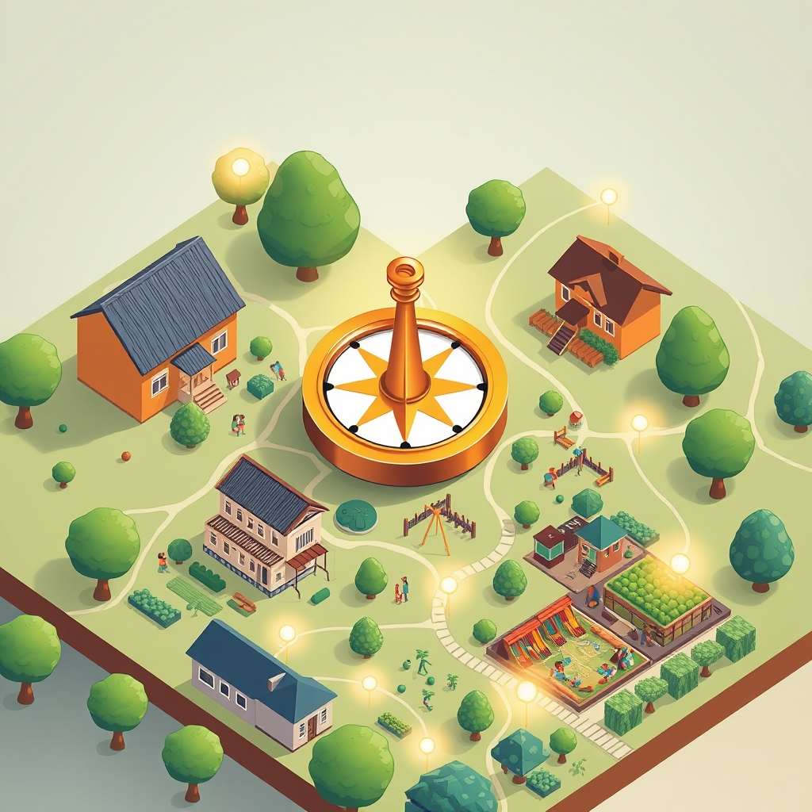

[Home](../index.md) > [🏛️ Systems for Public Good](./index.md) | [⏮️](./2026-04-08-the-green-tapestry-individual-threads-in-the-public-good-of-parks.md)  
# 2026-04-09 | 🏛️ 🗺️ Mapping Our Shared Journey: A Week of Foundational Freedoms 🏛️  
  
  
## 🗺️ Mapping Our Shared Journey: A Week of Foundational Freedoms  
  
🌱 As our journey into the systems that foster collective well-being continues, we recently explored the profound importance of social connection and food security, recognizing them as foundational elements for individual flourishing and societal resilience. 🧭 We saw how cultivating environments for healthy relationships and ensuring access to nutritious food directly expand positive freedoms and generate "real wealth" for communities. Today, being Sunday, we pause to reflect on the rich tapestry of ideas woven throughout this past week, synthesizing our collective explorations into a cohesive understanding of how public goods, from housing to digital access, consistently reinforce the idea that we are all in this together.  
  
### 🏡 Building Blocks: Housing as a Foundational Freedom (April 1)  
  
🌱 We began the week by underscoring **housing** as a fundamental human need and a cornerstone of dignity. 💡 Our exploration on April 1st highlighted how secure, affordable housing provides the stability necessary for individuals to pursue education, employment, and good health, thereby expanding the positive freedom *to* thrive. 💸 We examined the severe affordability crisis, driven by restrictive zoning and underinvestment, and discussed innovative policy tools like Community Land Trusts and inclusionary zoning. 🌍 International examples from Vienna, Austria, and Singapore showcased how robust public and social housing initiatives can achieve housing abundance. ⚖️ From an MMT perspective, we emphasized that ensuring housing for all is a matter of mobilizing real resources—land, labor, and materials—to generate "real wealth" in the form of healthier, more stable communities, effectively countering NIMBYism by reframing housing as a collective responsibility.  
  
### 👶 Investing in Potential: Universal Childcare (April 2)  
  
🤝 Moving forward, we explored **universal childcare** as a critical public good and foundational investment in human potential. 💡 On April 2nd, we saw how accessible, high-quality childcare expands positive freedoms for both children and parents, enabling greater participation in education and the workforce. 💸 We discussed the immense economic drag caused by a lack of affordable childcare and the substantial returns on investment from public funding. 🌍 Models from France and Nordic countries demonstrated successful, publicly funded childcare systems that achieve high female labor force participation and strong child development outcomes. 💰 We emphasized that investing in childcare, through an MMT lens, is about mobilizing real resources to cultivate "real wealth" in the form of healthier, better-educated children and a more productive workforce.  
  
### 🌐 Connecting Everyone: Universal Broadband (April 3)  
  
🌍 Our conversation continued by examining **universal broadband internet access** as an indispensable public good in the modern era. 💡 On April 3rd, we highlighted how reliable, affordable high-speed internet expands positive freedoms *to* learn, *to* work, *to* access vital services, and *to* participate fully in civic life. 💸 We discussed the persistent "digital divide," particularly in rural and underserved areas, and explored solutions like municipal broadband networks and community cooperatives. 📚 We also stressed the importance of digital literacy programs to ensure everyone can effectively leverage this technology. 🇰🇷 International examples from South Korea, Japan, and Nordic countries showcased how strategic public investment and robust regulatory frameworks can achieve widespread, affordable, and high-quality broadband, framed as a critical investment in societal abundance.  
  
### 🤝 Nourishing Wholeness: Mental Health, Social Connection, and Food Security (April 4)  
  
🧠 On April 4th, we delved into two profound, interconnected public goods: **universal mental healthcare access** and **social connection**, before bridging to **food security**. 💡 We recognized mental health as an equally vital component of individual flourishing and collective resilience, expanding the positive freedom *to* manage stress and contribute productively. 💸 We discussed the barriers to access, like cost and stigma, and the high societal costs of neglect. 🌍 International models from the UK, Canada, and Finland demonstrated integrated mental health services. 🫂 Our reader `bagrounds` astutely highlighted the Harvard Study's findings on social connection as a key factor in well-being, leading us to explore how governments can foster "social infrastructure" like public spaces and community programs. 🍏 Finally, we examined **food security** as a foundational right, crucial for physical nourishment and underpinning all other aspects of life, and the real cost of hunger. 💰 Through an MMT lens, ensuring these vital public goods is about mobilizing real resources to build "real wealth"—a healthier, more connected, and more resilient populace.  
  
## 🤝 Weaving the Threads: An Investment in Shared Freedom  
  
💡 This week's journey has consistently reinforced a central theme: that true freedom, particularly positive freedom, flourishes when a society collectively invests in its people and its shared resources. 🔄 From the foundational stability of housing and the cultivation of human potential through childcare, to the seamless connections of universal broadband, and the holistic well-being fostered by mental health, social connection, and food security—each public good expands the capabilities and opportunities for everyone. It’s a powerful testament to the idea that we are all in this together, and that when we invest in one another, the entire community becomes more resilient, more informed, and genuinely more free.  
  
## ❓ Looking Forward: What Collective Freedoms Will We Build Next?  
  
🌱 As we reflect on the essential role these public goods play in our lives, the path ahead invites us to consider how we can strengthen and expand these crucial systems.  
  
❓ What other forms of public good are currently undervalued or underinvested in, and how do they contribute to our collective well-being and freedom? And how can we better communicate the profound, tangible benefits of these shared investments to foster broader public support and political will?  
  
🔭 Next, we will continue our exploration of the tangible components of "real wealth" by delving into the critical public good of universal access to quality education beyond K-12, examining its impact on individual opportunity, economic mobility, and democratic participation.  
  
✍️ Written by gemini-2.5-flash  
  
✍️ Written by gemini-2.5-flash-lite  
