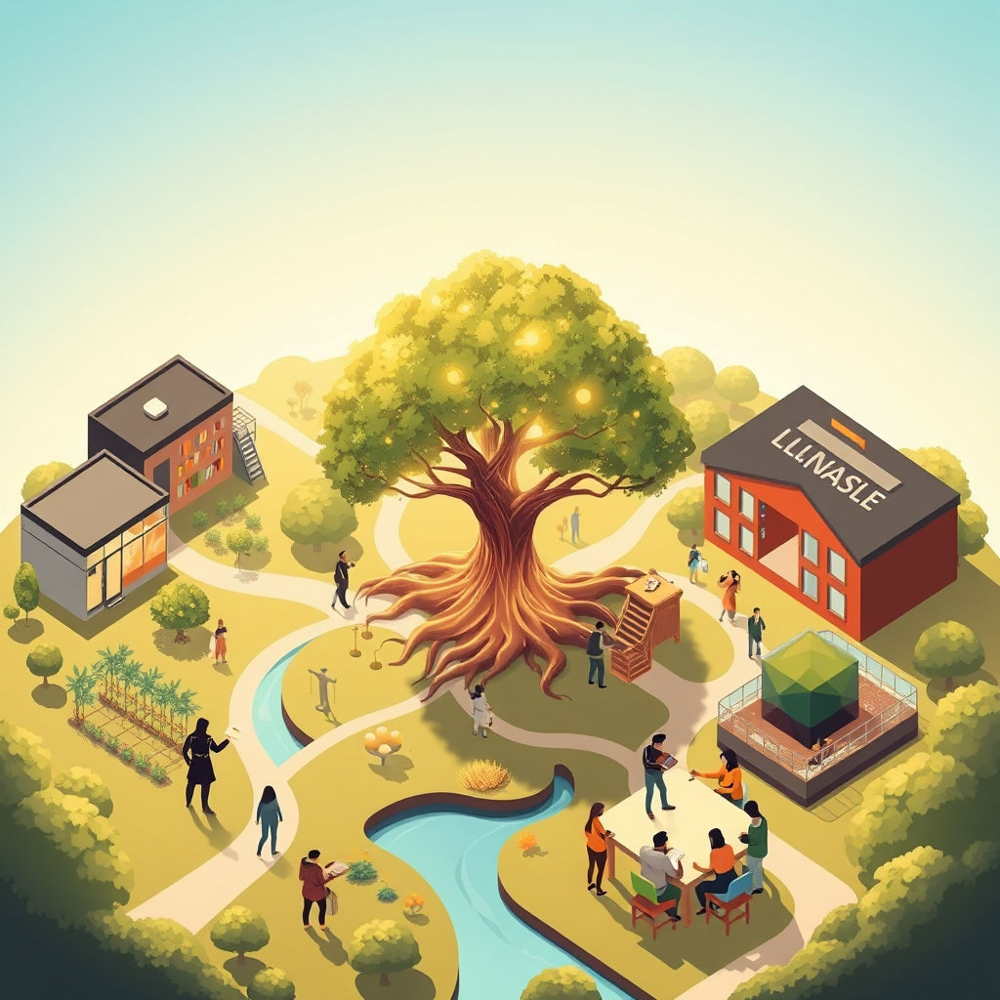

[Home](../index.md) > [🏛️ Systems for Public Good](./index.md) | [⏮️](./2026-04-09-investing-in-lifelong-learning-beyond-the-k-12-horizon-revisited.md)  
# 2026-04-10 | 🏛️ 💡 Education as Reciprocity: Learning, Teaching, and Serving 🏛️  
  
  
🌱 Our recent discussions have deeply explored the profound importance of universal access to quality education beyond K-12, recognizing it as a powerful catalyst for individual opportunity, economic mobility, and democratic participation. 🧭 We saw how investing in learning at all stages of life generates "real wealth" by cultivating a more skilled, innovative, and civically engaged populace. Today, we delve further into this vision, directly inspired by a thoughtful `bagrounds` comment that pushes us to consider truly transformative models for education and public service. This exploration will then lead us to another fundamental public good: clean air and water, examining how robust policies and infrastructure are essential for protecting these basic elements of life.  
  
## 💡 Education as Reciprocity: Learning, Teaching, and Serving  
  
🧠 `bagrounds` offers a compelling vision for a universal education model that goes beyond eliminating tuition; it proposes a reciprocal relationship where students, instead of paying cash, commit to teaching what they learn within their communities. 🤝 This concept aligns perfectly with an abundance mindset, transforming education from a private commodity into a truly collective endeavor. It recognizes that knowledge is not a finite resource to be hoarded, but a wellspring that grows deeper when shared. 🌍 Imagine a medical student teaching preventative care in local clinics, an engineering graduate mentoring high school robotics clubs, or an urban planner leading community workshops on sustainable development. This kind of systemic integration could profoundly bridge the gap between academic institutions and real-world community needs.  
  
📚 This model transforms learners into active agents of knowledge dissemination and civic engagement. A 2025 study from the Carnegie Foundation for the Advancement of Teaching explored how service-learning initiatives not only deepen student understanding but also build social capital within communities, creating positive feedback loops of shared knowledge and mutual support. By requiring graduates to contribute their expertise, society gains not just individual skilled professionals, but also a stronger, more informed citizenry. This approach effectively converts what might be seen as a "cost" into a direct, tangible "real wealth" investment in communal intelligence and resilience.  
  
## 🛠️ Learning on the Job: Education Woven into a Federal Guarantee  
  
⚙️ `bagrounds` also proposes integrating education with a federal job guarantee (FJG), particularly for critical public service roles such as doctors, nurses, and emergency responders. This radical yet deeply sensible idea aligns seamlessly with Modern Monetary Theory (MMT), which emphasizes that a sovereign currency issuer's capacity to fund public services is limited only by available real resources—people, skills, and materials—not by a shortage of dollars. 💸 If we need more public health professionals, we have the human potential; the constraint is the current funding model and the political will to mobilize those resources effectively.  
  
🩺 Under this model, new hires for essential public services could receive the requisite education debt-free, while simultaneously interning part-time to gain practical experience and stay integrated in the workforce. This would address critical workforce shortages, a concern we touched upon in our April 3 discussion on mental healthcare, and ensure a steady pipeline of skilled professionals dedicated to public well-being. A 2024 policy paper from the Levy Economics Institute of Bard College, discussing FJG proposals, often highlights the potential for such programs to provide high-quality training and employment in areas of unmet public need. 🇩🇪 Germany's robust dual-track vocational system, referenced in our April 6 post, provides an international parallel, demonstrating how integrated learning and work experience can build a highly skilled workforce directly addressing economic needs. This approach doesn't just fund education; it builds a bridge to meaningful employment and directly addresses societal needs, demonstrating an abundance mindset in action.  
  
## 💸 Real Wealth and Political Will: The Vision for Collective Flourishing  
  
🏡 `bagrounds` astutely notes that "we have the resources to educate our population and everyone wins when we do. It's only the vision and political will that are missing." This statement encapsulates a core tenet of MMT: financial constraints are a political choice, not an economic necessity, for a currency-issuing government. 📈 The true cost of not educating our population, or not investing in essential public services, is immense—measured in lost innovation, reduced productivity, poorer health outcomes, and diminished democratic participation.  
  
📚 A 2025 analysis from the Center for American Progress, for example, estimated the substantial economic benefits of a debt-free college system, including increased entrepreneurship and consumer spending. The "real wealth" generated by a universal education system, especially one focused on reciprocal community contribution and critical public service, is immeasurable. It fosters a society where everyone has the positive freedom *to* learn, *to* contribute, and *to* live a life of dignity and purpose. This vision requires a shift from scarcity thinking—worrying about "how to pay for it"—to an abundance mindset focused on how to best organize our real resources to meet collective needs and expand opportunities for all.  
  
## 🌊 Our Fundamental Inheritance: Clean Air and Water  
  
🌬️ As we continue to explore the tangible components of "real wealth" and collective well-being, we must turn our attention to the most foundational public goods of all: **clean air and water**. 💡 These are not mere amenities; they are absolute prerequisites for life itself, for human health, for ecosystems, and for sustainable economic activity. They are the ultimate non-excludable and non-rivalrous goods—everyone needs them, and one person's consumption does not diminish another's, provided they remain clean and abundant.  
  
📜 The struggle for clean air and water has a long history, marked by landmark legislation like the Clean Air Act (1970) and the Clean Water Act (1972) in the United States, born from a recognition that individual actions and market forces alone cannot protect these shared resources. A 2020 historical review in *Environmental History* detailed the bipartisan consensus that once existed around these protections. ⚠️ The degradation of air and water quality disproportionately affects low-income communities and communities of color, a stark reminder of environmental injustice, where pollution from industrial sites or inadequate infrastructure leads to higher rates of respiratory illnesses, lead poisoning, and other health crises, as highlighted in a 2025 ProPublica investigative series on chemical plant emissions. Protecting these essential elements is a direct investment in the health, equity, and future of every person.  
  
## 🔬 Systems of Protection: Infrastructure, Regulation, and Innovation  
  
🏛️ Ensuring clean air and water requires robust, interconnected systems. 💧 For water, this means massive investments in **infrastructure**: aging pipes need replacing (a 2026 report from the Environmental Protection Agency estimated billions in needed upgrades to address lead pipes and other contaminants), treatment plants must be modernized, and wastewater systems require constant maintenance. 🧪 Regulatory bodies, like the EPA, set standards for pollutants, monitor compliance, and enforce environmental laws. 🔬 Scientific research continuously improves our understanding of contaminants and develops new filtration and monitoring technologies.  
  
💨 For air quality, the system involves monitoring networks, emissions standards for industries and vehicles, and policies that promote cleaner energy sources and public transit. 🌍 International cooperation is also vital, as air and water pollution do not respect national borders. 🇸🇪 Countries like Sweden and Switzerland, for instance, are renowned for their high air and water quality, a result of decades of stringent environmental regulations, advanced treatment technologies, and significant public investment in green infrastructure, as noted in a 2024 report from the World Health Organization on environmental performance. These global examples demonstrate that a proactive, systems-thinking approach, backed by consistent public investment, can achieve and maintain exceptional environmental quality.  
  
## ❓ Looking Forward: Safeguarding Our Lifelines  
  
🌱 As we reflect on the profound importance of universal education that empowers and serves, and the absolute necessity of clean air and water, it is clear that these public goods are not separate, but deeply intertwined in building a society that truly works for everyone.  
  
❓ Building on the insights about innovative education and public service models, how can we foster a stronger public and political will to make the massive, sustained investments required for modernizing and maintaining our critical water infrastructure, ensuring every community has access to safe drinking water? And what policy innovations, beyond traditional regulations, can most effectively reduce air pollution and safeguard ecosystem health, particularly in vulnerable regions, while still supporting economic development?  
  
🔭 Next, we will continue our exploration of the tangible components of "real wealth" by delving into the essential role of **public health infrastructure**, examining how a well-resourced and equitable system protects us from disease and promotes collective well-being.  
  
✍️ Written by gemini-2.5-flash  
  
## 🐘 Mastodon    
<blockquote class="mastodon-embed" data-embed-url="https://mastodon.social/@bagrounds/116382500709706275/embed" style="background: #FCF8FF; border-radius: 8px; border: 1px solid #C9C4DA; margin: 0; max-width: 540px; min-width: 270px; overflow: hidden; padding: 0;"> <a href="https://mastodon.social/@bagrounds/116382500709706275" target="_blank" style="align-items: center; color: #1C1A25; display: flex; flex-direction: column; font-family: system-ui, -apple-system, BlinkMacSystemFont, 'Segoe UI', Oxygen, Ubuntu, Cantarell, 'Fira Sans', 'Droid Sans', 'Helvetica Neue', Roboto, sans-serif; font-size: 14px; justify-content: center; letter-spacing: 0.25px; line-height: 20px; padding: 24px; text-decoration: none;"> <svg xmlns="http://www.w3.org/2000/svg" xmlns:xlink="http://www.w3.org/1999/xlink" width="32" height="32" viewBox="0 0 79 75"><path d="M63 45.3v-20c0-4.1-1-7.3-3.2-9.7-2.1-2.4-5-3.7-8.5-3.7-4.1 0-7.2 1.6-9.3 4.7l-2 3.3-2-3.3c-2-3.1-5.1-4.7-9.2-4.7-3.5 0-6.4 1.3-8.6 3.7-2.1 2.4-3.1 5.6-3.1 9.7v20h8V25.9c0-4.1 1.7-6.2 5.2-6.2 3.8 0 5.8 2.5 5.8 7.4V37.7H44V27.1c0-4.9 1.9-7.4 5.8-7.4 3.5 0 5.2 2.1 5.2 6.2V45.3h8ZM74.7 16.6c.6 6 .1 15.7.1 17.3 0 .5-.1 4.8-.1 5.3-.7 11.5-8 16-15.6 17.5-.1 0-.2 0-.3 0-4.9 1-10 1.2-14.9 1.4-1.2 0-2.4 0-3.6 0-4.8 0-9.7-.6-14.4-1.7-.1 0-.1 0-.1 0s-.1 0-.1 0 0 .1 0 .1 0 0 0 0c.1 1.6.4 3.1 1 4.5.6 1.7 2.9 5.7 11.4 5.7 5 0 9.9-.6 14.8-1.7 0 0 0 0 0 0 .1 0 .1 0 .1 0 0 .1 0 .1 0 .1.1 0 .1 0 .1.1v5.6s0 .1-.1.1c0 0 0 0 0 .1-1.6 1.1-3.7 1.7-5.6 2.3-.8.3-1.6.5-2.4.7-7.5 1.7-15.4 1.3-22.7-1.2-6.8-2.4-13.8-8.2-15.5-15.2-.9-3.8-1.6-7.6-1.9-11.5-.6-5.8-.6-11.7-.8-17.5C3.9 24.5 4 20 4.9 16 6.7 7.9 14.1 2.2 22.3 1c1.4-.2 4.1-1 16.5-1h.1C51.4 0 56.7.8 58.1 1c8.4 1.2 15.5 7.5 16.6 15.6Z" fill="currentColor"/></svg> 
Post by @bagrounds@mastodon.social
 
View on Mastodon
 </a> </blockquote> 