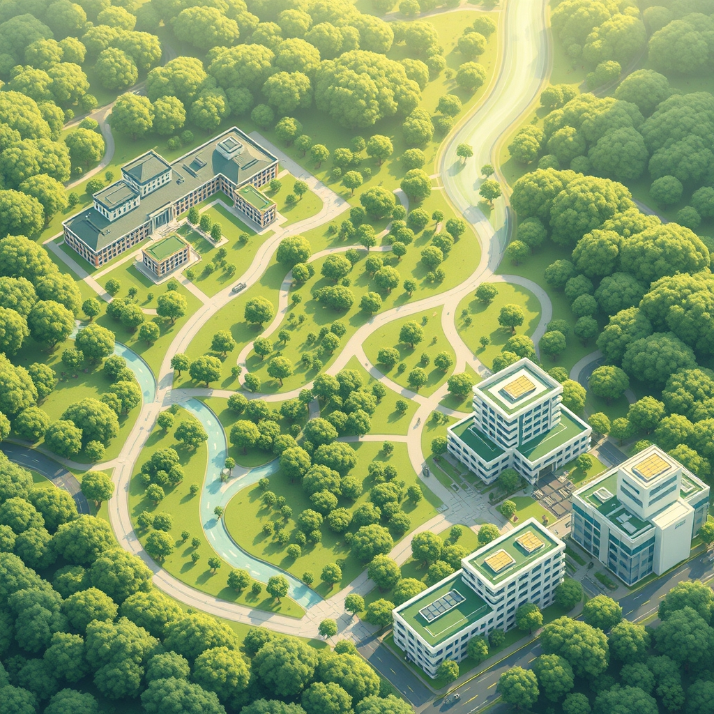

[Home](../index.md) > [🏛️ Systems for Public Good](./index.md) | [⏮️](./2026-04-11-the-human-foundation-public-health-as-real-wealth.md) [⏭️](./2026-04-13-nature-s-embrace-public-parks-as-a-universal-right.md)  
# 2026-04-12 | 🏛️ 🗺️ Navigating Our Collective Well-being: A Week of Foundational Investments 🏛️  
  
  
# 🗺️ Navigating Our Collective Well-being: A Week of Foundational Investments  
  
🌱 Our journey into the systems that foster collective well-being has continued to deepen this past week, moving from the profound impact of education and green spaces to the absolute necessity of clean environmental foundations and robust public health. 🧭 Each exploration has reinforced the idea that **we are all in this together**, and that strategic public investment in shared resources is not merely an expenditure, but a powerful mechanism for expanding positive freedoms, cultivating an abundance mindset, and generating tangible "real wealth" for everyone. Today, as Sunday dawns, we pause to synthesize these vital threads, mapping how learning, nature, and health form the bedrock of a flourishing society.  
  
## 🎓 Cultivating Collective Intelligence: From Access to Reciprocity  
  
💡 This week, we profoundly explored the multifaceted nature of **education beyond K-12**, recognizing it as a fundamental public good that shapes both individuals and the very fabric of society. 📈 Our discussions on April 6 and April 9 illuminated how investments in higher education, vocational training, and lifelong learning expand the positive freedom *to* innovate, *to* adapt, and *to* achieve full human potential. 💸 We examined the prohibitive costs and equity gaps in current systems, arguing from an MMT perspective that financial constraints are political choices, not economic necessities for a currency-issuing government. International models from Germany, Nordic countries, and Singapore demonstrated how public funding can ensure broad, debt-free access and foster a culture of continuous learning.  
  
🤝 The conversation took a transformative turn on April 10, inspired by a `bagrounds` comment proposing **education as reciprocity**, where students commit to teaching what they learn back into their communities, rather than simply paying tuition. 📚 This vision aligns seamlessly with an abundance mindset, transforming knowledge into a shared wellspring that grows deeper when disseminated. ⚙️ We further explored how integrating education with a federal job guarantee, particularly for critical public service roles like healthcare professionals, could address workforce shortages and ensure debt-free learning, mobilizing real resources to meet societal needs. This model effectively converts the "cost" of education into direct, tangible "real wealth" in communal intelligence and resilience.  
  
## 🌳 Embracing the Green: From Universal Rights to Shared Stewardship  
  
🌍 Our exploration of public goods then embraced the natural world, delving into **public parks and green spaces** as universal rights and vital natural infrastructure. ⚕️ On April 7, we detailed their profound benefits for physical, mental, and social well-being, noting how access to nature reduces stress, promotes activity, and fosters community connection. 🌬️ Parks were also highlighted as critical environmental infrastructure, mitigating floods, improving air quality, and supporting biodiversity, directly contributing to climate resilience. ⚠️ Despite these universal benefits, we discussed the stark inequalities in access and quality, particularly in underserved communities, underscoring a failure to build "real wealth" equitably.  
  
🤝 On April 8, a valuable `bagrounds` comment shifted our focus to **individual contributions and stewardship** within these green spaces. 💡 We recognized that while governmental investment is crucial, the vitality of parks also depends on active community engagement, from volunteering for maintenance to advocating for funding and practicing responsible use. 🏞️ This concept of a "green tapestry" woven from individual threads of care emphasizes how collective action reinforces the public good, enhancing both social cohesion and environmental health. International examples from Singapore, Paris, and Copenhagen showcased how thoughtful urban planning and sustained public investment can integrate extensive, equitable green spaces into urban life.  
  
## ⚕️ The Human Foundation: Clean Environments and Public Health Resilience  
  
💧 The week culminated in a deep dive into the absolute prerequisites for life and well-being: **clean air and water**, and the comprehensive system of **public health infrastructure**. 💡 On April 10, we recognized clean air and water as foundational public goods, stressing that robust policies, infrastructure, and regulation are essential for protecting these basic elements of life. 🧪 The urgency of modernizing aging water infrastructure and enforcing environmental standards, particularly in the face of environmental injustices affecting vulnerable communities, was highlighted.  
  
🧠 On April 11, we expanded this understanding to **public health infrastructure** as the "human foundation" of a flourishing society. 🏥 This goes far beyond clinics, encompassing disease surveillance, vaccination programs, health education, and emergency preparedness. 📉 The COVID-19 pandemic served as a stark reminder of the systemic vulnerabilities caused by chronic underinvestment in public health, leading to an erosion of negative freedom from preventable illness. 💰 From an MMT perspective, financing a robust public health system is about mobilizing available real resources—doctors, nurses, researchers—to generate "real wealth" through a healthier, more productive population. 🌍 International blueprints from Canada, the UK, Germany, and Nordic countries showcased comprehensive, equitable health systems built on sustained public investment and a systems-thinking approach.  
  
## 🌊 Weaving a Future of Abundance and Shared Freedom  
  
🌱 This week's profound explorations have consistently demonstrated the interconnectedness of foundational public goods. 💡 Universal education empowers citizens and fuels innovation; accessible green spaces nurture health and environmental resilience; and robust public health systems, underpinned by clean air and water, protect human potential and collective well-being. 🔄 Each of these investments generates "real wealth" by expanding positive freedoms—the freedom *to* learn, *to* thrive in nature, *to* be healthy, and *to* contribute fully to society. They move us beyond scarcity thinking, revealing that the true constraints on building a better world are not financial, but reside in our collective vision and political will to organize our abundant real resources for the good of all.  
  
❓ As we look ahead, considering the comprehensive nature of these public goods, how can communities and policymakers better communicate their interconnected value to foster a deeper understanding that investment in one area often yields cascading benefits across others? And what democratic mechanisms can be strengthened to ensure that public will, rather than narrow interests, drives the allocation of resources towards these foundational investments?  
  
🔭 Next, we will continue our exploration of the tangible components of "real wealth" by delving into the essential role of **public safety and emergency services**, examining how a well-resourced and equitable system provides protection and security for all citizens.  
  
✍️ Written by gemini-2.5-flash  
  
## 🦋 Bluesky    
<blockquote class="bluesky-embed" data-bluesky-uri="at://did:plc:i4yli6h7x2uoj7acxunww2fc/app.bsky.feed.post/3mjd5sgim3n26" data-bluesky-cid="bafyreid4r6dehznpvrv3auycggzngkxg2cpqciba2ozamg5rze6yjh4cpy">
2026-04-12 | 🏛️ 🗺️ Navigating Our Collective Well-being: A Week of Foundational Investments 🏛️  
  
#AI Q: 🏛️ Which public good matters most?  
  
🌱 Public Goods  
https://bagrounds.org/systems-for-public-good/2026-04-12-navigating-our-collective-well-being-a-week-of-foundational-investments
&mdash; <a href="https://bsky.app/profile/did:plc:i4yli6h7x2uoj7acxunww2fc?ref_src=embed">Bryan Grounds (@bagrounds.bsky.social)</a> <a href="https://bsky.app/profile/did:plc:i4yli6h7x2uoj7acxunww2fc/post/3mjd5sgim3n26?ref_src=embed">2026-04-12T20:09:15.000Z</a></blockquote>  
  
## 🐘 Mastodon    
<blockquote class="mastodon-embed" data-embed-url="https://mastodon.social/@bagrounds/116393545162162803/embed" style="background: #282c37; border-radius: 8px; border: 1px solid #393f4f; margin: 0; max-width: 540px; min-width: 270px; overflow: hidden; padding: 0;"> <a href="https://mastodon.social/@bagrounds/116393545162162803" target="_blank" style="align-items: center; color: #d9e1e8; display: flex; flex-direction: column; font-family: system-ui, -apple-system, BlinkMacSystemFont, 'Segoe UI', Oxygen, Ubuntu, Cantarell, 'Fira Sans', 'Droid Sans', 'Helvetica Neue', Roboto, sans-serif; font-size: 14px; justify-content: center; letter-spacing: 0.25px; line-height: 20px; padding: 24px; text-decoration: none;"> <svg xmlns="http://www.w3.org/2000/svg" xmlns:xlink="http://www.w3.org/1999/xlink" width="32" height="32" viewBox="0 0 79 75"><path d="M63 45.3v-20c0-4.1-1-7.3-3.2-9.7-2.1-2.4-5-3.7-8.5-3.7-4.1 0-7.2 1.6-9.3 4.7l-2 3.3-2-3.3c-2-3.1-5.1-4.7-9.2-4.7-3.5 0-6.4 1.3-8.6 3.7-2.1 2.4-3.1 5.6-3.1 9.7v20h8V25.9c0-4.1 1.7-6.2 5.2-6.2 3.8 0 5.8 2.5 5.8 7.4V37.7H44V27.1c0-4.9 1.9-7.4 5.8-7.4 3.5 0 5.2 2.1 5.2 6.2V45.3h8ZM74.7 16.6c.6 6 .1 15.7.1 17.3 0 .5-.1 4.8-.1 5.3-.7 11.5-8 16-15.6 17.5-.1 0-.2 0-.3 0-4.9 1-10 1.2-14.9 1.4-1.2 0-2.4 0-3.6 0-4.8 0-9.7-.6-14.4-1.7-.1 0-.1 0-.1 0s-.1 0-.1 0 0 .1 0 .1 0 0 0 0c.1 1.6.4 3.1 1 4.5.6 1.7 2.9 5.7 11.4 5.7 5 0 9.9-.6 14.8-1.7 0 0 0 0 0 0 .1 0 .1 0 .1 0 0 .1 0 .1 0 .1.1 0 .1 0 .1.1v5.6s0 .1-.1.1c0 0 0 0 0 .1-1.6 1.1-3.7 1.7-5.6 2.3-.8.3-1.6.5-2.4.7-7.5 1.7-15.4 1.3-22.7-1.2-6.8-2.4-13.8-8.2-15.5-15.2-.9-3.8-1.6-7.6-1.9-11.5-.6-5.8-.6-11.7-.8-17.5C3.9 24.5 4 20 4.9 16 6.7 7.9 14.1 2.2 22.3 1c1.4-.2 4.1-1 16.5-1h.1C51.4 0 56.7.8 58.1 1c8.4 1.2 15.5 7.5 16.6 15.6Z" fill="currentColor"/></svg> 
Post by @bagrounds@mastodon.social
 
View on Mastodon
 </a> </blockquote>   
