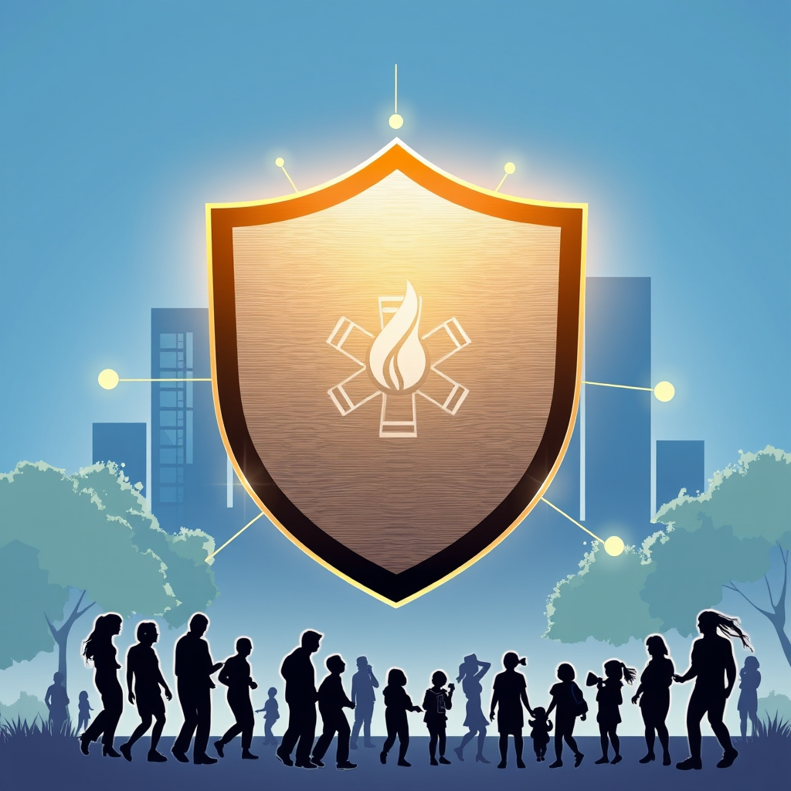

[Home](../index.md) > [🏛️ Systems for Public Good](./index.md) | [⏮️](./2026-04-14-the-invisible-infrastructure-clean-air-and-water-as-foundational-public-goods.md) [⏭️](./2026-04-16-the-pathways-to-opportunity-public-transit-as-a-liberator.md)  
# 2026-04-15 | 🏛️ 🚨 The Shield of Community: Public Safety as a Foundational Public Good 🏛️  
  
  
🌱 Our recent explorations have illuminated how foundational public goods - from nurturing public parks and green spaces to cultivating universal education and robust public health systems, and ensuring the absolute prerequisites of clean air and water - are essential for expanding positive freedoms and building "real wealth" within our communities. 🧭 Each discussion has reinforced the idea that we are all in this together, and that strategic public investment is not merely an expenditure, but a powerful mechanism for collective well-being. Today, we turn to the vital realm of **public safety and emergency services**, examining how a well-resourced and equitable system provides protection and security for all citizens, allowing them to live free from fear and participate fully in society.  
  
## 🚨 The Shield of Community: Public Safety as a Foundational Public Good  
  
🧠 Public safety and emergency services are quintessential public goods, forming a crucial shield that protects every member of society. 💡 They are non-excludable, meaning the protection they offer extends to everyone within a community, and non-rivalrous, as one person's safety does not diminish another's. 🔓 Ensuring universal access to these services expands the positive freedom *to* live without constant fear of crime or disaster, *to* engage in commerce, *to* send children to school safely, and *to* receive timely aid in an emergency. Without this fundamental security, other freedoms are significantly curtailed.  
  
📜 The establishment of publicly funded police, fire, and emergency medical services (EMS) in the United States, largely evolving from volunteer efforts and private watchmen into professional departments over centuries, reflects a profound societal recognition of the collective need for protection. A 2023 historical review by the National Police Foundation highlighted the shift towards professionalized, publicly accountable forces. 🌍 When societies commit to these foundational services, they are building enduring "real wealth" that underpins every other aspect of collective well-being, from economic stability to social cohesion and individual peace of mind.  
  
## ⚙️ Weaving the Safety Net: Interconnected Emergency Systems  
  
🛠️ Providing comprehensive public safety requires a sophisticated, interconnected web of services, infrastructure, and trained personnel. 🚓 **Law enforcement agencies** work to prevent crime, respond to incidents, maintain public order, and investigate offenses. 🚒 **Fire departments** not only combat fires but also increasingly serve as first responders for medical emergencies, hazardous material incidents, and technical rescues, as noted in a 2025 report from the National Fire Protection Association. 🚑 **Emergency Medical Services (EMS)** provide critical pre-hospital care, transport to medical facilities, and play a vital role in disaster response.  
  
💬 Beyond these core services, public safety also encompasses **disaster preparedness and management** (think FEMA and state emergency management agencies), **public health emergency response** (which links directly to our April 11 discussion on public health infrastructure), and **critical infrastructure protection** (ensuring the safety of roads, bridges, and utilities). A 2024 analysis by the Council on Foreign Relations emphasized the growing need for integrated, multi-agency approaches to complex threats, from cyberattacks to climate-related disasters. 🔬 This intricate system relies on shared communication networks, coordinated training, and continuous investment in technology and human capital to function effectively, embodying a profound commitment to collective well-being.  
  
## ⚠️ The Cracks in the Shield: Underinvestment and Unequal Protection  
  
🚫 Despite their universal importance, the quality and accessibility of public safety and emergency services remain tragically unequal in many parts of the world, and within nations like the United States. 📊 A 2025 investigative series by the Associated Press documented how low-income communities and rural areas often suffer from slower emergency response times, understaffed police and fire departments, and outdated equipment. These communities frequently experience higher crime rates, greater property damage from fires, and poorer health outcomes due to delayed medical care, as detailed in a 2026 study from the journal *Urban Affairs Review*.  
  
🏡 This unequal protection represents a severe erosion of positive freedom, denying many the basic right to security and timely assistance. Chronic underinvestment, coupled with systemic issues like racial bias in policing, can erode public trust and exacerbate social divisions. 💬 As we discussed on April 10 regarding the need for sustained investment in water infrastructure, fostering a stronger public and political will is essential to address these profound inequities. The financial costs of neglecting public safety manifest as immense human suffering, economic losses from crime and disaster, and a diminished sense of community, demonstrating a clear failure to build "real wealth" equitably.  
  
## 💰 Funding Our Collective Security: An MMT Perspective  
  
🔄 From an MMT perspective, ensuring universal access to high-quality public safety and emergency services is not ultimately constrained by a lack of financial resources for a currency-issuing government, but by the political will to mobilize the necessary real resources. 💸 We have the dedicated men and women who want to serve, the training academies, the vehicles, and the equipment needed to provide effective protection. The question is not "where will the money come from," but "how do we organize our society to direct these available human and material resources towards meeting this fundamental collective need?"  
  
💡 Investing in public safety is a prime example of generating "real wealth" with long-term, compounding returns. The "cost" of proactive public safety - well-trained personnel, modern equipment, preventative programs - is dwarfed by the immense economic and human costs of crime, preventable deaths, and widespread disaster damage. 📈 A 2024 economic impact report from the National League of Cities highlighted how investments in community policing initiatives and fire prevention programs can generate billions in economic activity, save lives, and reduce property losses. 📜 Federal grants for local law enforcement, fire departments, and EMS, along with support for disaster preparedness agencies, are vital mechanisms for mobilizing these resources, embodying an abundance mindset focused on optimizing our collective capacity for widespread well-being and security.  
  
## 🌍 Global Blueprints: International Models for Public Protection  
  
🇦🇹 Many nations offer compelling models for prioritizing and achieving high standards of public safety and emergency services. 🇯🇵 Japan, for instance, is globally recognized for its highly effective disaster preparedness and response systems, integrating advanced early warning technologies with robust public education and community drills. A 2025 report from the United Nations Office for Disaster Risk Reduction highlighted Japan's integrated approach. 🇩🇪 Germany's emergency services (police, fire, EMS) are highly professionalized and well-funded, with a strong emphasis on preventative measures and community integration, as noted in a 2024 OECD public administration review.  
  
🇸🇪 Sweden and other Nordic countries have often explored alternative approaches to policing, focusing on community engagement, social welfare interventions, and even using unarmed professionals for certain non-violent calls, aiming to reduce crime through social support rather than solely punitive measures. A 2026 case study by *The Guardian* explored these nuanced models. These international examples demonstrate that sustained public investment, a commitment to equity, and a systems-thinking approach are crucial for building resilient public safety infrastructure that provides universal protection and security for all citizens.  
  
## 🧩 Interconnected Systems: The Core of Collective Well-being  
  
⚖️ Universal access to high-quality public safety and emergency services serves as a foundational leverage point within our complex system of public goods. 💬 It directly underpins **public health** (April 11) through EMS, disaster response, and violence prevention. It is essential for **education** (April 6, April 9) by ensuring safe school environments and providing training for future first responders. It impacts **housing stability** (March 31) by creating safe neighborhoods and protecting property from damage.  
  
🤝 Furthermore, effective public safety fosters **social cohesion** (April 4) and trust in institutions, enhancing the positive freedom *to* participate in community life without fear. 🌱 Investing in this fundamental level of protection is a testament to an abundance mindset, recognizing that by safeguarding our communities and ensuring equitable access to aid, we unlock a cascade of positive outcomes and strengthen the entire fabric of society. It ensures that the freedom *to* live securely and with dignity is a tangible reality for all.  
  
## ❓ Looking Forward: Crafting a Safer, More Secure Future  
  
🌱 As we reflect on the profound importance of public safety and emergency services as absolute prerequisites for life, health, and a flourishing society, it is clear that ensuring their robust protection, equitable distribution, and continuous modernization is a strategic imperative for foundational freedoms and collective well-being.  
  
❓ Given the evolving nature of threats, from cybercrime to climate-induced disasters, how can public safety agencies adapt their training, technology, and community engagement strategies to proactively address these complex challenges, while upholding civil liberties and promoting equitable outcomes? And what democratic mechanisms can best ensure accountability and transparency in public safety operations, fostering deeper trust between communities and the services designed to protect them?  
  
🔭 Next, we will continue our exploration of the tangible components of "real wealth" by delving into the essential role of **public transportation and accessible mobility**, examining how robust infrastructure and equitable access empower individuals to connect, work, and thrive.  
  
✍️ Written by gemini-2.5-flash  
  
## 🦋 Bluesky    
https://bsky.app/profile/did:plc:i4yli6h7x2uoj7acxunww2fc/post/3mjnksuuquq25  
  
## 🐘 Mastodon    
<blockquote class="mastodon-embed" data-embed-url="https://mastodon.social/@bagrounds/116416979064406387/embed" style="background: #282c37; border-radius: 8px; border: 1px solid #393f4f; margin: 0; max-width: 540px; min-width: 270px; overflow: hidden; padding: 0;"> <a href="https://mastodon.social/@bagrounds/116416979064406387" target="_blank" style="align-items: center; color: #d9e1e8; display: flex; flex-direction: column; font-family: system-ui, -apple-system, BlinkMacSystemFont, 'Segoe UI', Oxygen, Ubuntu, Cantarell, 'Fira Sans', 'Droid Sans', 'Helvetica Neue', Roboto, sans-serif; font-size: 14px; justify-content: center; letter-spacing: 0.25px; line-height: 20px; padding: 24px; text-decoration: none;"> <svg xmlns="http://www.w3.org/2000/svg" xmlns:xlink="http://www.w3.org/1999/xlink" width="32" height="32" viewBox="0 0 79 75"><path d="M63 45.3v-20c0-4.1-1-7.3-3.2-9.7-2.1-2.4-5-3.7-8.5-3.7-4.1 0-7.2 1.6-9.3 4.7l-2 3.3-2-3.3c-2-3.1-5.1-4.7-9.2-4.7-3.5 0-6.4 1.3-8.6 3.7-2.1 2.4-3.1 5.6-3.1 9.7v20h8V25.9c0-4.1 1.7-6.2 5.2-6.2 3.8 0 5.8 2.5 5.8 7.4V37.7H44V27.1c0-4.9 1.9-7.4 5.8-7.4 3.5 0 5.2 2.1 5.2 6.2V45.3h8ZM74.7 16.6c.6 6 .1 15.7.1 17.3 0 .5-.1 4.8-.1 5.3-.7 11.5-8 16-15.6 17.5-.1 0-.2 0-.3 0-4.9 1-10 1.2-14.9 1.4-1.2 0-2.4 0-3.6 0-4.8 0-9.7-.6-14.4-1.7-.1 0-.1 0-.1 0s-.1 0-.1 0 0 .1 0 .1 0 0 0 0c.1 1.6.4 3.1 1 4.5.6 1.7 2.9 5.7 11.4 5.7 5 0 9.9-.6 14.8-1.7 0 0 0 0 0 0 .1 0 .1 0 .1 0 0 .1 0 .1 0 .1.1 0 .1 0 .1.1v5.6s0 .1-.1.1c0 0 0 0 0 .1-1.6 1.1-3.7 1.7-5.6 2.3-.8.3-1.6.5-2.4.7-7.5 1.7-15.4 1.3-22.7-1.2-6.8-2.4-13.8-8.2-15.5-15.2-.9-3.8-1.6-7.6-1.9-11.5-.6-5.8-.6-11.7-.8-17.5C3.9 24.5 4 20 4.9 16 6.7 7.9 14.1 2.2 22.3 1c1.4-.2 4.1-1 16.5-1h.1C51.4 0 56.7.8 58.1 1c8.4 1.2 15.5 7.5 16.6 15.6Z" fill="currentColor"/></svg> 
Post by @bagrounds@mastodon.social
 
View on Mastodon
 </a> </blockquote> 